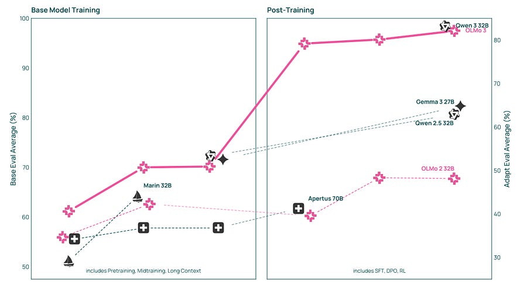
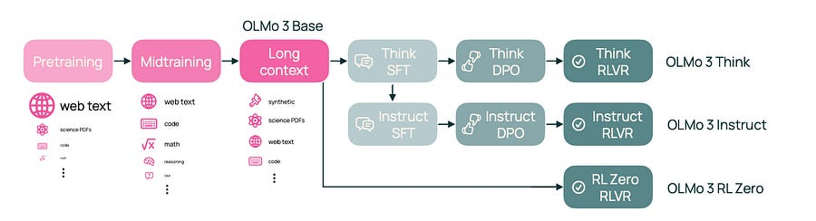
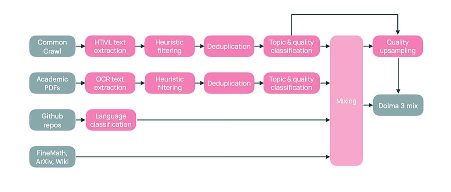

# OLMo 3: The Most Open LLM Yet

# TLDR

Allen AI just dropped OLMo 3, a fully open family of 7B and 32B language models with **everything** released: training data, intermediate checkpoints, code, and final weights. OLMo 3 Think-32B is now the strongest fully open thinking model available, competitive with Qwen 3-32B while being trained on 6x fewer tokens.

The release includes four model variants (Base, Think, Instruct, RL-Zero) covering the complete pipeline from pretraining through reinforcement learning. This is a goldmine for ML researchers wanting to study what actually happens inside modern LLM training.

## Introduction

The open-source AI community has been hungry for truly open models, not just open weights, but the full recipe. Allen AI delivers exactly that with OLMo 3, introducing what they call the “model flow”: the complete lifecycle of a language model including every stage, checkpoint, datapoint, and dependency required to create it.

Why does this matter? Most “open” models give you the final weights and maybe some training details. OLMo 3 lets you intervene at any point in the training pipeline. Want to study how midtraining affects downstream reasoning? You can. Want to understand why certain RL techniques work? The data is there.

The release targets long context reasoning (64K tokens), function calling, coding, instruction following, and general chat. They’ve built four distinct model types from the same base: OLMo 3 Base, OLMo 3 Think (reasoning with chain-of-thought), OLMo 3 Instruct (efficient responses without thinking traces), and OLMo 3 RL-Zero (for RL benchmarking research).

* * *

## OLMo 3 Base

The foundation of the family, OLMo 3 Base is trained in three stages totaling roughly 6 trillion tokens.

**Stage 1: Pretraining (5.9T tokens):** They introduce Dolma 3 Mix, featuring aggressive global deduplication at trillion-token scale using their new Duplodocus tool, quality-aware upsampling (repeating high-quality documents up to 7x rather than flat filtering), and a novel source of academic PDFs processed with olmOCR.

**Stage 2: Midtraining (100B tokens):** This is where things get interesting. They use a two-part framework: lightweight “microanneals” (10B token experiments) for rapid testing of individual data sources, combined with full 100B integration tests to validate mixes. The midtraining data (Dolma 3 Dolmino Mix) includes synthetic math data, code with fill-in-the-middle formatting, QA datasets, and importantly, thinking traces and instruction data to prime the model for post-training.

**Stage 3: Long Context Extension (50-100B tokens):** They extend context from 8K to 64K using YaRN position interpolation, document packing with intra-document masking, and synthetic aggregation tasks injected into long PDFs to teach information synthesis.

**Key architectural choices:** 8192 context during pretraining, sliding window attention (4096 window) on 3 of every 4 layers to manage compute, and the same tokenizer as OLMo 2.

**Results:** OLMo 3 Base 32B is the best fully open base model, outperforming Stanford Marin 32B, Apertus 70B, and LLM360 across math, code, and QA benchmarks.

* * *

## OLMo 3 Think

This is the flagship model, a reasoning model that generates explicit thinking traces before producing answers.

**Three-stage post-training:**

  1. **SFT with Dolci Think SFT:** They compile prompts from OpenThoughts3, SYNTHETIC-2, and other sources, then generate reasoning traces using QwQ-32B and DeepSeek R1. Heavy filtering removes incomplete traces, excessive Chinese content (from R1), and model identity mentions.

  2. **DPO with Delta Learning:** Here’s the clever insight: they pair chosen responses from Qwen3-32B (thinking mode) with rejected responses from Qwen3-0.6B. The key finding is that continued SFT on Qwen3-32B responses actually _hurts_ performance (the model has saturated on imitation), but pairing them with worse responses creates useful contrastive signal. DPO on these delta pairs improves pass@k, not just pass@1. It expands the reasoning frontier.

  3. **RLVR with OlmoRL:** They introduce a new RL framework with improvements over vanilla GRPO: zero gradient filtering, active sampling to maintain batch sizes, token-level loss normalization, no KL penalty, and clip-higher for larger updates. Verifiers span math (symbolic equivalence), code (test execution via AWS Lambda), instruction following (constraint checking), and chat (LLM judge). The infrastructure features fully asynchronous training with continuous batching, which is critical when average generation length exceeds 10K tokens.

**Key finding:** DPO provides a better starting point for RL than SFT alone. The DPO model has higher pass@k on AIME evaluations despite lower entropy.

**Results:** OLMo 3 Think-32B achieves 96.1% on MATH, 76.8% on AIME 2024, and 72.5% on AIME 2025, making it the best fully open thinking model, competitive with Qwen 3-32B.

* * *

## OLMo 3 Instruct

Not every use case needs extended thinking. OLMo 3 Instruct targets efficient, helpful responses for general chat and function calling.

**Function calling data:** They create three datasets: Science QA (using Semantic Scholar MCP), Web Search QA (using Serper API), and SimFC (42K synthetic trajectories with simulated environments). The key is balancing function diversity with interaction complexity.

**Length control:** A major focus. Preference data naturally has length bias (chosen responses are longer), which the model learns during DPO. They filter preference pairs to limit length difference to 100 tokens for chat data. Surprisingly, this length-controlled DPO model performs _better_ after RL. Shorter models may be “more intelligent per token” within fixed context windows.

**Delta-aware GPT judging:** Their initial attempts to update the OLMo 2 preference pipeline failed because all response generators were too good, leaving no meaningful contrast. Solution: ensure weak model responses are always present and select the worst response as rejected to maximize delta.

**Results:** Significantly outperforms Qwen 2.5-7B Instruct, OLMo 2 7B Instruct, and Apertus 8B Instruct, with strong function-calling capabilities on BFCL, LitQA2, and SimpleQA with tools.

* * *

## RL-Zero

This might be the most valuable release for RL researchers. All leading RLVR benchmarks train on models without revealed pretraining data, making it impossible to study data’s effect on RL or detect contamination.

**Dolci RL-Zero:** A decontaminated dataset across math, code, instruction following, and mixed domains. They aggressively filter DAPO math and Klear-Reasoner, decontaminate against both pretraining and evaluation data, and use simple prompt templates (special formatting like `\boxed{}` hurts base models that haven’t seen it).

**Verification of decontamination:** They run a negative control by training with random rewards. If the model had memorized evaluation data during pretraining, spurious rewards would elicit those solutions. Result: no improvement on any benchmark with random rewards, confirming clean decontamination.

**Key finding for the field:** Midtraining data composition determines whether RL-zero learns complex reasoning. Models with insufficient reasoning data in midtraining never learn to backtrack or verify answers during RL. Response length stays flat while properly prepared models show the characteristic length increase.

* * *

## Interesting Bits

**Model souping works:** Merging two independent midtraining runs improved MCSTEM by nearly a full point and math by 2.9 points for the 32B model. They also merged three adjacent long-context checkpoints for the final model.

**Contamination is everywhere:** Their decontamination tool found complete validation splits embedded in datasets like Flan. GSM8K was fully leaked in their data, but performance was actually _better_ with decontaminated data because the contaminated format didn’t match evaluation format.

**RL infrastructure dominates cost:** For 32B reasoning models, they use 8 H100 nodes for training but 20 nodes for inference. The learner spends 75% of time waiting for rollouts. Continuous batching and inflight weight updates gave 4x speedup.

**The quality-aware upsampling curve:** Rather than flat quality filtering (take top quartile), they repeat the top 5% of data 7x while including single copies of lower-quality data. This consistently outperforms DCLM-style filtering in data-constrained settings.

**Thinking traces in midtraining help base performance:** Adding instruction and reasoning data to midtraining improves _all_ base eval metrics, not just post-training performance. The benefit starts before post-training.

**Active sampling stabilizes RL:** Their novel approach continuously pulls completions and resamples prompts after filtering for non-zero advantage, maintaining consistent batch sizes throughout training with reduced loss variance.

* * *

## Closing Thoughts

  1. [Olmo technical paper](https://www.datocms-assets.com/64837/1763662397-1763646865-olmo_3_technical_report-1.pdf)
