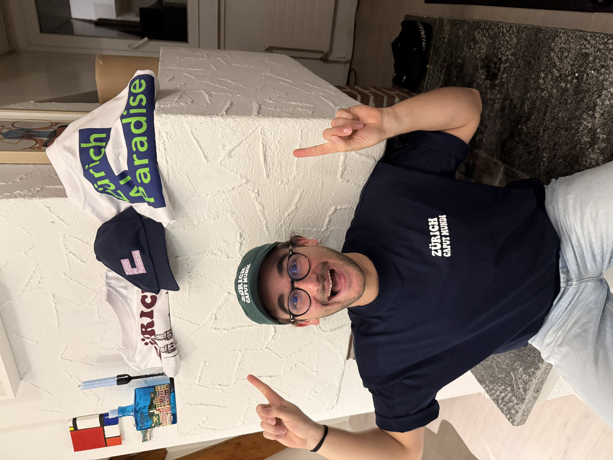

# Dear paid sub, a gift for you!

<figure><a class="image-link image2 is-viewable-img" target="_blank" href="../assets/1b2f9763ae16b3f5.jpg" data-component-name="Image2ToDOM">
<picture><source type="image/webp" srcset="../assets/1b2f9763ae16b3f5.jpg 424w, ../assets/1b2f9763ae16b3f5.jpg 848w, ../assets/1b2f9763ae16b3f5.jpg 1272w, ../assets/1b2f9763ae16b3f5.jpg 1456w" sizes="100vw"></picture>

<button tabindex="0" type="button" class="pencraft pc-reset pencraft icon-container restack-image buttonBase-GK1x3M"><svg aria-hidden="true" width="20" height="20" viewBox="0 0 20 20" fill="none" stroke-width="1.5" stroke="var(--color-fg-primary)" stroke-linecap="round" stroke-linejoin="round" xmlns="http://www.w3.org/2000/svg" class="icon-noB79L"><g><path d="M2.53001 7.81595C3.49179 4.73911 6.43281 2.5 9.91173 2.5C13.1684 2.5 15.9537 4.46214 17.0852 7.23684L17.6179 8.67647M17.6179 8.67647L18.5002 4.26471M17.6179 8.67647L13.6473 6.91176M17.4995 12.1841C16.5378 15.2609 13.5967 17.5 10.1178 17.5C6.86118 17.5 4.07589 15.5379 2.94432 12.7632L2.41165 11.3235M2.41165 11.3235L1.5293 15.7353M2.41165 11.3235L6.38224 13.0882"></path></g></svg></button><button tabindex="0" type="button" class="pencraft pc-reset pencraft icon-container view-image buttonBase-GK1x3M"><svg xmlns="http://www.w3.org/2000/svg" width="20" height="20" viewBox="0 0 24 24" fill="none" stroke="currentColor" stroke-width="2" stroke-linecap="round" stroke-linejoin="round" class="lucide lucide-maximize2 lucide-maximize-2 icon-noB79L"><polyline points="15 3 21 3 21 9"></polyline><polyline points="9 21 3 21 3 15"></polyline><line x1="21" x2="14" y1="3" y2="10"></line><line x1="3" x2="10" y1="21" y2="14"></line></svg></button>

</a></figure>

Hey!

You’ve been supporting ML@Scale as a paid subscriber, so you get first access to something I’m genuinely excited about.

I turned my viral Zürich content into a little clothing brand: <strong>Zürich Caput Mundi</strong>.

<strong>Your perks:</strong>
<ul><li>
<strong>30% off</strong> with code MLSCALE_PRO_SUB
</li><li>
<strong>Free shipping</strong> on orders $150
</li></ul>
👉 <a href="http://zurichcaputmundi.machinelearningatscale.com">zurichcaputmundi.machinelearningatscale.com</a>

Perfect for the office, the mountains, or anywhere you need to spot fellow Zürich believers in the wild.

Thanks for being here from the start.

Ludo

