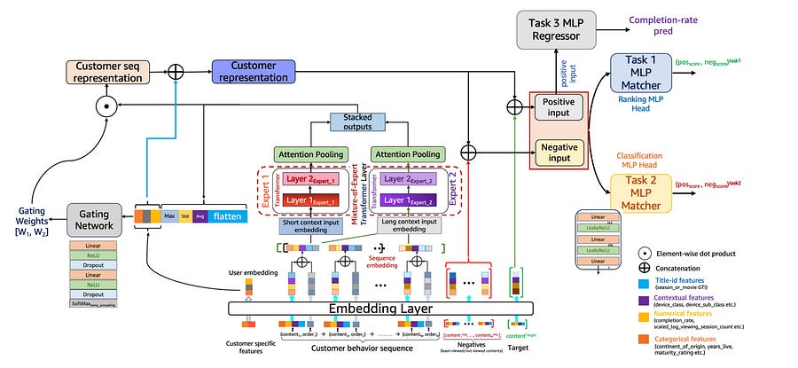
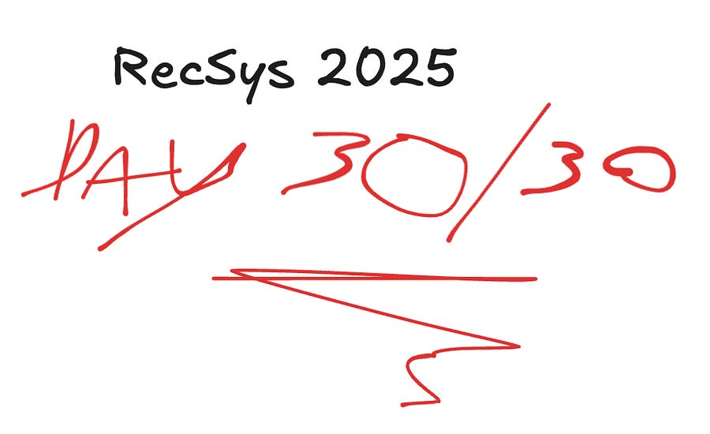

# xAI - Recommendation System Deep Dive

*X published their recommendation system. Let's understand it.*

> Paid post — only the publicly visible preview is included.

*X published their recommendation system. Let's understand it.*

# Introduction

X has made public their recommendation system.

End to end.

From retrieval to ranking.

This is Machine Learning at Scale and this is the exact content I love discussing, so this required a special edition.

LFG!

Read all the way to get my take on it :)

First things first.

If you are not super familiar with Recommendation systems, I suggest you take a look at my deep dives:

[R4ec: Teaching Your Recommender LLMs to Think TwiceLudovico Bessi·November 2, 2025[Read full story](2025-11-02-r4ec-teaching-your-recommender-llms.md)](2025-11-02-r4ec-teaching-your-recommender-llms.md)

[Exploring Scaling Laws of CTR Model for Online Performance ImprovementLudovico Bessi·November 9, 2025[Read full story](2025-11-09-exploring-scaling-laws-of-ctr-model.md)](2025-11-09-exploring-scaling-laws-of-ctr-model.md)

[Foundation Model for In-Context Learning on Relational DataLudovico Bessi·November 12, 2025[Read full story](2025-11-12-foundation-model-for-in-context-learning.md)](2025-11-12-foundation-model-for-in-context-learning.md)

[Beyond Immediate Click: Engagement-Aware and MoE-Enhanced Transformers for Sequential Movie RecommendationLudovico Bessi·November 16, 2025[Read full story](2025-11-16-beyond-immediate-click-engagement.md)](2025-11-16-beyond-immediate-click-engagement.md)

[Direct Profit Estimation Using Uplift Modeling under Clustered Network InterferenceLudovico Bessi·November 23, 2025[Read full story](2025-11-23-direct-profit-estimation-using-uplift.md)](2025-11-23-direct-profit-estimation-using-uplift.md)

[Towards Large-scale Generative RankingLudovico Bessi·November 26, 2025[Read full story](2025-11-26-towards-large-scale-generative-ranking.md)](2025-11-26-towards-large-scale-generative-ranking.md)

[Month of RecSys 2025 - closing notesLudovico Bessi·November 30, 2025[Read full story](2025-11-30-month-of-recsys-2025-closing-notes.md)](2025-11-30-month-of-recsys-2025-closing-notes.md)

Now, with that out of the way, let’s get started!

# TLDR

It operates on a "vector-first" philosophy. The pipeline executes a standard four-stage lifecycle: Query hydration → Retrieval → Filter → Rank

The defining characteristic of the system is the removal of explicit feature engineering in favor of raw embedding interoperability.The system does not “calculate” features; it looks up pre-computed vectors and passes them to a distilled Grok model.

Another interesting point is the lack of a prescorer, they chose to optimize for a better feed vs latency. 

In the end of the newsletter, I will comment in depth based on my experience as an MLE.

# Query Hydration

The recommendation request begins with the RecommendationRequest struct in Rust. This is not a simple database lookup; it is a parallelized gather-and-scatter operation to build the **User Context**.

The system hits the User Data Store to build a composite view of the user’s current state.

  1. **User Embedding:** A dense float-vector (d=2048) representing the user’s long-term interests. This is pre-computed by a separate offline User Tower and stored in a low-latency KV store.

  2. **Real Graph State:** The system retrieves the user’s weighted social graph. Unlike a standard follower list, this contains interaction coefficients, specifically identifying the “Core Network” (users with >0.8 interaction probability).

  3. **Anti-Signals:** A Bloom filter or hash set of recent “Dislikes,” “Mutes,” and “Show Less” actions. This is loaded early to short-circuit retrieval paths later.

If the User Embedding fails to load, the request is terminated immediately.

The architecture treats the embedding as the primary key for the entire session.

# Retrieval

The system targets a retrieval pool of roughly 1,500 to 2,000 candidates per request. This comes from two distinct, concurrent sources.

**1\. Source: Thunder (In-Network / Real Graph)**  
Thunder is the graph processing engine. It executes a breadth-first search on the user’s “Core Network.”

  * **Mechanism:** It iterates over the top users the requestor interacts with.

  * **Time Window:** It creates a window of recent posts (typically <24h, tighter for high-velocity users).

  * **Logistic Regression Lite:** The retrieved posts undergo a lightweight scoring pass (a linear combination of author_weight and time_decay) to cap the retrieval at ~1,000 candidates.

**2\. Source: Phoenix (Out-of-Network / Vector Search)**  
Phoenix is the ANN (Approximate Nearest Neighbor) engine. It solves the embedding retrieval problem.

  * **Algorithm:** It uses HNSW (Hierarchical Navigable Small World) graphs to index the vector space of all recent tweets.

  * **Query:** It queries the index using the **User Embedding** from the hydration step.

  * **Optimization:** The search is sharded. The index is likely segmented by language and safety clusters to prune the search space immediately. It returns the top ~1,000 candidates that act as “nearest neighbors” to the user’s interest vector.

# Post Hydration

At this stage, the system has a list of ~2,000 Candidate IDs.

The system performs a massive multi-get request to the Tweet Store:

  * **Content Embeddings:** The critical payload. The system fetches the pre-computed embedding for the tweet text and any attached media (Video/Images are projected into the same latent space).

  * **Interaction State:** Real-time counters (Likes, Reposts, Replies). These are not used as raw integers but are often log-normalized and bucketed before entering the model.

  * **Author Features:** The embedding of the author is fetched to compute the dot-product similarity between User_Vector and Author_Vector as an input signal.

# Filters

Before the compute-heavy ranking, the candidate list passes through a chain of boolean predicates (Filters).

  1. **Visibility Filter:** Checks the bi-directional block graph. If Candidate A blocked User B (or vice versa), drop.

  2. **Safety Filter:** Enforces the user’s specific sensitivity settings. It checks the content labels (e.g., label:nsfw_high_precision).

  3. **Feedback Fatigue Filter:** Checks the “Anti-Signals” loaded during Query Hydration. If the user clicked “Show Less” on this author or this topic cluster within the last session, the candidate is dropped.

  4. **Social Proof Filter:** In specific “For You” configurations, the system enforces a minimum engagement threshold (e.g., “Must have >5 likes”) to prevent cold-start spam from entering the heavy ranker.

# Scoring

The filtered candidates are batched and sent to the **Heavy Ranker**. This is the most expensive component in the stack.

The model is a JAX-based Transformer (a distilled version of the Grok architecture).

It treats recommendation as a sequence modeling problem.

  * **Input:** [User_Context_Tokens] [Candidate_1_Tokens] ... [Candidate_N_Tokens]

  * **Output:** A probability distribution over a set of engagement actions (P(Like), P(Reply))

This is a Multi-Task Learning (MTL) structure, with one head for each prediction.

# Personal deep dive

**1\. Production Ranker Size vs. Latency**  
The codebase hides the massive operational cost here.

Standard industry practice (Meta, TikTok) typically involves a three-step funnel: 

Retrieval (10k) → Light Ranker (2k) → Ranker (500)  
  
X has removed the middle step. They are feeding ~1,500 candidates directly into a Transformer-based ranker.

This is computationally wildly expensive. Unless they have infinite TPU budget, they are likely running a smaller, quantized model than they admit, or their “Grok” ranker is heavily distilled. Without a prescorer to cull the “obviously bad” 50% of candidates cheaply, this is expensive and **most importantly high latency**.

**2\. Transformer Heads: Standard but opaque**
