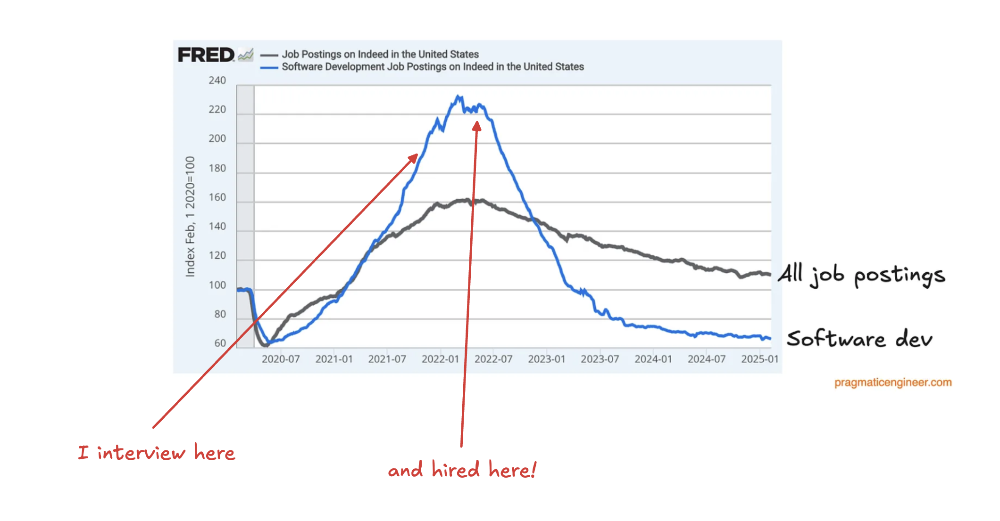

# What would I do if I wanted to get into ML in 2026

<figure><a class="image-link image2 is-viewable-img" target="_blank" href="../assets/6cac8d1cbdcf620e.png" data-component-name="Image2ToDOM">
<picture><source type="image/webp" srcset="../assets/6cac8d1cbdcf620e.png 424w, ../assets/6cac8d1cbdcf620e.png 848w, ../assets/6cac8d1cbdcf620e.png 1272w, ../assets/6cac8d1cbdcf620e.png 1456w" sizes="100vw"></picture>

<button tabindex="0" type="button" class="pencraft pc-reset pencraft icon-container restack-image buttonBase-GK1x3M"><svg aria-hidden="true" width="20" height="20" viewBox="0 0 20 20" fill="none" stroke-width="1.5" stroke="var(--color-fg-primary)" stroke-linecap="round" stroke-linejoin="round" xmlns="http://www.w3.org/2000/svg" class="icon-noB79L"><g><path d="M2.53001 7.81595C3.49179 4.73911 6.43281 2.5 9.91173 2.5C13.1684 2.5 15.9537 4.46214 17.0852 7.23684L17.6179 8.67647M17.6179 8.67647L18.5002 4.26471M17.6179 8.67647L13.6473 6.91176M17.4995 12.1841C16.5378 15.2609 13.5967 17.5 10.1178 17.5C6.86118 17.5 4.07589 15.5379 2.94432 12.7632L2.41165 11.3235M2.41165 11.3235L1.5293 15.7353M2.41165 11.3235L6.38224 13.0882"></path></g></svg></button><button tabindex="0" type="button" class="pencraft pc-reset pencraft icon-container view-image buttonBase-GK1x3M"><svg xmlns="http://www.w3.org/2000/svg" width="20" height="20" viewBox="0 0 24 24" fill="none" stroke="currentColor" stroke-width="2" stroke-linecap="round" stroke-linejoin="round" class="lucide lucide-maximize2 lucide-maximize-2 icon-noB79L"><polyline points="15 3 21 3 21 9"></polyline><polyline points="9 21 3 21 3 15"></polyline><line x1="21" x2="14" y1="3" y2="10"></line><line x1="3" x2="10" y1="21" y2="14"></line></svg></button>

</a></figure>
<h1>Introduction</h1>
I have been fortunate enough to graduate in late 2021 when hiring for new grads was going strong and ML skillset was somewhat rare.

In that time, I got offers from:
<ul><li>
Google Zürich (still here rocking almost 4 years after!)
</li><li>
Meta London
</li><li>
Snapchat Vienna
</li><li>
Yelp London
</li><li>
UBS Zürich
</li></ul>
All for heavy Machine Learning.

But, we know how many openings there were around those times…

<figure><a class="image-link image2 is-viewable-img" target="_blank" href="../assets/34d2195815f1f177.png" data-component-name="Image2ToDOM">
<picture><source type="image/webp" srcset="../assets/34d2195815f1f177.png 424w, ../assets/34d2195815f1f177.png 848w, ../assets/34d2195815f1f177.png 1272w, ../assets/34d2195815f1f177.png 1456w" sizes="100vw"></picture>

<button tabindex="0" type="button" class="pencraft pc-reset pencraft icon-container restack-image buttonBase-GK1x3M"><svg aria-hidden="true" width="20" height="20" viewBox="0 0 20 20" fill="none" stroke-width="1.5" stroke="var(--color-fg-primary)" stroke-linecap="round" stroke-linejoin="round" xmlns="http://www.w3.org/2000/svg" class="icon-noB79L"><g><path d="M2.53001 7.81595C3.49179 4.73911 6.43281 2.5 9.91173 2.5C13.1684 2.5 15.9537 4.46214 17.0852 7.23684L17.6179 8.67647M17.6179 8.67647L18.5002 4.26471M17.6179 8.67647L13.6473 6.91176M17.4995 12.1841C16.5378 15.2609 13.5967 17.5 10.1178 17.5C6.86118 17.5 4.07589 15.5379 2.94432 12.7632L2.41165 11.3235M2.41165 11.3235L1.5293 15.7353M2.41165 11.3235L6.38224 13.0882"></path></g></svg></button><button tabindex="0" type="button" class="pencraft pc-reset pencraft icon-container view-image buttonBase-GK1x3M"><svg xmlns="http://www.w3.org/2000/svg" width="20" height="20" viewBox="0 0 24 24" fill="none" stroke="currentColor" stroke-width="2" stroke-linecap="round" stroke-linejoin="round" class="lucide lucide-maximize2 lucide-maximize-2 icon-noB79L"><polyline points="15 3 21 3 21 9"></polyline><polyline points="9 21 3 21 3 15"></polyline><line x1="21" x2="14" y1="3" y2="10"></line><line x1="3" x2="10" y1="21" y2="14"></line></svg></button>

</a></figure>

Funny thing is that I know for sure I bombed hard one google interview, but still got in on the back of four strong interviews. Not sure that’d have happened in late 2025 early 2026 market?

Having said that, I remind myself that lucks meets opportunity, but you can't control luck. So all that’s left is creating the opportunities for yourself!

Let’s see what I’d do in 2026 to stand out, in two different cases:
<ul><li>
Students
</li><li>
Early career professionals
</li></ul>
Let’s go!

Let me say the quite part out loud: you should think of answering the following:

“How makes me different from other students in my cohort?”

This is not to be taken in a zero sum game aka competition, but that’s literally what companies are trying to answer when deciding to select you over others.

With that guiding light in mind, let’s go!
<h1>Students</h1>
If I was a student, I’d stop optimizing for one dimension that every students optimizes for: GPA

<strong>Early undergrad:</strong>

I’d get involved as early as possible into student clubs and other opportunities to start padding your CV.

I’d immediately start applying to early career opportunities, as an example: STEP career program from Google.

I’d also get into opportunities where my effort is directly linked to output:
<ul><li>
Preparing for a Google Summer of Code (GSOC) application: the more you contribute the higher the chances of getting in
</li><li>
Contributing to open source code. Imagine being top PyTorch contributor. I assure you will get fast tracked to Meta hiring. (plus, the skills you gain are incredible!)
</li></ul>
<strong>Later undegrad:</strong>

Here, I’d capitalize on the work you did earlier to start winning some nice internships. Prioritize work experience and not courses, you should try and fight against your uni to be able to follow as much as possible Co-op model of UWaterloo. (go look it up, tldr is that you do 6 months internship / 6 months courses on repeat).

You did not do anything in your early undergrad? No problem! I started in my third year of undergrad getting involved in work opportunities. Just go read section above again ;).

At this point, you should have an impressive CV even before graduating and should be able to get tons of interviews. Interviews are also a game of luck: you win some and you lose some, but you just need to win once. So get it!
<h1>Early career professionals that want to break into ML</h1>

If you are reading this, it means you are a paid sub! Thank you so much for being here :)

I feel this is way easier, so congrats if you are into this section.

I get asked this question a lot, and my first (and I guess only?) answer is the following: get involved in ML projects in *your current role*.

Let’s be real, you are probably not going to be pre training the next best LLM, but every company is trying to use ML in some kind of way, so don’t lie to yourself: there’s for sure an opportunity to play around with this work in your team, or by doing free work for another team! Everyone likes free work ;)

And from there, you build up brick by brick. With this experience and some self study under your belt (plenty of good ML content out there, like this newsletter :D), you can either:
<ul><li>
Switch internally to a more ML focused team, given your strong work ethic and ML experience
</li><li>
Interview for another company that does ML work by showcasing what you did at your current company
</li></ul>
Of course, all of that does not stop you to work outside of your current job, plenty of opportunities again:
<ul><li>
Open source work again!
</li><li>
ML program like the <a href="https://www.matsprogram.org/">MATS program</a> 
</li></ul><h1>Closing thoughts</h1>
Let’s be real, the market is quite strange. lots of people looking, not a lot of people moving around, positions are getting harder and harder to get.

Still, lots of people are getting multiple offers and are able to negotiate top comp packages!

So what gives?

Well, the supply has matched demand, which means you stop seeing crazy high comps for basic CRUD-like applications with QPS that you can count on one hand.

Instead, top packages go to only top candidates with unique skillsets.

That can still be you if you put in the work to become great!

Ludo

