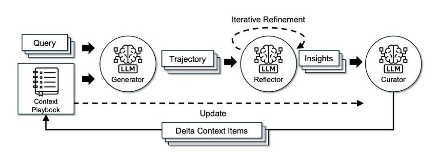

# Agent Context Engineering

# TLDR

As AI systems shift from simple chatbots to complex agents, the limiting factor is often not the model’s weights, but its context management.

A new framework, **Agentic Context Engineering (ACE)** , challenges the prevailing wisdom of prompt optimization.

Instead of condensing context into short, generalized summaries—which leads to performance degradation—ACE treats context as an evolving “playbook” of detailed, distinct strategies.

By using a modular Generator-Reflector-Curator architecture to append structured “delta updates,” ACE allowed a smaller open-source model (DeepSeek-V3.1) to match the performance of a top-ranked GPT-4 agent on the AppWorld benchmark, all while reducing adaptation latency by ~87%.

* * *

# The failure of brevity and the risk of collapse

For the last two years, the standard approach to improving LLM performance at inference time has been “context adaptation”—modifying instructions and providing few-shot examples rather than retraining the model. However, existing optimization methods (like OPRO, MIPRO, or GEPA) suffer from two critical flaws that prevent them from scaling to complex, agentic workflows.

**1\. The Brevity Bias**  
Most automated prompt optimizers have a fatal tendency: they prioritize conciseness. When an LLM is asked to improve a prompt, it instinctively tries to make it shorter and more general. While this is aesthetically pleasing to humans, it is detrimental to model performance in specialized domains. For example, in software testing tasks, optimizers often reduce specific heuristic guidelines into generic commands like “ensure code runs correctly.” This abstraction strips away the detailed edge-case handling required for high reliability. The ACE paper argues that to solve hard problems, contexts should not be summaries; they should be saturated with abundant, specific information.

**2\. Context Collapse**  
The second issue arises when agents attempt to maintain a long-term memory or evolving system prompt. Standard approaches rely on “monolithic rewriting,” where the model reads its current context and generates a fully rewritten version.

The researchers observed a catastrophic failure mode here called **Context Collapse**. In one case study on the AppWorld benchmark, an agent had accumulated a rich context of 18,282 tokens. After a single adaptation step where the model was asked to rewrite/refine the context, it compressed the information down to just 122 tokens. The result? Accuracy plummeted from 66.7% to 57.1%—worse than having no adaptation at all. By forcing the model to rewrite the whole context, the system inadvertently filters out the “boring” but necessary syntax rules and API specifics that the agent actually needs to function.

* * *

# ACE Architecture: Generation, Reflection, Curation

To solve this, ACE introduces a framework that treats context engineering like software version control rather than essay writing. It abandons monolithic rewrites in favor of **incremental delta updates**. The architecture is split into three distinct agentic roles to ensure high-quality data flow:

**1\. The Generator (Execution)**  
This component is responsible strictly for solving the problem. It produces reasoning trajectories and interacts with the environment (e.g., executing code or calling APIs). It does not try to learn; it only tries to do.

**2\. The Reflector (Evaluation)**  
This is where ACE differentiates itself from standard memory buffers. The Reflector reviews the Generator’s trajectory. Crucially, it works even without ground-truth labels. By looking at execution signals—did the code compile? did the API return a 404?—the Reflector identifies specific “bullets” of insight. It isolates exactly which strategy worked or which assumption caused a crash.

**3\. The Curator (Integration)**  
The Curator takes these insights and formats them into **Delta Context Items**. These are structured entries (containing metadata and content) that are _appended_ to the context.

**The “Grow-and-Refine” Strategy**  
Instead of rewriting the prompt every time, ACE appends these deltas. When the context eventually hits the token limit, ACE performs a “lazy refinement.” It uses semantic embeddings to detect duplicate strategies and merges them, while keeping unique, granular details intact.

This approach transforms the context from a static instruction block into a dynamic **Playbook**. It allows the system to retain specific API error codes alongside high-level planning strategies, scaling up to the massive context windows of modern models (128k+ tokens) without losing fidelity.

* * *

# **Main Takeaways**

  * **Open-Source Parity:** On the rigorous AppWorld benchmark, ACE enabled **DeepSeek-V3.1** (an open-source model) to match the performance of **IBM-CUGA** (a production agent powered by **GPT-4.1**). On the hardest “challenge” split, the ACE-enabled open-source model actually outperformed the proprietary giant.

  * **Unsupervised Self-Improvement:** ACE creates effective contexts without needing human-labeled data. By leveraging natural execution feedback (runtime errors, tool outputs), the Reflector can autonomously curate a high-quality playbook, making this viable for live production environments where ground truth is scarce.

  * **Massive Efficiency Gains:** Because ACE uses small delta updates rather than regenerating massive system prompts, it is incredibly efficient. Compared to strong baselines like GEPA or Dynamic Cheatsheet, ACE reduced adaptation latency by **86.9%** and lowered rollout costs by **75%**.

  * **Dominance in Specialized Domains:** The framework isn’t just for agents. On the FiNER financial analysis benchmark, ACE outperformed baselines by **8.6%** , proving that complex domains require the kind of detailed, non-compressed context that only an evolving playbook can provide.
