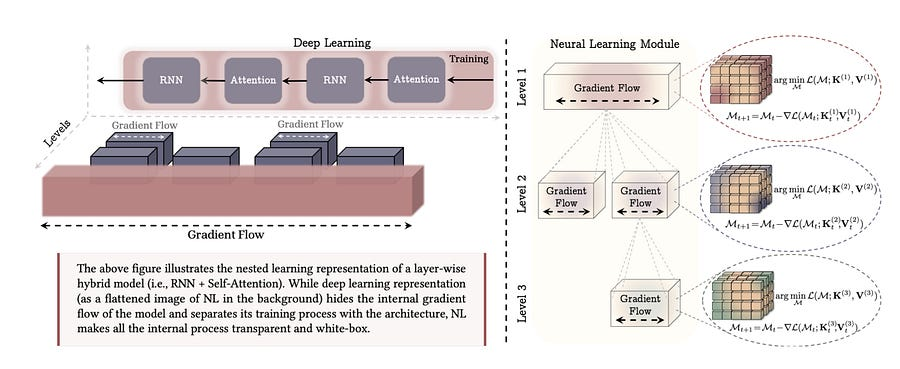

# Nested Learning: Why Stacking Layers is an Illusion

* A new paradigm from Google Research suggests we stop building "Deep" networks and start building "Nested" systems.*

* A new paradigm from Google Research suggests we stop building "Deep" networks and start building "Nested" systems.*

**TL;DR:**

  * **The Paradigm Shift:** A new paper argues that “Deep Learning” is a limited 2D view. The authors propose **Nested Learning (NL)** , viewing models as systems of nested optimization loops running at different frequencies (like brain waves).

  * **The Unification:** Through the lens of NL, there is no difference between an architecture (like a Transformer) and an optimizer (like Adam). Both are just associative memory units compressing data streams.

  * **The Model:** They introduce **“Hope,”** a new architecture using a “Continuum Memory System” that beats Transformers on long-context and continual learning tasks by virtually eliminating the boundary between training and inference.

### AI has problems remembering

Current Large Language Models (LLMs) suffer from a digital form of**amnesia**. They have “long-term memory” (pre-training weights) and “short-term memory” (context window), but nothing in between. Once the context window slides forward, the information is gone forever. Stacking more layers (making the model “deeper”) increases reasoning capacity, but it doesn’t solve the fact that the model lives in an eternal “now,” unable to learn continuously after deployment without expensive re-training.

### The Solution: Nested Learning (NL)

In a new paper, _Nested Learning: The Illusion of Deep Learning Architecture_ , researchers from Google and Columbia University suggest that “stacking layers” provides an illusion of complexity. Instead, they propose we view models as **Nested Systems**.

In this view, every component of a model is an optimization problem with a specific **“Context Flow”** and **“Update Frequency.”**

  * **High Frequency:** Attention mechanisms (Updates every token).

  * **Low Frequency:** Pre-training weights (Updates only during backprop).

  * **The Missing Middle:** We need layers that update at medium frequencies, bridging the gap between “in-context learning” and “hard-coded weights.”

### Optimizers are Neural Networks

The most radical insight in the paper is the mathematical proof that **Optimizers (like Adam or SGD) are actually Associative Memory Networks.**

When you train a network, the optimizer is trying to “compress” the gradients.

  * **SGD** is a 1-level memory (mapping input to error).

  * **Adam** is a 2-level memory (compressing gradient variance).

  * **Architecture** generates the context for the **Optimizer**.

This means we shouldn’t treat the Architecture and the Optimizer as separate entities. They are the same type of mathematical object, just operating at different levels of the nest.

### “Hope”: A Self-Modifying Architecture

Based on these insights, the authors introduce a new neural learning module called **Hope**.

Hope abandons the standard MLP blocks found in Transformers. Instead, it uses a **Continuum Memory System (CMS)**.

  1. **Self-Referential Titans:** A sequence model that learns how to modify itself by generating its own update algorithm on the fly (predicting its own learning rate and weight decay per token).

  2. **Multi-Scale Updates:** Instead of one static “weight,” the memory is distributed across blocks that update at different speeds (similar to how the brain has Gamma, Beta, and Theta waves for different memory consolidation speeds).

### The Results

The Hope architecture was tested against Transformers, Mamba/State Space Models, and RNNs.

  * **Continual Learning:** In tasks where the model had to learn a new language _in-context_ and translate it later, Hope achieved near-perfect retention, while Transformers suffered catastrophic forgetting.

  * **Needle-In-A-Haystack:** Hope outperformed Transformers in multi-key retrieval tasks.

  * **Optimizer Efficiency:** The authors also built a “Multi-scale Momentum Muon” (M3) optimizer based on this theory, which achieved lower loss on ImageNet than AdamW.

### Why This Matters for ML at Scale

We are hitting the limits of static pre-training. The future belongs to models that can learn continuously without needing a massive cluster to re-train from scratch every month. Nested Learning provides the theoretical framework to treat “Training” and “Inference” not as two separate phases, but as a continuous spectrum of memory updates.

Pretty cool work if you ask me!!
