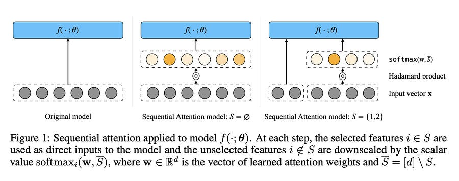

# Sequential Attention: Bridging Greedy Selection and Differentiable Masks

# **TLDR**

Sequential Attention (SA) is a feature selection algorithm that combines the performance of greedy forward selection with the efficiency of differentiable attention masks

By iteratively selecting features and re-evaluating the residual importance of the remaining set, SA avoids the redundancy issues common in one-pass selection methods.

In the linear case, the authors prove SA is equivalent to Orthogonal Matching Pursuit (OMP), effectively bridging classical sparse recovery theory with modern neural network architectures.

# Introduction

Feature selection for neural networks usually falls into two camps: combinatorial greedy methods or differentiable regularization. 

Greedy forward selection is the gold standard for quality because it evaluates the marginal contribution of a feature—how much it improves the model given the features already selected. 

However, it is computationally prohibitive for deep learning, requiring the training of O(kd) models.

On the other hand, differentiable methods like L1 regularization (LASSO) or global attention masks are efficient but typically operate in a single pass. This “one-shot” approach often fails to identify features that are uninformative in isolation but valuable in combination, or it selects redundant features that carry the same signal. 

Sequential Attention solves this by using a differentiable global mask in an iterative, k-round process.

# The Algorithm and Implementation

The Sequential Attention algorithm maintains a set of selected features and treats the unselected features as a weighted competition. The input vector is modified via a Hadamard product with a weight vector.

  1. **The Masking Mechanism:** In any given step, selected features are passed into the model with a weight of 1. Unselected features are multiplied by the output of a softmax function applied to a set of trainable attention weights. This forces the model to “focus” its limited attention budget on the most promising candidates among the remaining features.

  2. **Iterative Selection:** Unlike standard attention, which trains a mask once, SA selects the feature with the highest attention weight, adds it to the “selected” set, and then re-trains. This allows the model to adjust the weights of the remaining features based on the residual error.

  3. **One-Pass Efficiency:** To mitigate the cost of training k separate models, the authors propose a streaming implementation. The total training epochs are partitioned into k segments. After each segment, the top-weighted feature is locked in, and the weights for the remaining features are reset or updated. This reduces the computational overhead to nearly that of a standard single-model training run, making it viable for massive datasets.

  4. **Global vs. Instance-wise:** Many prior attention methods use instance-wise masks (generating a different mask for every input), which requires complex sub-networks and heavy hyperparameter tuning. SA uses a single global mask, simplifying the architecture and reducing the risk of overfitting the selection mechanism itself.

# Theoretical Foundations and Empirical Performance

The paper’s most significant contribution is providing a theoretical “why” for the effectiveness of attention in this context.

  * **Equivalence to OMP:** For least-squares linear regression, the authors demonstrate that a regularized version of SA is equivalent to Sequential LASSO. They then prove a novel result: Sequential LASSO is equivalent to Orthogonal Matching Pursuit (OMP). This is critical because OMP has well-documented provable guarantees for sparse recovery. It suggests that SA is essentially a differentiable version of OMP that can be applied to non-linear neural networks.

  * **The Hadamard Effect:** Through ablation studies, the authors find that the success of the algorithm is less about the specific softmax activation and more about “Hadamard product overparameterization.” By introducing these trainable weights as multipliers, the loss landscape becomes smoother and more conducive to gradient-based optimization for sparsity.**They tested various normalization schemes (L1, L2, and their normalized versions) and found nearly identical performance, suggesting that the explicit overparameterization is the primary driver of quality.**

  * **Large-Scale Validation:** The algorithm was tested on the Criteo click-through rate dataset, which contains over 3 billion examples. SA outperformed Group LASSO and other attention-based baselines, particularly as the number of selected features increased. It showed significantly lower variance than LASSO-based methods, which can be sensitive to the choice of the regularization strength (lambda).
