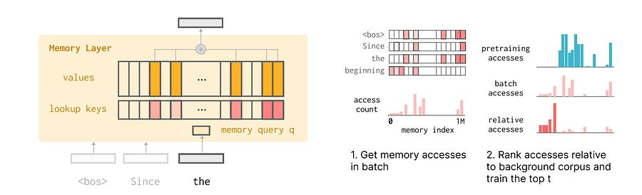

# Continual Learning via Sparse Memory Finetuning

> Paid post — only the publicly visible preview is included.

# TLDR

  * Replaces standard Transformer FFN layers with “Memory Layers” (key-value pools) and updates only a tiny fraction of parameters (slots) during fine-tuning.

  * Uses TF-IDF ranking to identify memory slots specific to new data, masking out slots responsible for general pre-training knowledge.

  * On QA tasks, this method yields comparable learning to Full Finetuning and LoRA but drastically reduces forgetting (e.g., 11% drop in held-out performance vs. 89% for Full FT).

  * Catastrophic forgetting is a parameter interference problem; mathematically isolating "fact-specific" parameters from "general-capability" parameters solves it.

# Introduction

The primary blocker to continual learning in production LLMs is catastrophic forgetting. When a model is updated on a stream of new data (e.g., breaking news, user-specific corrections), the gradient updates modify parameters shared across all tasks. Optimizing for the new distribution pushes weights away from the optima of previous distributions.
