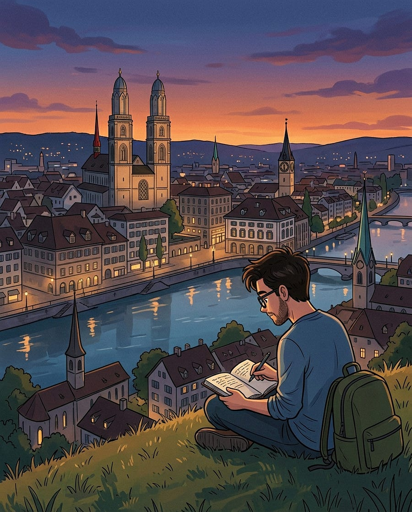

# ML engineer - The Bigger Picture - My life in 10 years?

> Paid post — only the publicly visible preview is included.

Last one in the series. This one’s more personal.

**My life outside of work is honestly quite simple.**

Strong performance at my job. Taking care of my body. Managing relationships with friends, family, and my girlfriend.

That’s it. No secret morning routine. No 5am cold plunge. No elaborate productivity system that I’m trying to sell you.

For the body: I practice whatever sport feels right at the time. Tennis, gym, running, biking, skiing.

The goal was never to become an athlete. It’s to disconnect, move, and stay in shape. 

Variety keeps it fun, fun keeps it consistent, consistency keeps me sane.

I’ve tried the “optimize everything” approach to fitness. It killed the joy. Now I just move and enjoy it.

For relationships: this one requires more intentionality than people admit.

When life gets busy the people you care about are the first thing that gets deprioritized without you even noticing.

I protect that time deliberately. Dinners, weekends, being actually present instead of half-thinking about work. It doesn’t happen by accident.

**What success looks like for me**
