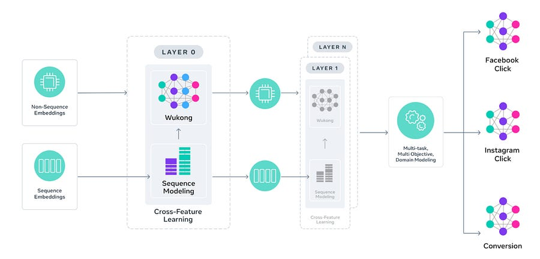

# Meta's GEM: Bringing LLM-Scale Architectures to Ads Recommendation

> Paid post — only the publicly visible preview is included.

# TL;DR

Meta has shifted its ads system to a “Foundation Model” paradigm with GEM (Generative Ads Model).

It adapts LLM scaling laws to recommendation systems (RecSys).

Key technical shifts include:

  * split architecture handling sequence vs. non-sequence features independently

  * “InterFormer” mechanism to process long user history without early compression

  * “Student Adapter” to fix knowledge distillation staleness in production

The result is a 23x increase in effective training FLOPS and a 1.43x improvement in Model FLOPS Utilization (MFU).

# Introduction

For years, the standard approach to industrial recommendation systems has been training individual ranking models for specific surfaces or objectives—one model for clicks on Feed, another for conversions on Reels. While effective, this fragments signal and caps scalability.

Meta recently detailed GEM, their move toward a unified foundation model for ads. The objective was to build a RecSys that scales like an LLM: where adding parameters and compute yields predictable, linear gains in accuracy.

This addresses the sparsity problem in ad prediction (billions of impressions, few conversions) by learning universal representations of user intent across all surfaces (Facebook, Instagram, etc.) before fine-tuning for specific verticals.

Below is the breakdown of how they architected the model and, crucially, how they solved the latency and freshness issues inherent in deploying massive models for real-time inference.

# The Architecture: InterFormers and Pyramid Parallelism
