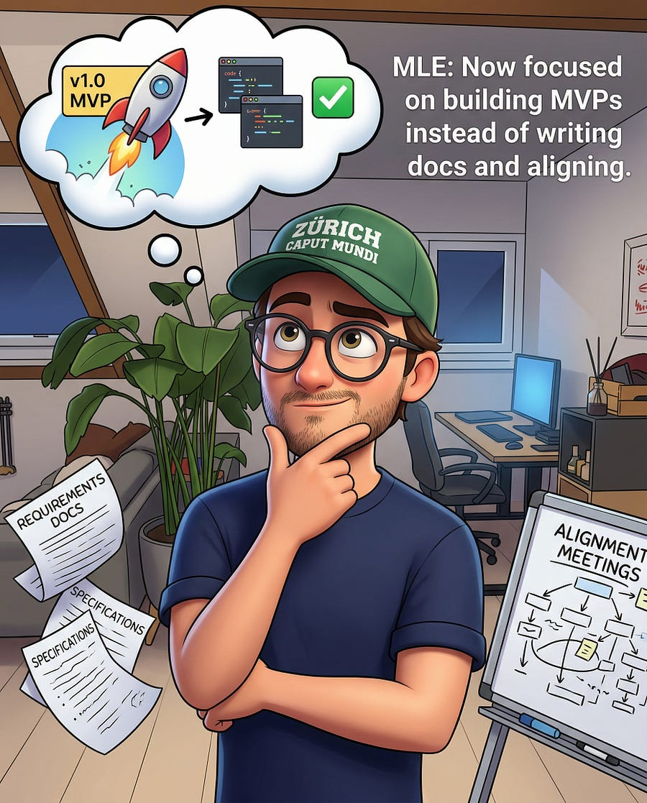

# What Nobody Tells You About Being an MLE in 2026

*Design docs are dead. MVPs are your new currency. Here's how I'm adapting.*

> Paid post — only the publicly visible preview is included.

*Design docs are dead. MVPs are your new currency. Here's how I'm adapting.*

We are entering a new era for Software engineers.

But **especially** for Machine learning engineers given the experimental nature of the job.

Here’s how _I am navigating_ it and how I try to stay ahead of the curve in my big tech job.

There are many angles in this post, namely:

  1. Design docs are dead.

  2. MVPs are your new currency. Less talk, more building.

  3. Convincing others that your work matters is easier than you think if you have good taste

  4. Relationships matter more and more

Let’s get to it!

## Design docs are dead

Yeah. I said it.

I have been bearish on design docs as artifacts for a while and I am happy they are mutating into something different.

I will give you an example from my own experience.

When I was working in YouTube Ads I worked on a multi-year (!!!) project that was taken and dropped many times due to reorgs.

Leadership visibility was high, people wanted this shipped badly.

Looking at the project history, every person coming in spent months writing a spotless doc with multiple alignments.

The problem?

The soil under you shifts.

every.

single.

day.

Infra changes. Top line metrics change.

Someone somewhere launches something that makes one of your core metrics tank.

Good luck telling them to un-launch it for your proposal (read this out aloud to realize how stupid this is?)

If you were to keep your shiny doc up to date with everything changing around you, you’d that full time and never ship ANYTHING.

If your leadership cares optics and believe this is fine… change orgs.

What do you do then?

You start building. Piece by piece. Core functionality first.

Prove fast that you are moving metrics.

If you are not… call it a day and move on.

Your design doc? It just turned into an experimental plan.

You still have artifacts showing your “design work”.

Just different flavour of it for the new agentic era.

Weekly updated in the doc to keep your leadership aware of blockers and what’s happening and what’s your plan.

Your tech lead can chime in to provide more context and course correct if needed.

You have a doc to share with your plan to get PRs approved.

A few new problems with this:

  * People don’t believe I should work on this initiative at all, don’t see strong grounding for it.

  * But Ludo… people don’t care about my silly MVP, think it’s stupid and don’t approve PRs if the doc is not fully approved

  * But my grand design… how do I prove seniority?

Let’s break them down one by one. ⬇️

## Convincing others that your work matters is easier than you think if you have good taste

 _I write about ML systems in production — the tradeoffs, the architecture decisions, the stuff that doesn’t make it into papers. If you want to go deeper, the paid tier covers the technical (AND personal! like this one) details I can’t fit in free posts._
