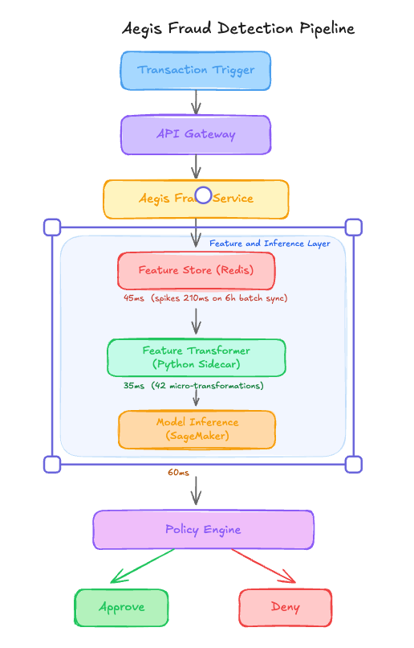

# 800ms Latency Spikes From A $45K Redis Cluster That Looked Healthy [Edition #2]

*Veritas Pay’s 18M daily transactions exposed how blind overwrites and Python sidecar bottlenecks blew a 150ms SLA, you will learn to implement streaming Flink pipelines to cut monthly costs by $30k*

*Veritas Pay’s 18M daily transactions exposed how blind overwrites and Python sidecar bottlenecks blew a 150ms SLA, you will learn to implement streaming Flink pipelines to cut monthly costs by $30k*

# The System

Veritas Pay is a Series C fintech company that recently crossed the 50 million user mark. They have scaled rapidly in the peer-to-peer lending space, processing nearly 800 million transactions last year.

Their engineering team built a real-time fraud detection engine called Aegis that scores every transaction before it is authorized. Here is their setup.

# Architecture Overview

When a user initiates a transaction, the payment gateway sends a POST request to the Veritas API:

### Traffic patterns:

Total Users: 50,000,000

Daily Transaction Volume: 18,000,000

Average: 2,500 req/sec

Peak: 12,500 req/sec (usually 9:00 AM and 6:00 PM EST)

### The ML Pipeline:

The model is an XGBoost classifier trained on 18 months of historical transaction data stored in Snowflake. The training set includes 450 features, 150 of which are “online-only” features computed by the Python Sidecar during the request flow, and 300 of which are “batch” features updated in Redis every 6 hours via a Snowflake-to-S3-to-Redis ETL pipeline.

### Current performance:

P99 Latency: 165ms (SLA is 150ms)

Reliability: 99.4% (Frequent timeouts during peak loads)

Business impact: 1.2% false decline rate

Costs:

Redis Cluster (Memory Optimized): $45,000 / month

Sagemaker Inference: $70,000 / month

Snowflake/ETL Compute: $35,000 / month

Total: $150,000 / month

Recent incidents:

Incident 1: P99 latency hit 800ms during the morning peak. Recovery required a manual throttle of the batch ETL job which was saturating Redis IOPS.

Incident 2: Model precision dropped 15% after a feature logic change. Investigation found the Python sidecar code was updated but the Snowflake SQL for training was not, leading to a silent feature drift.

# The Analysis

Now let me show you what is actually happening here.

### Critical Issue #1: Redis Write Saturation During Batch Syncs

In the architecture overview, I noted that Redis latency spikes from 45ms to 210ms during the 6-hour batch sync. This happens because the team is using a “blind overwrite” pattern where Snowflake dumps 300 features for 50 million users directly into a production read-store. At 12,500 peak TPS, the Redis cluster is already at 70% CPU utilization just handling GET requests. When the batch writer starts pushing millions of SET commands, the NIC saturates, queuing up the read requests and blowing the 150ms SLA.

### Critical Issue #2: The Python Sidecar Bottleneck

The system executes 42 distinct micro-transformations in a Python sidecar. Python is notoriously bad at handling high-concurrency IO-bound work due to the Global Interpreter Lock. At 35ms per request just for feature transformation, the sidecar is consuming nearly 25% of the entire latency budget. Because these transformations are done “in-flight,” any increase in transaction complexity immediately creates a backlog that the Sagemaker endpoint cannot even see.

### Critical Issue #3: Training-Serving Skew by Design

The architecture uses two different languages for the same logic: SQL in Snowflake for training and Python in the sidecar for inference. This is exactly why Incident 2 happened. There is no shared logic layer. The 150 “online-only” features are computed using different libraries (Pandas in training, raw Python in serving), ensuring that the model is making decisions on data that looks fundamentally different from what it learned on.

### Critical Issue #4: The 6-Hour Freshness Gap

Fraud is a game of minutes, not hours. By updating batch features every 6 hours, the “Velocity” features (e.g “How many times has this card been used in the last 10 minutes?”) are being calculated in the Python sidecar on the fly because the batch store is too stale. This forces more complexity into the serving path (the sidecar) and increases the risk of memory leaks and timeouts mentioned in the reliability metrics.

### Critical Issue #5: Massive Over-Provisioning

They have a $70,000 monthly Sagemaker bill just for inference. Looking at the architecture, the model is only 60ms of the total 165ms latency. The bottleneck is the feature retrieval and transformation. They are paying for high-compute instances to sit idle while the Python sidecar struggles to format JSON strings and the Redis cluster waits for IO.

# WHAT I WOULD DO INSTEAD

**1\. Move to a Streaming Feature Store**

Instead of 6-hour batch updates from Snowflake, implement a Kafka + Flink pipeline to update the feature store in real-time.

Impact:

Feature freshness improved from 6 hours to <200ms.

Reduction in False Decline Rate by an estimated 15% due to better velocity detection.

**2\. Unify Feature Logic with a DSL**

Current: Snowflake SQL for training, Python for serving.

New: Use a shared framework like Feast or a custom Rust-based transformer that generates both training sets and serving features.

Impact: Training-serving skew: 15% error rate → <1% error rate.

**3\. Decoupled Read/Write Store**

Replace the single Redis cluster with a Primary/Replica architecture or move to a dedicated Online Feature Store like DynamoDB with DAX.

Current Redis: $45,000 / month

New Architecture: $22,000 / month

Total: $150,000 → $127,000

# The Trade-offs

Every decision has a downside. Here is what you need to know before acting on any of this:

**Solution 1: Streaming Feature Store**

This adds significant operational complexity. Maintaining a Flink cluster requires specialized engineering talent that Veritas currently lacks.

When this is the wrong call: If fraud patterns are slow-moving and batch features provide 95% of the lift, the overhead of Flink is not worth the 5% gain.

**Solution 2: Shared DSL/Rust Transformer**

Moving feature logic into Rust or a DSL means data scientists can no longer “just write Python.” It adds friction to the model experimentation phase.

When this is the wrong call: If your data science team is small and moves fast, this will feel like a cage that slows down innovation.

**Solution 3: Decoupled Read/Write Store**

DynamoDB/DAX or Redis Replicas introduce eventual consistency. There might be a 50-100ms window where a feature update is not yet visible to the reader.

When this is the wrong call: If your fraud rules require absolute atomic consistency (e.g., precise balance checks), eventual consistency will lead to double-spending vulnerabilities.

# The Impact

Before redesign:

System violates SLA at peak loads (165ms vs 150ms).

$150,000 / month infrastructure cost.

After redesign:

P99 latency stabilized at 90ms regardless of load.

$120,000 / month ($30,000 savings or 20% reduction).

Time to implement: 4 months, team of 3 Senior ML Engineers and 1 Data Engineer.

# The Lesson

The system already told them what is wrong:

Incident 1 → Your write path is killing your read path.

Incident 2 → Your training logic is a lie compared to your serving logic.

They just need to listen to what the system is saying.

If you move to a streaming architecture to fix freshness, are you prepared to handle the “cold start” problem when you deploy a new feature that has no historical stream data?

# APPENDIX: Cost Estimation Methodology

How I estimated the savings for each decision:

**Solution 1: Streaming Feature Store**

Baseline: $35,000 Snowflake/ETL monthly compute for batch jobs.

After change: $12,000 for Managed Kafka (MSK) + $15,000 for Flink compute.

Estimated saving: $8,000/month (22% reduction)

Key assumption: Reduced frequency of massive Snowflake scans offsets the cost of running a 24/7 stream processor.

Confidence: Medium — Snowflake costs can be unpredictable based on query optimization.

**Solution 2: Unify Feature Logic**

Baseline: $12,000/month estimated in engineering “toil” and compute overhead for the Python sidecar.

After change: $4,000/month for optimized Rust/Wasm execution.

Estimated saving: $8,000/month

Key assumption: Binary-compiled feature logic reduces CPU cycles compared to interpreted Python sidecars.

Confidence: High — Python execution at scale is consistently 3-5x more expensive than optimized alternatives.

**Solution 3: Decoupled Read/Write Store**

Baseline: $45,000/month for a massive, over-provisioned Redis Cluster.

After change: $25,000/month for a right-sized DynamoDB + DAX setup.

Estimated saving: $20,000/month (44% reduction)

Key assumption: Moving to a managed service with auto-scaling avoids paying for peak capacity 24/7.

Confidence: High — Current Redis usage is pegged to peak IOPS, which only happens 4 hours a day.
