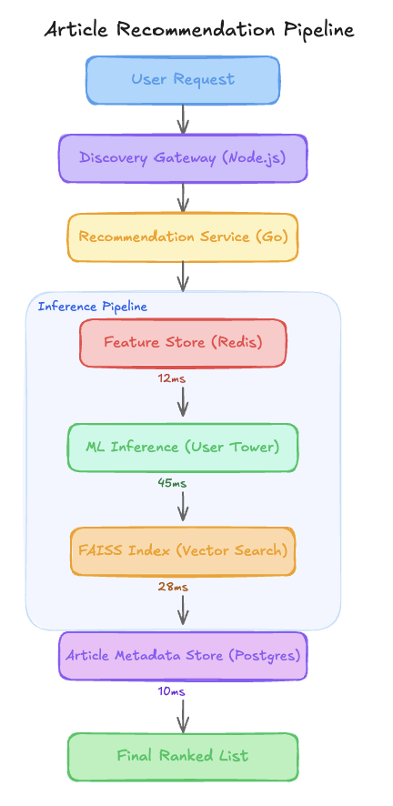

# The $5800 FAISS Index That Was Stale for 168 Hours Straight [Edition #3]

*Learn how swapping an over-provisioned 1024GB memory footprint for hourly HNSW updates can cut retrieval costs by 92% while fixing content freshness.*

<h1>The System</h1>
LexiFeed is a mid-stage newsletter aggregator company that recently crossed the 10 million total registered users mark. They have scaled to 5 million daily active users (DAU) by providing a centralized inbox for newsletter platforms and independent rss feeds.

Their engineering team built a personalized discovery engine that powers the “For You” tab, which is the primary driver of content consumption on the platform.

Here is their setup.
<h1>Architecture Overview</h1>
When a user opens the app, the discovery flow triggers a retrieval request to fetch the top 100 relevant articles from a pool of 1.2 million active newsletter posts.

<figure><a class="image-link image2 is-viewable-img" target="_blank" href="../assets/7129efc15a23601d.png" data-component-name="Image2ToDOM">
<picture><source type="image/webp" srcset="../assets/7129efc15a23601d.png 424w, ../assets/7129efc15a23601d.png 848w, ../assets/7129efc15a23601d.png 1272w, ../assets/7129efc15a23601d.png 1456w" sizes="100vw"></picture>

<button tabindex="0" type="button" class="pencraft pc-reset pencraft icon-container restack-image buttonBase-GK1x3M"><svg aria-hidden="true" width="20" height="20" viewBox="0 0 20 20" fill="none" stroke-width="1.5" stroke="var(--color-fg-primary)" stroke-linecap="round" stroke-linejoin="round" xmlns="http://www.w3.org/2000/svg" class="icon-noB79L"><g><path d="M2.53001 7.81595C3.49179 4.73911 6.43281 2.5 9.91173 2.5C13.1684 2.5 15.9537 4.46214 17.0852 7.23684L17.6179 8.67647M17.6179 8.67647L18.5002 4.26471M17.6179 8.67647L13.6473 6.91176M17.4995 12.1841C16.5378 15.2609 13.5967 17.5 10.1178 17.5C6.86118 17.5 4.07589 15.5379 2.94432 12.7632L2.41165 11.3235M2.41165 11.3235L1.5293 15.7353M2.41165 11.3235L6.38224 13.0882"></path></g></svg></button><button tabindex="0" type="button" class="pencraft pc-reset pencraft icon-container view-image buttonBase-GK1x3M"><svg xmlns="http://www.w3.org/2000/svg" width="20" height="20" viewBox="0 0 24 24" fill="none" stroke="currentColor" stroke-width="2" stroke-linecap="round" stroke-linejoin="round" class="lucide lucide-maximize2 lucide-maximize-2 icon-noB79L"><polyline points="15 3 21 3 21 9"></polyline><polyline points="9 21 3 21 3 15"></polyline><line x1="21" x2="14" y1="3" y2="10"></line><line x1="3" x2="10" y1="21" y2="14"></line></svg></button>

</a></figure>
<h3>Traffic patterns:</h3>
Total Requests: 10.5M requests/day

Peak Throughput: 850 req/sec (typically 8:00 AM EST)

Average Throughput: 120 req/sec

Machine Learning At Scale is a reader-supported publication. To receive new posts and support my work, consider becoming a free or paid subscriber.

<form class="subscription-widget-subscribe"><input type="email" class="email-input" name="email" placeholder="Type your email…" tabindex="-1"><input type="submit" class="button primary" value="Subscribe">

</form>

<h3>The ML Pipeline:</h3>
Model Type: Two-tower neural network (User Tower and Item Tower) using 512-dimension embeddings. 

Training Data: Engagement logs (clicks and read-time) sourced from 6-month-old historical snapshots.

Feature Set: 256 dense features per user including long-term category preferences and historical click-through rates.

Index Strategy: A flat L2 FAISS index hosted on 8x r5.4xlarge instances, rebuilt and redeployed every Sunday at 2:00 AM.
<h3>Current performance:</h3>
P99 Latency: 115ms

Reliability: 99.92 percent uptime

Business Impact: Click-Through Rate (CTR) has remained flat at 4.2 percent for three consecutive quarters.

Costs:

Inference &amp; Retrieval Infrastructure: $8,400 / month

Training Clusters (GPU P3 instances): $4,200 / month

Feature Store &amp; Storage: $1,900 / month

Total: $14,500 / month

Recent incidents:

Incident 1: Recommendation quality dropped to near-zero for 48 hours following a major US election cycle because the model had no representation for the new political keywords.

Incident 2: Recovery took 6 hours because the weekly FAISS index build failed due to an OOM (Out of Memory) error on the build server, requiring a manual rollback to the previous Sunday’s index.
<h1>The Analysis</h1>
Now let me show you what is actually happening here.
<h3>Critical Issue 1: Massive Latency Gap in Content Freshness</h3>
The Architecture Overview notes the index is refreshed weekly and the model is trained on 6-month-old data. In a newsletter aggregator, content dies in 48 hours. By the time an article makes it into the FAISS index, it is already “stale” by platform standards. If a breaking news newsletter is published on Monday, the system literally cannot retrieve it until the following Sunday. This explains why engagement is flat; the system is effectively a digital museum rather than a discovery engine.
<h3>Critical Issue 2: The Self-Fulfilling Feedback Loop</h3>
The ML Pipeline section mentions training on engagement logs from the current system. This creates a closed loop. The system only logs clicks for items it retrieves. Because it only retrieves what it “thinks” is good based on 6-month-old data, it never sees data on new topics. This is why CTR is stagnant. The model is being trained to get better at predicting what people liked half a year ago, which is a useless skill in a news-driven industry.
<h3>Critical Issue 3: Extreme Infrastructure Over-provisioning</h3>
The architecture uses 8x r5.4xlarge instances to host a flat FAISS index for 1.2 million items. This is an astronomical waste of resources. 1.2 million 512-dim vectors (float32) take up roughly 2.4 GB of RAM. An r5.4xlarge has 128 GB of RAM. They are paying for 1,024 GB of RAM to store a 2.4 GB dataset. They are likely using a “Flat” index because they are afraid of recall loss, but at this scale, it is pure financial negligence.
<h3>Critical Issue 4: Feature-Model Misalignment (The “Fat” User Tower)</h3>
The P99 latency is 115ms, with 45ms spent just in the User Tower. For a two-tower model, the user embedding should be a lightweight projection. 256 dense features for a 5M DAU platform suggests they are over-engineering the input vector with redundant signals. This high inference time limits their ability to do more complex re-ranking downstream because they have already blown their latency budget on a simple retrieval step.
<h3>Critical Issue 5: Popularity Bias Baked into Embeddings</h3>
The Training Data uses “clicks and read-time” without any position bias correction. Because the system likely puts “popular” items at the top, those items get more clicks, which tells the model they are “better,” which leads the model to embed them more centrally. Without an exploration strategy or a bias correction layer, the vector space has collapsed into a few high-density clusters of “viral” content from six months ago.
<h1>WHAT I WOULD DO INSTEAD</h1>

<strong>1. Shift to Incremental Indexing and Hourly Refreshes</strong>

Impact:

Content Freshness: 168-hour lag reduced to less than 1 hour.

Expected CTR Increase: 25-30 percent relative improvement as users see news while it is still relevant.

This increases the complexity of the deployment pipeline. Instead of a simple weekly “dump and load,” they need a streaming pipeline (like Kafka or Kinesis) to push new embeddings into the index. This introduces the risk of “index drift” where the index and model versions get out of sync.

<strong>2. Implement a Rolling 30-Day Training Window with Negative Sampling</strong>

Current: 6-month-old data snapshot.

New: A rolling 30-day window with “Easy Negatives” (random items) and “Hard Negatives” (items shown but not clicked).

Impact: Model adaptation to seasonal trends (e.g., AI news vs. Crypto news) improves from 0 percent to near-real-time.

Shorter training windows provide less data for long-tail users. If a user only logs in once every 45 days, the model might “forget” their specific niche interests if they aren’t captured in the 30-day window.

<strong>3. Optimize Retrieval Infrastructure</strong>

Replace: 8x r5.4xlarge instances ($5,800/month) with a managed HNSW (Hierarchical Navigable Small World) index on 2x m6g.large instances.

New Total: $450/month for retrieval infra.

Impact: 92 percent cost reduction in the retrieval layer with negligible recall loss.

HNSW is an approximate nearest neighbor search. Unlike the current “Flat” index, it can return slightly different results for the same query. For LexiFeed, this is a non-issue, but it does mean debugging “why did User X see Post Y” becomes harder due to the graph-based nature of the search.
<h1>The Impact</h1>
Before redesign:

System unable to surface content newer than 7 days.

$14,500 total monthly cost.

After redesign:

System surfaces content within 60 minutes of publication.

$8,850 total monthly cost (39 percent savings).

Time to implement: 4 weeks, 3 engineers (1 ML, 1 Backend, 1 Data/Infra).
<h1>The Lesson</h1>
The system already told them what was wrong:

Incident 1 (Election cycle failure) -&gt; The training data is too old to understand the world.

Incident 2 (Weekly OOM) -&gt; The indexing strategy is brittle and over-sized for the data.

How do you justify a “Flat” FAISS index in a production environment with only 1M vectors when even a basic HNSW implementation would provide 10x the throughput at 1/10th the cost?
<h1>APPENDIX: Cost Estimation Methodology</h1>
Solution 1: Managed Indexing

Baseline: 8x r5.4xlarge at $1.008/hour x 720 hours = $5,806/month.

After change: 2x m6g.large (managed service equivalent) at $0.15/hour + throughput fees = $450/month.

Estimated saving: $5,356/month (92 percent reduction).

Key assumption: The vector dataset remains under 10GB, allowing it to fit into memory on smaller ARM-based instances.

Confidence: High.

Solution 2: Rolling Training

Baseline: $4,200/month for massive monthly GPU runs on a 6-month corpus.

After change: Daily incremental training on smaller g4dn.2xlarge instances ($1.20/hour). 24 hours x 30 days = $864/month plus data transfer.

Estimated saving: $3,100/month.

Key assumption: The team can implement checkpoints to avoid retraining from scratch every day.

Confidence: Medium.

Solution 3: Storage Optimization

Baseline: $1,900/month for over-provisioned Redis and Postgres.

After change: Moving cold features to S3/DynamoDB with a smaller Redis cache.

Estimated saving: $700/month.

Key assumption: 80 percent of users only access the top 20 percent of features regularly.

Confidence: Medium.

