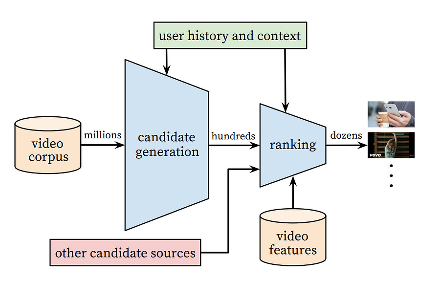
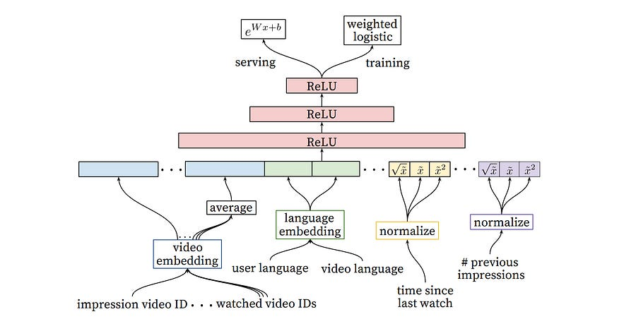

# Deep Neural Networks for YouTube Recommendations

*old school cool!*

*old school cool!*

# TL;DR

This 2016 paper established the standard two-stage "funnel" architecture (Candidate Generation + Ranking) for massive-scale recommender systems.

It combines the nearest neighbour algorithm with machine learning predicting the next token to solve a problem worth billion, the youtube recommendation problem.

Key takeaways include treating recommendation as extreme multiclass classification, using "Example Age" features to bias towards freshness and modifying logistic regression to predict expected watch time rather than click probability.

# Introduction

If you are building recommendation systems at scale, the 2016 Google paper "Deep Neural Networks for YouTube Recommendations" is effectively required reading.

While the specific model architectures (tower networks with ReLU layers) might look standard by today's standards, this paper codified the shift from Matrix Factorization to Deep Learning in industrial settings.  
  
The authors tackle three specific constraints:

  1. Scale (billions of users/videos)

  2. Freshness (handling new uploads immediately)

  3. Noise (relying on implicit rather than explicit feedback)

The solution they present is a split architecture: a “Candidate Generation” model to winnow millions of items down to hundreds, followed by a “Ranking” model to score those hundreds for the user interface.

# The Architecture

The architecture is defined by two distinct neural networks working together.  
  
First, the Candidate Generation network. 

his acts as a non-linear generalization of factorization techniques.

The authors frame the problem as extreme multiclass classification. The input is a high-dimensional embedding of the user (derived from their watch history and search tokens) and the output is a softmax probability distribution over the entire video corpus.  
  
Because calculating a full softmax over millions of classes is computationally prohibitive, they utilize negative sampling during training and rely on approximate nearest neighbor (ANN) search during inference. This allows them to retrieve relevant candidates in milliseconds.  
  
Second, the Ranking network. Once the candidates are retrieved, a heavier model takes over. This network has access to more granular features that couldn't be computed across the whole corpus, such as the relationship between a specific user and a specific video channel.  
  
A critical mathematical insight here is how they handle the optimization objective. They use weighted logistic regression where positive examples (clicks) are weighted by the video's watch time, and negative examples (impressions with no click) have a unit weight. The authors show that the learned odds of this regression approximate the expected watch time-

This allows the system to optimize for engagement (time spent) rather than just Click-Through Rate (CTR), which often penalizes clickbait.

# My personal thoughts

The true value of this paper lies in the practical engineering "hacks" required to make deep learning work on this data.  
  
First, the "Example Age" feature. Machine learning models on historical data inherently bias towards the past; they prefer older, established videos because there is more training data for them. In a product like YouTube, freshness is vital.

The authors solve this by feeding the "age of the training example" as a feature during training. At inference time, they set this feature to zero (or slightly negative). This effectively tricks the model into predicting what is popular *now* rather than what was popular on average over the training window.  
  
Second, the handling of training labels. The authors found that random holdout sets (standard in ML) perform poorly here. Because video consumption is often serial (e.g., watching a sequel after the original), holding out a random middle item breaks the causal structure. Instead, they use a "future watch" holdout, ensuring the model learns the asymmetric pattern of user consumption.

# References

  1. [Deep Neural Networks for YouTube Recommendations](https://dl.acm.org/doi/pdf/10.1145/2959100.2959190?utm_campaign=Weekly+dose+of+Machine+Learning&utm_medium=email&utm_source=Revue+newsletter)
