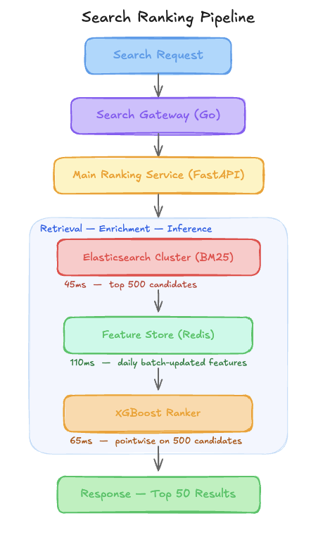

# A $27K/Month Ranking System That Silently Buried 45,000 New Listings Daily [Edition #4]

*Learn how MGET serialization on 500 candidates and positional bias caused a massive offline-online gap and how to slash P99 latency by 170ms using two-tiered fetching.*

<figure><a class="image-link image2 is-viewable-img" target="_blank" href="../assets/7df8fc3f4982875d.jpg" data-component-name="Image2ToDOM">
<picture><source type="image/webp" srcset="../assets/7df8fc3f4982875d.jpg 424w, ../assets/7df8fc3f4982875d.jpg 848w, ../assets/7df8fc3f4982875d.jpg 1272w, ../assets/7df8fc3f4982875d.jpg 1456w" sizes="100vw"></picture>

<button tabindex="0" type="button" class="pencraft pc-reset pencraft icon-container restack-image buttonBase-GK1x3M"><svg aria-hidden="true" width="20" height="20" viewBox="0 0 20 20" fill="none" stroke-width="1.5" stroke="var(--color-fg-primary)" stroke-linecap="round" stroke-linejoin="round" xmlns="http://www.w3.org/2000/svg" class="icon-noB79L"><g><path d="M2.53001 7.81595C3.49179 4.73911 6.43281 2.5 9.91173 2.5C13.1684 2.5 15.9537 4.46214 17.0852 7.23684L17.6179 8.67647M17.6179 8.67647L18.5002 4.26471M17.6179 8.67647L13.6473 6.91176M17.4995 12.1841C16.5378 15.2609 13.5967 17.5 10.1178 17.5C6.86118 17.5 4.07589 15.5379 2.94432 12.7632L2.41165 11.3235M2.41165 11.3235L1.5293 15.7353M2.41165 11.3235L6.38224 13.0882"></path></g></svg></button><button tabindex="0" type="button" class="pencraft pc-reset pencraft icon-container view-image buttonBase-GK1x3M"><svg xmlns="http://www.w3.org/2000/svg" width="20" height="20" viewBox="0 0 24 24" fill="none" stroke="currentColor" stroke-width="2" stroke-linecap="round" stroke-linejoin="round" class="lucide lucide-maximize2 lucide-maximize-2 icon-noB79L"><polyline points="15 3 21 3 21 9"></polyline><polyline points="9 21 3 21 3 15"></polyline><line x1="21" x2="14" y1="3" y2="10"></line><line x1="3" x2="10" y1="21" y2="14"></line></svg></button>

</a></figure>
<h1>The system</h1>
SwiftMarket is a Series B e-commerce marketplace company that recently raised 45 million dollars to scale their discovery engine. They have reached a milestone of 3.2 million completed transactions per month across a catalog of 1.5 million active listings.

Their engineering team built a learning-to-rank (LTR) system that powers the main search results page. Here is their setup.
<h1>Architecture Overview</h1>
When a user enters a search term, the request hits the Search Gateway, which coordinates a multi-stage retrieval and ranking process.

<figure><a class="image-link image2 is-viewable-img" target="_blank" href="../assets/bb3d6c1561818c40.png" data-component-name="Image2ToDOM">
<picture><source type="image/webp" srcset="../assets/bb3d6c1561818c40.png 424w, ../assets/bb3d6c1561818c40.png 848w, ../assets/bb3d6c1561818c40.png 1272w, ../assets/bb3d6c1561818c40.png 1456w" sizes="100vw"></picture>

<button tabindex="0" type="button" class="pencraft pc-reset pencraft icon-container restack-image buttonBase-GK1x3M"><svg aria-hidden="true" width="20" height="20" viewBox="0 0 20 20" fill="none" stroke-width="1.5" stroke="var(--color-fg-primary)" stroke-linecap="round" stroke-linejoin="round" xmlns="http://www.w3.org/2000/svg" class="icon-noB79L"><g><path d="M2.53001 7.81595C3.49179 4.73911 6.43281 2.5 9.91173 2.5C13.1684 2.5 15.9537 4.46214 17.0852 7.23684L17.6179 8.67647M17.6179 8.67647L18.5002 4.26471M17.6179 8.67647L13.6473 6.91176M17.4995 12.1841C16.5378 15.2609 13.5967 17.5 10.1178 17.5C6.86118 17.5 4.07589 15.5379 2.94432 12.7632L2.41165 11.3235M2.41165 11.3235L1.5293 15.7353M2.41165 11.3235L6.38224 13.0882"></path></g></svg></button><button tabindex="0" type="button" class="pencraft pc-reset pencraft icon-container view-image buttonBase-GK1x3M"><svg xmlns="http://www.w3.org/2000/svg" width="20" height="20" viewBox="0 0 24 24" fill="none" stroke="currentColor" stroke-width="2" stroke-linecap="round" stroke-linejoin="round" class="lucide lucide-maximize2 lucide-maximize-2 icon-noB79L"><polyline points="15 3 21 3 21 9"></polyline><polyline points="9 21 3 21 3 15"></polyline><line x1="21" x2="14" y1="3" y2="10"></line><line x1="3" x2="10" y1="21" y2="14"></line></svg></button>

</a></figure>
<h3>Traffic patterns:</h3>
Search Requests: 520 million/month

Catalog Updates: 45,000 new listings/day

Average: 200 req/sec

Peak: 1,150 req/sec

The ML Pipeline:

The model is an XGBoost Ranker trained weekly on S3 data lakes containing raw click logs. The labels are binary (1 for click, 0 for no click).

Features include historical Click-Through Rate (CTR) and conversion rates, which are computed via a Spark job every 24 hours and pushed to the Redis Feature Store.
<h3>Current performance:</h3>
P99 Latency: 380ms

Availability: 99.92%

Business impact: 12% increase in Search CTR (Offline test predicted +35%)

Costs:

Infra (EC2/Elasticsearch): $14,200/month

Managed Feature Store (Redis): $12,800/month

Total: $27,000/month
<h3>Recent incidents:</h3>
Incident 1: Search latency spiked to 2 seconds after a marketing campaign; the Feature Store couldn’t handle the concurrent read IOPS on the primary shard.

Incident 2: Recovery took 4 hours when the daily Spark job failed, leaving the Feature Store with stale data for 48 hours and causing a 5% drop in conversion.

Machine Learning At Scale is a reader-supported publication. To receive new posts and support my work, consider becoming a free or paid subscriber.

<form class="subscription-widget-subscribe"><input type="email" class="email-input" name="email" placeholder="Type your email…" tabindex="-1"><input type="submit" class="button primary" value="Subscribe">

</form>

<h1>The Analysis</h1>
Now let me show you what is actually happening here.

<strong>Critical Issue #1: The 24-Hour Cold Start Blackout</strong>

Look at the Architecture Overview: the Feature Store is updated via a daily batch job. If a seller lists an item at 9:00 AM, the features for that item (CTR, popularity, etc.) do not exist in Redis until the next day’s job finishes. Because the XGBoost model relies heavily on historical CTR features to rank items, these new listings receive a default “null” value. In a marketplace with 45,000 new listings daily, you are effectively burying 100% of your fresh inventory at the bottom of page 10 for the first 24 hours of their life.

<strong>Critical Issue #2: The Positional Bias Feedback Loop</strong>

The training setup uses raw click logs as binary labels. In the current UI, users naturally click the top 3 results more often because they are visible without scrolling. By training on these raw clicks without debiasing for position, the model is simply learning to predict what was already at the top of the page. This explains why the offline metrics looked amazing (the model predicted the status quo perfectly) while the online impact is underwhelming. You aren’t ranking for relevance; you are ranking for historical UI placement.

<strong>Critical Issue #3: Feature Store Latency Bloat</strong>

The Feature Store is taking 110ms per request, which is nearly 30% of the total P99 latency budget. This is happening because the Main Ranking Service is fetching features for all 500 candidates retrieved from Elasticsearch. Fetching 500 keys from a remote Redis instance (even with MGET) introduces significant network serialization overhead. This is why the system choked during the marketing peak mentioned in the incidents.

<strong>Critical Issue #4: The Accuracy Mirage (Offline/Online Gap)</strong>

The team is training on “clicks” but the business cares about “transactions.” The architecture shows the model treats every click as a success. However, in e-commerce, a click on a low-priced, clickbait item that never converts is actually a failure for the marketplace. The 35% predicted offline lift was based on a click-prediction task, but the actual 12% online lift reflects the fact that you are driving high-volume, low-value clicks that don’t lead to sales.

<strong>Critical Issue #5: Redundant Computation and Cost</strong>

They have 12 nodes of Elasticsearch just for BM25 retrieval. Since the XGBoost model is only re-ranking the top 500, they are paying for high-performance Elasticsearch instances to do simple text matching that is then ignored or overridden by the second stage.
<h1>WHAT I WOULD DO INSTEAD</h1>

<strong>1. Introduce Epsilon-Greedy Exploration for New Listings</strong>

Impact:

Eliminate the 24-hour visibility gap for new inventory.

Expected 15% increase in “First Day Sales” for new sellers.

Trade-offs:

Randomly injecting new items into the top 10 results will slightly degrade the experience for some users who expect 100% relevance.

When this is the wrong call: If your marketplace has a high penalty for “garbage” results (e.g., high-end luxury goods), unvetted exploration can damage brand trust.

<strong>2. Position-Bias Correction in Training</strong>

Current: Label = Click (Binary)

New: Label = Click / PropensityScore (where Score = Expected CTR at that rank)

Impact: Offline/Online metric alignment → 0.85 correlation (up from 0.4).

Trade-offs:

Requires logging the “Position” of every item at the time of the search, which increases log volume by roughly 20%.

<strong>3. Two-Tiered Feature Fetching</strong>

Current: Fetch features for 500 items (110ms) → Rank 500.

New: Fetch “Light” features for 500 items → Rank → Fetch “Heavy” features for top 60 → Final Sort.

Impact: P99 Latency 380ms → 210ms.

Trade-offs:

Increases architectural complexity by adding a secondary ranking stage.
<h2>The Impact</h2>
Before redesign:

New listings are invisible for 24 hours.

$27,000/month infrastructure spend.

After redesign:

New listings gain immediate visibility; search latency reduced by 40%.

$19,500/month infrastructure spend (27% savings).
<h2>The Lesson</h2>
The system already told them what is wrong:

Incident 1 → Your feature retrieval strategy is unscalable for your candidate size.

The Offline/Online Gap → Your training labels do not match your business goals.

They just need to listen to what the system is saying.

How do you handle the trade-off between showing the “best” items and giving new sellers a fair shake at the top of the page?
<h1>APPENDIX: Cost Estimation Methodology</h1>
Solution 1: Epsilon-Greedy Exploration

Baseline: $0 direct cost change, but addresses the “opportunity cost” of 45,000 stale listings.

After change: Minimal compute overhead.

Estimated saving: $0 in infra, but projected $220k/month in GMV from faster inventory turnover.

Confidence: High — This is a standard cold-start pattern.

Solution 2: Position-Bias Correction

Baseline: No direct infra savings.

After change: Increased S3 storage costs for position logging ($150/month).

Estimated saving: $0 infra; massive reduction in “wasted” training cycles.

Confidence: High.

Solution 3: Two-Tiered Feature Fetching

Baseline: Redis r6g.4xlarge nodes (8 nodes) = $12,800/month.

After change: By reducing the MGET payload from 500 to 60 items, we can downsize to r6g.xlarge nodes (8 nodes) = $3,200/month.

Estimated saving: $9,600/month (75% reduction in Feature Store costs).

Key assumption: That 80% of the Redis cost was driven by memory bandwidth and IOPS requirements for large candidate sets.

Confidence: Medium — Actual savings depend on how much memory the feature set itself requires vs. the IOPS overhead.

