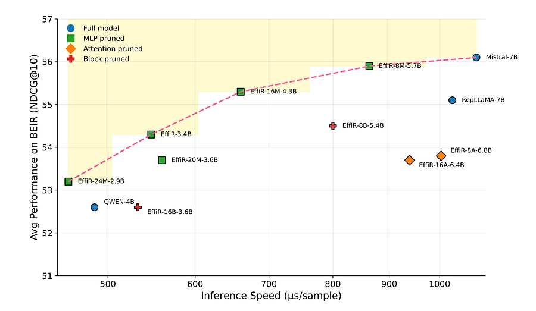

# Pruning LLMs for Retrieval: Why Attention Matters and MLPs Don't

# TLDR

A new framework called EffiR challenges standard LLM pruning logic when applied to dense retrieval.

While generative tasks usually require preserving MLP layers (knowledge) and pruning Attention, retrieval tasks require the opposite.

By aggressively pruning MLP layers in both depth and width while keeping Attention layers intact, the authors achieved a ~50% parameter reduction and 2x inference speedup on Mistral-7B with negligible performance loss on BEIR benchmarks.

# The Context: LLMs are too heavy for search

We are seeing a shift from BERT-based retrievers to LLM-based retrievers (like E5-Mistral). LLMs offer superior semantic understanding and zero-shot capabilities, but they introduce massive latency penalties.

Running a 7B parameter model just to encode a query or document for vector search is often cost-prohibitive for production RAG pipelines.  
  
Standard optimization usually involves quantization or distillation into smaller architectures.

However, structural pruning (removing layers or neurons) has been less effective because most pruning heuristics are derived from generative tasks (predicting the next token).  
  
This paper argues that the architectural redundancy in a retrieval model is fundamentally different from that of a generative model.

# The Core Concept: Inverting the Pruning Logic

The most significant finding here is that the conventional wisdom for pruning LLMs is wrong for retrieval.  
  
In generative tasks, research shows that Multi-Layer Perceptrons (MLPs) act as key-value memories storing factual knowledge, while attention heads can often be pruned without destroying coherence. The authors found the exact opposite is true for embedding models.  
  
When an LLM is fine-tuned for retrieval (converting input to a single vector representation), the Attention layers become the critical path.

They are responsible for global semantic aggregation (pooling information across the sequence to form the sentence embedding).

The MLP layers, which perform intra-token transformations, turn out to be highly redundant.  
  
The EffiR framework exploits this via a two-stage "coarse-to-fine" compression strategy:  
  
**1\. Coarse-Grained Depth Reduction:**  
They analyze layer importance using cosine similarity between inputs and outputs of specific sub-layers. They found they could drop significant numbers of MLP layers entirely. In their experiments with Mistral-7B, they dropped up to 16 MLP layers with minimal degradation, whereas dropping just a few Attention layers caused performance to collapse.  
  
**2\. Fine-Grained Width Reduction (Self-Slimming):**  
After dropping whole layers, they compress the remaining MLPs. They introduce a learnable gating mechanism (a simplified ReLU mask) into the intermediate expansion layers of the MLPs. During fine-tuning, the model learns which neurons are inactive. They then permanently prune those dimensions.  
  
This results in a model where the Attention mechanism is largely untouched, but the heavy compute blocks (the MLPs) are gutted.

# Engineering implications

**Better Efficiency-Performance Frontier**  
The results suggest that pruning a large, smart model is more effective than training a small model from scratch. An EffiR-pruned Mistral (3.4B parameters) outperformed natively small models like LLaMA-1B and Gemma-2B trained on the same retrieval data. You get the reasoning capabilities of the 7B architecture without the full parameter cost.  
  
**Latency Improvements**  
Dense retrieval is memory-bound and compute-heavy. By removing MLP layers, the authors achieved roughly a 2x inference speedup. Since MLPs usually account for ~60-70% of the parameters in Transformer blocks, targeting them specifically yields the highest ROI for latency reduction.  
  
**Implications for RAG Pipelines**  
If you are deploying embedding models, this highlights a potential flaw in using off-the-shelf pruning techniques like Wanda or SparseGPT if they aren't tuned for the specific modality. Those methods often prune attention and MLPs uniformly. For retrieval, you should be protective of attention heads.  
  
**Compatibility with Quantization**  
The authors showed this structural pruning stacks with quantization. They applied 4-bit quantization (NF4) to the pruned model and saw almost no additional accuracy loss. This means you can combine structural removal of MLPs with low-bit precision for a highly optimized inference engine.  
  
This approach effectively turns a general-purpose LLM into a specialized semantic aggregator, stripping away the generative "fat" that isn't required for vector embedding.

# References

  1. [Making Large Language Models Efficient Dense Retrievers  
](https://arxiv.org/pdf/2512.20612v1)
