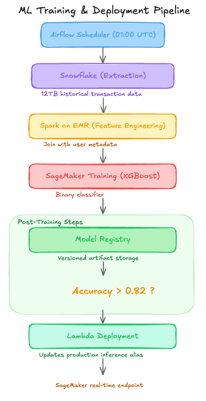

# $220K Lost to a Fraud Model That Passed a 0.82 Accuracy Check [Edition #5]

*Learn how silent schema corruption in a 12TB Snowflake pipeline bypassed XGBoost validation and why you need shadow mode for 15M daily transactions.*

> Paid post — only the publicly visible preview is included.

*Learn how silent schema corruption in a 12TB Snowflake pipeline bypassed XGBoost validation and why you need shadow mode for 15M daily transactions.*

FinFlow AI is a Series B fintech company that recently hit a milestone of processing 15 million transactions per day. They have successfully scaled their user base by 300 percent in the last twelve months.

Their engineering team built a real-time fraud detection system that powers every swipe on their platform. Here is their setup.

# Architecture Overview

The system triggers a full model retraining cycle every 24 hours to capture emerging fraud patterns.

### Traffic patterns:

Total transactions: 15,000,000/day

Unique active users: 2,200,000

Average: 175 req/sec

Peak: 850 req/sec

The ML Pipeline:

The model is an XGBoost classifier trained on 180 features including transaction velocity, merchant category, and geolocation deltas. It is trained on a sliding window of the last 30 days of data.

### Current performance:

P99 Inference Latency: 42ms

Service Availability: 99.9%

Fraud Capture Rate: 74%

Costs:

Data Warehouse (Snowflake): $14,000/month

Compute (EMR + SageMaker): $9,500/month

Inference (SageMaker Endpoints): $3,000/month

Total: $26,500/month

Recent incidents:

Incident 1: A schema change in the upstream transaction table caused the “merchant_zip” feature to be null for 100 percent of new rows. The model trained anyway, accuracy stayed high because other features compensated, and fraud losses spiked by $220,000 over the weekend.

Incident 2: A failed Lambda deployment during the 03:00 UTC update led to a 4-hour period where the system reverted to a hardcoded “allow-all” logic while engineers manually identified and redeployed the previous day’s Docker image tag.

# The Analysis

Now let me show you what is actually happening here.

**Critical Issue #1: Silent Data Corruption**

Look at the jump from Snowflake to Spark on EMR. There is no validation step between data extraction and feature engineering. When the “merchant_zip” schema changed in Incident 1, the pipeline ingested nulls without a peep. Because the model still hit its 0.82 accuracy threshold (likely due to label leakage or dominant features like “transaction_amount”) it promoted itself to production.

They are effectively flying blind; they don’t know the data is broken until the money is already gone.

**Critical Issue #2: The Binary Threshold Trap**

The performance check is a simple boolean: is accuracy > 0.82? This is a dangerous oversimplification for a growth-stage company. A model can maintain 82 percent accuracy while its precision on high-value transactions drops to zero. By using a global metric instead of per-segment statistical tests (e.g., performance on new users vs. power users), they are missing localized model degradation that costs hundreds of thousands in fraudulent chargebacks.

**Critical Issue #3: Deployment without a Safety Net**

The pipeline uses an “Immediate Lambda Update” to point to the new model registry artifact. There is no shadow mode. Every new model is “guilty until proven innocent,” but here, the trial happens on live customer funds. A 175 req/sec average means that within the first 60 seconds of a bad deployment, over 10,000 transactions are evaluated by an unverified model.

**Critical Issue #4: Recovery via Archaeology**

The incident report mentions engineers “manually identifying” the previous day’s tag. This confirms they have no automated rollback mechanism. In a system where you redeploy daily, your “rollback” is just a manual “re-forward” to a previous state. If the person who knows the naming convention is asleep at 03:00 UTC, the Mean Time to Recovery (MTTR) is dictated by how fast someone can read the Airflow logs.

**Critical Issue #5: Redundant Compute Expenditure**

They have 20 ML engineers and they are spending $9,500 a month on daily full-retraining of the same 30-day window. They are effectively paying to relearn 29 days of the same data every single night. At their scale, the delta in model weights from one day to the next is marginal, yet they treat every day like a “cold start” training event.

# WHAT I WOULD DO INSTEAD
