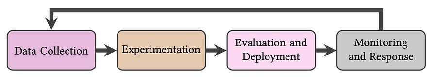
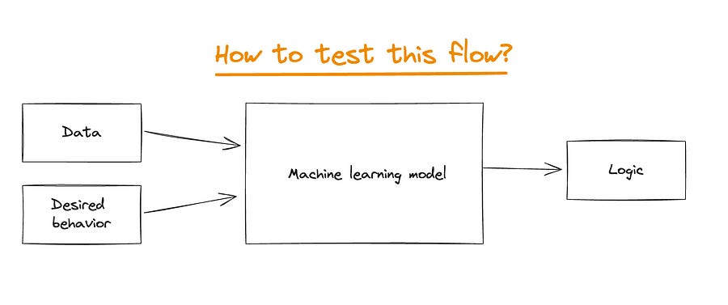

# Production ML: A Reality Check on MLOps

# TL;DR

A UC Berkeley study interviewed 18 MLEs to map actual production behaviors against academic theory.  
  
They propose a "Three Vs" framework for MLOps maturity:

  * Velocity (iteration speed)

  * Validation (testing against shifting data)

  * Versioning (managing the artifacts).

The “90% of models fail to ship” statistic is reframed as a positive indicator of experimentation velocity, not a failure of engineering.

“Alert fatigue” is the dominant state of monitoring; most engineers ignore automated data quality alerts because the signal-to-noise ratio is terrible.

Complex drift detection techniques are rarely used.

The production standard is simply retraining frequently on fresh labels.

# Introduction

There is a widening gap between how MLOps is sold by vendors and how it is actually practiced in the trenches.

While marketing copy focuses on "end-to-end platforms" and "feature stores," the reality for most engineers involves gluing together bash scripts, fighting with YAML configurations, and waking up to PagerDuty alerts that turn out to be false positives.

What stands out in this study is not the tooling stack, but the behavioral patterns.

The authors argue that the difficulty of MLOps doesn't stem from a lack of sophisticated algorithms, but from the tension between rapid experimentation and the rigidity of production software engineering.

# The three Vs

The authors distill successful MLOps practices into three variables: Velocity, Validation, and Versioning.

  
**Velocity**  
This is the speed at which an engineer can prototype an idea and get a signal.

The study highlights that high velocity often correlates with "config-driven" development.

Mature teams stop touching the model code early. Instead, they iterate on the data and the configuration files. If you are rewriting Python code for every experiment, your velocity tanks.

The authors note that high velocity necessitates a high failure rate: if you aren't throwing away most of your models, you aren't moving fast enough.  
  
**Validation**  
This refers to the rigor of testing before and during deployment.

The study found that standard "held-out test sets" are insufficient for production because data distributions drift immediately.

Successful teams move validation closer to production using "shadow mode" (running the new model alongside the old one without serving traffic) and "canary deployments."  
  
**Versioning**  
This is the safety net. Because high velocity generates a massive number of artifacts, and dynamic validation is prone to error, versioning allows for instant rollbacks.

The study notes that simple strategies often win here: rather than debugging a live model, engineers prefer to simply revert to a previous version or a "fallback" heuristic model.

# Why this matters

**The "Failure" Rate is a Vanity Metric**  
We often hear the statistic that "85-90% of ML projects fail to make it to production," usually framed as a crisis.

In a high-velocity environment, a high "discard rate" is actually healthy.

It implies that the pipeline allows for cheap, fast prototyping.

If every model you train goes to production, your experimentation pipeline is likely too conservative or your validation standards are too low.

The goal of MLOps shouldn't be to deploy every model, but to make the cost of discarding a bad model negligible.  
  
**The "Goldilocks" Problem in Monitoring**  
The study exposes a massive pain point in current observability tools: Alert Fatigue. Engineers reported getting bombarded with alerts about "distribution shifts" (e.g., KL divergence spikes) that didn't actually impact business metrics.

Conversely, hard failures (like broken schema changes) sometimes slipped through.  
The industry lacks a "Goldilocks" zone for alerting. The current state of the art is relying on downstream business metrics (e.g., click-through rate drops) rather than statistical properties of the input data. If the revenue drops, the model is broken. If the data drifts but revenue is fine, engineers tend to ignore the drift.  
  
**Retraining Beats Domain Adaptation**  
Academia loves complex methods for handling domain shift and out-of-distribution detection. The industry, however, largely ignores them.

If you retrain daily on yesterday's data, you don't need complex drift adaptation logic. The operational complexity of frequent retraining is lower than the mathematical complexity of maintaining long-running, adaptable models.  
  
**The Notebook-to-Prod Gap**  
The tension between Jupyter notebooks (high velocity, low rigor) and production pipelines (low velocity, high rigor) remains unsolved.

The study highlights two camps: those who ban notebooks in production to enforce code quality, and those who actually run notebooks in production to ensure the training environment exactly matches the serving environment.

This "environment mismatch" is a primary source of bugs. While software engineering best practices suggest stripping out notebooks, the operational reality is that "notebooks in prod" effectively eliminates the translation layer errors that plague many teams.  
  
**Tribal Knowledge is the Real Technical Debt**  
Finally, the paper points out that high velocity often kills documentation.

Pipelines change so fast that documentation is outdated the moment it's written. This leads to "pipeline jungles" where only the original author knows which config file actually controls the hyperparameters.

The takeaway is that documentation needs to be automated or code-based (like Infrastructure as Code), otherwise, it becomes a liability rather than an asset.

By the way, if you liked this reading, surely you will like:

## [44\. Testing Machine Learning ](2024-07-07-44-testing-machine-learning.md)

Ludovico Bessi

·

July 7, 2024

Introduction

[Read full story](2024-07-07-44-testing-machine-learning.md)
