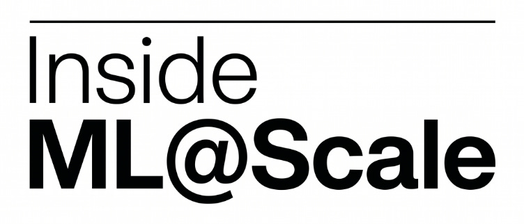
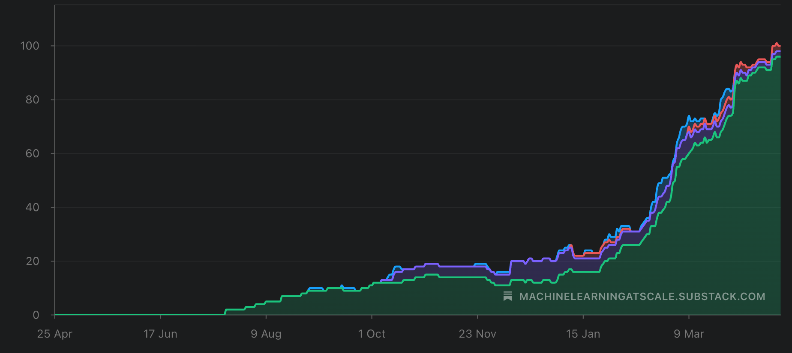
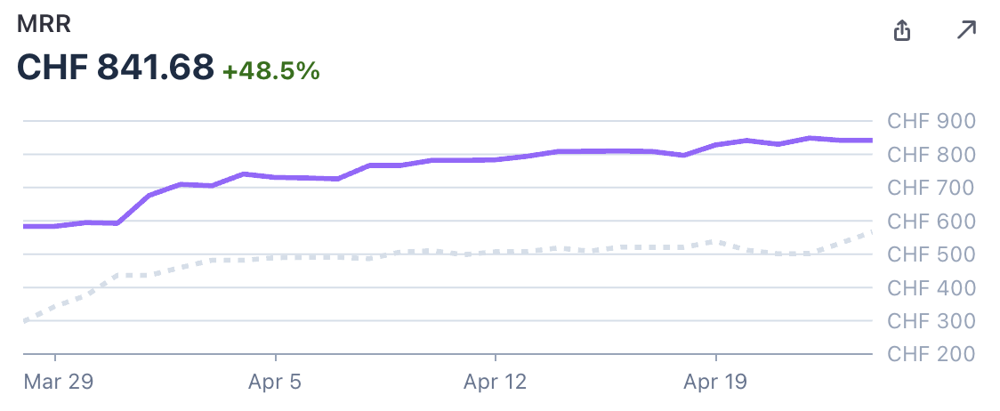
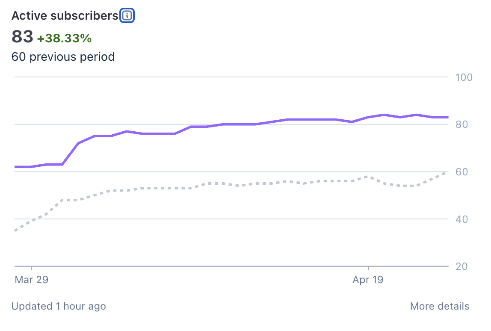
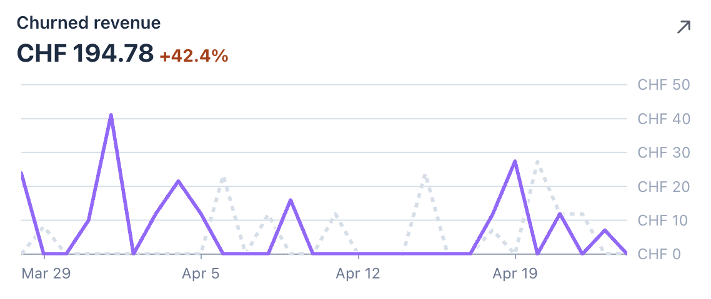
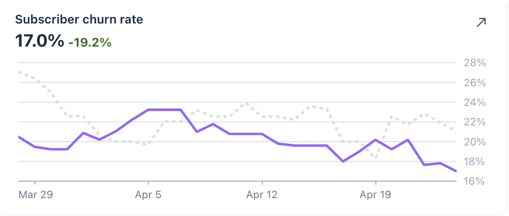

# Inside ML@Scale #1

*all the numbers behind ML@Scale (yeah, all!)*

**Every 25th of the month, I prepare a financial update for my girlfriend**

I have been been doing this for 26 months.

It’s boring. It’s uncomfortable sometimes (what do you mean we worked for a month and our networth is DOWN?)

I’m going to do the same thing with ML@Scale.

Every 25th of the month, starting today, I’ll publish **Inside ML@Scale** — a full, honest look at the business behind this newsletter.

The good, the bad.

What’s growing, what’s stagnating, what I’m trying that isn’t working (or sometimes is?)

**Why?**

Three reasons.

**1\. Because nobody else does it.**

The ML newsletter space is full of people performing success. “Just crossed 50k subscribers 🚀” with zero context on how, for how long, at what cost, with what retention.

I’ve been building ML@Scale since 2023: from 0 to 12k+ free subscribers, 42k on LinkedIn, and some of them paid.

That didn’t happen linearly. It happened with a lot of stupid decisions in between. Those are worth writing about.

**2\. Because transparency compounds.**

The same way our 25th-of-the-month ritual makes us better at money, writing this publicly will make me better at running this business. You can’t hide from numbers you’ve committed to publishing.

**3\. Because you deserve to know what you’re paying for.**

If you’re a premium subscriber, you’re not just getting “The Blind ML Review” or “The Zürich Feed”. You’re buying into a thing that either works or doesn’t. I owe you visibility into which one it is.

### What’s in the free section (this part)

Every edition will have:

  * Top-line numbers

  * The _one thing_ that worked that month

  * The _one thing_ that didn’t

  * What I’m trying next

### What’s behind the paywall

Everything else. The detail. The numbers underneath the numbers.

  * Full revenue breakdown by product (Blind ML Review, Zürich Feed, one-off paid posts)

  * Conversion funnel math: where free subs come from, what % convert, at what rate, per channel

  * Per-post revenue: which Lane 1 (technical) and Lane 2 (career strategy) posts drove money, which flopped, and why

  * Churn: who’s leaving premium and when

  * Cost side: tools, infra, time spent

  * Eventually (when I get the courage) my personal financial situation alongside the biz. Same energy as the 25th-of-the-month ritual at home. Full picture or no picture.

### Top-line: where we are in April 2026

  * **12,000+** free subscribers

  * **42,000+** LinkedIn followers

  * **~25%** open rate (below where I want it — more on this below the paywall)

  * **6x/week** LinkedIn cadence, **3x/week** newsletter cadence

### What worked this month

  1. [The Zürich feed]() post drove 5 premium subs and 64 free subs. WOW!

  2. [LinkedIn’s MixLM: 10x Fater LLM Ranking Via Embedding Injection](): 13 likes, 3 repost, 8 free subs, 1 paid sub.

  3. [Deep Neural Networks for YouTube Recommendations]()

### What didn’t work

I sent an email to free subs mentioning what they missed on. Complete flop! I expected some conversions from free to premium.

### What I’m trying next

Working with other newsletter writers to publish something together / recommend each other audiences.

> Below the paywall: the real numbers. Revenue, churn and other ideas I am thinking of.

# The business numbers

All right. Let’s get into the details.

## Paid subs graph

A bit of flat after an era of growth. But let’s dig deeper into it.

+50% MRR in the last 4 weeks? I will take that thank you!

That correlates with the active subs growth. Need to dig into why they are not the same as on the newsletter platform?

Let’s look into a big metric for me: Churn.

From this, you’d think that things are going bad.

However, that’s just coming from more money coming in with respect to last month.

If I look at the churn rate itself, I actually see a beautiful trend! I still want to bring this down in the single digit though.

A change I made really is reflected here: I recently increased prices AND I remove the option of a 7 day free trial.

I think I give enough value for free that those are not needed and actually only attract people that are just looking to get access to my full premium posts history.

That’s all for this first edition! Let me know which numbers you’d like to see more or less of.

Ludo
