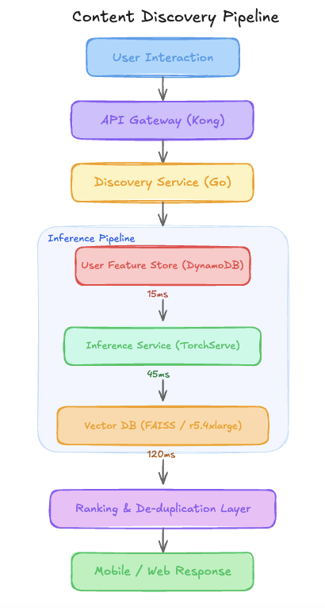

# The $22K Neural Search Pipeline That Was Silently 7 Days Behind [Edition #6]

*Learn how switching to HNSW indexing and quantized vector search can slash inference costs by 61 percent while eliminating a 7 day content lag for 5 million daily users.*

<figure><a class="image-link image2 is-viewable-img" target="_blank" href="../assets/023a4f6ab576d06f.jpg" data-component-name="Image2ToDOM">
<picture><source type="image/webp" srcset="../assets/023a4f6ab576d06f.jpg 424w, ../assets/023a4f6ab576d06f.jpg 848w, ../assets/023a4f6ab576d06f.jpg 1272w, ../assets/023a4f6ab576d06f.jpg 1456w" sizes="100vw"></picture>

<button tabindex="0" type="button" class="pencraft pc-reset pencraft icon-container restack-image buttonBase-GK1x3M"><svg aria-hidden="true" width="20" height="20" viewBox="0 0 20 20" fill="none" stroke-width="1.5" stroke="var(--color-fg-primary)" stroke-linecap="round" stroke-linejoin="round" xmlns="http://www.w3.org/2000/svg" class="icon-noB79L"><g><path d="M2.53001 7.81595C3.49179 4.73911 6.43281 2.5 9.91173 2.5C13.1684 2.5 15.9537 4.46214 17.0852 7.23684L17.6179 8.67647M17.6179 8.67647L18.5002 4.26471M17.6179 8.67647L13.6473 6.91176M17.4995 12.1841C16.5378 15.2609 13.5967 17.5 10.1178 17.5C6.86118 17.5 4.07589 15.5379 2.94432 12.7632L2.41165 11.3235M2.41165 11.3235L1.5293 15.7353M2.41165 11.3235L6.38224 13.0882"></path></g></svg></button><button tabindex="0" type="button" class="pencraft pc-reset pencraft icon-container view-image buttonBase-GK1x3M"><svg xmlns="http://www.w3.org/2000/svg" width="20" height="20" viewBox="0 0 24 24" fill="none" stroke="currentColor" stroke-width="2" stroke-linecap="round" stroke-linejoin="round" class="lucide lucide-maximize2 lucide-maximize-2 icon-noB79L"><polyline points="15 3 21 3 21 9"></polyline><polyline points="9 21 3 21 3 15"></polyline><line x1="21" x2="14" y1="3" y2="10"></line><line x1="3" x2="10" y1="21" y2="14"></line></svg></button>

</a></figure>
<h1>The System</h1>
Briefly.ly is a late-stage Series B newsletter aggregator that recently hit 5M Daily Active Users. They have successfully aggregated over 2,000 premium newsletters and provide a unified feed for discovery.

Their engineering team built a neural retrieval system that powers the personalized Discovery Tab. Here is their setup.
<h1>Architecture Overview</h1>
When a user opens the Discovery Tab, the frontend sends a request to the Feed Service.

<figure><a class="image-link image2 is-viewable-img" target="_blank" href="../assets/7704d2ce0c3f334b.png" data-component-name="Image2ToDOM">
<picture><source type="image/webp" srcset="../assets/7704d2ce0c3f334b.png 424w, ../assets/7704d2ce0c3f334b.png 848w, ../assets/7704d2ce0c3f334b.png 1272w, ../assets/7704d2ce0c3f334b.png 1456w" sizes="100vw"></picture>

<button tabindex="0" type="button" class="pencraft pc-reset pencraft icon-container restack-image buttonBase-GK1x3M"><svg aria-hidden="true" width="20" height="20" viewBox="0 0 20 20" fill="none" stroke-width="1.5" stroke="var(--color-fg-primary)" stroke-linecap="round" stroke-linejoin="round" xmlns="http://www.w3.org/2000/svg" class="icon-noB79L"><g><path d="M2.53001 7.81595C3.49179 4.73911 6.43281 2.5 9.91173 2.5C13.1684 2.5 15.9537 4.46214 17.0852 7.23684L17.6179 8.67647M17.6179 8.67647L18.5002 4.26471M17.6179 8.67647L13.6473 6.91176M17.4995 12.1841C16.5378 15.2609 13.5967 17.5 10.1178 17.5C6.86118 17.5 4.07589 15.5379 2.94432 12.7632L2.41165 11.3235M2.41165 11.3235L1.5293 15.7353M2.41165 11.3235L6.38224 13.0882"></path></g></svg></button><button tabindex="0" type="button" class="pencraft pc-reset pencraft icon-container view-image buttonBase-GK1x3M"><svg xmlns="http://www.w3.org/2000/svg" width="20" height="20" viewBox="0 0 24 24" fill="none" stroke="currentColor" stroke-width="2" stroke-linecap="round" stroke-linejoin="round" class="lucide lucide-maximize2 lucide-maximize-2 icon-noB79L"><polyline points="15 3 21 3 21 9"></polyline><polyline points="9 21 3 21 3 15"></polyline><line x1="21" x2="14" y1="3" y2="10"></line><line x1="3" x2="10" y1="21" y2="14"></line></svg></button>

</a></figure>
<h3>Traffic patterns:</h3>
5.2M Daily Active Users

Average: 125 req/sec

Peak: 850 req/sec

The ML Pipeline:

A Two-Tower (Bi-Encoder) model. The User Tower produces a 128-dimension embedding based on user history. The Item Tower embeds newsletter articles. The model is trained once a month on a static 6-month-old snapshot of engagement data (clicks and read-time) in H1.

A team of 4 engineers runs heuristics for the ranking and deduplication layer to patch-fix issues.
<h3>Current performance:</h3>
End-to-end Latency: 210ms (p99)

Reliability: 99.92% Uptime

Business impact metric: CTR is flat at 3.2% for the last four months.

Costs:

EC2 (Inference + FAISS nodes): $18,400/month

DynamoDB: $4,200/month

Total: $22,600/month
<h3>Recent incidents:</h3>
OOM on Vector Node: The FAISS index exceeded memory during a weekly Sunday rebuild, causing a 4-hour recommendation outage.

Stale Content Complaints: Users reported seeing “Breaking News” from three days ago at the top of their feed every Monday morning.
<h1>The Analysis</h1>

Machine Learning At Scale is a reader-supported publication. To receive new posts and support my work, consider becoming a free or paid subscriber.

<form class="subscription-widget-subscribe"><input type="email" class="email-input" name="email" placeholder="Type your email…" tabindex="-1"><input type="submit" class="button primary" value="Subscribe">

</form>

Now let me show you what’s actually happening here.

<strong>Critical Issue #1: Massive Temporal Training Mismatch</strong>

Look at the training data window in the architecture overview. They are training in H2 using a static snapshot from H1.

In the newsletter world, topics shift weekly. A model trained on June data has no concept of the current geopolitical or tech trends. By the time the model “learns” a topic is interesting, that topic is already six months out of date. The embeddings being generated for new articles are being forced into a latent space that only understands the past.

<strong>Critical Issue #2: The Sunday Staleness Spike</strong>

The architecture specifies the FAISS index is refreshed weekly on Sundays. For a content aggregator, this is architectural malpractice. A newsletter published on Monday morning will not be discoverable via vector search until the following Sunday. This explains the “flat” engagement; you are effectively running a “Yesterday’s News” service for 6 out of 7 days a week.

<strong>Critical Issue #3: Self-Reinforcing Feedback Loop</strong>

The ML pipeline notes that the model is trained on engagement data “sourced from production logs of this specific system.” Because the retrieval system only surfaces what the weekly FAISS index contains, the only data being logged is for those specific items. The model is being trained to get better at predicting clicks on the limited, stale subset it already knows how to show. It is impossible for the model to learn that users might like fresh content because it never shows them any.

<strong>Critical Issue #4: Popularity Bias Masked as Relevance</strong>

The architecture mentions “Dot product similarity with no frequency normalization.” In two-tower models, the magnitude of the item embedding often correlates with its frequency in the training set. Because they use a 6-month window of clicks, the “head” content (the most popular newsletters) develops massive vector magnitudes. These “super-nodes” will always have the highest dot product regardless of the user tower’s state, turning a “personalized” system into a simple “most popular” list.

<strong>Critical Issue #5: Operational Bloat for Rule-Sets</strong>

They have 4 FTEs (Full Time Engineers) just for manual override rule-sets. Because the model fails to surface fresh or relevant content (due to the weekly index and stale training), the team has built a massive “Heuristics Engine” on top of the output to manually boost new content. They are paying for a neural system but actually running a manual curation shop.
<h1>WHAT I’D DO INSTEAD</h1>

<strong>1. Move to Incremental Indexing</strong>

Impact:

Eliminate the 7-day content lag.

Estimated CTR lift of 20% by surfacing “today’s” newsletters.

Trade-offs:

Requires moving from a flat FAISS index to an HNSW (Hierarchical Navigable Small World) index that supports dynamic adds. This increases memory usage by roughly 20%.

When this is the wrong call: If your content corpus is static (e.g., a library of historical books), the complexity of incremental indexing is unnecessary.

<strong>2. Implement Popularity Debiasing (Logit Scaling)</strong>

Current: Dot product similarity.

New: Subtract log(item_frequency) from the dot product during training and serving.

Impact: Discovery of “long-tail” newsletters → 15% increase in user retention.

Trade-offs:

The “head” content will see fewer clicks initially, which might look like a regression in the first 48 hours to stakeholders.

<strong>3. Quantized Vector Search</strong>

Replace: FAISS ($1,100/mo per node)

With: FAISS with Product Quantization (IVFPQ)

Total: $18,400/month → $4,600/month

Trade-offs:

Small loss in precision (recall @ 10 might drop from 0.98 to 0.96), but at 5M DAU, the cost savings and latency gains far outweigh the negligible precision loss.
<h2><strong>The Impact</strong></h2>
Before redesign:

Stale content (up to 7 days old)

$22,600/month

After redesign:

Real-time content discovery (seconds after ingest)

$8,800/month (61% savings)

Time to implement: 5 weeks, 2 ML Engineers
<h2>The Lesson</h2>
The system already told them what’s wrong:

The Sunday Outage → Their index rebuild strategy is too monolithic for their memory constraints.

Flat CTR → Their 6-month-old training data has reached its limit of predictive power for a real-time domain.

They just need to listen to what the system is saying.

How do you handle the trade-off between model “freshness” and the cost of daily retraining for a 5M DAU system?
<h1>APPENDIX: Cost Estimation Methodology</h1>
How I estimated the savings for each decision:

Solution 1: Incremental Indexing

Baseline: 1 x r5.4xlarge at $1.008/hr × 730 hours = $735/month (per node).

After change: Increased memory requirement adds 1 additional node for redundancy/headroom.

Estimated saving: -$735/month (Cost increase of $735 for better performance).

Key assumption: HNSW memory overhead is roughly 1.5x to 2x of a flat index.

Confidence: High — This is a standard trade-off in vector search.

Solution 2: Cloud Instance Right-Sizing

Baseline: Current Inference + Vector cluster at $18,400/month.

After change: Moving to quantized vectors (PQ) allows the index to fit on smaller r5.large instances ($0.126/hr).

Calculation: 12 nodes × $0.126 × 730 = $1,103. Adding Inference nodes: 8 nodes × $0.40 (m5.xlarge) × 730 = $2,336.

Estimated saving: $14,961/month (81% reduction in compute).

Key assumption: Product Quantization (IVFPQ) reduces memory footprint by 4x-8x without significant loss in top-k recall.

Confidence: Medium — Actual savings depend on the distribution of the embedding space.

Solution 3: DynamoDB Optimization

Baseline: $4,200/month.

After change: Moving user features to a TTL-based cache (Redis/ElastiCache) for active users and cold storage for others.

Estimated saving: $2,500/month.

Key assumption: 20% of the 5M DAU drive 80% of the read volume.

Confidence: High.

