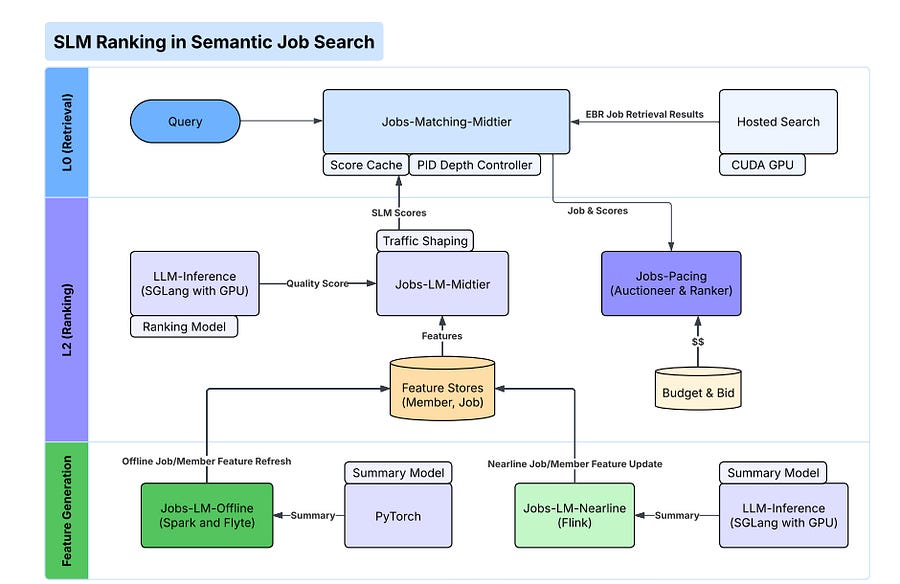

# LinkedIn Semantic job search

# TLDR

LinkedIn Engineering released a paper detailing how they deployed a decoder-only Small Language Model (SLM) for semantic job search.

By combining structured pruning (removing 40% of weights), RL-based context summarization (reducing input length by 90%) and deep optimizations to the SGLang serving engine (treating ranking as a prefill-only task), they achieved a 10x throughput increase in production.

# Introduction

Deploying Large Language Models for relevance ranking (re-ranking) is often the bottleneck in modern search stacks.

While LLMs offer superior semantic understanding compared to traditional keyword matching or bi-encoders, the computational cost of running a cross-encoder at scale usually prohibits their use on large candidate sets.

Most teams settle for distilling LLMs into BERT-based encoders or restricting the reranking depth to a handful of items.  

In a recent paper, LinkedIn describes a different approach. Instead of falling back to BERT, they optimized a decoder-only SLM (starting at 0.6B parameters) to run efficiently enough for high-traffic real-time ranking.

The engineering value here isn't in a single breakthrough, but in the combination of model compression, aggressive context reduction, and serving infrastructure hacks.

# Shrink the Model, Shrink the Input, Hack the Engine

The authors attacked the latency problem from three distinct angles: model architecture, data density, and serving mechanics.  
  
**1\. Model Compression via Structured Pruning**  
The team started with a 0.6B parameter model distilled from a 7B teacher. They then applied structured pruning using the OSSCAR method. Unlike unstructured pruning (which requires sparse kernels to realize speedups), structured pruning removes entire components.  
  
They pruned 50% of the hidden neurons in the MLP layers and, interestingly, removed the last 8 transformer blocks entirely. The intuition here is that for relevance tasks, the semantic features are likely formed in the earlier and middle layers, making the final layers redundant.

This reduced the model to 375M parameters with less than a 1% drop in NDCG@10 after fine-tuning.  
  
**2\. Context Compression via RL Summarization**  
In semantic search, the item description (e.g., a job posting) dominates the context window. The authors found that job descriptions averaged 900 tokens, causing quadratic latency spikes in the attention mechanism.  
  
They solved this by training a separate 1.7B "summarizer" model. Crucially, they didn't just use Supervised Fine-Tuning (SFT).

They used Reinforcement Learning (specifically Group Sequence Policy Optimization) to train the summarizer. The reward function penalized output length while maintaining the KL divergence between the ranking model's output on the full text versus the summary.  
  
This allowed them to compress descriptions by 93% (down to ~60 tokens) while retaining the signal the ranker actually needed. Because job postings change infrequently, these summaries are computed offline and cached, meaning the online inference cost is drastically lower.

  
**3\. Optimization of the SGLang Engine**  
The most interesting engineering insights come from how they modified the SGLang inference engine. They identified that ranking is a "prefill-only" workload. Standard LLM serving is designed for generation (decode phase), which involves iterative sampling.  
  
For ranking, the system only needs the logits of the "yes" and "no" tokens after processing the prompt. The authors modified the engine to:  
\- Strip out the decode/sampling loop entirely.  
\- Skip internal probability extraction for all tokens except the last one.  
\- Implement "in-batch prefix caching." Since all candidates for a single user share the same query and system prompt, the KV cache for the prefix is computed once and broadcast to all candidate sequences in the batch.

# Why It Matters

This work highlights a shift in how production teams are viewing LLM inference for non-chat use cases.  
  
**The "Prefill-Only" Paradigm**  
Most inference optimizations (like Speculative Decoding) focus on token generation speed. LinkedIn's work demonstrates that for discriminative tasks like ranking or classification, the bottleneck is entirely in the prefill phase. By stripping the generation overhead, they turned a generative model into a highly efficient scoring function.  
  
**Decoder-Only vs. BERT**  
For years, the industry standard for efficiency has been distilling to BERT-style encoders. LinkedIn shows that with aggressive pruning and context compression, decoder-only architectures can be viable for latency-sensitive ranking. This unifies the training stack, as the 375M student is architecturally similar to the 7B teacher.  
  
**Control Theory in Production**  
Beyond the model, the paper describes a PID controller used for "Dynamic Scoring Depth." The system monitors current traffic and latency; during load spikes, it automatically reduces the number of items sent to the ranker. During lulls, it increases depth to maximize relevance. This is a practical example of building resilience at the system level, acknowledging that even optimized LLMs can be overwhelmed by bursty traffic.

# References

  1. [Scaling up LLMs Serving Systems for Semantic Job Search](https://www.arxiv.org/pdf/2510.22101)
