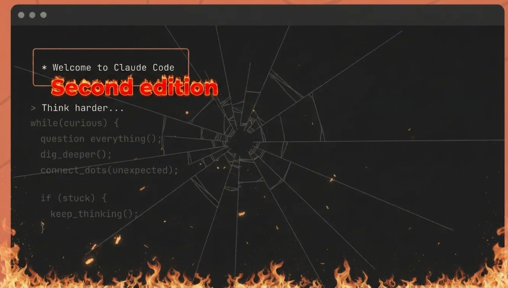

# Anthropic shipped three regressions in a month and their evals didn’t catch one of them

*A special edition. Inside the April 23 postmortem.*

<figure><a class="image-link image2 is-viewable-img" target="_blank" href="../assets/47d6d9d8a44303e4.jpg" data-component-name="Image2ToDOM">
<picture><source type="image/webp" srcset="../assets/47d6d9d8a44303e4.jpg 424w, ../assets/47d6d9d8a44303e4.jpg 848w, ../assets/47d6d9d8a44303e4.jpg 1272w, ../assets/47d6d9d8a44303e4.jpg 1456w" sizes="100vw"></picture>

<button tabindex="0" type="button" class="pencraft pc-reset pencraft icon-container restack-image buttonBase-GK1x3M"><svg aria-hidden="true" width="20" height="20" viewBox="0 0 20 20" fill="none" stroke-width="1.5" stroke="var(--color-fg-primary)" stroke-linecap="round" stroke-linejoin="round" xmlns="http://www.w3.org/2000/svg" class="icon-noB79L"><g><path d="M2.53001 7.81595C3.49179 4.73911 6.43281 2.5 9.91173 2.5C13.1684 2.5 15.9537 4.46214 17.0852 7.23684L17.6179 8.67647M17.6179 8.67647L18.5002 4.26471M17.6179 8.67647L13.6473 6.91176M17.4995 12.1841C16.5378 15.2609 13.5967 17.5 10.1178 17.5C6.86118 17.5 4.07589 15.5379 2.94432 12.7632L2.41165 11.3235M2.41165 11.3235L1.5293 15.7353M2.41165 11.3235L6.38224 13.0882"></path></g></svg></button><button tabindex="0" type="button" class="pencraft pc-reset pencraft icon-container view-image buttonBase-GK1x3M"><svg xmlns="http://www.w3.org/2000/svg" width="20" height="20" viewBox="0 0 24 24" fill="none" stroke="currentColor" stroke-width="2" stroke-linecap="round" stroke-linejoin="round" class="lucide lucide-maximize2 lucide-maximize-2 icon-noB79L"><polyline points="15 3 21 3 21 9"></polyline><polyline points="9 21 3 21 3 15"></polyline><line x1="21" x2="14" y1="3" y2="10"></line><line x1="3" x2="10" y1="21" y2="14"></line></svg></button>

</a></figure>

On April 23, Anthropic published a postmortem explaining a month of user complaints that Claude Code had gotten dumber.

Their tl;dr: three unrelated changes, three different surfaces, all shipping inside a four-week window, all degrading model behavior in ways that internal evals and dogfooding did not catch.

That is the story worth reading.

The bugs themselves are interesting: one is a genuinely beautiful failure at the intersection of prompt caching and extended thinking.

What’s interesting for anyone shipping ML systems in production: <strong>the company with one of the most invested eval infrastructure in the industry shipped three intelligence regressions back to back, and the signal they finally trusted was user feedback.</strong>

If your mental model is “we just need better evals,” this postmortem should change it.

Here is what happened, why each bug is interesting on its own terms, and what an MLE should actually take away from it.

<h3>The three changes, on one timeline</h3>
The chronology matters. Part of why this looked like “Claude got dumber” rather than three discrete bugs is that the changes overlapped in production, each affecting a different slice of traffic on a different schedule.
<ol><li>
<strong>March 4</strong> — Claude Code’s default reasoning effort changes from <code>high</code> to <code>medium</code>. Affects Sonnet 4.6 and Opus 4.6.
</li><li>
<strong>March 26</strong> — A caching optimization meant to clear stale thinking once per idle session ships with a bug that clears it on every turn. Affects Sonnet 4.6 and Opus 4.6.
</li><li>
<strong>April 16</strong> — A system prompt instruction to reduce verbosity ships alongside Opus 4.7. Affects Sonnet 4.6, Opus 4.6, and Opus 4.7.
</li></ol>
By mid-April, every Claude Code user is hitting at least one of these, often two, depending on which model they use, how long their sessions are, and whether they kept the default effort level.

The aggregate effect is exactly what you would expect: inconsistent, hard-to-reproduce reports of “Claude feels worse.”

Some users say it’s repetitive. Some say it’s lazy. Some say it burns through their usage limits faster. None of those reports look like the same bug because they aren’t.

Anthropic’s own framing:

Investigation began in early March, but the reports were “challenging to distinguish from normal variation in user feedback at first, and neither our internal usage nor evals initially reproduced the issues.”

Let’s walk through the three bugs.

<h3>Bug 1: The reasoning effort default</h3>
The simplest of the three, and the one most easily dismissed as “a product decision, not an ML bug.”

When Opus 4.6 launched in Claude Code in February, the default reasoning effort was high.

Some users hit a tail-latency issue: at high effort, the model would occasionally think long enough that the UI appeared frozen.

Anthropic’s internal evals showed that medium effort gave “slightly lower intelligence with significantly less latency for the majority of tasks” and avoided the long-tail freeze. So on March 4, they flipped the default to medium and surfaced the option via in-product dialogs.

Users immediately reported that Claude Code felt less intelligent. Anthropic shipped multiple iterations to make the effort setting more visible: startup notices, an inline selector, bringing back ultrathink.

Most users still kept the medium default because most users keep defaults.

On April 7, the default was reverted high.

<strong>Why this matters for an MLE:</strong>

The technical content here is the test-time-compute curve. Every reasoning model has one. Every team shipping a reasoning model picks a point on that curve as the default and exposes the others as options.

The choice of default is not a UX decision dressed up as an ML decision: it’s a distribution decision. You are deciding what fraction of your traffic gets which point on the intelligence/latency tradeoff.

The lie works like this: your eval suite is, by construction, a set of tasks where you can measure quality. Quality on those tasks degrades smoothly as you reduce thinking budget. “Slightly lower intelligence” is a real number on a real benchmark. What your eval suite does not measure is the long tail of tasks users actually bring to the product, where the marginal token of thinking is the difference between a correct multi-file refactor and a confidently-wrong one.

The bad version of this analysis:
<blockquote>
medium effort scores 97% of high effort on our evals, ship it.
</blockquote>
The good version
<blockquote>
medium effort scores 97% of high effort on our evals, but our evals saturate on the easy half of the distribution. The hard half (where most user complaints come from) is exactly where the marginal thinking token earns its keep.

The 3% gap is concentrated there. Ship medium as an option, not a default.
</blockquote>

<h3>Bug 2: The caching optimization that dropped prior reasoning</h3>

This is the deepest bug of the three and the one most worth understanding in detail.

It sits exactly at the intersection of three production ML systems concerns: context management, prompt caching, and extended thinking.

The setup: when a reasoning model works through a multi-turn task, the thinking blocks from previous turns stay in the conversation history.

On turn N, the model can see why it made the decisions it made on turns 1 through N-1. This is what makes long agentic sessions coherent

The cache: Anthropic uses prompt caching to make back-to-back requests cheap. The first request writes input tokens to cache, subsequent requests hit cache and pay only for the delta. After a period of inactivity, the prompt evicts.

The optimization: if a session has been idle for over an hour, the cache will miss anyway when the user comes back. Since you are paying for uncached tokens regardless, you might as well prune the older thinking blocks at that boundary. 

Smaller request, fewer uncached tokens, cheaper resumption.

The mechanism is the clear_thinking_20251015 API header with keep:1 .

The intent: clear thinking once, on session resume, then resume sending full reasoning history.

The bug: the flag was sticky.

After a session crossed the idle threshold once, every subsequent request for the rest of that process kept only the most recent reasoning block and dropped everything before it. And it compounded: if a user sent a follow-up while Claude was mid-tool-use, that started a new turn under the broken flag, dropping even the current turn’s thinking.

What this looks like from the outside is exactly what users reported.

Claude continues executing but increasingly without memory of why it chose to do what it was doing. It re-edits the same file three times in slightly different ways. It re-runs the same diagnostic command and reaches a different conclusion than it did two turns ago. It picks tools that don’t make sense given what should have been established earlier in the session. It feels forgetful and repetitive because functionally, it is.

There is a secondary effect that is its own little teaching moment: because every request after the trip-point dropped thinking blocks, every request was also a cache miss. Users reported burning through usage limits faster than expected.

Anthropic believes this is what drove those reports.

A correctness bug in context management surfaced as a billing/limits bug because the cache layer and the context layer were coupled.

<strong>Why this got past everything:</strong>

This is the part of the postmortem most worth sitting with. The change passed:
<ul><li>
multiple human code reviews
</li><li>
multiple automated code reviews
</li><li>
unit tests
</li><li>
end-to-end tests
</li><li>
automated verification
</li><li>
internal dogfooding
</li></ul>
It still shipped broken. Two specific reasons it survived dogfooding, both of which are worth understanding because both will happen to you:
<ol><li>
An unrelated server-side experiment on message queuing was running internally and interacted with the bug in a way that suppressed it for internal users.
</li><li>
An orthogonal change in how thinking was displayed in the CLI further masked the symptom in most internal sessions.
</li></ol>
Read that again. Two unrelated experiments combined to hide the bug from the people best positioned to find it. Internal builds were fine. External builds were broken.

<strong>The lesson here is not “do better dogfooding.”</strong> Anthropic dogfoods Claude Code more than any company on earth dogfoods Claude Code. The lesson is that <strong>internal builds are not the public build, and any company running internal experiments is dogfooding a counterfactual.</strong>

Anthropic explicitly says one of their post-incident commitments is to have more internal staff use the exact public build. That should tell you something about how much of your own internal usage is also a counterfactual.

<h3>Bug 3: The verbosity instruction in the system prompt</h3>
The third bug is the sneakiest because it looks like the kind of change that should be safe.

Opus 4.7 launched on April 16. It is a more verbose model than 4.6 — Anthropic flagged this at launch. Verbosity is good for hard problems and bad for output token costs, so before launch the team tuned the Claude Code harness for the new model. One of the changes was adding two lines to the system prompt:
<blockquote>
<em>“Length limits: keep text between tool calls to ≤25 words. Keep final responses to ≤100 words unless the task requires more detail.”</em>
</blockquote>
This is a perfectly reasonable thing to write. It is also exactly the kind of thing that ships without a second thought, because system prompts are not code in the way that, say, the cache eviction logic is code. They go through different review. They do not have the same test gates. Often they do not have any test gates beyond “we ran the eval suite and it didn’t get worse.”

The eval suite, in fact, did not get worse. The change passed multiple weeks of internal testing with no regressions on the eval set they ran. It shipped on April 16 alongside Opus 4.7. It hurt coding quality on Sonnet 4.6, Opus 4.6, and Opus 4.7.

The investigation method is the part worth copying. They ran ablations — removing the new lines from the system prompt one at a time — and ran them against a <em>broader</em> set of evaluations than the one used for the original gating decision. The broader suite showed a 3% drop on both Opus 4.6 and 4.7. The line was reverted on April 20.

<strong>Why this matters:</strong>

Three percent on a broader eval is the difference between “ship it” and “don’t ship it” in a way that the original eval suite, by definition, could not see. The system prompt change was sufficient to move the model meaningfully on tasks that the gating eval did not cover.

There is a temptation to read this as a tooling problem — <em>we should have tested with a broader suite</em> — and that is true but insufficient.

The deeper point is that <strong>a system prompt is production code that runs on every request and is one of the highest-leverage surfaces for changing model behavior</strong>, and most teams treat it like a config file.

You can ship a 3% intelligence regression by changing two sentences. You cannot ship a 3% intelligence regression by changing a model checkpoint without an enormous gating process. The asymmetry is wrong.

Anthropic’s commitments in the postmortem are mostly about closing this gap: a broad per-model eval suite for every system prompt change to Claude Code, continued ablations, new tooling to make prompt changes easier to review and audit, gating model-specific instructions to the specific model they target, soak periods for changes that could trade off against intelligence. In other words: treat the system prompt like a model.

If you are running a system that has a system prompt: this is the section to take literally.

<h3>So why didn’t the evals catch any of this?</h3>
This is the real question, and it has different answers for the three bugs that all rhyme.

<strong>Bug 1 (reasoning effort):</strong> The eval suite measured what it measured: quality at fixed effort. It did not capture the user-facing experience of “the same product feels less smart” because that experience is partly about distribution shift in task difficulty between eval and prod, and partly about the asymmetry between the cost of a failure and the cost of a slow response. The eval saw the median. Users felt the tail.

<strong>Bug 2 (cache + thinking):</strong> The bug only triggered after sessions crossed an idle threshold, which is rare in eval runs because eval runs are not stale sessions. It was further suppressed by two unrelated experiments in the internal environment. The eval suite was not wrong. The eval suite was running in a distribution that did not contain the bug.

<strong>Bug 3 (verbosity prompt):</strong> The eval suite that gated the change was narrower than the eval suite that found the regression. There exists a broader suite. It was not run because there was no rule that said run it. The change passed because the gate it had to pass was insufficient.

These three failure modes are completely standard. Every team running production ML hits at least two of them. The reason this postmortem is unusual is not that Anthropic encountered them. It is that they encountered them in public, on a product where users could feel the regression in their daily workflow, and they wrote about it specifically enough that the rest of us can learn from it.

If you want one lens for all three, it is this: <strong>your evals measure what you decided to measure when you wrote them. Production traffic does not respect that decision.</strong> The gap between eval distribution and production distribution is where regressions live. You do not close that gap by writing more evals. You close it by:
<ul><li>
Knowing where your eval suite saturates and which slice of production traffic lives past the saturation point.
</li><li>
Treating user feedback as a noisy but real signal that your eval surface is incomplete, not as a thing to be reconciled against the eval surface.
</li><li>
Recognizing that any change that touches the high-leverage surfaces — defaults, prompts, context management, caching — is a model change in disguise and deserves model-change-tier gating.
</li><li>
Building the discipline of ablations on a <em>broader</em> suite than the one you would use for a green-light decision, specifically for changes that could trade off against quality.
</li></ul>

<h3>What I’d actually take from this</h3>
If you are an MLE shipping into a production system, four things from this postmortem are worth changing your practice over.

<strong>One: every default is a distribution decision.</strong> The reasoning effort flip is the cleanest example. When you choose a default, you are choosing where most of your users will land on a tradeoff curve, and your eval suite will not tell you whether that point is the right one for the long tail of tasks you don’t have evals for. Users will. Listen.

<strong>Two: the caching layer and the context layer are coupled, even when you don’t want them to be.</strong> Bug 2 is going to happen to you in some shape or form if you run prompt caching with a reasoning model. The class of bugs where a “cache optimization” silently changes what context the model sees is a real and recurring class. Build observability that tells you, per request, exactly what context blocks are being sent. Not what you intended to send. What was actually sent.

<strong>Three: system prompts are production code with model-tier impact and config-tier review.</strong> Fix that asymmetry. Run ablations on a broader suite. Gate model-specific instructions to the specific model. Track every change. Soak before you ship.

<strong>Four: internal dogfooding is a counterfactual if your internal environment runs experiments your users don’t see.</strong> Anthropic discovered this the hard way. The fix is not “dogfood more.” The fix is to run a slice of internal traffic on the exact public build, with no experiments layered on, specifically so the dogfooding signal points at the same artifact your users are running.

<h3>Caveats</h3>
A few things this postmortem does not tell us, and that I want to flag honestly:
<ul><li>
We do not know how much production traffic was affected by each bug. “A slice” is doing real work in the original post. It is possible Bug 2 hit a small fraction of sessions and Bug 1 hit nearly everyone.
</li><li>
We do not know the magnitude of the user-perceived intelligence drop. The 3% number is from one ablation on one bug on a broader internal eval. It is not a claim about how much worse Claude felt to users.
</li><li>
We do not know whether the three bugs actually compounded — i.e., whether a user hitting all three simultaneously experienced a worse-than-additive effect — or whether they were largely independent.
</li></ul>
And one positive caveat that I think is worth ending on: postmortems this specific are rare. Most companies write postmortems that read like legal disclaimers.

This one names the API headers, the dates, the model versions, the fix commits.

That is the version that is useful to other engineers, and it is the version that is hard to write because it requires admitting exactly what broke and exactly why.

The right response to a postmortem like this is not to pile on. It is to read it carefully and ask which of these three bugs you would have shipped yourself.

I would have shipped at least two. LOL.

