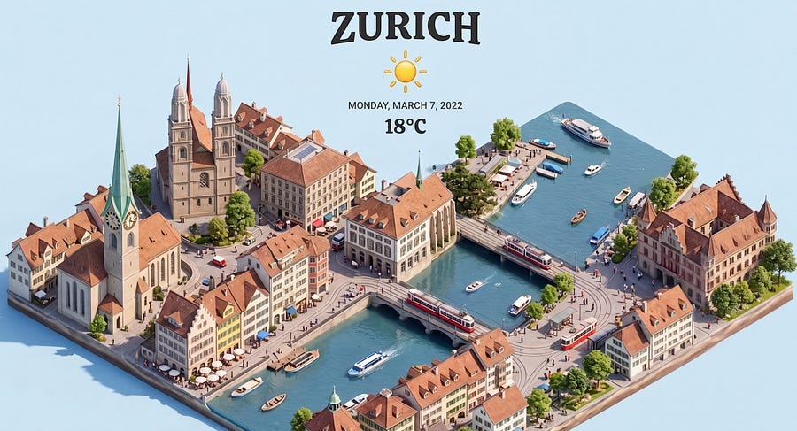

# An essay on Zürich.

*Why Zürich is the best city in Europe to be in. *

*Why Zürich is the best city in Europe to be in. *

## An essay on Zürich

I’m the “Zürich maximalist” guy on LinkedIn. The one who supposedly only cares about money, doesn’t know how to have fun, and lives in a boring little city by a lake.

I’ve been on r/LinkedInLunatics.

I don’t own real estate in Zürich and I’m not selling you anything, but I do keep saying the quiet part out loud, and apparently that’s enough to make people angry.

The pushback always surprises me, because my actual view is boring.

It’s the kind of thing I think half of educated young Europeans already believe and just won’t say. So this is me trying to write it out properly, in long form, because a 300-word LinkedIn post was never going to do it justice.

* * *

# European STEM financials

Here’s the setting I want you to picture, because it’s the one I come from and the one most of my university friends are still living in.

You’re a European STEM graduate in the 2020s. Good marks, maybe an internship or two if someone in your life knew how to nudge you toward one.

You finish your degree, you move to a city where the “good jobs” are, Milan, Paris, Madrid, maybe London if you’re brave, and you discover something nobody warned you about during your degree: the salaries in those cities have not, in any meaningful way, kept up with the cost of living there.

There are exceptions, of course.

If you land a FAANG-level role straight out of university, congratulations, you’ve found a bubble inside a bubble and the rest of this essay probably doesn’t apply to you. 

But that’s not most people. Most people take the normal graduate offer at the normal company, and they move into a flatshare, or a one-room apartment if they’re lucky, and at the end of every month they save maybe five hundred euros.

Sometimes less. Sometimes nothing.

And here is the thing nobody wants to say: in that situation, you cannot build a life. You cannot plan more than a year ahead.

You cannot think about a house, or kids, or what you want to be doing in your forties, because the math simply does not allow it. 

This isn’t a complaint about avocado toast or whatever GenZ thing is getting made fun of.

200k Italians under 35 leave the country every year, and they’re not leaving because the food is bad. (jk)

The escape hatch most of my peers back home use is their parents. 

A flat in Milan bought with family money, a deposit helped along by a grandparent, a car handed down. I don’t judge anyone who takes that help. If it’s there, take it. 

But I want to be honest about what it is:

> It’s a structural admission that the economy around you does not let young people build stability on their own, and the people who look like they’re making it are quietly being subsidized. If that’s your reality, fine. If it isn’t, you’re stuck.

I found that depressing.

And so the question I started asking myself was a simple one: what is the shortest, most boring, least heroic path to financial stability in Europe, for someone like me, without a trust fund and without waiting for the Italian economy to fix itself?

There are really only four answers I’ve ever been able to come up with.

# How to get to financial stability

The **first** is to join a FAANG-level company somewhere in Europe.

This works, the money is real, and you don’t need to move to Switzerland to do it.

But everyone wants this job, the competition is brutal, and the odds for any given graduate are not great.

The **second** is to join an early-stage startup and bet on the equity.

This also works, occasionally, but it requires luck and time, and most of the outcomes are bad even when the company is good.

The **third** is to go fully independent. Build something on the side, in public, from a place with a low cost of living, and compound it into a business.

I love this path romantically and I’m actually trying a version of it myself, but I’ll tell you honestly: it’s harder than the FAANG route, not easier. Very few people make it work, and the ones who do usually had something else funding them in the early years.

And then there’s the **fourth** option, which is the one nobody finds sexy and which is, mathematically, the easiest of the four.

You move to a country where a _normal_ job at a _normal_ company pays enough to let you live well and save meaningfully. Not a lottery ticket. Not a heroic bet. A boring, legible, achievable version of a good life, available to anyone with a decent degree and some willingness to relocate.

That country, for me, turned out to be Switzerland.

I want to be careful here because this is where people stop listening:

Switzerland is not paradise and Zürich is not perfect and I’m not trying to sell you on a postcard.

Eating out is genuinely expensive.

The city can feel quiet in a way that bothers people who grew up somewhere louder.

Making friends with locals is hard, though I’d challenge anyone to name a European city where it’s actually easy as an adult.

The cultural scene is not Milan or Paris and it never will be.

Childcare costs a fortune, and those low taxes everyone have to come from somewhere.

All of that is true and I don’t try to argue around it.

What is also true is this.

A standard entry-level job in Zürich, across disciplines, not just tech, pays enough to live comfortably and save aggressively from month one.

I was offered 85k CHF at UBS out of university.

My girlfriend was offered 100k CHF in a non-tech engineering role with a few years of experience.

Those are not outlier numbers here, they’re the middle of the distribution. 

The crime rate is absurdly low.

The mountains are an hour away.

The rent market is regulated against you in a specific, useful way: a landlord won’t rent to you if the rent exceeds a third of your gross income, which keeps the ratio of housing to salary sane in a way that Milan, Paris and London long ago abandoned.

The healthcare is private and it works.

The currency is stable.

The unemployment system, when you need it, is one of the most generous in Europe: 1.5 years at 70% of your salary.

You are in the middle of the continent, so every weekend can be somewhere else if you want it to be.

And the expat community is large enough that you will, eventually, build a life here even if you never quite crack the local social code.

None of this is exciting. That’s the point.

What I’m optimizing for is not excitement. I’m optimizing for stability, peace of mind, and the ability, ten years from now, to make a genuinely free choice about what I do next without money being a factor in the decision.

Maybe I go back to Italy and try to do something useful there. Maybe I start a company. Maybe I just keep writing. I don’t know yet, and I don’t need to know yet, because the whole strategy is designed to buy me the right to not know.

This is, I think, what gets lost when someone reads one of my LinkedIn posts and decides I’m a shill for a city or a personality drained of anything but spreadsheets.

I’m not saying money is the point of life.

I’m saying that when you don’t come from it, the fastest, least heroic, most reliable way to get the kind of life where money stops being the point is to go somewhere the numbers work in your favour while you’re young, and let compounding do the rest.

Zürich happens to be the place where that math is cleanest for me. (because I also enjoy the vibes)

For someone else it might be Amsterdam, or Dublin, or Munich, or Copenhagen.

That’s the essay. That’s the view.

You don’t have to agree with it. But the next time someone tells you they’re moving to Zürich for the money, consider the possibility that what they actually mean is that they’re moving for the freedom that comes after.

Ludo

Fun fact, I have written this article on Sechseläuten. Which makes this more wholesome.  
  
The best day in Zürich of the whole year. Ask your favourite AI what this is and be amazed by the little fun facts.
