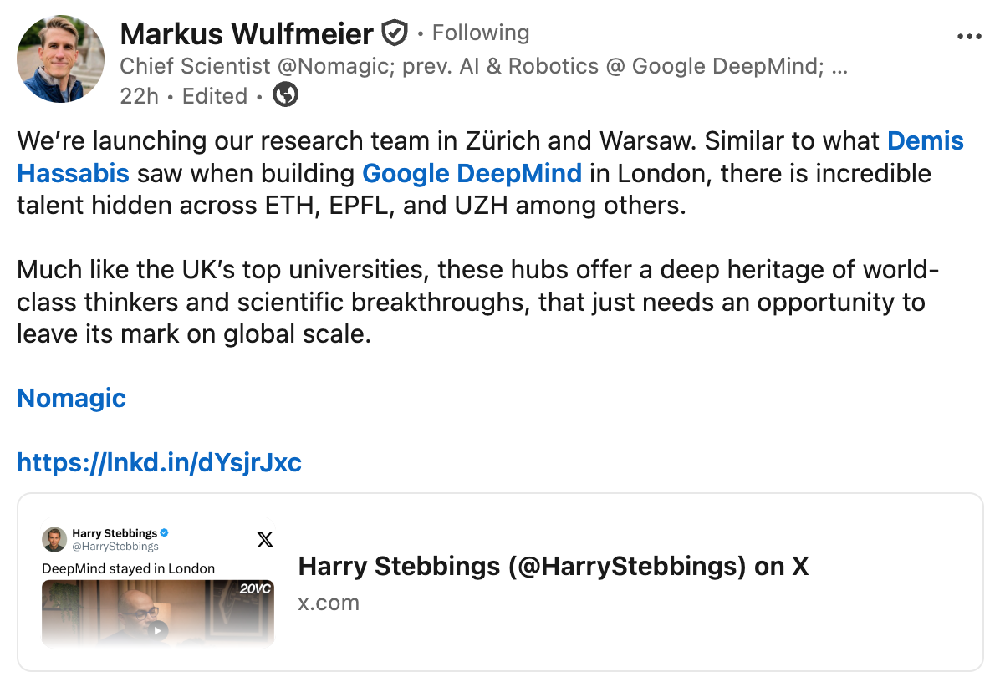

# THE ZÜRICH FEED [Edition #2]

*Curated ML roles in Zürich. With context no job board gives you.*

Hey!

Welcome to the second edition of The Zürich Feed. 🥂

Every week I go through **ML roles** in Zürich, filter out the noise, and add the context that job boards won’t give you:

  1. Team signals

  2. Whether the role is actually worth your time.

  3. What’s brewing in Zurich that’s not official yet (!!!)

This week: 29 hand picked roles.

**💥💥 Zürich ML ecosystem is alive! 💥💥**

Companies are opening offices left and right in Zürich: two hot AI / Robotics companies are joining the fun.

An interesting NVIDIA opening in Zürich that seems tailor made for Zooglers (Google employees working in Zurich, fun name!)

Company name and link to job openings below.

* * *

**📡 MARKET PULSE**

 _My takes, what I am keeping a close look on and the full list of X roles with comp estimates, team context, and my honest take on each — is below for paid subscribers._

> Google is still dominating hiring in Zürich for the moment with lots of opening across products.
>
> Even if not a growth-site per se (in terms of current openings vs other locations) lots of team are still in need of headcount as the office remains big.
>
> Meta remains at very few openings, most likely as Zürich office is still waiting for news around YET ANOTHER round of layoff. CHAOS!
>
> Microsoft is expanding rapidly the Superintelligence team in Zürich and paying top $$$ (or should I say CHF) for it
>
> Lots of roles are rarely for entry level engineers, but rather require 2/3+ YOE.
>
> Same pattern also for “Junior engineer role” that requires 1 YOE. Such is life!

* * *

**👀 ONE THING I’M WATCHING**

> Comp levels are growing in Zürich for top tier companies, while low tier companies are offshoring. It’s an interesting market dynamic of the top 10% engineers getting all the attention while the remaining 90% are left with leftovers.
>
> Make sure you sit on the right side by continuously up-skilling.
>
> Top startups / AI labs are paying above FAANG level comp, which is similar trend you also find in SF.

* * *

**🤫 TWO NEW COMPANIES THAT HAVE OPENED UP SHOP IN ZURICH (and the full job list of X hand picked jobs) 🤫**

🥁 Drums rolling 🥁****

[Synthesia](https://www.synthesia.io/)

AI Video Generation company hiring for **[Senior Research Engineer - Video Foundation Models (Pre - Training)](https://jobs.ashbyhq.com/synthesia/8a09fe17-c01c-4e35-9394-abd339bbfdf3?utm_source=careers_page)**

Research engineers are really a sweet job title: fun research activities with actual engineering challenges. For this role, you will need to know about:

  * Latent video diffusion models

  * Distributed training

  * How to optimize inference

Sounds pretty fun! To be fair they have been hiring remotely from Zürich already, but I am told they are opening an office location in the city :)

[Nomagic](https://nomagic.ai/)

Not yet any official openings for Zürich specifically, but they recently announed opening an hub in Zürich for research specifically:

Keep them in your radar, sounds like a fun challenge to automate warehouses :)

Now onto job other job openings!

**🗂️ THE LIST**

**FAANG LEVEL compensation is reflected on[levels.fyi](https://www.levels.fyi/?tab=levels) without me taking any guesses.**

**🏢 Google (❤️)**

_No explanation needed. One of the biggest tech hub outside of the US. Tons of strong teams hiring. ML-heavy office with lots of different products hiring._

[Senior Software Engineer, Operations Research](https://www.google.com/about/careers/applications/jobs/results/122028489434899142-senior-software-engineer-operations-research)

> Quite an interesting opening, it looks like they want to apply LLMs to OR. Sounds fun!

[Research Engineer, Paradigms of Intelligence](https://www.google.com/about/careers/applications/jobs/results/72858602171179718-research-engineer-paradigms-of-intelligence)

> A friend of mine works here. One of the coolest teams in Zurich to be honest under the research org. If you are into moonshots, this is the team for you!

[Staff Software Engineer, AI/ML, Safe Search](https://www.google.com/about/careers/applications/jobs/results/116095773799523014-staff-software-engineer-aiml-safe-search)

> Make Search safe for all :). Really impactful work in a growing org. Last edition lots of openings for early / mid engineers.

[Senior Software Engineer, AI/ML, YouTube](https://www.google.com/about/careers/applications/jobs/results/74466962196832966-senior-software-engineer-aiml-youtube)

> ML at YouTube is needed horizontally! :)

[Software Engineer III, AI/ML, YouTube Shopping](https://www.google.com/about/careers/applications/jobs/results/130360700219335366-software-engineer-iii-aiml-youtube-shopping)

> If you join this team, we will work closely together! :D Fun work as an “infra team” on a product team, supporting all shopping clients!

[Software Engineer III, Generative AI](https://www.google.com/about/careers/applications/jobs/results/100512786341077702-software-engineer-iii-generative-ai)

> Hard to get much out of this opening, but you get to play with LLMs :)

[Research Scientist, Frontier AI, Google DeepMind](https://www.google.com/about/careers/applications/jobs/results/109190501474673350-research-scientist-frontier-ai-google-deepmind)

> 15 years of experience leading a research agenda. You read that right! Only for really high senior people :)

[Senior Software Engineer, Video Ads Quality](https://www.google.com/about/careers/applications/jobs/results/117629583930335942-senior-software-engineer-video-ads-quality)

> I know people on this team. You get to touch E2E Ads stack from infra to modelling. Sounds really fun!

**🏢 Meta**

 _Smallish office heavily focusing on VR / AR projects. Recently spinned up a monetization division as well as Superintelligence team. I’d focus on the latter given recent developments._

[AI Research Scientist, Vision Language Models](https://www.metacareers.com/profile/job_details/1437821761070455)

> asdad

[Software Engineer (Leadership) - Machine Learning](https://www.metacareers.com/profile/job_details/1058363622156402)

> adasd

**🏢 Apple**

 _Small office (~200 headcount), but with a diverse range of projects._

[AIML - Applied ML Research Scientist, Accessibility](https://jobs.apple.com/en-us/details/200659101-4170/aiml-applied-ml-research-scientist-accessibility?team=MLAI)

> Meaningful work to use AI to make products more accessible!

[Software Engineer (Search), MLPT - ASE](https://jobs.apple.com/en-us/details/200618944-4170/software-engineer-search-mlpt-ase?team=MLAI)

> Infrastructure search team powering all search across Apple. Sounds like impact!

**🏢 NVIDIA**

 _Small office, mainly focused on Autonomous vehicles, LLM evals and Systems engineering._

[Research Scientist, 3D Computer Vision](https://jobs.nvidia.com/careers/job/893394784137?domain=nvidia.com&hl=en)

> Scene understanding: semantic and geomtry. Publishing original work is part of the job!

[Senior Software Engineer, JAX](https://jobs.nvidia.com/careers/job/893394712289?domain=nvidia.com&hl=en)

> All my Googler friends looking at this!? Sounds like fun!

**🏢 Microsoft**

 _Office that is expanding thanks to the recent opening of Microsoft AI division. Expect high TC offer and negotiate hard._

  * [Member of Technical Staff, Software Engineer - MAI SuperIntelligence team - Advanced level](https://apply.careers.microsoft.com/careers?start=0&location=Zurich&pid=1970393556744537&sort_by=distance&filter_distance=160&filter_include_remote=1)

>  _Infra role supporting all MAI workflows. Design and develop tools used by researchers and speed up their workflows._

  * [Member of Technical Staff, AI Post-Training - MAI SuperIntelligence team](https://apply.careers.microsoft.com/careers?start=0&location=Zurich&pid=1970393556648705&sort_by=distance&filter_distance=160&filter_include_remote=1) \- Advanced level

>  _Develop data collection, evaluation and finetuning recipes for post training models. Rapid prototyping is a mentioned skill._

  * [Member of Technical Staff -Member of Technical Staff - Pretraining Text Data](https://apply.careers.microsoft.com/careers/job/1970393556752593?domain=microsoft.com&hl=en)

>  _Develop data collection, evaluation and finetuning recipes for pre training models._

**🏢 Exa**

 _Brand new office in Zürich being lead by non-other than my friend[Max Buckley](https://www.linkedin.com/in/maxbuckley/)._

_They are focused on building the best search engine in the world. Zürich office is focused on both modelling and infra roles.
The comp can go quite high here. I expect it to reach 0.5M CHF TC (but those stocks are not liquid, so make sure to do your own valuation!)._

  * [Research, ML](https://jobs.ashbyhq.com/exa/1c9d0849-59f8-4a4b-bdd9-25a066993213) \- Mid level

> Graduate level ML exp, transformer coding, quality focused. Across the stack modelling from pretraining to finetuning.

  * [Software Engineer, Backend](https://jobs.ashbyhq.com/exa/ebb5c46f-7a2a-42f2-b96a-83b8db5ff016?locationId=16c5d558-3742-4e40-ab56-0a9b94c051ca) \- Mid level

> Maintain high throughput low latency systems, optimize systems. Build a custom vector database . State of the art crawling system that works optimally.

**🏢 RAI (Robotics and AI Institute)**

_Small office but lots of high quality researchers._

  * [Research Scientist (Zurich Location)](https://jobs.lever.co/rai/45f40b1a-0191-411a-bc6e-67043e676427) \- Mid level

> Good grasp of a broad set of techniques related to RL/IL control, state and world estimation, perception, planning/navigation, LLM/VLM

**🏢 Mimic**

 _Up and coming series B startup for automating away tedious physical tasks. I expect it to reach 0.35M CHF TC (but those stocks are not liquid, so make sure to do your own valuation!)_

  * [AI Research Scientist Robot Learning](https://jobs.gem.com/mimicrobotics-com/am9icG9zdDp4kHJkgcnfMbwa-tUElmqv) \- Mid level

> Shaping all aspects of the development of end-to-end AI models for robotics, from large scale multi-task pre-training to specialized fine-tuning and post-training.

  * [AI Research Engineer Robot Learning](https://jobs.gem.com/mimicrobotics-com/am9icG9zdDpDpu9NY8aD8f3YpENfLoSm) \- Mid level

> Research engineer version of the above. Less about research, more about engineering. Still more research than a standard SWE.

  * [Applied AI Engineer](https://jobs.gem.com/mimicrobotics-com/am9icG9zdDoq3kjdD1xnPYjm7KPKHaKe) \- Mid level

> Interesting role, almost looks like a forwarded deployed engineer. Apply AI recipes to new customer tasks and lead the technical project management.

**🏢 Lakera**

 _Acquired startup by Check Point. LLM x Security._

_I expect it to reach 0.35M CHF TC (with liquid stocks!)_

  * [Senior ML Engineer](https://www.lakera.ai/careers?ashby_jid=158d9a05-bc1d-49fd-81f1-bf1229e8021f)

> Modelling focused: extend a model to multiple languages, add signals to prompt injection detectors, red team models to understand and fix vulnerabilities.

  * [Staff ML Engineer](https://www.lakera.ai/careers?ashby_jid=6f04a898-893e-439f-8601-c25a30418c13)

> Higher seniority of the opening above.

**🏢 Bloom**

 _A YC backed startup, 3.4M pre-seed._

  * [Founding engineer](https://www.ycombinator.com/companies/bloom-4/jobs/Tb6dGeS-founding-engineer) \- 150k / 250k USD - 0.5 / 2.0 equity

> Build the foundation for technical infrastructure at Bloom. Looks pretty exciting around Agents for building App.

**🏢 Manufact (formerly mcp-use)**

_YC backed company, hiring in Zurich for founding engineers._

  * **[Software engineer (Founding team)](https://www.ycombinator.com/companies/manufact/jobs/x7AI7un-software-engineer-founding-team)**(100-150k USD + equity)

> Ship open source tools for MCP development.

**🏢 Zenline**

 _Build AI agents that find the perfect assortment for every retailer_

  * **[Founding engineer Full-stack](https://zenline.notion.site/founding-engineer-full-stack)**

> Real full stack! Full stack eng + AI. Fun is guaranteed!

* * *
