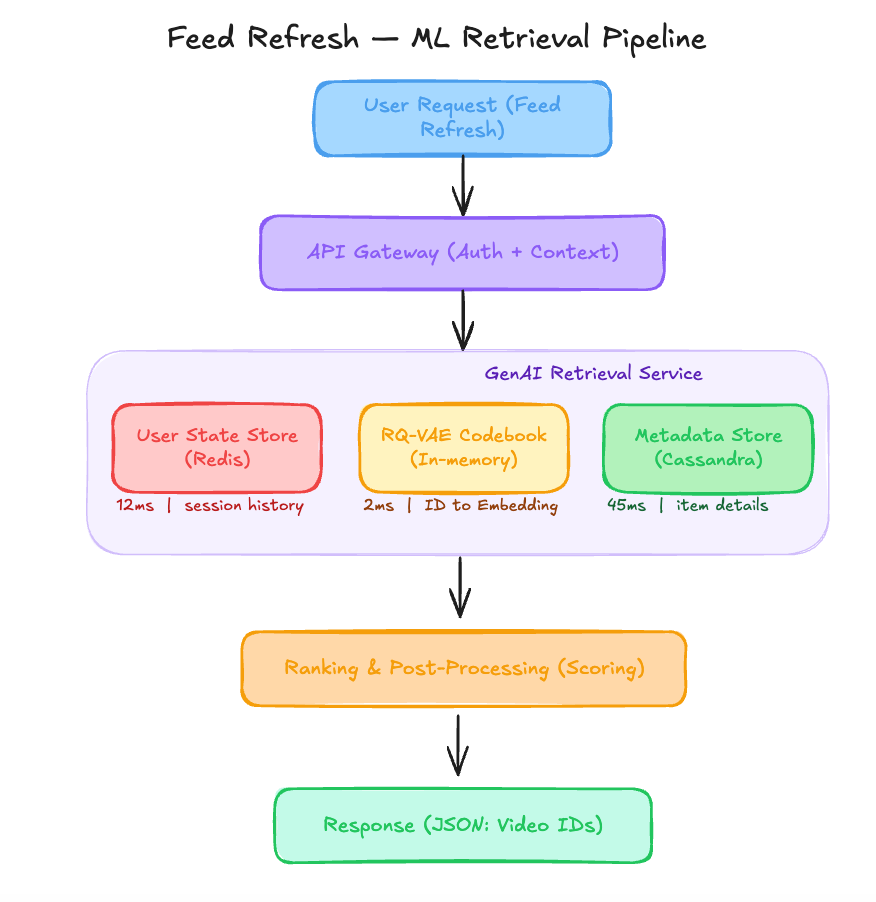

# A $1.1M Generative Recommender That Collapsed Into a 2000 Video Loop [Edition #7]

*Learn how StreamPulse accidentally baked legacy popularity bias into their RQ-VAE codebook and why parallel decoding can slash your A100 footprint by 40 percent.*

> Paid post — only the publicly visible preview is included.

*Learn how StreamPulse accidentally baked legacy popularity bias into their RQ-VAE codebook and why parallel decoding can slash your A100 footprint by 40 percent.*

StreamPulse is a Series C video-first social platform company that recently migrated their core recommendation engine to a Generative RecSys Architecture.  
  
(Don’t know what Gen RecSys is? [Check out this beautiful article](https://www.yuan-meng.com/posts/generative_recommendation/))

They’ve reached 200 million daily active users (DAU) and are currently managing a repository of 45 million active short-form videos.

Their engineering team built a Generative Semantic Retrieval system that replaces traditional two-stage retrieval (vector search) with a sequence-to-sequence model. This system predicts “Semantic IDs” (discrete tokens representing content clusters) directly from user history. Here’s their setup.

# Architecture Overview

When a user opens the home feed, the system triggers a sequence prediction to generate the next N items the user is likely to engage with.

### Traffic patterns:

Daily Active Users: 200,000,000

Total Daily Feed Refreshes: 4,000,000,000

Average: 46,296 req/sec

Peak: 88,000 req/sec

The ML Pipeline:

The model is a 1.2B parameter Transformer-decoder trained on 18 months of user interaction sequences. Items are represented as Semantic IDs generated by an Residual Quantized Variational Autoencoder (RQ-VAE).

This RQ-VAE was trained using the 128-dimension embeddings from the company’s legacy Matrix Factorization model to ensure “backward compatibility.”

The decoding process uses a beam search width of 4 with no temperature sampling.

### Current performance

Inference Latency (p99): 240ms (Autoregressive decoding of 10 items)

System Reliability: 99.8% uptime

Business Impact: 18% drop in session length (measured at week 6 post-launch)

Costs:

GPU Compute (A100 Clusters): $980,000 / month

Data Egress & Storage: $140,000 / month

Total: $1,120,000 / month

Recent incidents:

Incident 1: Feed “Frozen” Bug - Users reported seeing the same 10 videos for 48 hours. Resolved by clearing the User State Store cache.

Incident 2: Inference Timeout Spike - p99 jumped to 1.2s during a regional holiday peak, causing a 5% fallback rate to random popular videos.

# The Analysis

Now let me show you what’s actually happening here.

### Critical Issue #1: Semantic ID Poisoning

 _I write about ML systems in production — the tradeoffs, the architecture decisions, the stuff that doesn’t make it into papers. If you want to go deeper, the paid tier covers the technical details I can’t fit in free posts._
