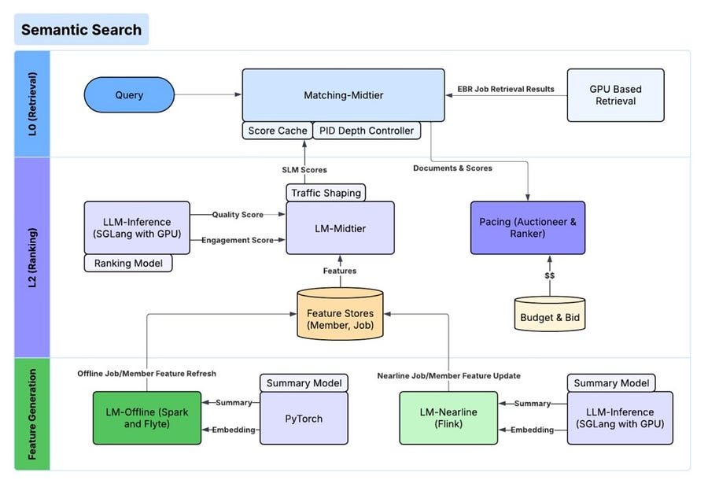

# Unpacking LinkedIn’s Move to Semantic Search

*SLMs, Distillation, and Hybrid Inference*

*SLMs, Distillation, and Hybrid Inference*

# TL;DR

LinkedIn replatformed their search stack from lexical matching to a fully semantic pipeline.

The architecture leverages GPU-accelerated embedding-based retrieval followed by a ranking stage using Small Language Models (SLMs).

Key engineering wins include a massive “LLM Judge” pipeline for generating training data, aggressive model distillation (7B to 0.6B parameters), and a novel “context compression” technique that condenses lengthy document text into single-token embeddings. 

This compression improved inference throughput from 290 to 22,000 items per second per GPU.

# Introduction

Moving search from sparse retrieval (BM25/Inverted Indexes) to dense retrieval (Vector Search) is a known pattern, but doing it at LinkedIn’s scale (millions of QPS with real-time requirements) introduces distinct latency and compute bottlenecks. 

The challenge isn’t just better retrieval; it’s making Large Language Models (LLMs) fast enough to rank candidates without bankrupting the inference budget.

What stands out is not just the use of embeddings, but the infrastructure they built to support a “Small Language Model” (SLM) ranking layer.

They effectively moved away from the idea that you need a massive model to get semantic understanding, proving that highly optimized, task-specific smaller models are the superior path for production search systems.

# A Pipeline Built on Distillation and Synthetic Data

The architecture is split into three distinct phases: Quality Assessment, Retrieval, and Ranking.

Semantic search requires massive amounts of labeled query-document pairs.

Instead of relying solely on click logs (which are noisy) or manual human labeling (which is slow), the team built an evaluation system based on LLMs.

Product Managers define “golden” grading policies, which are used to train a large LLM judge. This judge then labels tens of millions of pairs daily. This synthetic data engine is the foundation of the entire stack, creating the training set for both retrieval and ranking models.

For retrieval, they utilize a dual-tower (bi-encoder) architecture trained via contrastive loss. They mine “hard negatives” (irrelevant documents that the model incorrectly ranks highly) directly from the LLM judge’s output to sharpen the decision boundary. 

Interestingly, for serving, they perform exhaustive k-nearest-neighbor search on GPU-backed indexes rather than relying solely on approximate nearest neighbor (ANN) graphs, trading memory for precision.

The ranking layer is where the architecture deviates from standard RAG implementations. Instead of sending retrieved chunks to a massive generic LLM, they use a fine-tuned, decoder-only SLM (around 0.6B parameters).

This model acts as a cross-encoder: it takes the query and the candidate job/person profile as a single input and outputs logits for a “Yes” or “No” token. These logits are converted into a relevance probability score.

# Extreme Optimization for Inference Latency

The most significant takeaway for engineers is how LinkedIn optimized the ranking stage.

A standard cross-encoder is computationally expensive because self-attention scales quadratically with input length. Job descriptions are long, and processing them inside a ranker for hundreds of candidates per query creates massive latency.

To solve this, they applied three layers of optimization that are highly relevant for anyone deploying GenAI in production:

**1\. Multi-Stage Distillation**

They didn’t train the 0.6B model from scratch. They started with a 7B parameter “teacher” model and distilled it down to a 1.7B intermediate model, and finally to the 0.6B production student.

They used multi-task distillation, where the student learns to mimic the teacher’s relevance scores while also predicting engagement signals (clicks, applies) from user logs. This preserves reasoning capabilities while slashing parameter count.

**2\. Structured Pruning**

They moved beyond simple weight quantization. They employed structured pruning: removing entire neurons in MLPs, attention heads, and even whole transformer layers. Because this physically reduces the model architecture (rather than just zeroing out weights), it results in actual wall-clock speedups on standard GPU kernels without needing sparse-matrix hardware support.

**3\. Context Compression (The Big Win)**

This is the most novel component. Job descriptions often hit the context window limit (2k tokens). The engineers implemented a text-embedding hybrid interaction architecture.

An offline encoder LLM compresses the lengthy job description into a single-token embedding. During online inference, the ranking SLM receives the query text and this pre-computed “summary embedding” instead of the raw text.

The paper notes that throughput for the SLM ranker jumped from roughly 290 items/sec/GPU (using raw text) to 22,000 items/sec/GPU (using embedding compression).

This architecture demonstrates that the future of production search isn’t about calling the largest model available. It’s about building a data flywheel to train small, specialized models and aggressively optimizing the input context to minimize compute per query.

# Are you interested in Evals?

[Helping Software Engineers Turn AI Prototypes into Production-Ready Systems](https://www.eventbrite.co.uk/e/eval-driven-development-for-engineers-tickets-1987673491921?aff=mlatscale)

Discount code for Machine learning at scale subs: ML50

# References

  1. https://www.linkedin.com/blog/engineering/search/reimagining-linkedins-search-stack
