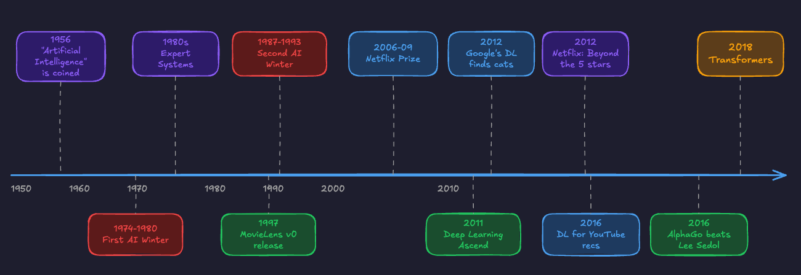

# Generative RecSys Won’t Save You: What Actually Matters at Billion-User Scale

Recommender systems have moved through three architectural eras:

  1. Matrix factorization

  2. Deep learning (the Two-Tower standard)

  3. Generative era

Xavier Amatriain’s RecSys 2025 keynote mapped this evolution well, from Netflix Prize nostalgia to Gemini-powered preference elicitation.

It was a good talk.

It was also dangerously optimistic.

For engineers building discovery systems at scale right now, the path forward is not “add an LLM.”

It never is.

The real challenge is distinguishing between what looks cool in a keynote demo and what actually survives contact with a billion users and a 200ms latency budget.

The industry is buzzing about autonomous agents and “media of one.”

I’m going to argue that agents are overrated for mass-market products, that personalization must remain bounded to be safe, that the _real_ generative revolution (HSTU, not LLMs) is quietly rewriting the stack, and that real-time adaptation still matters more than anything else.

* * *

## Agents Are a Distraction for Consumer Products

The keynote highlighted “Zero-History Preference Elicitation”: using conversational agents to ask users what they want. Technically impressive. Practically useless for products with billions of users.

**The Cognitive Load Problem.** The success of modern feeds is built on passive consumption. People open TikTok to decompress, not to negotiate with a chatbot about what kind of videos they’re in the mood for.

**The Latency/Cost Barrier.** Running an agentic loop (reasoning → tool use → response) shatters the 200ms latency budget required for seamless feed rendering. At billion-user scale, the inference cost of an agentic layer is not just expensive.

It is economically ruinous compared to efficient embedding retrieval.

For niche tasks like travel planning, complex B2B queries, or high-consideration purchases, agents genuinely add value.

But for mass-media discovery, they are a solution looking for a problem.

The dominant interface for the next decade will remain a feed, not a chat window.

* * *

## The Generative Revolution That Actually Matters: HSTU and Sequential Transduction

When people hear “Generative RecSys,” they picture an LLM chatting with users about movie preferences.

The actual generative revolution happening in production looks nothing like that.

It looks like Meta’s HSTU (Hierarchical Sequential Transduction Units), a 1.5-trillion-parameter model that treats user behavior sequences as a language in themselves.

**What HSTU actually does.** It reformulates recommendation as sequential transduction. Instead of the classic DLRM pipeline (feature extraction → feature interaction → prediction), HSTU feeds raw behavioral sequences (clicks, watches, skips, purchases) directly into a modified transformer.

No hand-engineered features.

No feature crossing.

Just actions, treated as tokens, predicted autoregressively.

**Why this matters more than LLM-based recommendations.**

LLM-based recommenders leverage _language_ (prompts, descriptions, reviews) and pretrained world knowledge. HSTU leverages _actions_.

At scale, actions are a far denser and more informative signal than any natural language description of preferences.

A user’s last 500 interactions tell you more about what they want right now than any prompt they could type.

**The scaling law breakthrough.** For the first time in recommender systems history, HSTU demonstrated power-law scaling with compute. The same pattern that made GPT possible. More compute = better recommendations, predictably.

This is the ChatGPT moment for RecSys, but it happened quietly because the architecture doesn’t generate text. It generates ranked lists.

**The cascade is dying.** The traditional retrieve → lightweight rank → heavy rank → re-rank pipeline has been the default for a decade. HSTU challenges this by unifying retrieval and ranking into a single generative model.

Kuaishou’s OneRec took it further with session-wise list generation, generating interdependent sequences of videos instead of scoring items independently. Xiaohongshu’s GenRank is doing the same for ranking.

Every major platform (Google, ByteDance, Alibaba, Meituan) is racing to deploy some version of this paradigm.

**What this means for your stack.** If you are still building retrieval and ranking as separate systems with independent feature pipelines, you are building the equivalent of a DLRM in 2016.

The next two years will be defined by teams figuring out how to unify these stages under a single generative model while keeping latency and serving costs under control. That’s the real engineering challenge.

Not whether to add a chatbot on top of your feed.

* * *

## Real-Time Adaptation Trumps World Knowledge

The most critical engineering challenge today is not how much “world knowledge” an LLM has, but how quickly the system can update its “user knowledge.”

A trillion-parameter model that knows everything about the world but only knows what the user liked _yesterday_ is inferior to a small model that knows what the user liked _three seconds ago_.

**The state management problem.** In the Two-Tower era, updating user embeddings in near real-time was solved. With LLMs, the context window is static. Injecting real-time behavior (clicks and skips from the current session) into an LLM requires complex RAG pipelines prone to latency spikes.

HSTU partially addresses this by design: the sequential input _is_ the real-time signal. But serving long sequences at inference time introduces its own challenges.

Meta’s M-FALCON algorithm and recent work on context parallelism for HSTU show that even the best teams are still fighting this battle.

**The “Now” Factor.** User intent is volatile. Someone switches from learning mode to entertainment mode in the span of two swipes. If the system relies on heavy, slow-to-update generative models, it misses these micro-shifts entirely.

The system that reacts instantly to a “skip” is more valuable than an agent that can write a sonnet about the video you just skipped.

Adapting to the user in real-time is more valuable than deep semantic understanding. Always has been. Always will be.

* * *

## Bounded Personalization: Use GenAI for the Lens, Not the Content

There is a dangerous allure in the concept of generative content: systems that create movies, music, or articles on the fly for a specific user. The “audience of one” vision. It ignores the social nature of media and the safety risks of hallucination.

The pragmatic step forward is **bounded personalization** : using GenAI to personalize the _presentation layer_ within the strict boundaries of an existing catalog.

**Personalized framing.** Don’t generate a new movie. Use an LLM to rewrite the synopsis or select the thumbnail of an existing movie based on the user’s interests. If a user loves romance, highlight the romantic subplot of an action movie in the description. The content stays vetted. The framing becomes personal.

**Safety in constraints.** By operating within the boundaries of a fixed catalog, you eliminate the risk of an agent hallucinating offensive or nonsensical content. The AI contextualizes. It does not create.

**Explainability.** Use small language models to generate “Why this?” explanations. This delivers the value of an agent (reasoning, contextualization) without the friction of a chat interface and without the risk of open-ended generation.

We don’t need to burn down the catalog to save the user. The winning strategy is GenAI as a dynamic, personalized _lens_ through which users view the standard catalog.

* * *

## The Real Playbook

The RecSys 2025 keynote traced a path from Matrix Factorization to LLMs. The map for production engineers looks different.

The future is not replacing efficient ranking systems with slow, chatty agents.

It is hybrid vigor: keeping the ruthless efficiency and real-time speed of collaborative filtering, adopting the genuine generative breakthrough (HSTU-style sequential transduction, not GPT-style chatbots), and using LLMs surgically for the last mile of presentation and explanation.

Success won’t go to the company with the smartest agent. It will go to the system that can adapt to a user’s changing mood in under 100 milliseconds, while quietly running a trillion-parameter generative ranker underneath.

## References

  1. [2025 RecSys keynote](https://amatria.in/blog/recsyskeynote)
