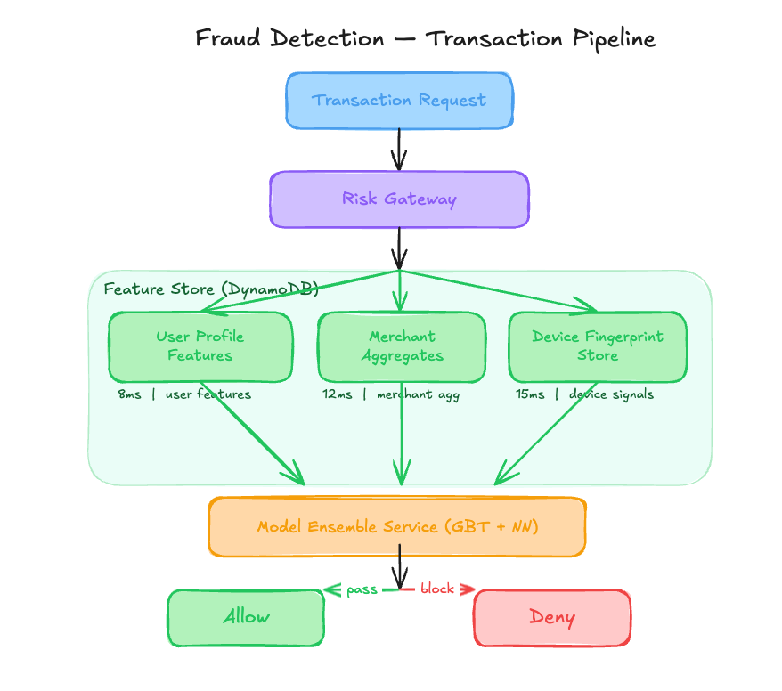

# 0.08% False Positive Rate That Masked a $4.2M Attack [Edition #8]

*Learn how an implicit negative feedback loop and a 90-day window allowed a 35-day poisoning attack to bypass an XGBoost ensemble.*

> Paid post — only the publicly visible preview is included.

*Learn how an implicit negative feedback loop and a 90-day window allowed a 35-day poisoning attack to bypass an XGBoost ensemble.*

FinShield is a Series B fintech company that recently expanded its cross-border payment rails to 14 new markets. They have scaled aggressively, now processing 8 million transactions per day for a global user base.

Their engineering team built a real-time anti-abuse gateway that sits in the critical path of every transaction. Here is their setup:

# Architecture Overview

When a user initiates a transaction, the request hits the Risk Gateway. This service fetches pre-computed features and orchestrates the model inference before returning a boolean allow/deny decision.

### Traffic patterns:

Total Volume: 8,000,000 transactions per day

Average Throughput: 92 requests per second

Peak Throughput: 480 requests per second

The ML Pipeline:

The system uses an ensemble of a Gradient Boosted Tree (XGBoost) and a shallow Neural Network. It is retrained every Sunday at 2:00 AM UTC using a sliding window of the previous 90 days of transaction data. Labels are generated automatically: any transaction not flagged as fraudulent by a human or a chargeback within 48 hours of clearing is labeled as Benign.

### Current performance:

P99 Inference Latency: 45ms

Service Availability: 99.99%

False Positive Rate: 0.08%

Costs:

Model Training Compute (Weekly GPU/Spark): $18,500/month

Feature Store Throughput: $14,000/month

Total: $32,500/month (Infrastructure only)

Recent incidents:

March 12: 14-minute latency spike due to DynamoDB throttling. Recovered by increasing provisioned RCUs.

May 5: Systemic failure to block $4.2M in fraudulent transactions over a 35-day period. Recovery required manual merchant blacklisting and a full model rollback.

# The Analysis

Now let me show you what is actually happening here.

### Critical Issue #1: The Implicit Negative Feedback Loop

 _I write about ML systems in production — the tradeoffs, the architecture decisions, the stuff that doesn’t make it into papers (like this one!) If you want to go deeper, the paid tier covers the technical details I can’t fit in free posts._
