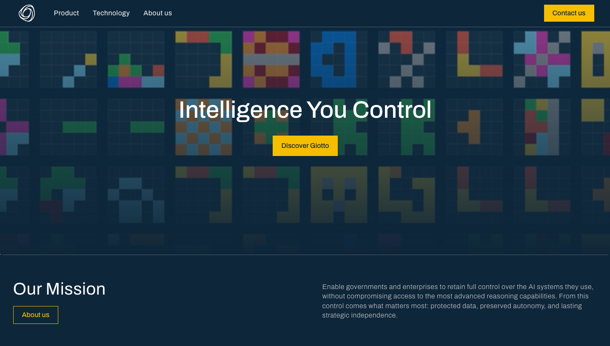

# THE ZÜRICH FEED [Edition #3] 

*Curated ML roles in Zürich. With context no job board gives you. *

<figure><a class="image-link image2 is-viewable-img" target="_blank" href="../assets/76c80b1c11dc4431.jpg" data-component-name="Image2ToDOM">
<picture><source type="image/webp" srcset="../assets/76c80b1c11dc4431.jpg 424w, ../assets/76c80b1c11dc4431.jpg 848w, ../assets/76c80b1c11dc4431.jpg 1272w, ../assets/76c80b1c11dc4431.jpg 1456w" sizes="100vw"></picture>

<button tabindex="0" type="button" class="pencraft pc-reset pencraft icon-container restack-image buttonBase-GK1x3M"><svg aria-hidden="true" width="20" height="20" viewBox="0 0 20 20" fill="none" stroke-width="1.5" stroke="var(--color-fg-primary)" stroke-linecap="round" stroke-linejoin="round" xmlns="http://www.w3.org/2000/svg" class="icon-noB79L"><g><path d="M2.53001 7.81595C3.49179 4.73911 6.43281 2.5 9.91173 2.5C13.1684 2.5 15.9537 4.46214 17.0852 7.23684L17.6179 8.67647M17.6179 8.67647L18.5002 4.26471M17.6179 8.67647L13.6473 6.91176M17.4995 12.1841C16.5378 15.2609 13.5967 17.5 10.1178 17.5C6.86118 17.5 4.07589 15.5379 2.94432 12.7632L2.41165 11.3235M2.41165 11.3235L1.5293 15.7353M2.41165 11.3235L6.38224 13.0882"></path></g></svg></button><button tabindex="0" type="button" class="pencraft pc-reset pencraft icon-container view-image buttonBase-GK1x3M"><svg xmlns="http://www.w3.org/2000/svg" width="20" height="20" viewBox="0 0 24 24" fill="none" stroke="currentColor" stroke-width="2" stroke-linecap="round" stroke-linejoin="round" class="lucide lucide-maximize2 lucide-maximize-2 icon-noB79L"><polyline points="15 3 21 3 21 9"></polyline><polyline points="9 21 3 21 3 15"></polyline><line x1="21" x2="14" y1="3" y2="10"></line><line x1="3" x2="10" y1="21" y2="14"></line></svg></button>

</a></figure>

Hey!

Welcome to the third edition of The Zürich Feed. 🥂

Every week I go through <strong>ML roles</strong> in Zürich, filter out the noise, and add the context that job boards won’t give you:
<ol><li>
Team signals
</li><li>
Whether the role is actually worth your time.
</li><li>
What’s brewing in Zurich that’s not official yet (!!!)
</li></ol>
This week: 41 hand picked, high leverage roles.

<strong>💥💥 Zürich ML ecosystem is alive! 💥💥</strong>

Especially focused on robotics. Two new companies have opened up Zürich recently with TONS of roles.

And, just for this time a company that’s Lausanne based :) without any paywall!

Company name and link to job openings below.

<strong>📡 MARKET PULSE</strong>

<em>My takes, what I am keeping a close look on and the full list of X roles with comp estimates, team context, and my honest take on each — is below for paid subscribers.</em>
<blockquote>
Google is still hiring a lot in Zürich for the moment with lots of opening across products.

Even if not a growth-site per se (in terms of current openings vs other locations) lots of team are still in need of headcount as the office remains big.  Meta layoffs will hit next week. Let’s see how Zürich office will be impacted  Microsoft is expanding rapidly the Superintelligence team in Zürich and paying top $$$ (or should I say CHF) for it

Lots of roles are rarely for entry level engineers, but rather require 2/3+ YOE.

Same pattern also for “Junior engineer role” that requires 1 YOE. Such is life!
</blockquote>

<strong>👀 ONE THING I’M WATCHING</strong>
<blockquote>
Zürich is deep tech capital. The amount of highly technical roles is crazy here as you will see in the newsletter.

Make sure you sit on the right side by continuously up-skilling. If you are here at ML@Scale, you are already in the right place.

Comp levels are growing in Zürich for top tier companies, while low tier companies are offshoring. It’s an interesting market dynamic of the top 10% engineers getting all the attention while the remaining 90% are left with leftovers.
</blockquote>

<strong><a href="https://giottoai.bamboohr.com/careers/29">Machine learning engineer role in Lausanne at Giotto.AI</a> [sponsored]</strong>

If you are interested in exploring new architectures for reasoning and efficient AI, this is the place for you.

They are looking for a Machine Learning Engineer (open to remote within Switzerland!). Check out the opening <a href="https://giottoai.bamboohr.com/careers/29">here</a>.

<figure><a class="image-link image2 is-viewable-img" target="_blank" href="../assets/66ae3a506b1feed3.png" data-component-name="Image2ToDOM">
<picture><source type="image/webp" srcset="../assets/66ae3a506b1feed3.png 424w, ../assets/66ae3a506b1feed3.png 848w, ../assets/66ae3a506b1feed3.png 1272w, ../assets/66ae3a506b1feed3.png 1456w" sizes="100vw"></picture>

<button tabindex="0" type="button" class="pencraft pc-reset pencraft icon-container restack-image buttonBase-GK1x3M"><svg aria-hidden="true" width="20" height="20" viewBox="0 0 20 20" fill="none" stroke-width="1.5" stroke="var(--color-fg-primary)" stroke-linecap="round" stroke-linejoin="round" xmlns="http://www.w3.org/2000/svg" class="icon-noB79L"><g><path d="M2.53001 7.81595C3.49179 4.73911 6.43281 2.5 9.91173 2.5C13.1684 2.5 15.9537 4.46214 17.0852 7.23684L17.6179 8.67647M17.6179 8.67647L18.5002 4.26471M17.6179 8.67647L13.6473 6.91176M17.4995 12.1841C16.5378 15.2609 13.5967 17.5 10.1178 17.5C6.86118 17.5 4.07589 15.5379 2.94432 12.7632L2.41165 11.3235M2.41165 11.3235L1.5293 15.7353M2.41165 11.3235L6.38224 13.0882"></path></g></svg></button><button tabindex="0" type="button" class="pencraft pc-reset pencraft icon-container view-image buttonBase-GK1x3M"><svg xmlns="http://www.w3.org/2000/svg" width="20" height="20" viewBox="0 0 24 24" fill="none" stroke="currentColor" stroke-width="2" stroke-linecap="round" stroke-linejoin="round" class="lucide lucide-maximize2 lucide-maximize-2 icon-noB79L"><polyline points="15 3 21 3 21 9"></polyline><polyline points="9 21 3 21 3 15"></polyline><line x1="21" x2="14" y1="3" y2="10"></line><line x1="3" x2="10" y1="21" y2="14"></line></svg></button>

</a></figure>

Now, onto the other amazing roles available in <strong>Zurich</strong> :)

<strong>🤫 TWO NEW COMPANIES THAT HAVE OPENED UP SHOP IN ZURICH (and the full job list of X hand picked jobs) 🤫</strong>

<strong>🥁 Drums rolling 🥁</strong>

<a href="https://www.linkedin.com/company/flexion-robotics/">Flexion Robotics</a>

Autonomy stack for humanoid robots - from command to control, from manipulation to locomotion, across any hardware and task. Leveraging the power of simulation and reinforcement learning, their software scales to the real world with minimal human involvement. Hiring for:
<ul><li>
<a href="https://www.linkedin.com/jobs/search/?currentJobId=4404332102&amp;f_C=106062932&amp;geoId=92000000&amp;origin=COMPANY_PAGE_JOBS_CLUSTER_EXPANSION&amp;originToLandingJobPostings=4404332102%2C4389720696%2C4404592123%2C4345832499%2C4404575323%2C4387281288%2C4404583478%2C4373823022%2C4378335191&amp;refId=kx5DjEWe8fJFcBrHotjPog%3D%3D&amp;trackingId=I1vxz03tKDruwibtEoHEzw%3D%3D&amp;trk=d_flagship3_company">ML Infra engineer</a>
</li><li>
<a href="https://www.linkedin.com/jobs/search/?currentJobId=4404592123&amp;f_C=106062932&amp;geoId=92000000&amp;origin=COMPANY_PAGE_JOBS_CLUSTER_EXPANSION&amp;originToLandingJobPostings=4404332102%2C4389720696%2C4404592123%2C4345832499%2C4404575323%2C4387281288%2C4404583478%2C4373823022%2C4378335191&amp;trk=d_flagship3_company">Software engineer - Simulation</a>
</li><li>
<a href="https://www.linkedin.com/jobs/search/?currentJobId=4345832499&amp;f_C=106062932&amp;geoId=92000000&amp;origin=COMPANY_PAGE_JOBS_CLUSTER_EXPANSION&amp;originToLandingJobPostings=4404332102%2C4389720696%2C4404592123%2C4345832499%2C4404575323%2C4387281288%2C4404583478%2C4373823022%2C4378335191&amp;trk=d_flagship3_company">Research engineer - Generative Humanoid Motion Generation</a>
</li><li>
<a href="https://www.linkedin.com/jobs/search/?currentJobId=4404575323&amp;f_C=106062932&amp;geoId=92000000&amp;origin=COMPANY_PAGE_JOBS_CLUSTER_EXPANSION&amp;originToLandingJobPostings=4404332102%2C4389720696%2C4404592123%2C4345832499%2C4404575323%2C4387281288%2C4404583478%2C4373823022%2C4378335191&amp;trk=d_flagship3_company">AI Research Engineer - Dexterous Manipulation</a>
</li><li>
<a href="https://www.linkedin.com/jobs/search/?currentJobId=4404583478&amp;f_C=106062932&amp;geoId=92000000&amp;origin=COMPANY_PAGE_JOBS_CLUSTER_EXPANSION&amp;originToLandingJobPostings=4404332102%2C4389720696%2C4404592123%2C4345832499%2C4404575323%2C4387281288%2C4404583478%2C4373823022%2C4378335191&amp;trk=d_flagship3_company">AI Research engineer - RL Manipulation</a>
</li></ul>
Lots of fun and lots of openings!

<a href="https://www.linkedin.com/company/microagi/">Microagi</a>

The data layer for physical AI.
<ul><li>
<a href="https://www.microagi.ai/careers#research-engineer-robotics-embodied-ai">Research Engineer (Robotics)</a>
</li><li>
<a href="https://www.microagi.ai/careers#researcher">Researcher</a>
</li><li>
<a href="https://www.microagi.ai/careers#computer-vision-researcher-hand-body-tracking">Computer vision researcher</a>

</li></ul>
<strong>🗂️ THE LIST</strong>

<strong>FAANG LEVEL compensation is reflected on <a href="https://www.levels.fyi/?tab=levels">levels.fyi</a> without me taking any guesses.</strong>

<strong>🏢 Google (❤️)</strong>

<em>No explanation needed. One of the biggest tech hub outside of the US. Tons of strong teams hiring. ML-heavy office with lots of different products hiring.</em>

<a href="https://www.google.com/about/careers/applications/jobs/results/122028489434899142-senior-software-engineer-operations-research">Senior Software Engineer, Operations Research</a>
<blockquote>
Quite an interesting opening, it looks like they want to apply LLMs to OR. Sounds fun!
</blockquote>
<a href="https://www.google.com/about/careers/applications/jobs/results/74466962196832966-senior-software-engineer-aiml-youtube">Senior Software Engineer, AI/ML, YouTube</a>
<blockquote>
ML at YouTube is needed horizontally! :)
</blockquote>
<a href="https://www.google.com/about/careers/applications/jobs/results/130765388144091846-senior-software-engineer-approximation-algorithms-ai-query-processing">Senior Software Engineer, Approximation Algorithms, AI Query Processing</a>
<blockquote>
ML for queries!
</blockquote>
<a href="https://www.google.com/about/careers/applications/jobs/results/130360700219335366-software-engineer-iii-aiml-youtube-shopping">Software Engineer III, AI/ML, YouTube Shopping</a>
<blockquote>
If you join this team, we will work closely together! :D Fun work as an “infra team” on a product team, supporting all shopping clients!
</blockquote>
<a href="https://www.google.com/about/careers/applications/jobs/results/117629583930335942-senior-software-engineer-video-ads-quality">Senior Software Engineer, Video Ads Quality</a>
<blockquote>
I know people on this team. You get to touch E2E Ads stack from infra to modelling. Sounds really fun!
</blockquote>
<a href="https://www.google.com/about/careers/applications/jobs/results/80459626985726662-software-engineer-iii-youtube-trust-and-safety">Software Engineer III, YouTube Trust and Safety</a>
<blockquote>
Help make YouTube safer!
</blockquote>
<a href="https://www.google.com/about/careers/applications/jobs/results/124711215128552134-software-engineer-iii-machine-learning-research-and-products">Software Engineer III, Machine Learning, Research and Products</a>
<blockquote>
Cool combination of research that makes its way into products
</blockquote>
<a href="https://www.google.com/about/careers/applications/jobs/results/141410104883716806-software-engineering-manager-automotive-ai-agent">Software Engineering Manager, Automotive AI Agent</a>
<blockquote>
Engineering manager for car platform
</blockquote>
<a href="https://www.google.com/about/careers/applications/jobs/results/124457386856325830-research-software-engineer-generative-ai">Research Software Engineer, Generative AI</a>
<blockquote>
One of the coolest roles of this edition imho. Check it out!
</blockquote>
<a href="https://www.google.com/about/careers/applications/jobs/results/118923738107257542-senior-applied-ml-engineer-graph-neural-network-ml-frontiers">Senior Applied ML Engineer, Graph Neural Network, ML Frontiers</a>
<blockquote>
Oh wait. Scratch the above. HOW COOL IS THIS?
</blockquote>
<a href="https://www.google.com/about/careers/applications/jobs/results/73092069077197510-research-engineer-astra-evals-deepmind">Research Engineer, Astra Evals, DeepMind</a>
<blockquote>
Making evals across GDM? Sign me up!
</blockquote>
<a href="https://www.google.com/about/careers/applications/jobs/results/80628242033058502-staff-engineering-analyst-gen-ai-trust-and-safety">Staff Engineering Analyst, GenAI Trust and Safety</a>
<blockquote>
High leverage position for horizontal T&amp;S.
</blockquote>
<strong>🏢 Meta</strong> <em>Smallish office heavily focusing on VR / AR projects. Recently spinned up a monetization division as well as Superintelligence team. I’d focus on the latter given recent developments.</em>

<a href="https://www.metacareers.com/profile/job_details/1058363622156402">Software Engineer (Leadership) - Machine Learning</a>
<blockquote>
What can i say. Just one opening. Let’s wait a few weeks for Meta Zürich future.
</blockquote>
<strong>🏢 Apple</strong>  <em>Small office (~200 headcount), but with a diverse range of projects.</em>

<a href="https://jobs.apple.com/en-us/details/200643040-4170/ai-research-scientist-multimodal-intelligence?team=HRDWR">AI Research Scientist - Multimodal Intelligence</a>
<blockquote>
Full stack foundation model training for vision. Is that you? If yes, looks fun!
</blockquote>
<a href="https://jobs.apple.com/en-us/details/200634821-4170/aiml-senior-ml-rl-training-infrastructure-engineer-afm?team=MLAI">AIML - Senior ML/RL Training Infrastructure Engineer, AFM</a>
<blockquote>
Infra for large-scale ML and RL training runs? Sounds fun.
</blockquote>
<strong>🏢 NVIDIA</strong> <em>Small office, mainly focused on Autonomous vehicles, LLM evals and Systems engineering.</em>

<a href="https://jobs.nvidia.com/careers/job/893391009867?domain=nvidia.com&amp;hl=en">Senior Deep Learning Compiler Engineer - PyTorch</a>
<blockquote>
Classic NVIDIA opening :)
</blockquote>
<a href="https://jobs.nvidia.com/careers/job/893392900593?domain=nvidia.com&amp;hl=en">Research Scientist, 3D Computer Vision</a>
<blockquote>
Computer vision is big in Zürich what can i say!?
</blockquote>
<a href="https://jobs.nvidia.com/careers/job/893394093790?domain=nvidia.com&amp;hl=en">Deep Learning Engineer - LLM and VLM Model Compression</a>
<blockquote>
Small models are cheaper models! :D
</blockquote>
<strong>🏢 Microsoft</strong> <em>Office that is expanding thanks to the recent opening of Microsoft AI division. Expect high TC offer and negotiate hard.</em>
<ul><li>
<a href="https://apply.careers.microsoft.com/careers/job/1970393556648532?domain=microsoft.com&amp;hl=en">Member of Technical Staff, AI Multimodal - MAI Superintelligence Team</a>
</li></ul><blockquote>
MAI goes multimodal!
</blockquote><ul><li>
<a href="https://apply.careers.microsoft.com/careers/job/1970393556626996?domain=microsoft.com&amp;hl=en">Member of Technical Staff - AI Pretraining - MAI Superintelligence Team</a>
</li></ul><blockquote>
Pretraining keeps winning :)
</blockquote><ul><li>
<a href="https://apply.careers.microsoft.com/careers/job/1970393556752593?domain=microsoft.com&amp;hl=en">Member of Technical Staff -Member of Technical Staff - Pretraining Text Data</a>
</li></ul><blockquote>
But pretraining needs data… :D
</blockquote>
<strong>🏢 Exa</strong> <em>Brand new office in Zürich being lead by non-other than my friend <a href="https://www.linkedin.com/in/maxbuckley/">Max Buckley</a>.</em>

<em>They are focused on building the best search engine in the world. Zürich office is focused on both modelling and infra roles.  The comp can go quite high here. I expect it to reach 0.5M CHF TC (but those stocks are not liquid, so make sure to do your own valuation!).</em>
<ul><li>
<a href="https://jobs.ashbyhq.com/exa/1c9d0849-59f8-4a4b-bdd9-25a066993213">Research, ML</a> - Mid level
</li></ul><blockquote>
Build the AI agents for search :)
</blockquote><ul><li>
<a href="https://jobs.ashbyhq.com/exa/ebb5c46f-7a2a-42f2-b96a-83b8db5ff016?locationId=16c5d558-3742-4e40-ab56-0a9b94c051ca">Software Engineer, Backend</a> - Mid level
</li></ul><blockquote>
Infra for AI Agents
</blockquote>
<strong>🏢 RAI (Robotics and AI Institute)</strong> <em>Small office but lots of high quality researchers.</em>
<ul><li>
<a href="https://jobs.lever.co/rai/45f40b1a-0191-411a-bc6e-67043e676427">Research Scientist (Zurich Location)</a> - Mid level
</li></ul><blockquote>
Good grasp of a broad set of techniques related to RL/IL control, state and world estimation, perception, planning/navigation, LLM/VLM
</blockquote>
<strong>🏢 Mimic</strong> <em>Up and coming series B startup for automating away tedious physical tasks. I expect it to reach 0.35M CHF TC (but those stocks are not liquid, so make sure to do your own valuation!)</em>
<ul><li>
<a href="https://jobs.gem.com/mimicrobotics-com/am9icG9zdDreFN_ZVNrzDEGNC4mrmw4-">Forward Deployed Engineer</a> - Mid level
</li></ul><blockquote>
Hottest role in tech came to zurich!
</blockquote><ul><li>
<a href="https://jobs.gem.com/mimicrobotics-com/am9icG9zdDp4kHJkgcnfMbwa-tUElmqv">AI Research Scientist Robot Learning</a> - Mid level
</li></ul><blockquote>
Shaping all aspects of the development of end-to-end AI models for robotics, from large scale multi-task pre-training to specialized fine-tuning and post-training
</blockquote><ul><li>
<a href="https://jobs.gem.com/mimicrobotics-com/am9icG9zdDpDpu9NY8aD8f3YpENfLoSm">AI Research Engineer Robot Learning</a> - Mid level
</li></ul><blockquote>
Research engineer version of the above. Less about research, more about engineering. Still more research than a standard SWE.
</blockquote><ul><li>
<a href="https://jobs.gem.com/mimicrobotics-com/am9icG9zdDoq3kjdD1xnPYjm7KPKHaKe">Applied AI Engineer</a> - Mid level
</li></ul><blockquote>
Interesting role, almost looks like a forwarded deployed engineer. Apply AI recipes to new customer tasks and lead the technical project management.
</blockquote>
<strong>🏢 Lakera</strong> <em>Acquired startup by Check Point. LLM x Security.</em>

<em>I expect it to reach 0.35M CHF TC (with liquid stocks!)</em>
<ul><li>
<a href="https://www.lakera.ai/careers?ashby_jid=158d9a05-bc1d-49fd-81f1-bf1229e8021f">Senior ML Engineer</a>
</li></ul><blockquote>
Modelling focused: extend a model to multiple languages, add signals to prompt injection detectors, red team models to understand and fix vulnerabilities.
</blockquote><ul><li>
<a href="https://www.lakera.ai/careers?ashby_jid=6f04a898-893e-439f-8601-c25a30418c13">Staff ML Engineer</a>
</li></ul><blockquote>
Higher seniority of the opening above.
</blockquote>
<strong>🏢 Bloom</strong> <em>A YC backed startup, 3.4M pre-seed.</em>
<ul><li>
<a href="https://www.ycombinator.com/companies/bloom-4/jobs/Tb6dGeS-founding-engineer">Founding engineer</a> - 150k / 250k USD - 0.5 / 2.0 equity
</li></ul><blockquote>
Build the foundation for technical infrastructure at Bloom. Looks pretty exciting around Agents for building App.
</blockquote>
<strong>🏢 Manufact (formerly mcp-use)</strong>  <em>YC backed company, hiring in Zurich for founding engineers.</em>
<ul><li>
<strong><a href="https://www.ycombinator.com/companies/manufact/jobs/x7AI7un-software-engineer-founding-team">Software engineer (Founding team)</a></strong>(100-150k USD + equity)
</li></ul><blockquote>
Ship open source tools for MCP development.
</blockquote>
<strong>🏢 Zenline</strong>

<em>Build AI agents that find the perfect assortment for every retailer</em>
<ul><li>
<strong><a href="https://zenline.notion.site/founding-engineer-full-stack">Founding engineer Full-stack</a></strong>
</li></ul><blockquote>
Real full stack! Full stack eng + AI. Fun is guaranteed!
</blockquote>
— Ludo

