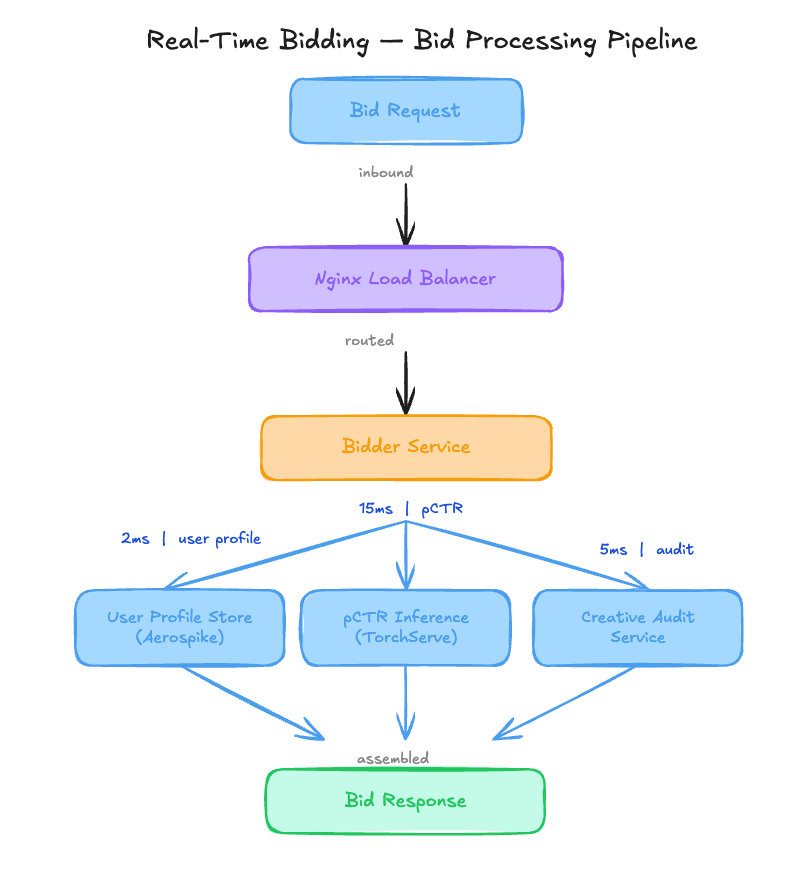

# 12M Dollars Lost to an AUC Metric That Ignored Probability Calibration [Edition #9]

*Learn how miscalibrated pCTR scores in a 260K RPS bidding engine destroyed advertiser ROI and how to fix it with Isotonic Regression.*

<figure><a class="image-link image2 is-viewable-img" target="_blank" href="../assets/719fd71de1e55405.jpg" data-component-name="Image2ToDOM">
<picture><source type="image/webp" srcset="../assets/719fd71de1e55405.jpg 424w, ../assets/719fd71de1e55405.jpg 848w, ../assets/719fd71de1e55405.jpg 1272w, ../assets/719fd71de1e55405.jpg 1456w" sizes="100vw"></picture>

<button tabindex="0" type="button" class="pencraft pc-reset pencraft icon-container restack-image buttonBase-GK1x3M"><svg aria-hidden="true" width="20" height="20" viewBox="0 0 20 20" fill="none" stroke-width="1.5" stroke="var(--color-fg-primary)" stroke-linecap="round" stroke-linejoin="round" xmlns="http://www.w3.org/2000/svg" class="icon-noB79L"><g><path d="M2.53001 7.81595C3.49179 4.73911 6.43281 2.5 9.91173 2.5C13.1684 2.5 15.9537 4.46214 17.0852 7.23684L17.6179 8.67647M17.6179 8.67647L18.5002 4.26471M17.6179 8.67647L13.6473 6.91176M17.4995 12.1841C16.5378 15.2609 13.5967 17.5 10.1178 17.5C6.86118 17.5 4.07589 15.5379 2.94432 12.7632L2.41165 11.3235M2.41165 11.3235L1.5293 15.7353M2.41165 11.3235L6.38224 13.0882"></path></g></svg></button><button tabindex="0" type="button" class="pencraft pc-reset pencraft icon-container view-image buttonBase-GK1x3M"><svg xmlns="http://www.w3.org/2000/svg" width="20" height="20" viewBox="0 0 24 24" fill="none" stroke="currentColor" stroke-width="2" stroke-linecap="round" stroke-linejoin="round" class="lucide lucide-maximize2 lucide-maximize-2 icon-noB79L"><polyline points="15 3 21 3 21 9"></polyline><polyline points="9 21 3 21 3 15"></polyline><line x1="21" x2="14" y1="3" y2="10"></line><line x1="3" x2="10" y1="21" y2="14"></line></svg></button>

</a></figure>

AdTechFlow is a growth-stage programmatic advertising company that recently crossed the $300M annual ad spend milestone. They have seen 40 percent year-over-year growth in managed spend, positioning themselves as a top-tier mid-market Demand Side Platform.

Their engineering team built a real-time bidding engine that processes hundreds of billions of monthly bid requests. Here is their setup.
<h1>Architecture Overview</h1>
<figure><a class="image-link image2 is-viewable-img" target="_blank" href="../assets/62b59a21827b781f.png" data-component-name="Image2ToDOM">
<picture><source type="image/webp" srcset="../assets/62b59a21827b781f.png 424w, ../assets/62b59a21827b781f.png 848w, ../assets/62b59a21827b781f.png 1272w, ../assets/62b59a21827b781f.png 1456w" sizes="100vw"></picture>

<button tabindex="0" type="button" class="pencraft pc-reset pencraft icon-container restack-image buttonBase-GK1x3M"><svg aria-hidden="true" width="20" height="20" viewBox="0 0 20 20" fill="none" stroke-width="1.5" stroke="var(--color-fg-primary)" stroke-linecap="round" stroke-linejoin="round" xmlns="http://www.w3.org/2000/svg" class="icon-noB79L"><g><path d="M2.53001 7.81595C3.49179 4.73911 6.43281 2.5 9.91173 2.5C13.1684 2.5 15.9537 4.46214 17.0852 7.23684L17.6179 8.67647M17.6179 8.67647L18.5002 4.26471M17.6179 8.67647L13.6473 6.91176M17.4995 12.1841C16.5378 15.2609 13.5967 17.5 10.1178 17.5C6.86118 17.5 4.07589 15.5379 2.94432 12.7632L2.41165 11.3235M2.41165 11.3235L1.5293 15.7353M2.41165 11.3235L6.38224 13.0882"></path></g></svg></button><button tabindex="0" type="button" class="pencraft pc-reset pencraft icon-container view-image buttonBase-GK1x3M"><svg xmlns="http://www.w3.org/2000/svg" width="20" height="20" viewBox="0 0 24 24" fill="none" stroke="currentColor" stroke-width="2" stroke-linecap="round" stroke-linejoin="round" class="lucide lucide-maximize2 lucide-maximize-2 icon-noB79L"><polyline points="15 3 21 3 21 9"></polyline><polyline points="9 21 3 21 3 15"></polyline><line x1="21" x2="14" y1="3" y2="10"></line><line x1="3" x2="10" y1="21" y2="14"></line></svg></button>

</a></figure>

When an ad exchange sends a bid request via OpenRTB, it hits the AdTechFlow global load balancer. From there, the request flows into the bidding cluster.
<h3>Traffic patterns:</h3>
Average: 180,000 req/sec

Peak: 260,000 req/sec

Total Monthly Impressions: 450 Billion

The ML Pipeline:

The pCTR model is a Deep Neural Network trained on historical impression and click logs using a 6-month sliding window. It uses categorical features for user geography, device, and domain, plus visual embeddings for the creative thumbnails. The training objective is binary cross-entropy, and the primary offline metric for model promotion is AUC. The pipeline re-trains every 7 days.
<h3>Current performance:</h3>
P99 Inference Latency: 22ms

Availability: 99.95 percent

CTR (Aggregate): 0.28 percent (up from 0.21 percent last quarter)

Costs:

Model Training (EC2 P4d instances): $85,000/month

Inference Fleet (C6i instances): $410,000/month

Total Infra: $1.2M/month

Recent incidents:

March 14: Model deployment failed due to feature drift in a new creative category, recovered in 2 hours.

April 02: 22 point drop in Advertiser Net Promoter Score (NPS) reported over a rolling 8-week window.

May 10: Churn of two enterprise-tier accounts representing $12M in annual recurring revenue.
<h1>The Analysis</h1>
Now let me show you what is actually happening here.
<h3>Critical Issue #1: AUC-Only Optimization</h3>
<em>I write about ML systems in production — the tradeoffs, the architecture decisions, the stuff that doesn’t make it into papers. If you want to go deeper, the paid tier covers the technical details I can’t fit in free posts.</em>

The architecture overview notes that AUC is the primary offline metric for model promotion. This is a classic trap. AUC measures the probability that a randomly chosen positive instance is ranked higher than a randomly chosen negative one.

It tells you nothing about the actual value of the predicted probability. Since the bidding logic uses the pCTR score directly to calculate the bid price in a second-price auction, any systematic overestimation leads to overbidding.

Their aggregate CTR went from 0.21 percent to 0.28 percent, but advertiser churn accelerated. The model is ranking clickbait effectively, but its predicted 10 percent CTR for a content farm ad might actually be a 2 percent CTR in reality. Without calibration curves, this inflation is invisible.
<h2>Critical Issue #2: Inventory Poisoning from ViralNet</h2>
In the training pipeline description, they mention a 6-month sliding window. Coincidentally, four months ago, they onboarded ViralNet, a massive aggregator that added 15B monthly impressions of low-quality thumbnail-heavy content.

Because the training data is not stratified by advertiser quality or inventory source, the DNN has spent the last 16 weeks over-weighting features associated with high-arousal thumbnails.

The model has effectively been hijacked by a specific subset of high-volume, low-intent traffic that now dominates the gradient updates.
<h3>Critical Issue #3: The Won-Impression Feedback Loop</h3>
The pipeline trains only on “historical impression logs.” In a programmatic auction, you only see the outcome of the auctions you win. By winning more content-farm auctions due to inflated pCTR, the model generates more training data for that specific style of creative. This is a self-reinforcing loop. The bidder is essentially training itself to become a clickbait delivery engine because it never sees the performance of the “quality” ads it is now consistently losing to because of its own miscalibrated bid logic.
<h3>Critical Issue #4: Feature Space Imbalance</h3>
The system uses visual embeddings for creative thumbnails but lacks any semantic representation of advertiser intent or brand safety tiers. By allowing raw pixel-level features to drive the pCTR without a corresponding “quality tier” feature, the model is free to find correlations between garish colors and clicks, ignoring the long-term cost of brand degradation.
<h3>Critical Issue #5: Massive Overspending on Inference</h3>
They are spending $410,000 a month on C6i instances for inference while running a 15ms TorchServe process. Based on the 180k RPS average, they are likely running thousands of cores at sub-optimal utilization because the DNN architecture is too dense for the signal it provides. They have a massive fleet just to support a model that is currently destroying their enterprise reputation.
<h1>WHAT I’D DO INSTEAD</h1>
<strong>1. Calibration-Aware Training and Evaluation</strong>

The system must stop using raw pCTR for bidding. I would implement Isotonic Regression as a post-processing step to calibrate the model output.

Impact:

Reduction in bid overestimation by 40 percent.

Advertiser ROI stabilization within 14 days.

Trade-offs:

Adds 1-2ms of latency to the bidding flow.

Requires maintaining a separate calibration mapping that must be updated as frequently as the model.

When this is the wrong call:

If you are running a first-price auction where the bid price is decoupled from the pCTR (e.g., fixed-price sponsorships), the precision of the probability matters less than the ranking.

<strong>2. Segmented Data Gating and Stratified Sampling</strong>

Instead of a 6-month window of raw logs, the training pipeline should use stratified sampling. We need to cap the influence of any single inventory source at 15 percent of the total training batch.

Current: 6-month raw log ingestion

New: Stratified sampling by Inventory Tier (Premium, Mid, Low-Quality)

Impact: Model AUC on Premium segments: 0.65 → 0.74

Trade-offs:

Increases Spark job complexity and potentially training time by 20 percent.

Requires a manual or semi-automated process for labeling inventory sources into tiers.

<strong>3. Earth Mover’s Distance Monitoring for Winner Distribution</strong>

Replace the simple CTR monitoring with a distribution-based metric. If the distribution of “won” creative categories shifts by more than 10 percent in a 24-hour period, the system should trigger an automated roll-back or an alert.

Replace: CTR aggregate monitoring ($0 cost)

With: Distribution drift monitoring using Earth Mover’s Distance (EMD)

Total: $2,500/month for additional logging and analysis.

Trade-offs:

Requires computing a baseline distribution which can be noisy during seasonal shifts like Black Friday.
<h1>The Impact</h1>
Before redesign:

Model is optimized for clicks regardless of value, leading to $12M in churn.

$1.2M monthly infrastructure cost.

After redesign:

Calibrated bidding ensures bid prices match expected value, stabilizing the enterprise accounts.

$950,000 new monthly cost (20 percent savings from model pruning and fleet optimization).

Time to implement: 5 weeks, 3 engineers (1 MLE, 1 Data Engineer, 1 Backend Engineer).
<h1>The Lesson</h1>
The system already told them what is wrong:

April 02 NPS drop → The model was winning the wrong auctions.

Aggregate CTR increase vs. Churn → The model was optimizing for “noise” clicks that do not convert to business value for quality advertisers.

They just need to listen to what the system is saying.

How do you balance the trade-off between short-term revenue spikes from high-CTR inventory and the long-term health of your advertiser ecosystem?
<h1>APPENDIX: Cost Estimation Methodology</h1>
How I estimated the savings for each decision:

Solution 1: Calibration-Aware Training

Baseline: $410,000 inference cost.

After change: No direct infra savings here; the cost is in the loss of short-term revenue from the high-clickbait volume. However, we prevent the $12M annual churn.

Estimated saving: $1M/month (recovered revenue).

Key assumption: Churn is directly tied to the bid inflation issue.

Confidence: High.

Solution 2: Segmented Data Gating

Baseline: $85,000/month training cost (P4d instances).

After change: By sampling rather than using raw 6-month logs, we can reduce the training dataset size by 40 percent.

Estimated saving: $34,000/month (reduction in EC2 training hours).

Key assumption: The sampled dataset provides equivalent or better signal than the full noisy dataset.

Confidence: Medium — training time does not always scale linearly with data volume if epochs are increased.

Solution 3: Fleet Optimization (Pruning)

Baseline: $410,000/month inference.

After change: Moving from a dense DNN to a pruned version or a DistilBERT-style architecture for text/embeddings reduces the compute requirement per request.

Estimated saving: $205,000/month (50 percent reduction in C6i fleet size).

Key assumption: 50 percent of the DNN parameters are redundant for the pCTR task at the current accuracy level.

Confidence: Medium — depends on the current model’s sparsity.

