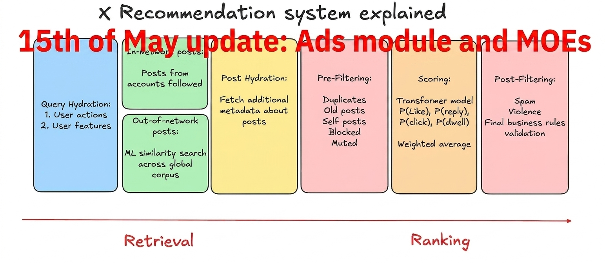

# xAI - Recommendation System deep dive [Part 2]

* what changed in the May 15 update*

<figure><a class="image-link image2 is-viewable-img" target="_blank" href="../assets/38f2e3f034c4309b.jpg" data-component-name="Image2ToDOM">
<picture><source type="image/webp" srcset="../assets/38f2e3f034c4309b.jpg 424w, ../assets/38f2e3f034c4309b.jpg 848w, ../assets/38f2e3f034c4309b.jpg 1272w, ../assets/38f2e3f034c4309b.jpg 1456w" sizes="100vw"></picture>

<button tabindex="0" type="button" class="pencraft pc-reset pencraft icon-container restack-image buttonBase-GK1x3M"><svg aria-hidden="true" width="20" height="20" viewBox="0 0 20 20" fill="none" stroke-width="1.5" stroke="var(--color-fg-primary)" stroke-linecap="round" stroke-linejoin="round" xmlns="http://www.w3.org/2000/svg" class="icon-noB79L"><g><path d="M2.53001 7.81595C3.49179 4.73911 6.43281 2.5 9.91173 2.5C13.1684 2.5 15.9537 4.46214 17.0852 7.23684L17.6179 8.67647M17.6179 8.67647L18.5002 4.26471M17.6179 8.67647L13.6473 6.91176M17.4995 12.1841C16.5378 15.2609 13.5967 17.5 10.1178 17.5C6.86118 17.5 4.07589 15.5379 2.94432 12.7632L2.41165 11.3235M2.41165 11.3235L1.5293 15.7353M2.41165 11.3235L6.38224 13.0882"></path></g></svg></button><button tabindex="0" type="button" class="pencraft pc-reset pencraft icon-container view-image buttonBase-GK1x3M"><svg xmlns="http://www.w3.org/2000/svg" width="20" height="20" viewBox="0 0 24 24" fill="none" stroke="currentColor" stroke-width="2" stroke-linecap="round" stroke-linejoin="round" class="lucide lucide-maximize2 lucide-maximize-2 icon-noB79L"><polyline points="15 3 21 3 21 9"></polyline><polyline points="9 21 3 21 3 15"></polyline><line x1="21" x2="14" y1="3" y2="10"></line><line x1="3" x2="10" y1="21" y2="14"></line></svg></button>

</a></figure>
<h2>Introduction</h2>
Four months ago I wrote a deep dive on xAI’s open-sourced recommendation system. That release was a readable codebase but not a runnable one.

No model weights, two separate scripts for retrieval and ranking that you had to glue together by hand, no content understanding service, no ads logic in the public code.

On May 15, 2026, xAI shipped a new commit. 187 files changed, +18,263 lines, -926 lines.

This is Machine Learning at Scale and the May update has enough new architecture in it to deserve a follow-up deep dive.

Read all the way for my take on it :)

First things first.

If you have not read the original deep dive, start there.

This post assumes you know what Thunder is, what the two-tower retrieval does, and why candidate isolation in the attention mask matters.

Now, with that out of the way, let’s get started!
<h2>TLDR</h2>
The May update transitions the codebase from “open source dump” to “runnable system.”

There is now a single entry point phoenix/run_pipeline.py that runs retrieval and ranking together, and a pre-trained mini model is shipped as well so you can run inference end to end on your own machine.

Three subsystems that were missing in January are now public: a content understanding service (Grox), an ads blending module, and additional Phoenix retrieval clusters (one labeled MoE, one for topic-driven retrieval).

The home mixer hydrates significantly more context per request: impression bloom filters, mutual follow Jaccard scores, served history, IP, inferred topics, starter pack membership.

A second scorer file vm_ranker now sits next to the production scorer ranker scorer. Reading both reveals something important: the engineer-tuned weighted sum I assumed was gone is still alive. It is right there in ranker_scorer with 22 weighted actions.

The new vm_reranker is a gRPC-based experimental reranker that adds DPP (<a href="https://arxiv.org/abs/1207.6083">Determinantal Point Process</a>) diversity on top.
<blockquote>
In the end of this post I will give my read on what is real, what is sanitized, and what xAI is still hiding. Keep reading for that!
</blockquote><h2>Unified pipeline</h2>
In the January release there were two scripts, run_retrieval.py and  run_ranker.py, and running them in cascade required manual coordination and undocumented config dependencies.

The new phoenix/run_pipeline.py replaces both with a single entry point.

The code confirms the architecture:
<ol><li>
Load retrieval model checkpoint, embedding table, and config.
</li><li>
Load ranker model checkpoint, embedding table, and config (separate from retrieval).
</li><li>
Load a pre-computed corpus of candidate representations and a user action sequence.
</li><li>
Hash the user history into embedding lookup indices (multiple hashes per ID).
</li><li>
Run the retrieval model to produce a user representation, then dot product against the corpus to get top-K candidates.
</li><li>
Batch the top-K through the ranker model, get per-action engagement probabilities.
</li><li>
Collapse to a single score with a weighted sum and rank.
</li></ol>
Two things worth noting from the code:
<ol><li>
The retrieval and the ranker are <strong>separate models</strong> with <strong>separate embedding tables</strong>. They share architecture (the same transformer backbone) but they are trained and exported independently. This explains why the run_pipeline script loads two model configs.
</li><li>
The mini-model retrieval in this script does <strong>brute-force</strong> dot product over the corpus (corpus_repr @ user_repr), not HNSW. Production almost certainly uses HNSW or similar for sub-linear ANN. The brute force version is the runnable-on-your-laptop version.
</li></ol>
The “no light ranker between retrieval and ranking” point I made in the previous deep dive holds. The pipeline goes retrieval → ranker → weighted sum, no intermediate cull.

Machine Learning At Scale is a reader-supported publication. To receive new posts and support my work, consider becoming a free or paid subscriber.

<form class="subscription-widget-subscribe"><input type="email" class="email-input" name="email" placeholder="Type your email…" tabindex="-1"><input type="submit" class="button primary" value="Subscribe">

</form>

<h2>Pre-trained mini model</h2>
The repo now ships a working artifact.

Specs of the mini model:
<ul><li>
256-dim embeddings
</li><li>
4 attention heads
</li><li>
2 transformer layers
</li><li>
~3 GB packaged size
</li></ul>
This is a toy. Production is almost certainly an order of magnitude larger on every axis. But the toy is enough to:
<ul><li>
Run inference end to end on a sample sports corpus they ship
</li><li>
Verify the candidate isolation attention mask works the way the README describes
</li><li>
See how hash-based embeddings are looked up at runtime
</li></ul>
That last point is worth pausing on, because the embedding mechanism is now clear from the code.

The system uses hash-based embedding lookup. From run_pipeline.py:
<pre><code><code>raw = (ids[i] * scales[j] + biases[j]) % modulus
out[i, j] = 0 if ids[i] == 0 else int((int(raw) % (num_buckets - 1)) + 1)</code></code></pre>
Linear congruential hash: multiply the ID by a per-hash-function scale, add a bias, take modulo a large prime, then map into the embedding table bucket range.

Each ID gets hashed multiple times (the config has separate user_hash_scales, item_hash_scales, author_hash_scales, each a list).

The result: a user ID becomes a small set of embedding indices, which are summed to form the user vector. Same for posts and authors.

The retrieval and ranker have separate embedding tables but the same hashing scheme.

<strong>Implication</strong>: there is no separate offline tower that produces a dense user embedding sitting in a KV store. The user representation is computed inside the model itself, from hashed inputs, on every request.

Hash trick + large embedding tables + multiple hashes to reduce collisions, much more scalable than precomputing dense vectors per user.
<h2>Grox: content understanding service</h2>
The new grox/ directory is a separate Python service. It runs in its own process (literally multiprocessing.Process) and talks to the rest of the system over data stores.
<h3>Engine architecture</h3>
Reading engine.py, the architecture is simpler than the file tree suggested:
<ol><li>
The engine runs in a dedicated subprocess.
</li><li>
Inside the subprocess, an asyncio loop polls a multiprocessing task queue.
</li><li>
For each task, it calls a single dispatcher class: PlanMaster.exec(task).
</li><li>
Results go back through a response queue.
</li></ol>
That’s it. No Kafka. No internal message bus. Just a process with a queue, an event loop, and a dispatcher.

Two auxiliary processors start up alongside the engine:
<ul><li>
MediaProcessor: handles image processing
</li><li>
ASRProcessor: automatic speech recognition for video audio
</li></ul>
They are transcribing the audio in videos so the content understanding pipeline can read what people are saying, not just look at frames.

This is the kind of capability that quietly raises the floor on what the platform can detect (misinformation in podcast clips, policy violations in voice content, etc.).

It is not mentioned in the README. It is just sitting in the code.
<h3>Strato as the data backbone</h3>
The data layer file (tweet_strato_loader.py) reveals what I had wrong before. I claimed Grox routed work through Kafka and Strato. It does not. Strato is its data store, not a message bus.

Specifically, Strato is used bidirectionally:

Input (Grox reads):
<ul><li>
StratoContentUnderstandingMetadataV2: post metadata for a tweet ID
</li><li>
StratoContentUnderstandingAuthorMetadata: author metadata
</li><li>
StratoContentUnderstandingPostQuoteMetadata: post + quote metadata
</li><li>
StratoUserRecentPosts: a user’s recent post history
</li><li>
StratoSafetyLabel: existing safety labels
</li></ul>
Output (Grox writes):
<ul><li>
StratoReplyRankingScore.put: reply ranking scores
</li><li>
StratoReplyRankingScoreV2Kafka.insert: reply ranking scores routed through a Kafka topic
</li><li>
StratoReplySpamAnnotation.put: spam annotations on replies
</li></ul>
So Strato is both Grox’s input (the content metadata it reads to classify) and its output (the labels it writes back for downstream consumers like AdsBrandSafetyHydrator to read).

Kafka shows up only as a routing layer for one specific output (ReplyRankingScoreKafka), not as the orchestration backbone.

This matters because it changes the mental model: Grox is not a streaming pipeline. It is a task-processing service with a Strato-shaped read/write contract.
<h3>Task structure</h3>
Tasks inherit from a base Task class and a TaskWithPost subclass for post-aware tasks. The pattern looks like this (from task_spam_detection.py):

python
<pre><code><code>class TaskSpamDetection(TaskWithPost):
    eapi_low_follower_classifier = SpamEapiLowFollowerClassifier()

    @classmethod
    async def _exec_with_post(cls, ctx: TaskContext, post: Post) -&gt; None:
        res = await cls.eapi_low_follower_classifier.classify(post)
        ctx.content_categories.extend(res)
        # ... metrics emission with follower-bucket tagging</code></code></pre>
Each task instantiates a classifier as a class-level attribute, defines _exec_with_post, and writes results into a shared TaskContext.content_categories list.

Simple, stateless, parallelizable.

One detail from TaskSpamDetection worth flagging: it explicitly targets replies, not top-level posts. It walks the reply chain (post.ancestors) and buckets by follower count of the reply target and root. Replies into accounts with under 1000 followers get extra logging. This is asymmetric protection: small accounts get more attention from the spam detector than large ones do.

A second task, TaskBangerScreen, classifies posts for “banger” potential and reveals how Grox interacts with Grok the LLM:
<pre><code><code>class TaskBangerScreen(TaskWithPost):
    classifier = BangerInitialScreenClassifier()
    _cached_topics = None
    _cache_timestamp = None
    ...
    res = await cls.classifier.classify(post, topics=cls._cached_topics)</code></code></pre>
Three things this tells us:
<ol><li>
“Banger” is a real classification category (ContentCategoryType.BANGER_INITIAL_SCREEN), not a filename joke. Posts get an explicit binary screen for whether they look like a banger.
</li><li>
The naming (”initial screen”) implies a two-stage pipeline: this is the cheap filter that runs on everything, presumably feeding a more expensive classifier downstream.
</li><li>
Banger detection is conditioned on topics fetched from Grok. The topics come from StratoGrokTopics(), cached at the class level with a TTL, refreshed periodically. So Grok the LLM generates a topic taxonomy, that taxonomy is stored in Strato, and Grox tasks consume it to condition their classification on what topics are currently relevant.
</li></ol>
This is the substrate I had not seen before: Grok produces topic structure → Strato persists it → Grox classifiers use it → safety labels and content categories propagate back to the home-mixer hydrators that feed the ranker.

Grok shows up not as a ranker (which is what most public discussion assumes) but as a content-understanding co-processor that feeds the classifier layer.

The task list visible in the file tree also includes PTOS category and policy classification, reply ranking, multimodal post embedding, and Grok-based user-post-action labeling.

Machine Learning At Scale is a reader-supported publication. To receive new posts and support my work, consider becoming a free or paid subscriber.

<form class="subscription-widget-subscribe"><input type="email" class="email-input" name="email" placeholder="Type your email…" tabindex="-1"><input type="submit" class="button primary" value="Subscribe">

</form>

<h3>Why this exists</h3>
The ranker has no idea what a post is “about.” It only sees engagement sequences and hashed embeddings. That works for relevance, but it does not work for safety.

You cannot rely on a transformer trained on Like prediction to also decide what counts as spam, what counts as a PTOS violation, or what gets a sensitive content label.

So Grox sits beside the ranker.

The ranker predicts engagement, trained on user actions.

Grox classifies content, trained on labels. The two share a substrate (Strato) but have independent lifecycles, model families, and release cycles.
<h2>Ads module</h2>
In January, ads were a black box. The code referenced a “for_you_server” but there was no ads logic in the public repo. May fixes this, and the ads code is the cleanest, most readable part of the whole release.

The new home-mixer/ads/ module has two blenders with genuinely different strategies:
<ol><li>
partition_organic_blender.rs: partitions the feed into safe and unsafe posts, places each ad between two safe posts as bookends, then distributes everything else as filler.
</li><li>
safe_gap_blender.rs: places ads only in positions where the natural feed order already has safe content on both sides, with controlled spacing between consecutive ads.
</li></ol>
Plus two new hydrators:
<ul><li>
ads_brand_safety_hydrator.rs: pulls safety labels per tweet and computes a brand safety verdict
</li><li>
ads_brand_safety_vf_hydrator.rs: same thing but for the visibility filter pipeline
</li></ul>
And a new candidate source: ads_source.rs.

The key design choice: ads are not ranked by the main transformer.

They come in through their own source with their own scoring (almost certainly an ads auction model that is not in the public code), and the blender decides where they land relative to organic candidates.

This is the same pattern Meta uses for Reels ads and Google uses for YouTube ads. Organic and paid are two separate ranking systems that meet at a blender. The blender’s job is to maximize a combined objective subject to constraints (min ad load, max ad load, brand safety, advertiser adjacency controls).
<h3>How brand safety verdicts are computed</h3>
AdsBrandSafetyHydrator is the upstream component that attaches a BrandSafetyVerdict (Low / Medium / High risk) to each organic post.

Mechanism:
<ol><li>
Collect all tweet IDs from the candidate set, including retweeted and quoted IDs.
</li><li>
Batch-fetch safety labels from SafetyLabelStoreClient (this store is fed upstream, almost certainly by Grox).
</li><li>
For retweets, use the underlying tweet’s labels via retweeted_tweet_id.
</li><li>
For quote tweets, take the WORST verdict between the quoting post and the quoted post.
</li></ol>
That last point is a sharp piece of design. A clean post quoting toxic content inherits the toxic verdict. You cannot launder a brand-unsafe post by wrapping it in a quote tweet.

There is also a defensive fallback: if the safety label lookup errors out for a quoted tweet, the verdict defaults to MediumRisk. Fail-closed on quotes.

Caching is done with Moka, with TTLs that depend on tweet age:
<pre><code><code>new_tweet_ttl: 60 seconds   (under 5 minutes old, labels still updating)
old_tweet_ttl: 1 hour       (older, labels stable)
cache size: 1,000,000 entries</code></code></pre>
This is the kind of cache tuning you only get from running the system in production. New tweets get short TTLs because their labels are still being computed by Grox. 

Old tweets get long TTLs because their labels do not change.
<h3>How safe_gap_blender uses those verdicts</h3><pre><code><code>let safe_gaps = find_safe_gaps(&amp;scored_posts);
let spacing = compute_spacing(&amp;ads);
let placements = assign_ads_to_gaps(&amp;safe_gaps, ads.len(), &amp;spacing, first_ideal);
interleave_and_finalize(scored_posts, ads, &amp;placements)</code></code></pre>
find_safe_gaps is 11 lines and is the actual brand safety rule:
<pre><code><code>fn find_safe_gaps(scored_posts: &amp;[ScoredPost]) -&gt; Vec&lt;usize&gt; {
    let n = scored_posts.len();
    let mut safe = Vec::new();
    for g in 1..n {
        if has_avoid(&amp;scored_posts[g - 1]) { continue; }
        if g &lt; n &amp;&amp; has_avoid(&amp;scored_posts[g]) { continue; }
        safe.push(g);
    }
    safe
}</code></code></pre>
A position is a safe gap only if neither the post immediately above nor the post immediately below is “avoid.” has_avoid returns true when the BrandSafetyVerdict is MediumRisk. That is the rule. No ad next to medium-risk content, in either direction.

compute_spacing is dynamic. It takes the first 4 ads, looks at their insert_position values, and uses the smallest gap as the requested spacing. The minimum is requested / 2 (rounded up). With fewer than 2 ads or a tiny inferred gap, it falls back to DEFAULT_SPACING { requested: 3, min: 2 }.

assign_ads_to_gaps walks the ad list and, for each ad, picks the safe gap closest to its ideal position subject to the min distance from the previous placement. The picker uses binary search via partition_point:
<pre><code><code>let min_offset = gaps.partition_point(|&amp;g| g &lt; min);
let candidates = &amp;gaps[min_offset..];
let ideal_pos = candidates.partition_point(|&amp;g| g &lt; ideal);</code></code></pre>
Two binary searches: first throw out gaps closer than min to the previous ad, then find the gap closest to ideal and tie-break on absolute distance. If no valid gap exists, return None and the blender stops placing ads early.
<h3>Brand suitability: advertiser-defined adjacency controls</h3>
There is a separate layer in <code>util.rs</code> that I missed in my first read. Advertisers can attach controls per ad:
<ul><li>
A list of blocked handles (should_drop_handle): drop the ad if the post above or below is by one of these authors.
</li><li>
A list of blocked keywords (should_drop_keyword): drop the ad if the post above or below contains any of these keywords (tokenized properly via a TweetTokenizer).
</li><li>
A brand safety risk tier (should_drop_bsr_low): if the ad is tagged as BsrLow or BsrIas, drop it when adjacent to a LowRisk post.
</li></ul>
That last one is counterintuitive at first read. Why drop a low-risk ad next to a low-risk post? It is not about safety, it is about category exclusion at the advertiser tier. BsrIas is the IAS (Integral Ad Science) brand safety certification level. Advertisers who pay for IAS verification want their ads only in very specific contexts, and the rule says: if your ad is BsrLow or BsrIas and the adjacent post is even rated LowRisk (the most lenient bucket), drop the ad rather than risk a placement that violates the advertiser’s contractual standard.

This is brand SUITABILITY (advertiser preferences) layered on top of brand SAFETY (platform-wide rules). Both are in the public code.
<h3>How partition_organic_blender is different</h3>
partition_organic_blender.rs takes a more aggressive approach. Instead of finding safe gaps in the natural order, it actively partitions the feed:
<ol><li>
Split scored posts into safe (LowRisk) and unsafe (MediumRisk) buckets.
</li><li>
Compute the max number of ads as min(ads.len(), n / spacing.requested, safe_count / 2). Each ad needs two safe posts to bookend it, so safe count divided by 2 is a hard ceiling.
</li><li>
Chunk the safe posts into actual_ads equal-sized groups. For each ad, take the first two posts of its group as the “above” and “below” bookends.
</li><li>
Run the brand suitability checks (BsrLow, handle blocklist, keyword blocklist) against those bookends. Skip the ad if any check fails. Emit counters per drop reason (bsr_drop, handle_drop, keyword_drop).
</li><li>
Build the feed as a sequence of [above, ad, below, ...filler] triples, with leftover safe posts and all unsafe posts sorted by score and distributed evenly as filler between triples.
</li><li>
Standard truncate-to-RESULT_SIZE, no-ending-on-ad.
</li></ol>
The difference matters. safe_gap_blender respects the natural feed order and only places ads where it can. partition_organic_blender rearranges the feed so every ad gets safe bookends, with unsafe content pushed into filler regions away from the ads.

Trade-offs:
<ul><li>
Partition gives guaranteed safe-adjacency for every placed ad. Safe gap relies on the natural order having enough safe gaps.
</li><li>
Partition is more invasive to the ranking. The score-sorted order is preserved within filler regions but the overall structure is dictated by ad placements.
</li><li>
Safe gap is less disruptive to organic ranking but places fewer ads when the feed is “dirty.”
</li></ul>
These two strategies are presumably A/B tested in production. The codebase shows both, which means xAI has not committed to one strategy globally.
<h3>Two operational details that scream production system</h3><ol><li>
interleave_and_finalize truncates the feed to RESULT_SIZE, and if the last item is an ad, pops it. No feed ever ends on an ad.
</li><li>
Two metrics are emitted per blend (AdsBlender.post_brand_safety_verdict and AdsBlender.ad_brand_safety_risk) so they can monitor the distribution of safety verdicts and ad risk tiers in production traffic.
</li></ol>
The blender itself is policy-free orchestration. The actual rules live in has_avoid, in the safety label store, and in the per-ad adjacency controls. That separation is the right one. You can change brand safety rules without touching the blender.
<h2>Phoenix retrieval clusters: MoE and topics</h2>
Alongside the original dense retrieval source, two new sources appeared: phoenix_moe_source.rs and phoenix_topics_source.rs.

When I first read the filenames I assumed these were three different retrieval architectures. Reading the code: they are not. They are three different parameterizations of the same retrieval client.

All three sources call the same PhoenixRetrievalClient. They differ in three things:
<ol><li>
Cluster ID. Each source reads a different config param for its target cluster: PhoenixRetrievalInferenceClusterId, PhoenixRetrievalMOEInferenceClusterId, PhoenixRetrievalTopicInferenceClusterId. These map to separate gRPC backend deployments.
</li><li>
Extra arguments. The topics source passes topic_entity_ids and a topic_filter_mode to the retrieval call. The MoE source passes empty topic IDs.
</li><li>
Enable conditions. The MoE source enables only when the user is not making a topic request and there are no cached posts. The topics source enables only when there IS an explicit topic request, OR when the user is new and has new-user topic IDs (cold start path). The regular Phoenix source covers the default case.
</li></ol>
So in production there are at least three Phoenix retrieval clusters running. The “MoE” cluster is presumably a Mixture of Experts model deployment, distinct from the regular dense retrieval, and the topics cluster is one tuned/trained for topic-conditioned retrieval. The home mixer just picks which cluster to call based on the query characteristics.

What the routing logic does tell us: there is at least one specialized cluster for topic-driven requests (when you click into a Topic or Community), and another (MoE) presumably tuned for diversity or specialization that the regular cluster does not provide. The exact model differences are not in the public repo.

Note also: candidates from each source are tagged with a different ServedType (ForYouPhoenixRetrieval vs ForYouPhoenixRetrievalMoe).

Downstream code can attribute outcomes to specific retrieval paths for offline analysis.
<h2>Hydrators: feature engineering in disguise</h2>
Hydrators attach context to each request and to each candidate before the model sees them. The May commit adds a long list of new hydrators. I have read two of them in detail; the others I can only name from the file tree.
<h3>Two hydrators worth understanding deeply</h3>
<strong>1. impression_bloom_filter_query_hydrator</strong>

This hydrator fetches a per-user impression history as a list of bloom filters. The pattern:
<ul><li>
Calls ImpressionBloomFilterClient.get(user_id, SurfaceArea::HOME_TIMELINE) via Thrift.
</li><li>
Receives a list of bloom filter entries, each with its own size_cap and false_positive_rate.
</li><li>
Converts each entry into a proto for downstream consumption.
</li></ul>
The bloom filter is how the system tracks “you have already seen this post” without storing every impression ID per user. Multiple filters per user likely correspond to different time windows (recent impressions in a tight filter, older impressions in a looser one). The size cap and false positive rate are tuned per entry, which is a tell that they have explicit memory budgets per user for impression dedup.

Note also: the surface area is hard-coded as HOME_TIMELINE. The bloom filter is surface-specific. Your impression history on the home feed is different from your impression history on the Following feed.

<strong>2. mutual_follow_jaccard_hydrator.rs</strong>

This is the most technically interesting hydrator in the new release. It estimates the Jaccard similarity between the viewer’s follow set and the candidate author’s follow set, but it does not compare the raw follow sets.

Instead, both sides have a pre-computed MinHash signature of length 256 (constant MIN_HASHES). The hydrator:
<ol><li>
Reads the viewer’s MinHash from query.viewer_minhash (attached upstream).
</li><li>
Batch-fetches the MinHash for every unique candidate author from Strato.
</li><li>
For each candidate, compares the two 256-element signatures element-wise:
</li></ol><pre><code><code>fn jaccard_from_minhash(a: &amp;[i64], b: &amp;[i64]) -&gt; f64 {
    let matching = a.iter().zip(b.iter()).filter(|(x, y)| x == y).count();
    matching as f64 / len as f64
}</code></code></pre>
The fraction of matching positions in the two MinHash arrays is an unbiased estimator of the Jaccard similarity of the original sets. MinHash-LSH is a 25-year-old technique from web search deduplication. Seeing it here, in production code, doing graph-overlap estimation for a recommendation system, is genuinely instructive.

Why this matters: storing every user’s full follow set as a sortable signature would cost gigabytes per active user. Storing a 256-element sketch costs 2 KB per user. The hydrator can batch-fetch sketches for hundreds of candidate authors per request and compute their graph overlap with the viewer in microseconds.

If you take one thing from this section: this is what production ML at scale actually looks like. Not bigger models, not more parameters. Sketches that turn intractable storage problems into tractable ones, with bounded error.
<h3>The longer hydrator list (named only)</h3>
Many more hydrators are added in this commit, including handlers for impressed posts, mutual follow signals, followed/inferred topics, starter pack membership, IP, demographics, served history, retrieval and scoring sequences, request timestamps, engagement counts, media metadata, video duration, quote-tweet expansion, follow-of-repliers signals, language codes, and tweet-type metrics.

The pattern, from the two I have read: each hydrator is a thin wrapper around an upstream data store (Thrift service, Strato, Kafka feed) that fetches a specific signal and attaches it to either the query or the candidate. They are small, single-purpose, and parallelizable.

The home mixer chains them together to assemble the full context the model needs.
<h3>Implication for the “no feature engineering” narrative</h3>
The hydrator pattern is what people mean when they call something “feature engineering in disguise.” The model does not compute these features. The model receives them as inputs after they have been fetched, sketched, bucketed, and proto-encoded by hand-written code. Someone chose to expose MinHash-derived Jaccard scores to the model. Someone tuned the bloom filter false positive rates. Someone wired up the impression surface mapping. None of that is automatic, and none of it is learned. It is editorial choice, executed in Rust.

The model learns the weights on those signals. The signals themselves are still picked by engineers.
<h2>The scoring stack: phoenix_scorer.rs, ranking_scorer.rs, vm_ranker.rs</h2>
Inside home-mixer/scorers/ there are three files:
<ul><li>
phoenix_scorer.rs: routes the ranking request to a specific Phoenix inference cluster and attaches per-action probabilities to each candidate.
</li><li>
ranking_scorer.rs: takes those per-action probabilities and collapses them into a single ranking score.
</li><li>
vm_ranker.rs: an alternative reranker behind a feature flag.
</li></ul>
This is where the most important reveal of the May release lives, and I want to spend time on it.
<h3>phoenix_scorer.rs: cluster routing is doing more work than you think</h3>
I assumed this scorer was a thin wrapper that just called the Phoenix prediction service. Reading the code, the routing logic alone deserves a section.

New-user cluster routing. If the user’s scoring sequence has fewer actions than PhoenixRankerNewUserHistoryThreshold, the request goes to a separate dedicated cluster (PhoenixRankerNewUserInferenceClusterId):
<pre><code><code>if action_count &lt; threshold {
    return PhoenixCluster::parse(&amp;query.params.get(PhoenixRankerNewUserInferenceClusterId));
}</code></code></pre>
There is a different Phoenix model serving predictions for users without enough history. Combined with the new-user OON reweighting I covered earlier, that is <strong>two distinct cold-start interventions</strong> in the same request:
<ol><li>
A separate inference cluster running a model presumably trained or tuned for sparse-history users.
</li><li>
A separate OON weight multiplier amplifying out-of-network candidates after scoring.
</li></ol>
Both kick in for accounts younger than a threshold with a minimum follow count. The feed your first week on the platform really is structurally different.

<strong>A/B experiment routing baked into the scorer.</strong> This was missing from the January release and is now visible:
<pre><code><code>match configured_cluster {
    PhoenixCluster::Experiment1Fou if decider.enabled("override_qf_use_lap7") =&gt; {
        return PhoenixCluster::Experiment1Lap7;
    }
    PhoenixCluster::Experiment1Lap7 if decider.enabled("override_qf_use_fou") =&gt; {
        return PhoenixCluster::Experiment1Fou;
    }
    _ =&gt; {}
}</code></code></pre>
There are explicit experimental cluster codenames (Experiment1Fou, Experiment1Lap7). A decider system can override the assigned cluster for specific traffic slices. This is the A/B testing infrastructure for model variants, and it lives in the scorer.

In the previous deep dive I flagged the absence of experimentation infrastructure in the public code as suspicious. It is no longer absent. They have multiple Phoenix model variants deployed simultaneously, with traffic-splitting controlled by named decider flags.

<strong>Egress sidecar with fallback.</strong> Production reliability detail I would not have guessed:
<pre><code><code>let mut predictions = client.predict(cluster, request.clone()).await;
if predictions.is_err() &amp;&amp; use_egress {
    predictions = self.phoenix_client.predict(cluster, request).await;
}</code></code></pre>
An “egress sidecar” client is the primary path when UseEgressSidecar is enabled. If it fails, fall back to the direct phoenix client. This pattern suggests inference traffic is routed through an egress proxy (likely for cross-region or cross-zone resilience), and the fallback exists because that path can fail independently of the model itself.

<strong>Surface awareness.</strong> The product surface is set explicitly in the request:
<pre><code><code>let product_surface = if query.in_network_only {
    ProductSurface::HomeTimelineRankedFollowing
} else {
    ProductSurface::HomeTimelineRanking
};</code></code></pre>
The Phoenix model sees which surface the request is for (Following feed vs main For You feed) and can behave differently per surface.
<h3>ranking_scorer.rs: the hand-tuned weighted sum is still alive</h3>
I expected this collapsing step to be a learned model. The 2023 Heavy Ranker famously used hand-tuned weights (”a reply is 13.5x a like, a report is -369x”) and the headline framing around Phoenix was that engineers no longer need to pick weights.

Reading ranking_scorer.rs: that framing is wrong. The hand-tuned weighted sum is still right there, with 22 weighted actions:
<pre><code><code>favorite * w_fav
+ reply * w_reply
+ retweet * w_retweet
+ photo_expand * w_photo_expand
+ click * w_click
+ profile_click * w_profile_click
+ vqv * vqv_weight
+ share * w_share
+ share_via_dm * w_share_via_dm
+ share_via_copy_link * w_share_via_copy_link
+ dwell * w_dwell
+ quote * w_quote
+ quoted_click * w_quoted_click
+ quoted_vqv * quoted_vqv_weight
+ dwell_time * w_cont_dwell_time
+ click_dwell_time * w_cont_click_dwell_time
+ follow_author * w_follow_author
+ not_interested * w_not_interested
+ block_author * w_block_author
+ mute_author * w_mute_author
+ report * w_report
+ not_dwelled * w_not_dwelled</code></code></pre>
Every weight is loaded from a config param: params.get(FavoriteWeight), params.get(ReplyWeight), and so on. These are feature switches that engineers tune externally.

Three other pieces of logic in this scorer that matter:

1. Offset normalization (offset_score). If the total weight sum is zero, the score is clamped to non-negative. If the combined score is negative, it gets rescaled by (combined + negative_sum) / total_sum * NEGATIVE_SCORES_OFFSET. Otherwise add NEGATIVE_SCORES_OFFSET to keep everything in a known range. This is how they prevent negative scores from breaking downstream consumers that assume positive ranges.

2. Author diversity penalty (apply_author_diversity). Sort candidates by weighted score, then for each subsequent post from the same author, multiply by:
<pre><code><code>(1.0 - floor) * decay_factor^position + floor</code></code></pre>
The second post from an author gets decay^1, the third decay^2, etc. With decay_factor = 0.5 and floor = 0.3, the second post is at 65% of its original score, the third at 47.5%, and so on, asymptoting at the floor. This is the “do not show me five tweets from the same person in a row” rule, and it is hard-coded as a multiplicative penalty in the scorer.

3. Out-of-network reweighting (effective_oon_weight). Out-of-network candidates get multiplied by an OON weight factor before final ranking. Three paths:
<ul><li>
Topic requests: use TopicOonWeightFactor
</li><li>
Eligible new users (account age below threshold AND following at least NEW_USER_MIN_FOLLOWING people): use NEW_USER_OON_WEIGHT_FACTOR
</li><li>
Everyone else: use the regular OonWeightFactor
</li></ul>
New users get more OON weight because their follow graph is too thin to fill a feed. This is an explicit, code-level cold start handling. The feed actually behaves differently for accounts created recently. That has been an open question for years and is now confirmed in the open code.
<h3>vm_ranker.rs: an experimental gRPC reranker with DPP</h3>
VM stands for Value Model. The naming is right. But what it actually does was not what I expected.

VMRanker is not an in-process scorer. It is a gRPC client that calls a separate VMRankerClient service. The home-mixer side just builds a RankRequest proto with all the candidate features (including all 22 per-action scores from Phoenix), sends it to the VM service, and uses the returned per-candidate score.

What makes it interesting: the RankRequest carries DppParams { theta, max_selected_rank }. DPP = Determinantal Point Process. This is a diversity-aware reranking method that mathematically promotes candidates that are different from already-selected ones, with theta controlling the strength of the diversity term and max_selected_rank capping how deep the diversity reranking applies.

So VMRanker is two things at once:
<ol><li>
An external service that can recompute a single score from the Phoenix action probabilities, with whatever model logic xAI runs server-side (genuinely a learned value model).
</li><li>
A DPP-based diversity reranker that fights the “all similar content” failure mode that pure pointwise ranking suffers from.
</li></ol>
The two pieces of evidence that this is experimental and not the default:
<ul><li>
It is gated behind EnableVMRanker. Default-off for most traffic.
</li><li>
It has its own cluster ID (VMRankerClusterId) and its own value model ID (VMRankerValueModelId), suggesting they can deploy multiple value models in parallel for A/B testing.
</li></ul>
So the production stack today is: Phoenix transformer produces 22 action probabilities. RankingScorer collapses them with hand-tuned weights, applies author diversity and OON reweighting. Final score.

In an experimental treatment: same Phoenix probabilities, but sent to VMRanker instead, which returns a learned scalar with DPP-based diversity reranking baked in.

The implication: the “fully learned ranking” future I assumed was already shipped is actually still being A/B tested. The default in May 2026 is still hand-tuned weights with hard-coded diversity penalties. That is a more honest picture of where production is.
<h2>Personal deep dive</h2>
<em>I write about ML systems in production — the tradeoffs, the architecture decisions, the stuff that doesn’t make it into papers. If you want to go deeper, the paid tier covers the technical details I can’t fit in free posts.</em>

<h3>1. The “no feature engineering” claim was always misleading. Now we know how misleading.</h3>
The framing around Phoenix is that engineers no longer need to pick weights or design features. The transformer learns everything.

Reading the May code: the transformer learns the per-action probabilities. Engineers still pick the weight on each action. RankingScorer has 22 weighted actions, all loaded from config params, all tunable externally without retraining the model. Plus author diversity decay, plus OON reweighting, plus new-user cold start handling. All hard-coded, all tunable, none of it learned.

So the right framing is: the <strong>scoring head</strong> is a learned multi-task transformer. The <strong>ranking policy</strong> is still hand-tuned config. Production has two layers of decision-making, and the human-tunable one is doing more work than the marketing implies.

This is not bad design. Hand-tuned weights at the top of the stack means engineers can shift platform behavior in minutes by changing a config, without retraining a billion-parameter model.

What anyone telling you “Phoenix is fully end-to-end learned” is wrong about: the action vector exists, the weights on the action vector exist, the diversity decay exists, the OON multipliers exist. All knobs are in the code, all are config-driven, all are external to the model.
<h3>2. There are TWO cold start interventions in the open code</h3>
The most surprising thing about reading this codebase carefully is that new-user handling is everywhere.

<strong>Intervention 1</strong>: In phoenix_scorer.rs, if the user’s history is shorter than a threshold, the ranker request is routed to a separate dedicated Phoenix cluster (PhoenixRankerNewUserInferenceClusterId). Different model, presumably trained or tuned for sparse-history users.

<strong>Intervention 2</strong>: In ranking_scorer.rs‘s effective_oon_weight, eligible new users get a different out-of-network multiplier (NEW_USER_OON_WEIGHT_FACTOR). More OON content gets amplified relative to in-network candidates when your follow graph is too thin to fill a feed.

So a new user with a thin follow graph gets:
<ol><li>
A different model serving their predictions (in PhoenixScorer)
</li><li>
A different OON weight applied to the predictions (in RankingScorer)
</li></ol>
The feed you see in your first week on the platform is structurally different from the feed you see in month three, in two ways, at two different layers of the stack. Bonus: there is also a topic-specific OON multiplier (TopicOonWeightFactor) for when you are inside a Topic or Community surface, so feed behavior also varies by surface.
<h3>3. Grox is the most underrated part of the release</h3>
Everyone is going to write about the transformer ranker again. Almost no one will write about Grox.

Grox is where content policy lives. Spam detection, reply protection, PTOS enforcement, multimodal embedding, video audio transcription. The fact that they shipped a separate subprocess service with its own asyncio engine, classifier instances, and a Strato-backed read/write contract tells you content classification is treated as a first-class production system, not a side project.

Two specific things worth absorbing:
<ul><li>
The asymmetric reply protection in TaskSpamDetection: replies into accounts with under 1000 followers get extra logging attention. Small accounts get protected more aggressively from reply spam than large accounts do. This is a deliberate platform policy choice, sitting in 10 lines of code.
</li><li>
The ASR processor running alongside the main engine: they transcribe video audio. This is the kind of capability that quietly raises what the platform can detect, and it does not appear in any of xAI’s public communication about the recommender. You only find it by reading the engine init code.
</li></ul><h3>4. MinHash and bloom filters: production ML is about sketches</h3>
The mutual_follow_jaccard_hydrator and the impression_bloom_filter_query_hydrator are the two pieces of code I would recommend any aspiring rec systems engineer read.

Both solve the same kind of problem: you have a per-user signal whose true representation is too large to fetch on every request (the full follow set, the full impression history), and you need a sub-millisecond approximation that fits in a small fixed budget.

The answers, lifted directly out of the May 2026 production code:
<ul><li>
For follow-graph overlap: 256-element MinHash sketches, compared element-wise. Jaccard from matching positions divided by length. Bounded error, fixed memory per user, batch-friendly.
</li><li>
For impression history: per-user bloom filter entries with explicit size_cap and false_positive_rate per entry. Multiple filters per user, likely time-windowed.
</li></ul>
This is what production ML at scale actually looks like. Not bigger models. Not more parameters. Sketches and probabilistic data structures that turn intractable problems into bounded-error tractable ones.

If you are a junior MLE reading code to learn, prioritize these two files over the transformer. The transformer is impressive but it is also opinionated and unique to this stack. The sketches are universally reusable, and the engineering principles they embody transfer to every recommender system on earth.
<h3>5. The ads code is the most legible part of the release</h3>
I genuinely did not expect xAI to ship the ads logic publicly.

xAI shipping the blender code is either a confidence flex (”our model is the moat, the blender is just plumbing”) or a regulatory hedge.

But more importantly: this is the most readable code in the entire repo. find_safe_gaps is 11 lines and is the actual production brand safety rule. The brand suitability layer (handle blocklists, keyword blocklists, IAS-certified ad tier) is in one file. The TTL strategy on the brand safety cache shows real production tuning (1 minute for new tweets, 1 hour for old). And the two blenders represent two genuinely different strategies (gap-finding vs partition-and-bookend) that are presumably A/B tested.

If you are interviewing for ads ranking at any company, this code is now the best free reference for how organic/paid mixing is actually done at scale. The brand safety verdict propagation through quote tweets is also a production-quality example.

Two operational details worth internalizing: feeds never end on an ad, and per-blend metrics are emitted for monitoring verdict and risk distributions in production. Both are the kind of thing you only know to do after running the system at scale.
<h3>6. DPP is the actual technical surprise in the scoring stack</h3>
VMRanker brings Determinantal Point Process diversity reranking into the open code. DPP is not a new technique academically, but seeing it actually wired into a production rec system, gated behind a feature flag, with configurable theta, is meaningful.

It also tells you something about what hand-tuned diversity (the author decay in <code>RankingScorer</code>) is not enough for. They are clearly experimenting with a learned diversity term that can prevent topical clustering, not just author clustering. The author penalty stops you from seeing five tweets from the same person. DPP stops you from seeing five similar tweets from five different people.

If VMRanker becomes the default path, the practical effect on creators will be: harder to dominate a feed by being similar to other top performers. That is a meaningfully different ranking world than “engagement-rate-wins.”
<h3>7. They are still hiding the policy layer</h3>
The model architecture, the scorer, the hydrators, the blenders, the ads code: all open.

What is NOT open: the actual values of all those weight parameters (FavoriteWeight, ReplyWeight, BlockAuthorWeight, etc.), the NEW_USER_OON_WEIGHT_FACTOR constant, the training data, the training objective, the value model that VMRanker calls, the boost/penalty rules for blue check verification, all-caps detection, sensitive content reach suppression. X’s public documentation lists those last ones, but they are not in this repo.

The architecture is open. The numerical values that decide what gets distributed are closed. That is the actual interesting thing about open-sourcing a recommender system. You can show the machinery without revealing the policy.

A specific example: the entire 22-action weighted sum is right there in code. But if ReportWeight is -369 in production, you cannot know that.

You would have to be inside xAI to see the config.
<h2>Caveats</h2><ul><li>
The mini model shipped is explicitly described as not the production model. The production model is almost certainly much larger. I have not seen production size numbers from xAI.
</li><li>
I have read two hydrators in detail (bloom filter and MinHash Jaccard). The other hydrators in the file tree follow the same general pattern (thin wrapper around an upstream data store) but I have not verified each one individually.
</li><li>
VMRanker being a value model with DPP is what the code clearly shows. What the value model on the server side actually does is not in the public code. It could be anything from a small MLP to a much larger model.
</li><li>
The “multiple Phoenix retrieval clusters” claim is grounded in different cluster ID config params. The phoenix_scorer.rs also reveals additional named experimental clusters (Experiment1Fou, Experiment1Lap7). There may be more clusters in production not surfaced in this code.
</li></ul>
— Ludo

