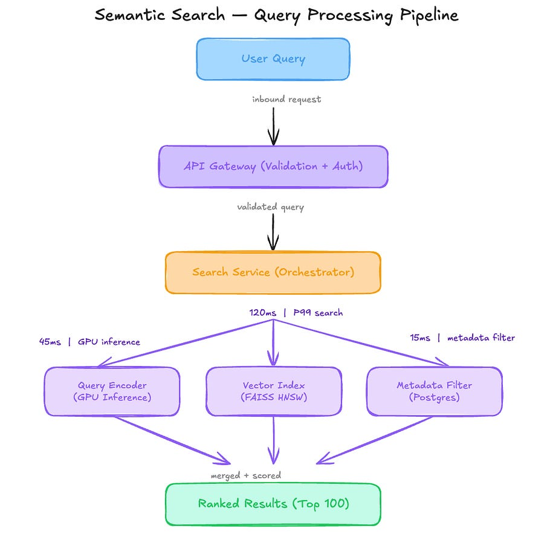

# A 0.44 Recall Collapse That Looked Like 0.81 Global Success [Edition #10]

*Discover how in-batch negatives created an anisotropic echo for 2 million documents and the monitoring blind spot you must avoid.*

> Paid post — only the publicly visible preview is included.

*Discover how in-batch negatives created an anisotropic echo for 2 million documents and the monitoring blind spot you must avoid.*

LexiSearch is a Series A legal-tech and B2B SaaS search company that recently crossed the milestone of 50,000 enterprise seats. They have seen 300 percent year-over-year growth in document ingestion, primarily serving law firms and corporate compliance departments.

Their engineering team built a semantic retrieval engine that powers the primary search bar for internal document management systems. Here is their setup.

# Architecture Overview

When a user enters a query, the system triggers a retrieval-augmented flow to find relevant clauses or documents.

### Traffic patterns:

Total documents indexed: 25 million

Queries per second: 120 req/sec average

Peak: 350 req/sec during morning hours (EST)

The ML Pipeline:

The model is a dual-tower bi-encoder based on an MPNET backbone. It was trained using a standard contrastive loss with in-batch negatives. The training data consists of 1 million query-document pairs, including a mix of MS MARCO and 50,000 domain-specific legal pairs. The embedding dimension is 768. The vector store uses FAISS with an HNSW index (M=32, efConstruction=200) hosted on r6g.4xlarge instances.

### Current performance:

P99 Latency: 185ms

Reliability: 99.95 percent uptime

Recall@10 (Global): 0.81

Costs:

Inference Nodes (G4dn.2xlarge): $6,500 per month

Vector Database (Memory-optimized nodes): $9,000 per month

Total: $15,500 per month

Recent incidents:

Recall collapse for Global Capital Partners: After onboarding 2 million financial filings for a new high-value client, the Recall@10 for that specific account dropped from 0.81 to 0.44. The system stayed up, but users reported that search was basically broken for their documents.

# The Analysis

Now let me show you what is actually happening here.

### Critical Issue #1: The Anisotropic Echo

 _I write about ML systems in production — the tradeoffs, the architecture decisions, the stuff that doesn’t make it into papers. If you want to go deeper, the paid tier covers the technical details I can’t fit in free posts._
