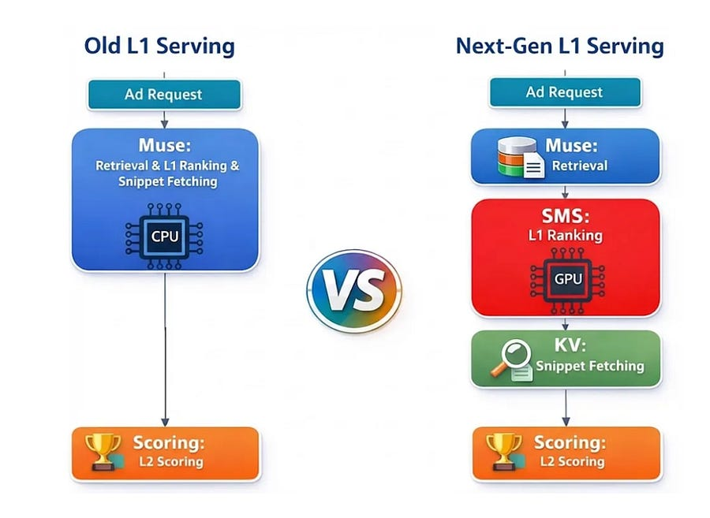

# Embedding Features in Weights to Kill Retrieval Latency

*Industry lesson from pinterest*

*Industry lesson from pinterest*

# TL;DR

\- **The Industry Standard** : Two-Tower models are efficient for retrieval but limit expressiveness because they prevent early feature crossing (user/item interactions).

\- **The Shift** : Pinterest moved to a general-purpose, GPU-based neural network for the retrieval stage to capture deep interaction signals.

\- **The Optimization** : To solve massive latency issues (4000ms -> 20ms), they embedded high-value candidate features directly into the model file as registered buffers, effectively storing data in VRAM to eliminate network I/O.

\- **Logic Shift** : They moved business logic (filtering, top-k selection) into the PyTorch graph, forcing the GPU to output only the final candidates rather than raw scores for thousands of items.

# Introduction

In recommendation systems, the “Two-Tower” architecture is the default standard for the retrieval stage. It allows for lightning-fast inference by encoding users and items separately and reducing ranking to a dot product or Approximate Nearest Neighbor (ANN) search.

While efficient, this decoupling prevents the model from “seeing” user and item features simultaneously until the very last layer.

You lose the ability to model complex interactions (like specific user affinity for a specific advertiser’s visual style) early in the network.

Pinterest recently published details on how they broke this constraint. They replaced the standard Two-Tower approach with a heavier, general-purpose neural network at the retrieval stage. 

The engineering challenge wasn’t training the model; it was serving it.

Running a heavy interaction model over 100,000 candidates per request typically destroys latency. Their solution involved a radical “model-infra co-design” that blurs the line between a neural network and a database.

* * *

[Effective Software Engineering with Claude Code - From Prompts to Systems - Discount Code ML50](https://www.eventbrite.co.uk/e/effective-software-engineering-with-claude-code-from-prompts-to-systems-tickets-1988571262176?aff=mlatscale)

* * *

# The Architecture: Treating Features as Weights

The primary bottleneck in serving large retrieval models isn’t usually matrix multiplication; it’s data movement. Fetching features for 100,000 candidates, serializing them, and transferring them to the GPU takes longer than the actual inference. Pinterest’s engineering team attacked this by eliminating the fetch step entirely for their most valuable inventory.

For the “head” of their inventory (high-value candidates), they bundled item features directly into the PyTorch model file as registered buffers. In this setup, features are treated exactly like model weights. They reside in the GPU’s High-Bandwidth Memory (HBM). When a request comes in, the system doesn’t fetch item features from a remote Key-Value store; the features are already “hot” on the device.

To further reduce data transfer overhead, they pushed non-ML business logic into the neural network. In a traditional setup, the GPU scores 100,000 items and returns all 100,000 scores to the CPU, where the application layer applies diversity filters and sorts the results. Pinterest moved this logic (utility calculations, filtering, and top-k sorting) inside the PyTorch graph.

The GPU now acts as both scorer and filter, returning only the final ~1,000 winners. This reduces Device-to-Host (D2H) data transfer by two orders of magnitude.

On the compute side, they optimized the execution path using multi-stream CUDA to overlap memory transfers with compute kernels, and utilized Triton to fuse operations like Linear layers and Activations.

This lowered the memory bandwidth pressure, which is often the silent killer in large-batch inference.

# Implications for Production ML

This architecture highlights a growing trend in high-scale ML: the model is becoming the application server.

First, let’s look at the trade-off of the “features as weights” approach.

By baking features into the model binary, you eliminate network latency, but you introduce a data freshness problem. You can no longer update a feature in the KV store and expect the model to pick it up immediately.

The model file itself must be updated and redeployed to refresh the data.

This works for stable features or “head” inventory where the set is relatively static, but it effectively hard-codes the state of the world into the neural network. It turns the deployment pipeline into a data pipeline.

Second, the shift from CPU-based sharded retrieval to GPU-based batch processing fundamentally changes the ranking distribution. In a CPU-based system, you typically query multiple leaf nodes (shards), grab the top-k from each, and merge them (Local Ranking).

The authors noted this caused unexpected metric shifts because the distribution of “top” documents changed. A global top-k is theoretically better, but if your downstream business logic (bidding, diversity) was tuned for a sharded distribution, a “better” ranking system can actually break business metrics initially.

Finally, this approach redefines the retrieval stage. By accepting the cost of a GPU inference layer, you can bypass the expressiveness ceiling of vector search.

The industry has spent years optimizing ANNs; Pinterest’s work suggests that for high-value use cases, the future might be brute-forcing smart models on hardware that is finally fast enough to handle them, provided you can optimize the data flow to keep that hardware fed.

# Reference

  1. [Beyond Two Towers: Re-architecting the Serving Stack for Next-Gen Ads Lightweight Ranking Models](https://medium.com/pinterest-engineering/beyond-two-towers-re-architecting-the-serving-stack-for-next-gen-ads-lightweight-ranking-models-1992f2b76cbb)
