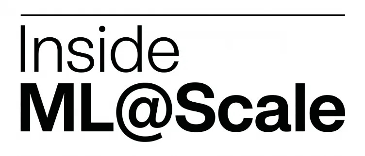
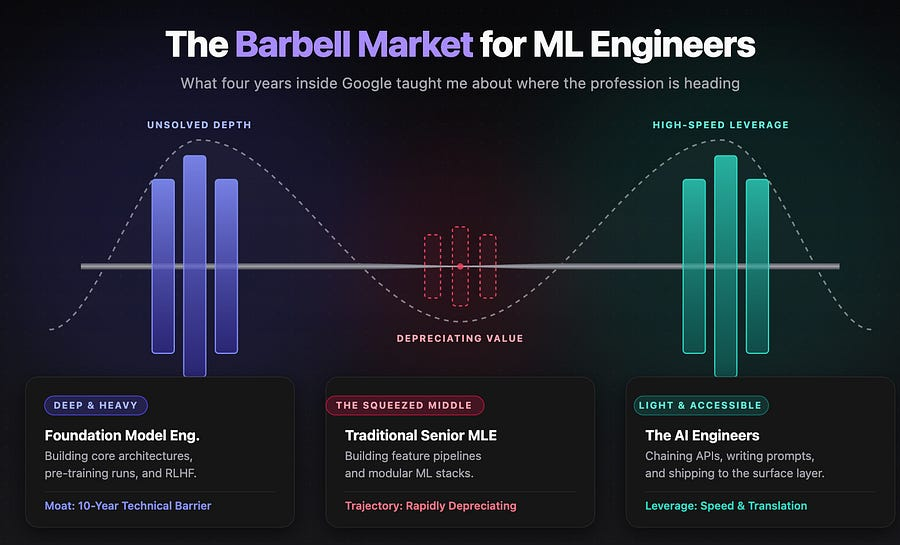
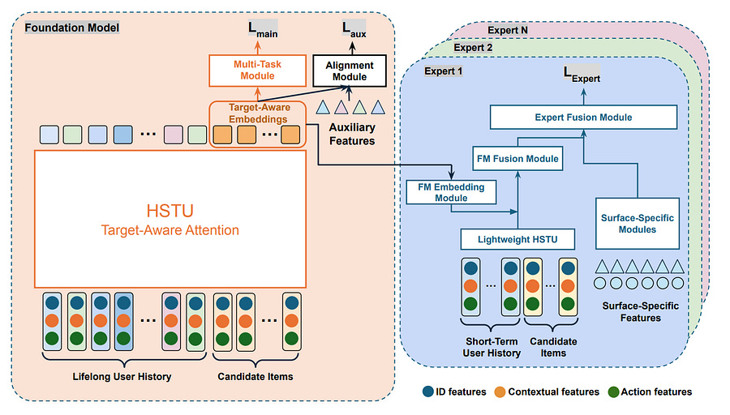

# Inside ML@Scale #2

*all the numbers behind ML@Scale (yeah, all!)*

> Paid post — only the publicly visible preview is included.

*all the numbers behind ML@Scale (yeah, all!)*

Every 25th of the month, I publish **Inside ML@Scale** — a full, honest look at the business behind this newsletter.

The good, the bad.

What’s growing, what’s stagnating, what I’m trying that isn’t working (or sometimes is?)

**Why?**

Three reasons.

**1\. Because nobody else does it.**

The ML newsletter space is full of people performing success. “Just crossed 50k subscribers 🚀” with zero context on how, for how long, at what cost, with what retention.

I’ve been building ML@Scale since 2023: from 0 to 13k+ free subscribers, 45k on LinkedIn, and some of them paid.

That didn’t happen linearly. It happened with a lot of stupid decisions in between. Those are worth writing about.

**2\. Because transparency compounds.**

The same way our 25th-of-the-month ritual makes us better at money, writing this publicly will make me better at running this business. You can’t hide from numbers you’ve committed to publishing.

**3\. Because you deserve to know what you’re paying for.**

If you’re a premium subscriber, you’re not just getting “The Blind ML Review” or “The Zürich Feed”. You’re buying into a thing that either works or doesn’t. I owe you visibility into which one it is.

### **What’s in the free section (this part)**

Every edition will have:

  * Top-line numbers

  * The _one thing_ that worked that month

  * The _one thing_ that didn’t work

  * What I’m trying next

### **Top-line: where we are in May 2026**

  * **13,000+** free subscribers

  * **45,000+** LinkedIn followers

  * **~25%** open rate (still constant, need to work on this!)

  * **6x/week** LinkedIn cadence, **3x/week** newsletter cadence

### **What worked this month**

Lots of articles, both technical and non technical reonated!

[The Barbell Market for ML EngineersLudovico Bessi·May 20[Read full story](2026-05-20-the-barbell-market-for-ml-engineers.md)](2026-05-20-the-barbell-market-for-ml-engineers.md)

[A Blueprint for Scaling Recommender SystemsLudovico Bessi·May 17[Read full story](2026-05-17-a-blueprint-for-scaling-recommender.md)](2026-05-17-a-blueprint-for-scaling-recommender.md)

[![THE ZÜRICH FEED \[Edition #3\] ](../assets/76c80b1c11dc4431.jpg)THE ZÜRICH FEED [Edition #3] May 13[Read full story](2026-05-13-the-zurich-feed-edition-3.md)](2026-05-13-the-zurich-feed-edition-3.md)

Sub split:

  * Barbell market: 46 free subs, 1 paid sub

  * Blueprint scaling: 21 free subs

  * Zurich feed: 43 free subs, 2 paid subs

### **What didn’t work**

This followup on xAI RecSys is imho very high quality, but did not do as well as the first part. I expected more, I only got 22 free subs out of it.

[![xAI - Recommendation System deep dive \[Part 2\]](../assets/38f2e3f034c4309b.jpg)xAI - Recommendation System deep dive [Part 2]Ludovico Bessi·May 17[Read full story](2026-05-17-xai-recommendation-system-deep-dive-202.md)](2026-05-17-xai-recommendation-system-deep-dive-202.md)

### **What I’m trying next**

Focusing on a big month of X for august. Need to find time!

Also, I have unlocked drip campaigns on the newsletter platform, and I have setup them for:

  1. New free subs

  2. New paid subs

  3. People that went from paid to free

Let’s see how they perform in the next month :)

### **What’s behind the paywall**

Everything else. The detail. The numbers underneath the numbers.

  * Full revenue breakdown by product (Blind ML Review, Zürich Feed, one-off paid posts)

  * Conversion funnel math: where free subs come from, what % convert, at what rate, per channel

  * Per-post revenue: which Lane 1 (technical) and Lane 2 (career strategy) posts drove money, which flopped, and why

  * Churn: who’s leaving premium and when

  * Eventually (when I get the courage) my personal financial situation alongside the biz. Same energy as the 25th-of-the-month ritual at home. Full picture or no picture.
