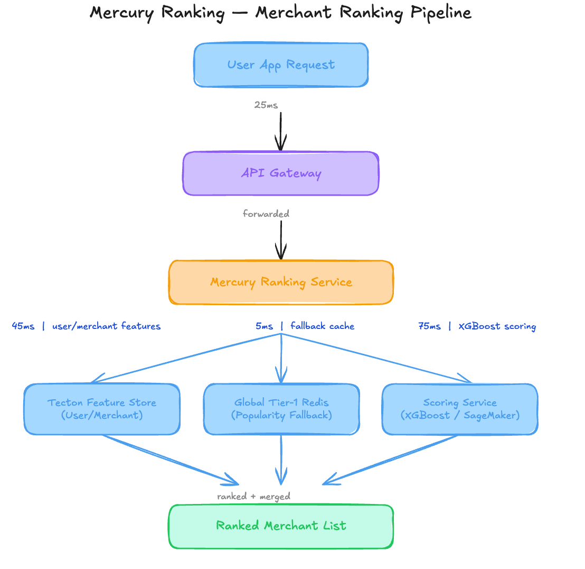

# Why Your $130K ML Pipeline Is Starving 65 Percent of New Merchants [Edition #11]

*A blind spot in the ranking logic caused a feedback loop that destroyed supply-side stability in three expansion markets with only 14% retention. Discover how to implement regional multi-armed bandits*

QuickBite is a Series D food delivery company that recently hit a milestone of 100 million total orders. They have established a dominant presence in five major metropolitan areas and recently attempted a simultaneous launch in three new expansion markets to satisfy growth targets for their upcoming IPO filing.

Their engineering team built a ranking engine called Mercury that powers the home screen restaurant feed. Mercury is responsible for balancing user relevance with merchant visibility. Here is their setup:

# Architecture Overview

When a user opens the app, the home screen request triggers a ranking flow that attempts to personalize the list of 200+ available merchants based on historical preferences.

### Traffic patterns:

Average: 8,000 requests per second

Peak: 14,500 requests per second

The ML Pipeline:

The system uses a point-wise XGBoost ranker trained on the last 180 days of order data. The model uses 150 features, primarily focused on user-merchant interaction counts, user cuisine affinity, and merchant-level conversion rates. For users with no history, the ranking service is hard-coded to bypass the Scoring Service and fetch a pre-computed list from the Global Tier-1 Redis cache.

### Current performance:

P99 Latency: 165ms

System Uptime: 99.98%

Expansion Market Retention: 14% (versus 42% in mature markets)

Costs:

SageMaker Inference: $92,000 per month

Feature Store Managed Service: $38,000 per month

Total: $130,000 per month

Recent incidents:

Incident 1: Merchant Churn Spike. In the first 30 days of market expansion, 65% of new merchants received fewer than 5 orders total, leading to a 3x higher churn rate compared to legacy markets.

Incident 2: Feedback Loop Saturation. The top 5 ranked restaurants in Austin, Texas, reached 100% capacity within 15 minutes of the dinner rush, while 90% of local merchants had zero active orders.

### The Analysis

Now let me show you what is actually happening here.

### Critical Issue 1: The Global Feedback Loop Trap

 _I write about ML systems in production — the tradeoffs, the architecture decisions, the stuff that doesn’t make it into papers. If you want to go deeper, the paid tier covers the technical details I can’t fit in free posts._

The architecture overview shows a Global Tier-1 Redis fallback. Because the expansion markets are new, 80% of users have fewer than 3 orders. This means 80% of your new market traffic is hitting a fallback list generated from global data.

The system is showing NYC and Chicago favorites to users in Austin and Nashville. Not only is the food irrelevant, but it directs all new traffic to national brands that already have high scores, starving the local merchants who actually provide the delivery density needed for the unit economics to work.

### Critical Issue 2: Cold Start Feature Blindness

The ML pipeline description notes that the model is trained on 180 days of historical data from mature markets. When the Mercury service calls Dependency 1 (Tecton), it retrieves empty feature vectors for 80% of expansion users. The XGBoost model has no learned representation for “New User in New Market.” Instead of a dedicated cold-start strategy, the system just defaults to the global popularity list, creating a hard binary between “Perfect Information” and “No Information.”

### Critical Issue 3: Marketplace Imbalance in the Objective Function

The Scoring Service optimizes for a single metric: Order Conversion. In a two-sided marketplace, optimizing only for the consumer’s probability of purchase is a death sentence for supply. By ignoring merchant-side health (like order distribution or kitchen capacity), the system creates a winner-take-all dynamic. The architecture has no feedback loop from the merchant tablets back into the ranking service, meaning the system keeps sending orders to a kitchen that is already 40 minutes behind.

### Critical Issue 4: Massive Compute Waste for Fallbacks

They are paying $92,000 a month for SageMaker inference, yet for 80% of the users in their most critical growth areas, they are skipping the model entirely and hitting a $5,000 Redis cache. They are essentially over-provisioning their inference fleet by 400% relative to the actual value it provides in expansion markets.

### Critical Issue 5: Missing Geo-Sharding in the Logic Layer

Mercury acts as a monolithic ranker. The architecture shows the ranking service sits behind the API Gateway but before any regional logic. Because there is no geo-local context injected before the fallback fetch, the system cannot differentiate between a “Popular” restaurant in a high-density zone versus a “Popular” restaurant 20 miles away.

# WHAT I D DO INSTEAD

**1\. Regional Multi-Armed Bandits for Exploration**

Instead of a static Redis fallback, I would implement a Thompson Sampling or UCB-based bandit for users with fewer than 5 orders. This would reserve 20% of the feed for “exploration” items (new restaurants) to gather data.

Impact:

Increase in new restaurant exposure by 400%

Reduction in merchant churn by 25% within 60 days

Trade-offs:

Slight short-term dip in conversion rate as users are shown unproven merchants.

Requires a real-time event stream to update bandit rewards (order/no-order).

**2\. Contextual Cold Start Sharding**

Current: Global Redis fallback for all cold users.

New: Geo-sharded popularity indices that aggregate at the neighborhood level (zip code) rather than the global level.

Impact: 3.2% Conversion -> 7.5% Conversion in expansion markets.

Trade-offs:

Increased complexity in the data pipeline to maintain 500+ regional caches instead of 1 global cache.

**3\. Capacity-Aware Multi-Objective Optimization**

Replace: Single-objective XGBoost (Conversion) ($92,000/mo)

With: A light-weight Ranking-as-a-Service (RaaS) using a constrained optimization layer that discounts scores for merchants with high “active order” counts.

Total: $65,000/mo (Moving to smaller, specialized models).

Trade-offs:

Higher complexity in the scoring logic; requires sub-10ms latency updates from the merchant app state.

When this is the wrong call: If your delivery fleet is significantly over-supplied, you don’t want to throttle orders to busy merchants.

# The Impact

Before redesign:

Expansion markets are stuck in a starvation loop where new merchants churn before the model ever learns they exist.

$130,000 per month in infrastructure costs with 80% inefficiency in new markets.

After redesign:

New markets achieve supply-side stability within 14 days of launch.

$85,000 per month in infrastructure costs (35% savings) by right-sizing the inference fleet and using regionalized caching.

# APPENDIX: Cost Estimation Methodology

How I estimated the savings for each decision:

Solution 1: Regional Multi-Armed Bandits

Baseline: $92,000 SageMaker + $38,000 Tecton = $130,000.

After change: By moving cold-start traffic to a bandit logic running on the Mercury Service (Go/Java) instead of calling the Scoring Service, we can reduce SageMaker instance count by 50%.

Estimated saving: $46,000/month (35% reduction).

Key assumption: 80% of users in expansion markets currently bypass the model but the fleet is provisioned for peak global load.

Confidence: High.

Solution 2: Geo-sharded Popularity

Baseline: $5,000 for current Redis infra.

After change: Increasing Redis footprint to handle 500+ regional keys and higher write frequency for real-time popularity.

Estimated saving: -$3,000/month (This is a cost increase, but offset by conversion gains).

Key assumption: Memory footprint per zip-code list is negligible (under 1MB).

Confidence: High.

Solution 3: Capacity-Aware Ranking

Baseline: $92,000/mo for heavy SageMaker instances.

After change: Distilling the XGBoost model into a lighter version for 80% of requests and using a rule-based capacity filter.

Estimated saving: $27,000/month.

Key assumption: A smaller model with better features (capacity) outperforms a large model with stale features.

Confidence: Medium - actual savings depend on how many features are removed.
