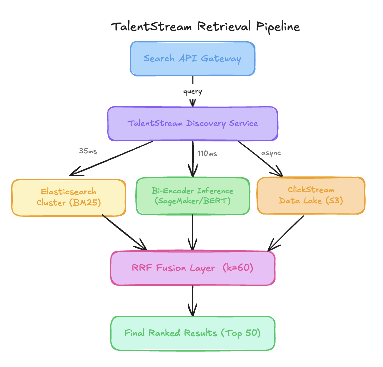

# Why a 1.2 Percent CTR Model Triggered a 42 Percent Application Crash

<figure><a class="image-link image2 is-viewable-img" target="_blank" href="../assets/b1724ec6e238a342.jpg" data-component-name="Image2ToDOM">
<picture><source type="image/webp" srcset="../assets/b1724ec6e238a342.jpg 424w, ../assets/b1724ec6e238a342.jpg 848w, ../assets/b1724ec6e238a342.jpg 1272w, ../assets/b1724ec6e238a342.jpg 1456w" sizes="100vw"></picture>

<button tabindex="0" type="button" class="pencraft pc-reset pencraft icon-container restack-image buttonBase-GK1x3M"><svg aria-hidden="true" width="20" height="20" viewBox="0 0 20 20" fill="none" stroke-width="1.5" stroke="var(--color-fg-primary)" stroke-linecap="round" stroke-linejoin="round" xmlns="http://www.w3.org/2000/svg" class="icon-noB79L"><g><path d="M2.53001 7.81595C3.49179 4.73911 6.43281 2.5 9.91173 2.5C13.1684 2.5 15.9537 4.46214 17.0852 7.23684L17.6179 8.67647M17.6179 8.67647L18.5002 4.26471M17.6179 8.67647L13.6473 6.91176M17.4995 12.1841C16.5378 15.2609 13.5967 17.5 10.1178 17.5C6.86118 17.5 4.07589 15.5379 2.94432 12.7632L2.41165 11.3235M2.41165 11.3235L1.5293 15.7353M2.41165 11.3235L6.38224 13.0882"></path></g></svg></button><button tabindex="0" type="button" class="pencraft pc-reset pencraft icon-container view-image buttonBase-GK1x3M"><svg xmlns="http://www.w3.org/2000/svg" width="20" height="20" viewBox="0 0 24 24" fill="none" stroke="currentColor" stroke-width="2" stroke-linecap="round" stroke-linejoin="round" class="lucide lucide-maximize2 lucide-maximize-2 icon-noB79L"><polyline points="15 3 21 3 21 9"></polyline><polyline points="9 21 3 21 3 15"></polyline><line x1="21" x2="14" y1="3" y2="10"></line><line x1="3" x2="10" y1="21" y2="14"></line></svg></button>

</a></figure>

TalentStream is a mid-stage career marketplace company that recently completed a series C funding round to expand its reach into the Small and Medium Business (SMB) sector. They have achieved a significant milestone of 50 million monthly active users and over 10 million active job listings.

Their engineering team built a Hybrid Retrieval Engine that powers the primary job search page. Here is their setup.
<h1>Architecture Overview</h1>
When a job seeker enters a query, the system triggers a parallel retrieval flow through two distinct paths before merging the results.

<figure><a class="image-link image2 is-viewable-img" target="_blank" href="../assets/4aad798a4b649028.png" data-component-name="Image2ToDOM">
<picture><source type="image/webp" srcset="../assets/4aad798a4b649028.png 424w, ../assets/4aad798a4b649028.png 848w, ../assets/4aad798a4b649028.png 1272w, ../assets/4aad798a4b649028.png 1456w" sizes="100vw"></picture>

<button tabindex="0" type="button" class="pencraft pc-reset pencraft icon-container restack-image buttonBase-GK1x3M"><svg aria-hidden="true" width="20" height="20" viewBox="0 0 20 20" fill="none" stroke-width="1.5" stroke="var(--color-fg-primary)" stroke-linecap="round" stroke-linejoin="round" xmlns="http://www.w3.org/2000/svg" class="icon-noB79L"><g><path d="M2.53001 7.81595C3.49179 4.73911 6.43281 2.5 9.91173 2.5C13.1684 2.5 15.9537 4.46214 17.0852 7.23684L17.6179 8.67647M17.6179 8.67647L18.5002 4.26471M17.6179 8.67647L13.6473 6.91176M17.4995 12.1841C16.5378 15.2609 13.5967 17.5 10.1178 17.5C6.86118 17.5 4.07589 15.5379 2.94432 12.7632L2.41165 11.3235M2.41165 11.3235L1.5293 15.7353M2.41165 11.3235L6.38224 13.0882"></path></g></svg></button><button tabindex="0" type="button" class="pencraft pc-reset pencraft icon-container view-image buttonBase-GK1x3M"><svg xmlns="http://www.w3.org/2000/svg" width="20" height="20" viewBox="0 0 24 24" fill="none" stroke="currentColor" stroke-width="2" stroke-linecap="round" stroke-linejoin="round" class="lucide lucide-maximize2 lucide-maximize-2 icon-noB79L"><polyline points="15 3 21 3 21 9"></polyline><polyline points="9 21 3 21 3 15"></polyline><line x1="21" x2="14" y1="3" y2="10"></line><line x1="3" x2="10" y1="21" y2="14"></line></svg></button>

</a></figure>
<h3>Traffic patterns:</h3>
Average Throughput: 1,800 requests per second

Peak Throughput: 4,200 requests per second

Total Daily Queries: 155 million
<h3>The ML Pipeline:</h3>
The system uses a BERT-base bi-encoder fine-tuned every 14 days on the last 30 days of click-through data. The model uses Binary Cross Entropy loss, where a click is a positive label (1) and a non-click in the top 10 positions is a negative label (0).

The bi-encoder generates 768-dimensional embeddings for both the query and the job description, which are stored in a Pinecone vector database.

Current performance:

P99 Search Latency: 165ms

System Availability: 99.95%

Click-Through Rate (CTR): 1.2% (Up from 0.8% at launch)

Application Completion Rate (ACR): 1.5% (Down from 2.4% at launch)

SMB Customer Churn: 15% month-over-month increase

Costs:

Inference Infrastructure (GPU nodes): $65,000 per month

Vector Database (Pinecone): $18,000 per month

Elasticsearch Managed Service: $9,000 per month

Total: $92,000 per month

Recent incidents:

Application volume alert: Total job applications for startup-category postings dropped by 42% over a six-week period following the third model update. Recovery involved a manual roll-back to the version 1.0 base model, which temporarily restored volume but caused a 20% drop in CTR.
<h1>The Analysis</h1>

Machine Learning At Scale is a reader-supported publication. To receive new posts and support my work, consider becoming a free or paid subscriber.

<form class="subscription-widget-subscribe"><input type="email" class="email-input" name="email" placeholder="Type your email…" tabindex="-1"><input type="submit" class="button primary" value="Subscribe">

</form>

Now let me show you what is actually happening here.
<h3>Critical Issue #1: Engagement Signal Laundering</h3>
The architecture overview shows a glaring divergence: CTR is up 50% while Application Completion Rate (ACR) has plummeted by 37.5%. The model is being trained exclusively on clicks. In the job market, a click is a measure of brand curiosity or prestige, not suitability. By fine-tuning the bi-encoder on click data, the team has inadvertently created a Prestige Ranker. The bi-encoder has learned that the embedding for Google or Netflix should be close to almost every query, regardless of the job title. This is why SMB churn is spiking; their jobs are being pushed to page five because they lack the click-magnet status of a Fortune 500 company.
<h3>Critical Issue #2: The Reciprocal Rank Fusion Deadlock</h3>
In the architecture overview, the RRF Fusion Layer uses a k-factor of 60 to merge BM25 and Bi-Encoder results. However, because the Bi-Encoder is fine-tuned on the output of the previous system’s clicks, the two branches are no longer independent. The Bi-Encoder has effectively memorized the BM25 results for popular companies. Instead of a hybrid system where semantic search rescues keyword search, you have two models agreeing on the same biased results. The 110ms latency for the Bi-Encoder is becoming a tax paid for zero marginal gain in diversity.
<h3>Critical Issue #3: Negative Sampling Bias in the Top 10</h3>
The ML Pipeline description notes that negative samples are pulled from non-clicks in the top 10 positions. This is a classic feedback loop error. If the model previously ranked a highly relevant but low-prestige startup at position 8 and the user skipped it to click on a high-prestige company at position 2, the model now explicitly learns to treat that relevant startup job as a negative signal. You are actively training your model to suppress relevant small-business results because they cannot compete with the dopamine hit of a recognizable logo.
<h3>Critical Issue #4: Prohibitive Inference Costs for a Redundant Signal</h3>
The team is spending $65,000 per month on GPU nodes to run a BERT-base bi-encoder that is currently destroying the SMB revenue stream. The architecture shows that the Bi-Encoder is the primary bottleneck for p99 latency (110ms). Given that the model has collapsed into a prestige-based popularity ranker, TalentStream is effectively paying $780,000 a year to implement a feature that could be replaced by a simple SQL ORDER BY brand_prestige_score DESC.
<h3>Critical Issue #5: Feedback Loop Corruption via Periodic Retraining</h3>
The 14-day retraining cycle on a rolling 30-day window is the mechanism of the collapse. Each cycle reinforces the bias of the previous one. The Architecture Overview mentions that startup job applications fell off a cliff after the third cycle. This is the exact amount of time needed for the bi-encoder to fully “forget” the semantic meaning of job descriptions in favor of the high-variance click signals of the previous two models.
<h1>WHAT I’D DO INSTEAD</h1>

I write about ML systems in production — the tradeoffs, the architecture decisions, the stuff that doesn’t make it into papers. If you want to go deeper, the paid tier covers the technical details I can’t fit in free posts.

<h3>1. Multi-Task Learning (MTL) with Downstream Weighting</h3>

Impact:

Increase Application Completion Rate by 40%

Stabilize SMB revenue by surfacing relevant matches over prestige matches

Trade-offs:

Increased complexity in the training pipeline to handle sparse application labels.

Requires a more sophisticated loss function balancing Click-Through and Application Completion.

When this is the wrong call:

If your platform has extremely low application volume (e.g., a niche executive search firm), the application signal will be too sparse to converge.
<h3>2. Epsilon-Greedy Exploration in the RRF Layer</h3>
Current: RRF merges top-ranked items from two deterministic paths.

New: Reserve 10% of the top 20 slots for Thompson Sampling or Epsilon-Greedy exploration, pulling from the middle-tier of the BM25 results.

Impact:

ACR: 1.5% → 2.1%

SMB Churn: 15% → 4%

Trade-offs:

Slight, temporary dip in CTR as users are shown less “famous” companies.

Requires robust tracking to ensure “explored” items are actually seen by users.
<h3>3. Replace Bi-Encoder with Lightweight Cross-Encoder Reranker</h3>
Replace: BERT-base Bi-Encoder ($65,000)

With: DistilBERT Cross-Encoder on Top 100 BM25 results

Total: $22,000

Trade-offs:

Slightly higher CPU usage on the scoring service.

Total recall is limited by the initial BM25 retrieval set.

When this is the wrong call:

This is the wrong call if your users use highly semantic, natural language queries where keyword matching (BM25) fails completely.
<h1>The Impact</h1>
<strong>Before redesign:</strong>

System is optimized for brand curiosity, leading to 15% SMB churn.

Total monthly infra cost: $92,000

<strong>After redesign:</strong>

System is optimized for actual employment (applications), restoring SMB retention.

Total monthly infra cost: $49,000 (46% savings)
<h1>APPENDIX: Cost Estimation Methodology</h1>
How I estimated the savings for each decision:

Solution 1: Multi-Task Learning

Baseline: No direct cost change to infra, but revenue recovery is the primary driver.

After change: $18,000 training cost stays flat.

Estimated saving: $0/month (Infrastructure), but estimated $200k/month in retained SMB revenue.

Key assumption: SMB churn is directly tied to job visibility.

Confidence: High.

Solution 2: Bandit-based Exploration

Baseline: $0 (Logic change in the Fusion Layer).

After change: $0.

Estimated saving: $0/month.

Key assumption: Users will click on relevant SMB jobs if they are actually surfaced.

Confidence: High.

Solution 3: Lightweight Cross-Encoder

Baseline: $65,000 (GPU nodes) x 1 month = $65,000

After change: $22,000 (High-memory CPU nodes) x 1 month = $22,000

Estimated saving: $43,000/month (66% reduction in model spend)

Key assumption: Reranking 100 items on CPU is viable within 50ms.

Confidence: Medium — depends on the complexity of the feature set used in the cross-encoder.

