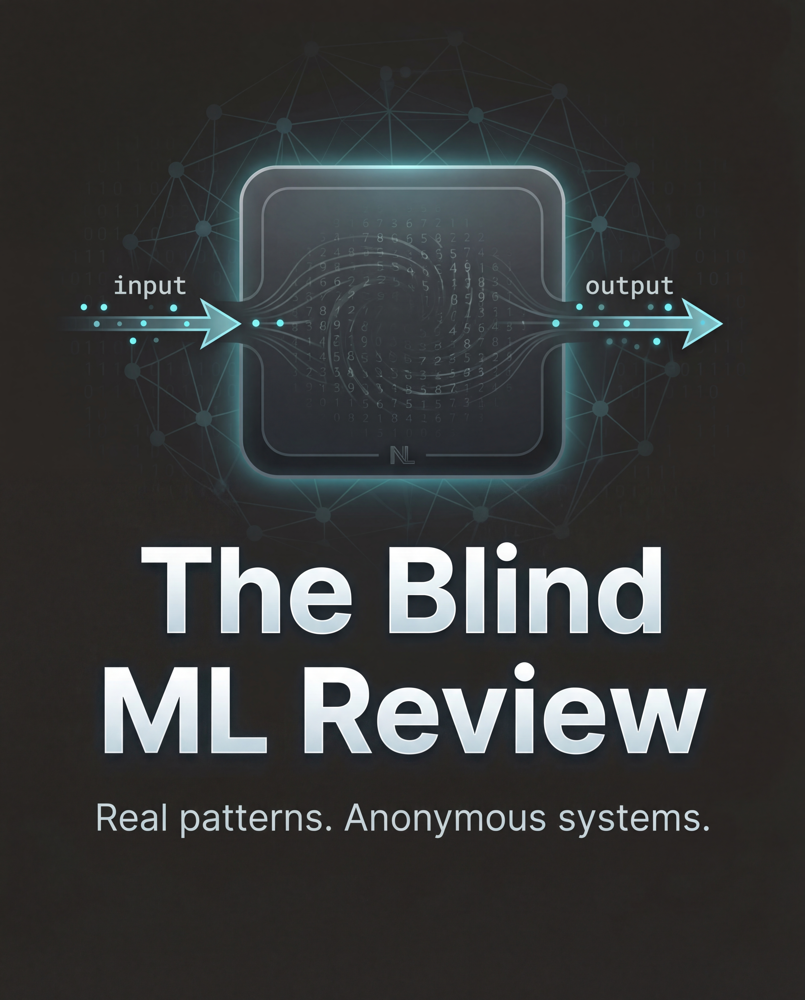
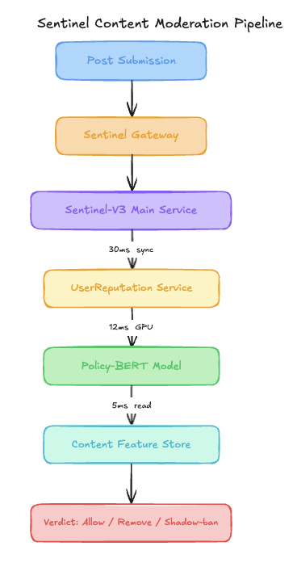

# Why a 0.92 F1 Score Hid a 31 Percent Violation Surge

*Learn how tiered inference and FastText could slash 72 percent of infrastructure costs while maintaining 28,000 requests per second throughput.*

<figure><a class="image-link image2 is-viewable-img" target="_blank" href="../assets/6d3f3e67230429d8.jpg" data-component-name="Image2ToDOM">
<picture><source type="image/webp" srcset="../assets/6d3f3e67230429d8.jpg 424w, ../assets/6d3f3e67230429d8.jpg 848w, ../assets/6d3f3e67230429d8.jpg 1272w, ../assets/6d3f3e67230429d8.jpg 1456w" sizes="100vw"></picture>

<button tabindex="0" type="button" class="pencraft pc-reset pencraft icon-container restack-image buttonBase-GK1x3M"><svg aria-hidden="true" width="20" height="20" viewBox="0 0 20 20" fill="none" stroke-width="1.5" stroke="var(--color-fg-primary)" stroke-linecap="round" stroke-linejoin="round" xmlns="http://www.w3.org/2000/svg" class="icon-noB79L"><g><path d="M2.53001 7.81595C3.49179 4.73911 6.43281 2.5 9.91173 2.5C13.1684 2.5 15.9537 4.46214 17.0852 7.23684L17.6179 8.67647M17.6179 8.67647L18.5002 4.26471M17.6179 8.67647L13.6473 6.91176M17.4995 12.1841C16.5378 15.2609 13.5967 17.5 10.1178 17.5C6.86118 17.5 4.07589 15.5379 2.94432 12.7632L2.41165 11.3235M2.41165 11.3235L1.5293 15.7353M2.41165 11.3235L6.38224 13.0882"></path></g></svg></button><button tabindex="0" type="button" class="pencraft pc-reset pencraft icon-container view-image buttonBase-GK1x3M"><svg xmlns="http://www.w3.org/2000/svg" width="20" height="20" viewBox="0 0 24 24" fill="none" stroke="currentColor" stroke-width="2" stroke-linecap="round" stroke-linejoin="round" class="lucide lucide-maximize2 lucide-maximize-2 icon-noB79L"><polyline points="15 3 21 3 21 9"></polyline><polyline points="9 21 3 21 3 15"></polyline><line x1="21" x2="14" y1="3" y2="10"></line><line x1="3" x2="10" y1="21" y2="14"></line></svg></button>

</a></figure>

PulseFeed is a series-C social media company that recently surpassed 200 million monthly active users. They have seen a 40 percent year-over-year growth in user-generated content, largely driven by their new short-form video and public thread features.

Their engineering team built a system called Sentinel-V3 that serves as the primary automated gatekeeper for content safety. It is designed to auto-remove posts that violate community guidelines regarding hate speech and harassment. Here is their setup:
<h1>Architecture Overview</h1>
When a user submits a post, the Content Delivery API triggers a synchronous call to the Sentinel-V3 gateway. The post cannot be published until this service returns a verdict.

<figure><a class="image-link image2 is-viewable-img" target="_blank" href="../assets/f724ce178c0e94ed.png" data-component-name="Image2ToDOM">
<picture><source type="image/webp" srcset="../assets/f724ce178c0e94ed.png 424w, ../assets/f724ce178c0e94ed.png 848w, ../assets/f724ce178c0e94ed.png 1272w, ../assets/f724ce178c0e94ed.png 1456w" sizes="100vw"></picture>

<button tabindex="0" type="button" class="pencraft pc-reset pencraft icon-container restack-image buttonBase-GK1x3M"><svg aria-hidden="true" width="20" height="20" viewBox="0 0 20 20" fill="none" stroke-width="1.5" stroke="var(--color-fg-primary)" stroke-linecap="round" stroke-linejoin="round" xmlns="http://www.w3.org/2000/svg" class="icon-noB79L"><g><path d="M2.53001 7.81595C3.49179 4.73911 6.43281 2.5 9.91173 2.5C13.1684 2.5 15.9537 4.46214 17.0852 7.23684L17.6179 8.67647M17.6179 8.67647L18.5002 4.26471M17.6179 8.67647L13.6473 6.91176M17.4995 12.1841C16.5378 15.2609 13.5967 17.5 10.1178 17.5C6.86118 17.5 4.07589 15.5379 2.94432 12.7632L2.41165 11.3235M2.41165 11.3235L1.5293 15.7353M2.41165 11.3235L6.38224 13.0882"></path></g></svg></button><button tabindex="0" type="button" class="pencraft pc-reset pencraft icon-container view-image buttonBase-GK1x3M"><svg xmlns="http://www.w3.org/2000/svg" width="20" height="20" viewBox="0 0 24 24" fill="none" stroke="currentColor" stroke-width="2" stroke-linecap="round" stroke-linejoin="round" class="lucide lucide-maximize2 lucide-maximize-2 icon-noB79L"><polyline points="15 3 21 3 21 9"></polyline><polyline points="9 21 3 21 3 15"></polyline><line x1="21" x2="14" y1="3" y2="10"></line><line x1="3" x2="10" y1="21" y2="14"></line></svg></button>

</a></figure>
<h3>Traffic patterns:</h3>
Total posts: 1.3 billion per day

Peak throughput: 28,000 requests per second

Average: 15,000 requests per second

Peak: 32,000 requests per second
<h3>The ML Pipeline</h3>
The system uses a DistilBERT-based classifier for text and a separate ResNet-50 for images. Both models are fine-tuned on a dataset of 4 million human-labeled examples. Ground truth is provided by an external contractor team of 150 labelers. Every Sunday, the training and evaluation sets are refreshed by sampling 50,000 new examples from the previous week’s flagged content, which the contractors re-verify.
<h3>Current performance</h3>
End-to-end P99 Latency: 55ms

Model Accuracy (F1-score): 0.92 (reported by internal eval set)

False Negative Rate: 4 percent (reported by internal eval set)

Costs:

Inference Infrastructure: $240,000 per month

Labeling Operations: $115,000 per month

Total: $355,000 per month

Recent incidents:

Incident 1: A 31 percent surge in user-reported policy violations over 18 months, despite the model evaluation metrics remaining flat. No alerts triggered because the system believed it was performing within spec.

Incident 2: A 4-hour partial outage in June caused by the UserReputation service timing out, which defaulted the gateway to Allow-All mode, flooding the platform with unmoderated content.
<h1>The Analysis</h1>
Now let me show you what is actually happening here.
<h3>Critical Issue #1: The Evaluation Loop Death Spiral</h3>

I write about ML systems in production — the tradeoffs, the architecture decisions, the stuff that doesn’t make it into papers. If you want to go deeper, the paid tier covers the technical details I can’t fit in free posts.

Looking at the ML Pipeline section, notice how the training and evaluation sets are refreshed weekly by sampling from the previous week’s flagged content and sending it to the same 150 contractors. Over 18 months, those contractors became aware that their labels directly dictated what got removed. To reduce the volume of appeals and internal pressure, they drifted toward labeling borderline content as safe. Because the evaluation set is drawn from this same biased pool, the model’s reported F1-score stayed at 0.92 while the actual real-world false negative rate climbed 31 percent. The system is grading its own homework using a biased teacher.
<h3>Critical Issue #2: The Synchronous Reputation Bottleneck</h3>
In the Architecture Overview, the UserReputation Service adds 30ms of synchronous latency to every single post. This represents over 50 percent of the total P99 latency (55ms). If this service hangs, the whole moderation chain stalls. More importantly, using a synchronous lookup for historical user data on every post submission is an architectural anti-pattern that limits horizontal scaling of the ingest service.
<h2>Critical Issue #3: Feature Leakage via Reported Metrics</h2>
The Content-Feature-Store includes a feature for current user-report-count on the post. Since the model is retrained weekly on flagged content, it has learned that if a post has already been flagged or reported by users, it is more likely to be a violation. This creates a feedback loop where the model waits for human reports to become confident, rather than proactively identifying violations based on the content itself. This explains why the false negative rate is so high for new content that hasn’t been seen by users yet.
<h3>Critical Issue #4: Over-Provisioned GPU Inference for Low-Signal Content</h3>
The system runs Policy-BERT (12ms) on every single post, regardless of length or content type. At 15,000 requests per second, they are spending $240,000 a month on GPU clusters. Looking at the traffic, a significant portion of these posts are short-form content like “lol” or “good morning” which could be filtered by a $500-a-month CPU-based Regex or FastText model. They are using a sledgehammer to crack every nut.
<h3>Critical Issue #5: Fail-Open Vulnerability</h3>
As seen in Incident 2, when the UserReputation service fails, the system defaults to Allow-All. This is a massive security hole. For a content moderation system, a failure in a dependency should trigger a Fail-Closed (or Fail-to-Human-Queue) state for high-risk accounts, rather than a total bypass of the safety layer.
<h1>WHAT I D DO INSTEAD</h1><h3>1. Independent Gold-Standard Audit</h3>
Impact:

Detects labeler drift within 7 days.

Reduces real-world false negative rate by an estimated 25 percent.

Trade-offs:

Increased labeling cost for a specialized, high-accuracy “Gold Team.”

Requires a more complex data pipeline to manage two separate labeling streams.
<h3>2. Tiered Inference Architecture</h3>
Current: Every post → Sentinel-V3 (BERT)

New: Every post → FastText Classifier (0.5ms) → If high confidence safe, stop. If low confidence, → Sentinel-V3 (BERT).

Impact: 15,000 rps on GPU → 3,500 rps on GPU.

Trade-offs:

Adds complexity to the model deployment pipeline.

Slight increase in P99 for the 20 percent of posts that require both models.
<h3>3. Asynchronous Context Injection</h3>
Replace: Synchronous UserReputation lookup ($0 additional cost).

With: The Reputation service pushes updates to a local cache or the Gateway includes the reputation score in the JWT/Session header during the post request.

Total: $0 (reallocating existing infrastructure).

Trade-offs:

Reputation scores might be slightly stale (seconds or minutes).

When this is the wrong call: Only if the system requires millisecond-perfect consistency for financial transactions or high-stakes identity verification.
<h1>The Impact</h1>
Before redesign:

System blind to 31 percent increase in violations.

$355,000 monthly cost.

After redesign:

Proactive violation detection with independent ground-truth verification.

$185,000 monthly cost (48 percent savings).

Time to implement: 3 months, 4 engineers.
<h1>APPENDIX: Cost Estimation Methodology</h1>
How I estimated the savings for each decision:

Solution 1: Independent Gold-Standard Audit

Baseline: $115,000 / month for 150 contractors.

After change: $115,000 (standard) + $15,000 (Gold Team) = $130,000 / month.

Estimated saving: -$15,000 / month (13 percent increase).

Key assumption: A small, highly-trained audit team can catch drift by sampling only 2 percent of the volume.

Confidence: High — This is a standard industry practice for labeling quality.

Solution 2: Tiered Inference Architecture

Baseline: $240,000 / month for g4dn.xlarge GPU nodes at 15,000 rps.

After change: $60,000 (reduced GPU footprint) + $5,000 (CPU nodes for FastText) = $65,000 / month.

Estimated saving: $175,000 / month (72 percent reduction in infra cost).

Key assumption: 75 percent of social media content is low-complexity and can be classified by FastText with high confidence.

Confidence: High — PulseFeed’s content distribution (short text) heavily favors this.

Solution 3: Asynchronous Context Injection

Baseline: $0 direct cost, but saves 30ms in latency.

After change: $0.

Estimated saving: $0 in cash, but significant reduction in “fail-open” incidents.

Key assumption: Reputation scores do not change significantly post-to-post for a single user.

Confidence: High — User reputation is a slow-moving metric.

