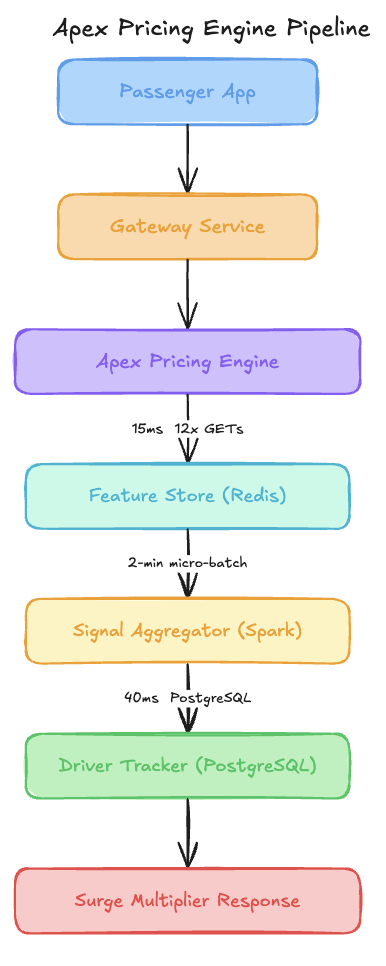

# $800K Lost Because a Model Thought the City Was Empty

*See how moving to atomic hashes slashed P99 latency by 170ms and why Spark Streaming is costing you an extra $30,000 monthly.*

<figure><a class="image-link image2 is-viewable-img" target="_blank" href="../assets/e6a3afad46a92d31.jpg" data-component-name="Image2ToDOM">
<picture><source type="image/webp" srcset="../assets/e6a3afad46a92d31.jpg 424w, ../assets/e6a3afad46a92d31.jpg 848w, ../assets/e6a3afad46a92d31.jpg 1272w, ../assets/e6a3afad46a92d31.jpg 1456w" sizes="100vw"></picture>

<button tabindex="0" type="button" class="pencraft pc-reset pencraft icon-container restack-image buttonBase-GK1x3M"><svg aria-hidden="true" width="20" height="20" viewBox="0 0 20 20" fill="none" stroke-width="1.5" stroke="var(--color-fg-primary)" stroke-linecap="round" stroke-linejoin="round" xmlns="http://www.w3.org/2000/svg" class="icon-noB79L"><g><path d="M2.53001 7.81595C3.49179 4.73911 6.43281 2.5 9.91173 2.5C13.1684 2.5 15.9537 4.46214 17.0852 7.23684L17.6179 8.67647M17.6179 8.67647L18.5002 4.26471M17.6179 8.67647L13.6473 6.91176M17.4995 12.1841C16.5378 15.2609 13.5967 17.5 10.1178 17.5C6.86118 17.5 4.07589 15.5379 2.94432 12.7632L2.41165 11.3235M2.41165 11.3235L1.5293 15.7353M2.41165 11.3235L6.38224 13.0882"></path></g></svg></button><button tabindex="0" type="button" class="pencraft pc-reset pencraft icon-container view-image buttonBase-GK1x3M"><svg xmlns="http://www.w3.org/2000/svg" width="20" height="20" viewBox="0 0 24 24" fill="none" stroke="currentColor" stroke-width="2" stroke-linecap="round" stroke-linejoin="round" class="lucide lucide-maximize2 lucide-maximize-2 icon-noB79L"><polyline points="15 3 21 3 21 9"></polyline><polyline points="9 21 3 21 3 15"></polyline><line x1="21" x2="14" y1="3" y2="10"></line><line x1="3" x2="10" y1="21" y2="14"></line></svg></button>

</a></figure>

Zenith Mobility is a late-stage Series D mobility startup that recently hit 100 million completed rides globally. They have expanded into 15 new international markets in the last eighteen months, scaling their fleet to nearly 2 million active drivers.

Their engineering team built a dynamic pricing engine called Apex that powers the surge multiplier for every ride request in real-time. Here is their setup.
<h1>Architecture Overview</h1>
When a passenger opens the app, the request triggers a price estimation flow to determine the surge multiplier.

<figure><a class="image-link image2 is-viewable-img" target="_blank" href="../assets/bc4a6c84f138aae2.png" data-component-name="Image2ToDOM">
<picture><source type="image/webp" srcset="../assets/bc4a6c84f138aae2.png 424w, ../assets/bc4a6c84f138aae2.png 848w, ../assets/bc4a6c84f138aae2.png 1272w, ../assets/bc4a6c84f138aae2.png 1456w" sizes="100vw"></picture>

<button tabindex="0" type="button" class="pencraft pc-reset pencraft icon-container restack-image buttonBase-GK1x3M"><svg aria-hidden="true" width="20" height="20" viewBox="0 0 20 20" fill="none" stroke-width="1.5" stroke="var(--color-fg-primary)" stroke-linecap="round" stroke-linejoin="round" xmlns="http://www.w3.org/2000/svg" class="icon-noB79L"><g><path d="M2.53001 7.81595C3.49179 4.73911 6.43281 2.5 9.91173 2.5C13.1684 2.5 15.9537 4.46214 17.0852 7.23684L17.6179 8.67647M17.6179 8.67647L18.5002 4.26471M17.6179 8.67647L13.6473 6.91176M17.4995 12.1841C16.5378 15.2609 13.5967 17.5 10.1178 17.5C6.86118 17.5 4.07589 15.5379 2.94432 12.7632L2.41165 11.3235M2.41165 11.3235L1.5293 15.7353M2.41165 11.3235L6.38224 13.0882"></path></g></svg></button><button tabindex="0" type="button" class="pencraft pc-reset pencraft icon-container view-image buttonBase-GK1x3M"><svg xmlns="http://www.w3.org/2000/svg" width="20" height="20" viewBox="0 0 24 24" fill="none" stroke="currentColor" stroke-width="2" stroke-linecap="round" stroke-linejoin="round" class="lucide lucide-maximize2 lucide-maximize-2 icon-noB79L"><polyline points="15 3 21 3 21 9"></polyline><polyline points="9 21 3 21 3 15"></polyline><line x1="21" x2="14" y1="3" y2="10"></line><line x1="3" x2="10" y1="21" y2="14"></line></svg></button>

</a></figure>
<h1>Traffic patterns</h1>
Average rides per day: 1.2 million

Peak rides per hour: 280,000

Average: 4,000 req/sec

Peak: 15,000 req/sec
<h1>The ML Pipeline:</h1>
The model is a Gradient Boosted Decision Tree (XGBoost) trained on 180 days of historical ride data, including demand density, driver proximity, and external factors like weather. It outputs a multiplier between 1.0x and 4.0x. The feature vector consists of 12 real-time signals fetched from the Redis feature store.

Current performance:

P99 Latency: 280ms

Reliability: 99.92%

Business impact metric: $4.20 average surge revenue per peak-hour ride

Costs:

Cloud Infrastructure: $140,000 / month

Redis Managed Instance: $22,000 / month

Total: $162,000 / month

Recent incidents:

New Years Eve Peak: Systemic revenue miss of $800,000. Under-priced rides by 30% during a 4-hour window.

Recovery: Manual override of surge multipliers to a flat 2.5x across major metros once the discrepancy was caught by Finance.
<h1>The Analysis</h1>
Now let me show you what’s actually happening here.
<h1>Critical Issue 1: Stale Feature Confidence</h1>

I write about ML systems in production — the tradeoffs, the architecture decisions, the stuff that doesn’t make it into papers. If you want to go deeper, the paid tier covers the technical details I can’t fit in free posts.

Looking at the architecture, the Signal Aggregator uses 2-minute micro-batches to update the Feature Store. During the New Year’s Eve incident, the Kafka consumer lag spiked to 180 seconds. Because the Apex Engine fetches features from Redis without any versioning or timestamp metadata, it unknowingly served multipliers based on demand data that was 3 minutes old. During a surge event where demand doubles every 60 seconds, a 3-minute lag means the model is effectively pricing for a ghost town while the streets are packed. The $800k loss was a direct result of the model being technically certain about objectively wrong data.
<h1>Critical Issue 2: IOPS Death by a Thousand Cuts</h1>
The Apex Engine performs 12 sequential GET requests to Redis for every single pricing call. At 15,000 requests per second during peak times, that is 180,000 Redis operations per second. Even with 15ms latency per call, the sequential nature of these fetches accounts for 180ms of the total 280ms P99 latency. This is an enormous waste of compute and network overhead for a feature vector that could be retrieved in a single round trip.
<h1>Critical Issue 3: The PostgreSQL Driver Bottleneck</h1>
The architecture shows the Driver Tracker sitting on PostgreSQL with a 40ms latency. During peak load, the connection pool saturates. When the feature store is slow, the Pricing Engine holds onto these DB connections longer, leading to a cascading failure. If the Driver Tracker slows down by just 20ms, the entire pricing flow exceeds the Gateway timeout, resulting in 1.0x default pricing for users — essentially turning off surge exactly when it is needed most.
<h1>Critical Issue 4: Binary Default Logic</h1>
The system is configured to return a 1.0x multiplier if the Apex Engine fails or times out. Quote: Surge Multiplier Response. When the system was under heavy load on NYE, the combination of Redis lag and DB connection exhaustion forced the system into its failure mode. It did not fail closed; it failed open. This spike in rider satisfaction was actually a failure of the system to protect the marketplace balance.
<h1>Critical Issue 5: Infrastructure Bloat for Micro-batching</h1>
They have a massive Spark Streaming cluster just for 2-minute micro-batches. Using Spark for a 12-feature vector update is like using a semi-truck to deliver a single envelope. The overhead of managing the Spark RDDs for such a simple aggregation is contributing to the very lag that caused the NYE incident.
<h1>WHAT I’D DO INSTEAD</h1><h3>1. Feature Metadata and TTL Validation</h3>
Impact:

Elimination of $800k revenue risks due to stale data.

Automatic fallback to safe pricing when data is older than 45 seconds.

Trade-offs:

Increased storage size in Redis by approximately 20% to accommodate timestamp headers.

Slightly more complex client-side logic in the Apex Engine to parse the metadata.

When this is the wrong call: If your features are static (e.g., user home city), checking TTL is just wasted CPU. But for dynamic pricing, it is non-negotiable.
<h3>2. Atomic Feature Retrieval via Redis Hashes</h3>
Current: 12 sequential GETs per request.

New: Single HGETALL on a per-session or per-geohash key.

Impact: P99 Latency 280ms → 110ms.

Trade-offs:

Requires a migration of the write pipeline to group features into hashes.

Less flexibility to update individual features without rewriting the entire hash in some edge cases.
<h3>3. Replacement of Spark Streaming with Flink or Kafka Streams</h3>
Replace: Spark Streaming ($45,000/month infra)

With: Kafka Streams / Flink ($15,000/month infra)

Total: $132,000 / month

Trade-offs:

Engineering effort to rewrite aggregation logic.

Flink requires more specialized tuning for state management.
<h1>The Impact</h1>
Before redesign:

System blindly accepts stale data leading to massive revenue leakage.

$162,000 / month infrastructure cost.

After redesign:

Freshness-aware pricing with sub-150ms P99 latency.

$132,000 / month cost (18% savings).
<h1>APPENDIX: Cost Estimation Methodology</h1>
How I estimated the savings for each decision:

Solution 1: Feature Metadata and TTL Validation

Baseline: $0 monthly (Current state has no validation).

After change: $1,200/month additional storage cost in Redis.

Estimated saving: -$1,200/month (This is a safety cost, not a saving, but it prevents the $800k one-time losses).

Key assumption: Adding a 13th field (timestamp) to the 12-feature vector increases object size by 15-20%.

Confidence: High — Redis memory scaling is linear with object size.

Solution 2: Atomic Feature Retrieval via Redis Hashes

Baseline: $22,000/month for high-IOPS Redis instances.

After change: $10,000/month by moving to lower-IOPS, memory-optimized instances.

Estimated saving: $12,000/month (54% reduction in Redis costs).

Key assumption: Reducing command count by 11x allows for a move to smaller instance classes that were previously CPU-bound by interrupt handling.

Confidence: Medium — depends on how much of the current cost is IOPS-provisioned vs. memory-provisioned.

Solution 3: Replacement of Spark Streaming with Flink

Baseline: $45,000/month for Spark Cluster.

After change: $15,000/month for Flink/Kafka Streams nodes.

Estimated saving: $30,000/month.

Key assumption: Spark micro-batching overhead for 12 features is significantly higher than the lightweight state management in Flink.

Confidence: High — Spark is notoriously expensive for low-latency, small-state streaming compared to Flink.

