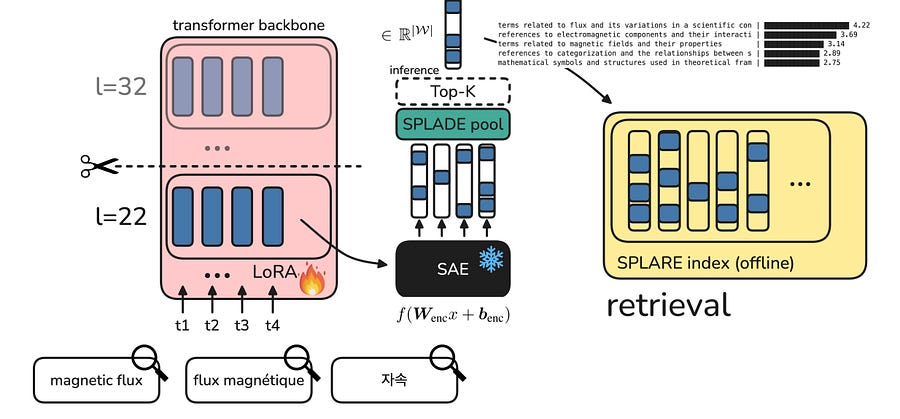

# Analysis of SPLARE: Sparse Autoencoders for Learned Sparse Retrieval 

*Swapping the LLM vocabulary head for a Sparse Autoencoder beats SPLADE on MMTEB benchmarks.*

*Swapping the LLM vocabulary head for a Sparse Autoencoder beats SPLADE on MMTEB benchmarks.*

# TL;DR

Researchers from NAVER LABS Europe introduced SPLARE, a Learned Sparse Retrieval model that replaces the standard LLM vocabulary head with a pre-trained Sparse Autoencoder. By mapping tokens into a latent feature space rather than a subword vocabulary, SPLARE beats traditional SPLADE models on multilingual and out-of-domain retrieval tasks. It achieves top-tier performance for sparse retrievers on the MMTEB benchmark while maintaining low inference latency and exact search capabilities.

# Introduction

Learned Sparse Retrieval models like SPLADE have been a reliable alternative to dense embedding models. They generate sparse representations that plug directly into inverted indexes, allowing for exact term matching and high efficiency. But these models have a structural bottleneck. They project hidden states into the fixed vocabulary space of the underlying LLM. This hard dependency on the tokenizer vocabulary creates token redundancy and severely limits cross-lingual and multi-modal retrieval.

The authors of the SPLARE paper target this exact limitation. Instead of relying on the language modeling head to map representations back to subword tokens, they use a pre-trained Sparse Autoencoder to project token representations into a sparse, language-agnostic latent space.

# The Architecture of Latent Sparse Retrieval

The mechanics behind SPLARE are a straightforward synthesis of two existing paradigms. In a standard SPLADE architecture, token representations are projected through the language modeling head to create a sparse bag-of-words vector over the vocabulary. SPLARE swaps the language modeling head for the encoder portion of an SAE.

The authors inject a pre-trained SAE, such as Llama Scope or Gemma Scope, at an intermediate transformer layer. During training, the SAE weights remain completely frozen. Only the underlying LLM backbone is fine-tuned using LoRA adapters via distillation from a cross-encoder teacher. To get a single sequence-level representation, SPLARE applies the standard SPLADE pooling mechanism, which involves a log saturation function followed by max-pooling across the sequence.

Think of it like swapping a localized dictionary for a universal concept map. A standard tokenizer vocabulary forces the model to express relevance through specific language tokens. This breaks down when the query is in Tamil but the document is in English. The SAE activates mono-semantic, language-agnostic features instead. The model learns to retrieve based on abstract concepts rather than lexical overlap.

Interestingly, the authors found that extracting features at intermediate layers, such as layer 26 of a 32-layer Llama model, yields the best retrieval performance. This means you do not need to run a forward pass through the entire LLM, cutting inference compute compared to traditional full-depth models.

# Production Impact and Trade-Offs

The shift from a lexical vocabulary to a latent vocabulary has direct implications for production retrieval systems.

First, it fundamentally improves generalization. SPLARE-7B rivals state-of-the-art dense models on the MTEB multilingual benchmark, doing so without any synthetic data generation or pre-finetuning. The language-agnostic nature of the SAE features natively supports cross-lingual retrieval, heavily outperforming vocabulary-based methods on benchmarks like XTREME-UP.

Second, the sparsity profile is much easier to manage at scale. SPLARE is significantly more robust to aggressive document pruning at inference time. The authors show that if you cap the document vectors to only 100 active features using Top-K pooling, SPLARE’s performance drops by only 2 percent. A standard SPLADE model drops by over 6 percent under the same conditions. This tight feature activation allows the model to leverage highly optimized inverted indexes with a minimal memory footprint. The paper notes single-threaded retrieval latency around 5ms per query over an 8.8 million document collection.

There is an operational trade-off to watch out for. Because SPLARE relies on a pre-trained SAE to define its feature space, it is bound by the concepts that SAE has learned. The authors noted a performance drop on highly domain-specific tasks like code retrieval. The generalist SAE features were too generic to capture the syntactic nuances of code semantics. Deploying this pattern in heavily specialized verticals will likely require training dedicated, domain-specific SAEs first.

Overall, the paper demonstrates that the interpretability research around SAEs has immediate, practical utility in search architectures. It offers the exact-match efficiency of sparse retrieval with the semantic depth typically reserved for dense vector models.

# References

  1. [Learning Retrieval Models with Sparse Autoencoders](https://arxiv.org/pdf/2603.13277)
