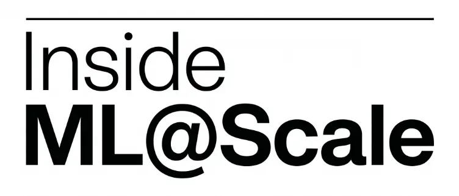
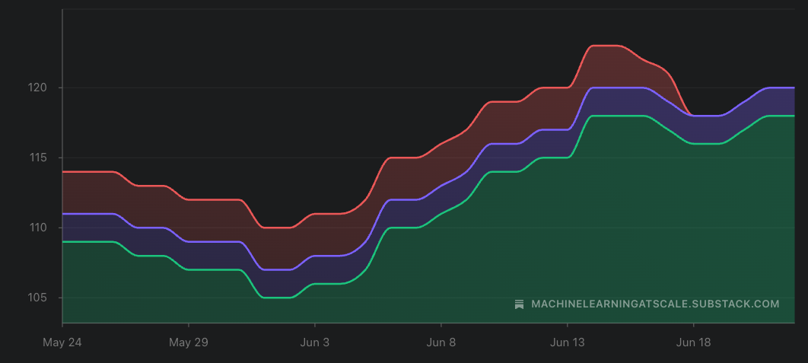
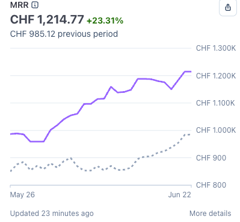
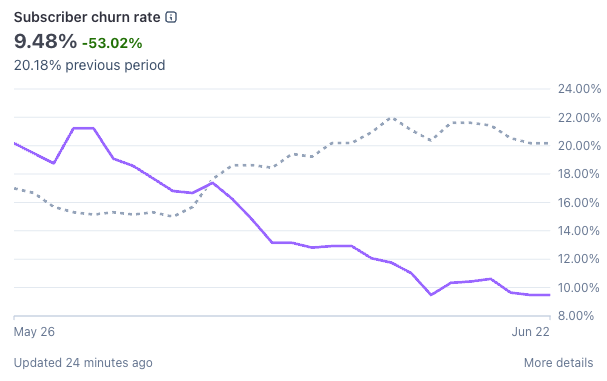

# Inside ML@Scale #3

*MRR goes BRRRRR*

Every 25th of the month, I publish **Inside ML@Scale** — a full, honest look at the business behind this newsletter.

The good, the bad.

What’s growing, what’s stagnating, what I’m trying that isn’t working (or sometimes is?)

**Why?**

Three reasons.

**1\. Because nobody else does it.**

The ML newsletter space is full of people performing success. “Just crossed 50k subscribers 🚀” with zero context on how, for how long, at what cost, with what retention.

I’ve been building ML@Scale since 2023: from 0 to 14k+ free subscribers, 45k on LinkedIn, and some of them paid.

That didn’t happen linearly. It happened with a lot of stupid decisions in between. Those are worth writing about.

**2\. Because transparency compounds.**

The same way our 25th-of-the-month ritual makes us better at money, writing this publicly will make me better at running this business. You can’t hide from numbers you’ve committed to publishing.

**3\. Because you deserve to know what you’re paying for.**

If you’re a premium subscriber, you’re not just getting “The Blind ML Review” or “The Zürich Feed”. You’re buying into a thing that either works or doesn’t. I owe you visibility into which one it is.

### **What’s in the free section (this part)**

Every edition will have:

  * Top-line numbers

  * The _one thing_ that worked that month

  * The _one thing_ that didn’t work

  * What I’m trying next

### **Top-line: where we are in June 2026**

  * **14,000+** free subscribers

  * **45,000+** LinkedIn followers

  * **~25%** open rate (still constant, need to work on this!)

  * **6x/week** LinkedIn cadence, **3x/week** newsletter cadence

### **What worked this month**

This month was a big month! Lots of thing drove it.

Sub split:

  * Zurich feed: 63 subs, 30+29 free subs, 0+4 paid subs

  * ML@Scale 1:1: 20 subs, 2 paid 18 free

  * How to pick the right ML team: 7 subs, 3 paid 4 free

Not a bad month!

### **What didn’t work**

Honestly, this month was hard to find lowlights. Even deep technical content performed great. Love such months!

### **What I’m trying next**

Still trying to find time for a big month of august edition. Time is scarcest resource when you juggle a full time job (pretty demanding one) and this side project.

No data on drip campaigns yet. But they are setup to convince paid subs to come back and to convince new free subs to convert to paid!

I want to focus a bit more on “personal stories” as those seem to be the driving force behind things. Maybe a new format where I give advice to people in 1:1 on career things (which people seem to love) and then share the anonymized version of it for all paid subs. That’d be cool i think!

# **The business numbers**

All right. Let’s get into the details. (metrics are very shiny this month!!)

## **Paid subs graph**

Decent growth in the last 30 days, we are now at 120 paid subs!

This is reflected in the new MRR:

A 23% increase in the last 30 days! Here we go! :)

You know what’s cool? I now have a subscriber churn rate that’s below 10%!

Happy happy happy!

I need to focus on providing value to people week over week to make their sub be worth it. :)

That’s all for this second edition! Let me know which numbers you’d like to see more or less of.

— Ludo
