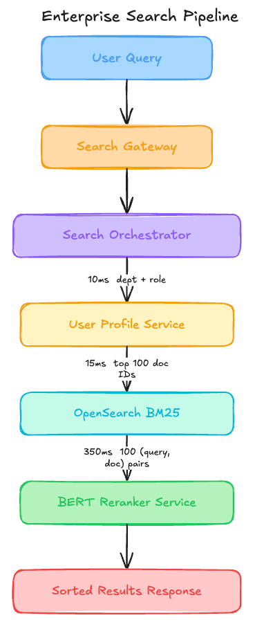

# The $32,400 Search Model That Silently Prioritized CEO Memos Over Results [Edition #15]

*Training on internal dogfooding logs encoded a social hierarchy that tanked junior account click rates by 12 percent but a bi-encoder swap can restore relevance.*

> Paid post — only the publicly visible preview is included.

*Training on internal dogfooding logs encoded a social hierarchy that tanked junior account click rates by 12 percent but a bi-encoder swap can restore relevance.*

Lexisync is a Series C enterprise productivity company that recently crossed 5,000 corporate customers. They have seen 400 percent year-over-year growth in document creation following their move to a collaborative workspace model.

Their engineering team built a centralized search infrastructure called LexiSearch that powers all document retrieval across their web and mobile apps.

Here is their setup.

# Architecture Overview

When a user types a query into the search bar, the request hits the Search Gateway which orchestrates a two-stage retrieval process. First, an initial set of 100 candidates is pulled from a keyword-based index. These candidates are then passed to a neural reranking service to determine the final order presented to the user.

# Traffic patterns

Document count: 15 million

Daily Active Users: 200,000

Average: 50 req/sec

Peak: 180 req/sec

### The ML Pipeline

The model is a DistilBERT cross-encoder fine-tuned on 1.2 million click-through logs. These logs were sourced entirely from the company’s internal dogfooding environment over an 18-month period. The training labels are binary: 1 if a document was clicked, 0 if it was shown but ignored. The training data includes the document author’s title and seniority level as metadata features.

Current performance

P99 Latency: 485ms

Reliability: 99.8 percent uptime

Business impact metric: 12 percent drop in Search-to-Click rate for junior-level accounts post-deployment.

Costs:

GPU Inference (AWS SageMaker g4dn.xlarge): $32,400 per month

OpenSearch Infrastructure: $4,800 per month

Total: $37,200 per month

Recent incidents:

In July, a viral internal company announcement by the CEO caused a massive spike in click signals for a single document. The model updated 24 hours later and began surfacing that announcement for unrelated queries like coffee machine or dental insurance for all internal users.

In September, the Reranker service hit a memory limit during a peak traffic hour because the cross-encoder was attempting to process 100 long-form document snippets simultaneously, leading to a 15-minute partial outage where search defaulted to raw BM25.

# The Analysis

Now let me show you what is actually happening here.

### Critical Issue #1: Institutional Authority Bias Encoding

I write about ML systems in production — the tradeoffs, the architecture decisions, the stuff that doesn’t make it into papers. If you want to go deeper, the paid tier covers the technical details I can’t fit in free posts
