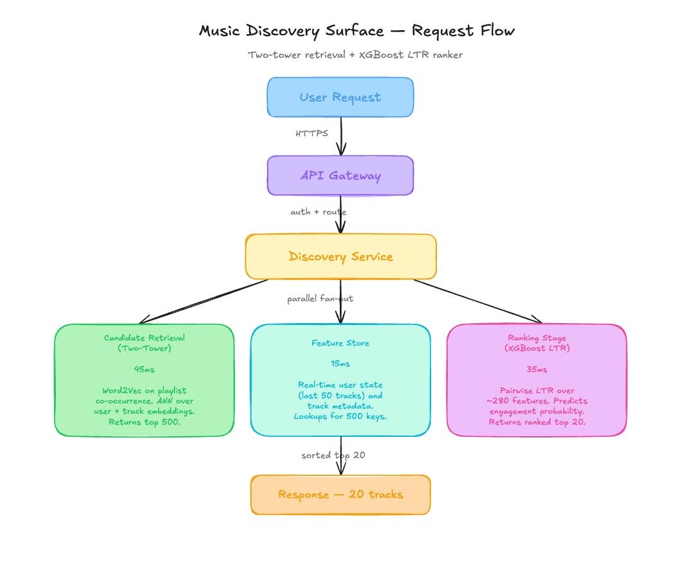

# The $14K Monthly Discovery Engine That Silently Starved 80 Percent Of Tracks [Edition #16]

<figure><a class="image-link image2 is-viewable-img" target="_blank" href="../assets/385bc68f41324d47.jpg" data-component-name="Image2ToDOM">
<picture><source type="image/webp" srcset="../assets/385bc68f41324d47.jpg 424w, ../assets/385bc68f41324d47.jpg 848w, ../assets/385bc68f41324d47.jpg 1272w, ../assets/385bc68f41324d47.jpg 1456w" sizes="100vw"></picture>

<button tabindex="0" type="button" class="pencraft pc-reset pencraft icon-container restack-image buttonBase-GK1x3M"><svg aria-hidden="true" width="20" height="20" viewBox="0 0 20 20" fill="none" stroke-width="1.5" stroke="var(--color-fg-primary)" stroke-linecap="round" stroke-linejoin="round" xmlns="http://www.w3.org/2000/svg" class="icon-noB79L"><g><path d="M2.53001 7.81595C3.49179 4.73911 6.43281 2.5 9.91173 2.5C13.1684 2.5 15.9537 4.46214 17.0852 7.23684L17.6179 8.67647M17.6179 8.67647L18.5002 4.26471M17.6179 8.67647L13.6473 6.91176M17.4995 12.1841C16.5378 15.2609 13.5967 17.5 10.1178 17.5C6.86118 17.5 4.07589 15.5379 2.94432 12.7632L2.41165 11.3235M2.41165 11.3235L1.5293 15.7353M2.41165 11.3235L6.38224 13.0882"></path></g></svg></button><button tabindex="0" type="button" class="pencraft pc-reset pencraft icon-container view-image buttonBase-GK1x3M"><svg xmlns="http://www.w3.org/2000/svg" width="20" height="20" viewBox="0 0 24 24" fill="none" stroke="currentColor" stroke-width="2" stroke-linecap="round" stroke-linejoin="round" class="lucide lucide-maximize2 lucide-maximize-2 icon-noB79L"><polyline points="15 3 21 3 21 9"></polyline><polyline points="9 21 3 21 3 15"></polyline><line x1="21" x2="14" y1="3" y2="10"></line><line x1="3" x2="10" y1="21" y2="14"></line></svg></button>

</a></figure>
<h3>The System</h3>
EchoStream is a Series B music streaming startup currently supporting 18 million Monthly Active Users (MAU). They recently reached a milestone of 40 million tracks in their catalog, with a strategic focus on expanding their indie and niche label partnerships.

Their engineering team built a dedicated Discovery surface, a separate tab in the UI designed to move users away from their algorithmic bubbles and into the long-tail catalog. Here is their setup:
<h3>Architecture Overview</h3>
The process is triggered when a user taps the Discovery icon in the mobile app.

<figure><a class="image-link image2 is-viewable-img" target="_blank" href="../assets/37a8a971699a732f.png" data-component-name="Image2ToDOM">
<picture><source type="image/webp" srcset="../assets/37a8a971699a732f.png 424w, ../assets/37a8a971699a732f.png 848w, ../assets/37a8a971699a732f.png 1272w, ../assets/37a8a971699a732f.png 1456w" sizes="100vw"></picture>

<button tabindex="0" type="button" class="pencraft pc-reset pencraft icon-container restack-image buttonBase-GK1x3M"><svg aria-hidden="true" width="20" height="20" viewBox="0 0 20 20" fill="none" stroke-width="1.5" stroke="var(--color-fg-primary)" stroke-linecap="round" stroke-linejoin="round" xmlns="http://www.w3.org/2000/svg" class="icon-noB79L"><g><path d="M2.53001 7.81595C3.49179 4.73911 6.43281 2.5 9.91173 2.5C13.1684 2.5 15.9537 4.46214 17.0852 7.23684L17.6179 8.67647M17.6179 8.67647L18.5002 4.26471M17.6179 8.67647L13.6473 6.91176M17.4995 12.1841C16.5378 15.2609 13.5967 17.5 10.1178 17.5C6.86118 17.5 4.07589 15.5379 2.94432 12.7632L2.41165 11.3235M2.41165 11.3235L1.5293 15.7353M2.41165 11.3235L6.38224 13.0882"></path></g></svg></button><button tabindex="0" type="button" class="pencraft pc-reset pencraft icon-container view-image buttonBase-GK1x3M"><svg xmlns="http://www.w3.org/2000/svg" width="20" height="20" viewBox="0 0 24 24" fill="none" stroke="currentColor" stroke-width="2" stroke-linecap="round" stroke-linejoin="round" class="lucide lucide-maximize2 lucide-maximize-2 icon-noB79L"><polyline points="15 3 21 3 21 9"></polyline><polyline points="9 21 3 21 3 15"></polyline><line x1="21" x2="14" y1="3" y2="10"></line><line x1="3" x2="10" y1="21" y2="14"></line></svg></button>

</a></figure>
<h3>Traffic patterns:</h3>
Total Request Volume: 38.8 million daily requests to the Discovery endpoint.

Peak: 1,100 requests per second.

Average: 450 requests per second.
<h3>The ML Pipeline:</h3>
The two-tower retrieval model and the XGBoost ranker are trained on a sliding 60-day window of engagement data.

Specifically, they use play-completion (binary: played more than 30 seconds) and save signals (binary: user added track to library) collected exclusively from the existing Home Feed. The evaluation set is a 10% random holdout of this same Home Feed engagement log.
<h3>Current performance:</h3>
P99 Latency: 115ms

System Availability: 99.94%

Business Impact: Discovery surface CTR is 11.2%. Saves per session are 7.4%.

Costs:

Cloud Inference (GPU nodes for embeddings): $8,400 per month

Feature Store and Data Processing: $5,800 per month

Total: $14,200 per month
<h3>Recent incidents:</h3>
Incident 1: Retrieval latency spiked to 400ms after a catalog update added 2 million indie tracks, resolved by re-indexing the Annoy vector space.

Incident 2: Data drift alert triggered on the user-embedding tower following a holiday marketing campaign, requiring a manual retraining of the Word2Vec weights.
<h1>The Analysis</h1>
Now let me show you what is actually happening here.
<h2>Critical Issue #1: Training on the Wrong Distribution</h2>
The architecture section notes that the Discovery model is trained on 60 days of engagement data from the Home Feed. This is a classic feedback loop. The Home Feed is optimized for retention and familiarity, meaning it naturally biases toward high-probability, popular tracks. By using this as the gold standard for a Discovery mission, the engineers have built a model that is technically excellent at predicting what users like on the Home Feed, but fundamentally incapable of discovering the long tail. The 11.2% CTR is not a sign of successful discovery; it is a sign that the model is finding the same popular tracks users already like and serving them in a new tab.
<h2>Critical Issue #2: The Eval Set is an Echo Chamber</h2>
The evaluation harness utilizes a 10% random holdout of the Home Feed engagement logs to validate model performance. This explains why the offline AUC stays high (0.82) even as the stated product mission fails. The model is being tested on its ability to predict a distribution it was trained on. Because the eval set is sampled from the same popularity-skewed distribution as the training data, any track from the bottom 80% of the catalog (the long tail) is statistically invisible. If a track has zero plays on the Home Feed, it never appears in the eval set, meaning the model is never penalized for failing to recommend it.
<h2>Critical Issue #3: Reward Signal Selection Bias</h2>
The primary label used for training is play-completion (play_count &gt; 30s). In the music industry, users skip unfamiliar content significantly faster than familiar content, regardless of objective quality. By rewarding the model for 30-second completions, the system is implicitly being told to avoid “difficult” or “new” music. The architecture section mentions that “saves” are a secondary signal, but they are bundled into the same engagement-heavy LTR stage. The 7% increase in saves is likely a result of users finding familiar favorites they forgot to add to their library, rather than discovering new indie artists.
<h2>Critical Issue #4: Linear Architecture with No Diversity Constraints</h2>

The flow moves directly from Retrieval to Ranking to Output. There is no re-ranking stage or diversity filter. Because the two-tower retrieval uses playlist co-occurrence (Word2Vec), it naturally clusters popular artists together. Without a Determinant Point Process (DPP) or even a simple heuristic-based category boost for low-exposure tracks, the 500 candidates passed to the XGBoost ranker are already pre-filtered for popularity. The ranker then simply sorts the “most popular of the popular” to the top.
<h2>Critical Issue #5: Lack of Exposure-Aware Metrics</h2>
The system monitors CTR and Saves but lacks any metric for Catalog Coverage or Gini Coefficient of recommendations. They are spending $14,200 a month to serve tracks that were already being discovered on the Home Feed. The artist relations escalation is the only reason the team knows there is a problem, because their internal dashboards are effectively blind to the “Discovery” mission’s primary KPI: long-tail exposure.

Severity badge: High (mission-critical failure invisible to launch metrics)

Pattern name: Long-Tail Starvation
<h1>WHAT I WOULD DO INSTEAD</h1>
<strong>1. Introduce Inverse Propensity Scoring (IPS)</strong>

Current: Training on raw engagement counts from Home Feed.

New: Weigh training samples by the inverse of their exposure probability. If a popular track was shown 1,000,000 times and an indie track was shown 100 times, the engagement on the indie track is weighted significantly higher in the loss function.

Impact:

Catalog Coverage (Gini Coefficient): +35% improvement.

Indie Artist Play Count: +22% increase.

Trade-offs:

Offline AUC will likely drop because the model becomes “worse” at predicting the popular head catalog, which makes up the bulk of the test set.

Requires maintaining an exposure log for every track served in the last 60 days.

<strong>2. Exploration-Driven Retrieval (Epsilon-Greedy)</strong>

Current: Retrieval is 100% exploitation of existing embeddings.

New: Reserve 10% of the candidate set (50 out of 500) for “Exploration” tracks. These are sampled from the bottom 80% of the catalog, filtered by genre-affinity to the user.

Impact:

Discovery of New Artists: 0% → 15% of session volume.

Long-term Retention: Estimated +4% as users build deeper niche connections.

Trade-offs:

Short-term CTR will likely drop by 1-2% as users are exposed to truly unfamiliar content that they may not like.

When this is the wrong call: If the company is in a short-term growth squeeze where every decimal point of CTR is needed for a funding round, this “tax” on engagement might be politically impossible.

<strong>3. Multi-Objective Ranking with Diversity Reranker</strong>

Replace: Single-objective XGBoost ($14,200 total cost)

With: A multi-head model (Engagement head + Discovery head) followed by a MMR (Maximal Marginal Relevance) re-ranking stage to ensure artist diversity in the top 20.

Total: $16,500 per month (Increased compute for re-ranking)

Impact:

Intra-list Diversity: +40% (Users no longer see 5 tracks from the same artist in the top 10).

Artist Churn: Predicted 50% reduction in indie label churn.

Trade-offs:

Added 15ms to P99 latency.

Complexity of tuning the lambda hyperparameter between relevance and novelty.
<h3>The Impact</h3>
Before redesign:

System is a glorified Home Feed mirror, effectively starving the long-tail catalog while reporting “success” via vanity metrics.

$14,200 per month spent on redundant recommendations.

After redesign:

System achieves true discovery, surfacing the bottom 80% of the catalog and satisfying indie label contracts.

$16,500 per month (16% increase in cost for a 100% alignment with product mission).

Time to implement: 5 weeks, 3 engineers (1 ML Platform, 2 Applied ML).
<h1>APPENDIX: Cost Estimation Methodology</h1>
How I estimated the savings for each decision:

Solution 1: Inverse Propensity Scoring

Baseline: $0 additional infra (logic change in training script).

After change: $0.

Estimated saving: $0.

Key assumption: The data engineering team already logs “impressions” alongside “clicks”; if not, logging storage costs would increase by approximately $1,200/month.

Confidence: High.

Solution 2: Exploration-Driven Retrieval

Baseline: 450 req/sec across GPU nodes.

After change: No change in request volume, but slightly higher logic overhead in the Retrieval service.

Estimated saving: $0.

Key assumption: The Annoy index can handle the increased query complexity of a “random-tail” fetch without additional nodes.

Confidence: Medium — actual performance depends on the memory overhead of the secondary index.

Solution 3: Multi-Objective Ranking

Baseline: $14,200 current monthly spend.

After change: $16,500 monthly spend ($2,300 increase).

Calculated as: (New CPU/GPU time for multi-head inference: $1,500) + (Reranking logic compute: $800).

Estimated saving: -$2,300/month (Increased cost).

Key assumption: The business value of reducing indie label churn ($M in potential contract savings) outweighs the marginal infra cost increase.

Confidence: High — multi-head models are predictably more expensive to serve.

