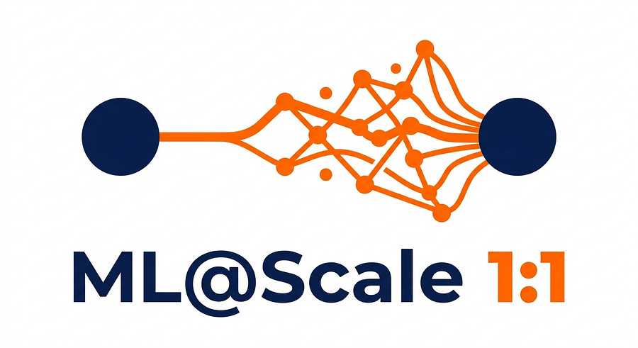

# ML@Scale 1:1 — Judit, ML Engineer at a Danish fashion-forecasting startup [Edition #2]

The ML@Scale 1:1 is a recurring interview series. One engineer, six questions, no fluff. We go straight to the production scars.

Issue #1 was Sanket, Staff MLE at Meta — 100B+ scale recommenders.

This time we’re going the other direction: a small team, a hard problem (forecasting demand for products with literally zero sales history), and an engineer who touches the whole stack on the same day.

**Q1 · The 60-second pitch** _Who are you and what do you work on?_

Judit, ML Engineer / Data Scientist at a Danish startup building demand forecasting systems for fashion brands.

My main focus is the new product introduction (NPI) module — forecasting for items that haven’t sold a single unit. The cold-start problem in all its chaotic glory.

In practice I’m in everything from data ingestion to frontend, often on the same day. Outside of work, I mentor at HackYourFuture Denmark, speak at conferences about explainable(ish) ML, and buy too much yarn.

* * *

**Q2 · The stack, end to end** _Walk me through your ML infrastructure. What works, what would you change?_

Firmly GCP. Cloud Functions, Cloud Run, Cloud Batch, BigQuery, Pub/Sub, GCS. Pub/Sub all the way down: ingestion publishes an event, ML pipeline picks it up, publishes another event, app syncs.

Event-driven is great when it works and a headache to debug when it doesn’t.

Ingestion is Cloud Functions pulling from customers: SFTP drops, Shopify integrations, the works. Raw files land in GCS, get processed into BigQuery, get promoted to the live dataset once they pass SQL validation. BigQuery is the single source of truth.

Forecasting runs two families. NOOS (never-out-of-stock: your basics, the black t-shirt) uses an ensemble of statistical, neural, and tree-based models combined through a custom ensemble layer that weights by playback performance. NPI has no sales history at all, so the approach is essentially a recommender: for each new product, find the most similar items in the catalog and base the forecast off those.

Orchestration is Cloud Workflows + Cloud Batch, each model in its own Docker container. Forecast lands in the app: React frontend, Postgres, FastAPI for DS-specific computation.

What I’d rebuild: the orchestration layer. Dozens of jobs per customer, no clear dependency view, Cloud Workflows YAML that’s verbose and untestable locally. When something breaks I’m reconstructing a crime scene from logs and timestamps. Prefect or Cloud Composer! Something with a real DAG and observability built in.

> Event-driven is great when it works and a headache to debug when it doesn’t.

* * *

**Q3 · The most expensive mistake in production** _What’s a production failure you’d rather people learned from than experienced?_

Expensive in all three currencies — time, money, and dignity.

I shipped a new NPI feature. Worked, correct, great. Also made the pipeline 6x slower. Customer deadline that day.

First instinct: blame the infra. Bigger machine. Tweak the config. Pray to the GCP gods. Spent an embarrassing amount of time on this before admitting it was a dead end.

Then I actually profiled the pipeline: which, side note, is not something DS school prepares you for.

Found a row-by-row operation begging to be vectorized. Fixed it in an hour.

Now I profile semi-regularly as code hygiene, not just when things are on fire. The bottleneck is almost never where I assume it is.

> Before you throw compute at the problem, profile the damn code.

[Want to be part of ML@Scale 1:1?](https://app.youform.com/forms/abpu9l2x)

* * *

**Q4 · The thing nobody says out loud** _What’s the uncomfortable truth about ML that most people won’t say?_

Modeling is a tiny part of the work. Much smaller than the internet would have you believe.

The magic lives in two places: model defensibility and system reliability.

Defensibility is giving stakeholders a peek under the hood however much is appropriate.

I’m a believer in explainable(ish) systems: explain just enough to make the model defensible. Not always SHAP-style explainability. Often it’s just being able to answer “why did the forecast change from last week?” Sometimes the answer isn’t a modeling issue at all: a customer dropped a big batch of new data and the signal shifted.

That kind of transparency is what builds trust.

Reliability is the wiring. Monitoring, logging, alerting, defining what “broken” looks like _before_ anything breaks. Done well, debugging is fast. Done badly, it’s three days of ugly crying.

Neither of these gets enough credit. The systems that actually work in production are the ones where someone loved the unglamorous bits as much as the fancy bits.

> The systems that work in production are the ones where someone loved the unglamorous bits as much as the fancy bits.

* * *

**Q5 · Where research meets reality** _What fraction of ML research actually makes it into production?_

We went through a phase of building things that were, by our own reckoning, excellent. Technically interesting, methodologically sound. A joy to work on.

Customers didn’t use them.

Since then, every new feature needs a clear customer benefit attached. If we can’t find one, we don’t build it — no matter how cool it sounded in the planning meeting.

Being high-touch with customers helps. The feedback loop is short enough that we find out fast whether something moved the needle, or whether we burned three weeks improving accuracy by 2% in a way nobody cared about.

The tension between technical perfectionism and practical usefulness is real and never fully goes away. Keeping customers close is the best compass we have.

* * *

**Q6 · What you’d tell someone joining a big tech ML team** _One piece of advice._

Caveat: my career has been startups + a stint in academia. I’ve only seen big tech as a consultant. So pinch of salt.

What struck me most was the density of senior expertise. People who’ve seen a lot of things go wrong in a lot of contexts. Pay attention to how they approach problems, how they make judgment calls.

That pattern recognition compounds across a career. And use your learning budget.  
It exists, spend it.

If you’re considering startup life instead: touch a bit of everything. Less red tape, more surface area. You’ll pick up technologies, but more importantly you’ll work with people who have wildly different priorities and ways of thinking. Excellent for generalists.

Either way, the advice is the same: stay curious about the humans around you, not just the problems on your screen.

* * *

**My take**

Two issues in, a pattern is forming.

Sanket’s expensive mistakes all clustered around one root cause: the gap between training distribution and serving reality.

Judit’s expensive mistake was a different shape: she went looking for the bug in the infra when it was sitting in her code the whole time.

That’s the same root, just rotated. Both are versions of _assuming the problem is somewhere it isn’t_.

Sanket assumed his offline eval reflected production. Judit assumed her infra was the bottleneck. The cost of the wrong assumption scales with how late you catch it.

The other thread I keep pulling on: how much of “ML at scale” is actually unglamorous wiring.

Sanket called out experimentation friction as the biggest drag at Meta.

Judit calls out observability and defensibility as where the magic actually lives. Different stacks, different scales, same answer: the model is the small part.

If your reliability story is “we’ll figure it out when it breaks,” your reliability story is three days of ugly crying.

[Want to be part of ML@Scale 1:1?](https://app.youform.com/forms/abpu9l2x)
