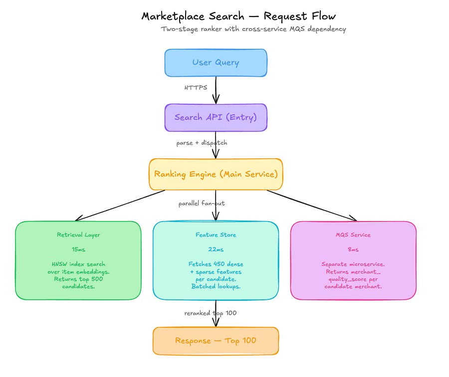

# 11 Percent NDCG Gains That Were Actually Just Target Leakage [Edition #17]

> Paid post — only the publicly visible preview is included.

# System Overview

MarketPlace Prime is a Series D horizontal marketplace company that recently hit a GMV run rate of 4.2 billion dollars per year. They have established a dominant position in the mid-market goods category, scaling their catalog to over 85 million active listings.

Their engineering team built a Search Discovery Stack that powers 92 percent of all site conversions. Here is their setup:

# Architecture Overview

When a user enters a search query, the system executes a classic two-stage retrieval and ranking pipeline to surface relevant items.

### Traffic patterns:

Search Requests: 140 million per day

User Actions: 1.2 billion events per day (clicks, adds, purchases)

Average: 1,620 req/sec

Peak: 2,850 req/sec

The ML Pipeline:

Stage 2 uses a LambdaMART gradient boosted decision tree model with 450 features. It is trained on the last 30 days of search logs. One of the highest-weight features is merchant_quality_score (MQS), a scalar output from a separate regression model. MQS itself is trained every Sunday at 02:00 UTC using labels derived from search outcomes (clicks, cart-adds, and purchases) from the preceding 7 days. The Ranker model is then retrained every Sunday at 06:00 UTC, consuming the updated MQS values from the Feature Store.

### Current performance:

P99 Latency: 145ms

Availability: 99.98%

Purchase Conversion Rate: 3.4% (Flat for 9 months)

Offline NDCG@10: 0.79 (Up from 0.71 over 14 months)

Costs:

Model Training (GPU/High-Mem instances): 95,000 dollars per month

Feature Store and Inference Infrastructure: 110,000 dollars per month

Total: 205,000 dollars per month

### Recent incidents:

Incident 1: MQS service timeout caused by a 4x spike in merchant registrations. Resulted in ranker falling back to default MQS of 0.5, causing a 12 percent drop in CTR for 4 hours.

Incident 2: Sunday morning training job for the ranker failed due to OOM. Recovery took 6 hours, resulting in a stale model being served for half a day.

# The Analysis

Now let me show you what is actually happening here.

## Critical Issue #1: Positive Feedback Loop in Feature Generation

The setup shows the MQS model is trained at 02:00 UTC on Sunday using ranking outcomes from the Search surface. The Ranker is then trained at 06:00 UTC using that MQS score. This is a closed-loop system. The Ranker places Merchant A at the top because they have a high MQS. Because Merchant A is at the top, they get more clicks (position bias). The MQS model sees these clicks and assigns Merchant A an even higher score. The Ranker then sees the higher score and becomes more “confident” in the placement. You are not measuring quality; you are measuring the Ranker’s own historical preference.

## Critical Issue #2: Target Leakage in Offline Evaluation
