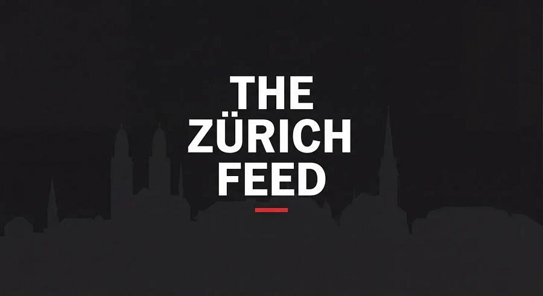

# THE ZÜRICH FEED [Edition #7]

*Curated ML roles in Zürich. With context no job board gives you. *

> Paid post — only the publicly visible preview is included.

*Curated ML roles in Zürich. With context no job board gives you. *

Hey!

Welcome to the 7th edition of The Zürich Feed. 🥂

Every week I go through **ML roles** in Zürich, filter out the noise, and add the context that job boards won’t give you:

  1. Team signals

  2. Whether the role is actually worth your time.

  3. What’s brewing in Zurich that’s not official yet (!!!)

This week: **55** hand picked roles.

**💥💥 Zürich ML ecosystem is alive! 💥💥**

**📡 MARKET PULSE**

> microagi raised 55M USD (!!!). Love to see it!
> 
> Odyssey is hiring a lot in Zürich.
> 
> Aionic Labs is a newly formed frontier AI company by my dear friend Jakob!

**👀 ONE THING I’M WATCHING**

> Max Buckley is now building something in Zürich. Keep an eye on him ;)

**🗂️ THE LIST (preview)**

**🏢 Microagi**

 _The data layer for physical AI._

  * [Research Engineer (Robotics)](https://www.microagi.ai/careers/research-engineer-robotics-embodied-ai)

  * [Research Scientist (Robotics)](https://www.microagi.ai/careers/research-engineer-robotics-embodied-ai)

  * [Computer vision researcher](https://www.microagi.ai/careers/computer-vision-researcher-hand-body-tracking)

**🏢 Aionic labs**  
 _New frontier AI company focusing on TSLMs_

  * [Infra engineer](https://aioniclabs.notion.site/team-careers)

  * [Research scientist](https://aioniclabs.notion.site/team-careers)

**🏢 Synthesia**  
 _New frontier AI company focusing on TSLMs. Roles:_
