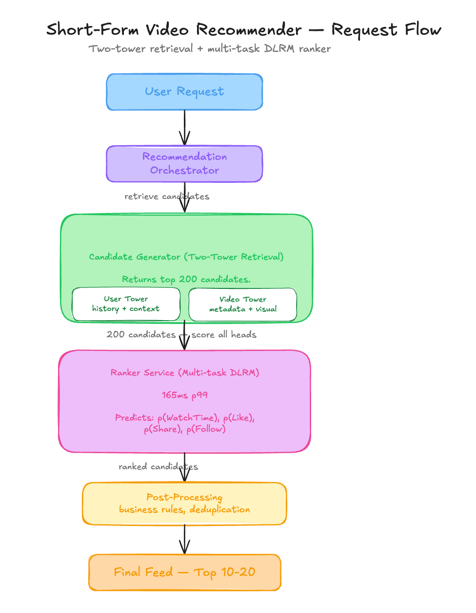

# The $195K Monthly Ranker That Only Learns to Mimic Retrieval [Edition #19]

<figure><a class="image-link image2 is-viewable-img" target="_blank" href="../assets/35f75a12f88064bc.jpg" data-component-name="Image2ToDOM">
<picture><source type="image/webp" srcset="../assets/35f75a12f88064bc.jpg 424w, ../assets/35f75a12f88064bc.jpg 848w, ../assets/35f75a12f88064bc.jpg 1272w, ../assets/35f75a12f88064bc.jpg 1456w" sizes="100vw"></picture>

<button tabindex="0" type="button" class="pencraft pc-reset pencraft icon-container restack-image buttonBase-GK1x3M"><svg aria-hidden="true" width="20" height="20" viewBox="0 0 20 20" fill="none" stroke-width="1.5" stroke="var(--color-fg-primary)" stroke-linecap="round" stroke-linejoin="round" xmlns="http://www.w3.org/2000/svg" class="icon-noB79L"><g><path d="M2.53001 7.81595C3.49179 4.73911 6.43281 2.5 9.91173 2.5C13.1684 2.5 15.9537 4.46214 17.0852 7.23684L17.6179 8.67647M17.6179 8.67647L18.5002 4.26471M17.6179 8.67647L13.6473 6.91176M17.4995 12.1841C16.5378 15.2609 13.5967 17.5 10.1178 17.5C6.86118 17.5 4.07589 15.5379 2.94432 12.7632L2.41165 11.3235M2.41165 11.3235L1.5293 15.7353M2.41165 11.3235L6.38224 13.0882"></path></g></svg></button><button tabindex="0" type="button" class="pencraft pc-reset pencraft icon-container view-image buttonBase-GK1x3M"><svg xmlns="http://www.w3.org/2000/svg" width="20" height="20" viewBox="0 0 24 24" fill="none" stroke="currentColor" stroke-width="2" stroke-linecap="round" stroke-linejoin="round" class="lucide lucide-maximize2 lucide-maximize-2 icon-noB79L"><polyline points="15 3 21 3 21 9"></polyline><polyline points="9 21 3 21 3 15"></polyline><line x1="21" x2="14" y1="3" y2="10"></line><line x1="3" x2="10" y1="21" y2="14"></line></svg></button>

</a></figure>

V-Stream is a mid-stage short-form video company that recently crossed the 60 million Daily Active User (DAU) milestone. They have seen aggressive user growth of 15 percent quarter-over-quarter, driven largely by their expansion into South Asian markets.

Their engineering team built a two-stage recommendation engine that powers the primary home feed. Here is their setup.
<h1>Architecture Overview</h1>
When a user opens the app or scrolls to the next video, the recommendation service triggers a sequential two-stage pipeline.

<figure><a class="image-link image2 is-viewable-img" target="_blank" href="../assets/8ac5d0c3403d4b98.png" data-component-name="Image2ToDOM">
<picture><source type="image/webp" srcset="../assets/8ac5d0c3403d4b98.png 424w, ../assets/8ac5d0c3403d4b98.png 848w, ../assets/8ac5d0c3403d4b98.png 1272w, ../assets/8ac5d0c3403d4b98.png 1456w" sizes="100vw"></picture>

<button tabindex="0" type="button" class="pencraft pc-reset pencraft icon-container restack-image buttonBase-GK1x3M"><svg aria-hidden="true" width="20" height="20" viewBox="0 0 20 20" fill="none" stroke-width="1.5" stroke="var(--color-fg-primary)" stroke-linecap="round" stroke-linejoin="round" xmlns="http://www.w3.org/2000/svg" class="icon-noB79L"><g><path d="M2.53001 7.81595C3.49179 4.73911 6.43281 2.5 9.91173 2.5C13.1684 2.5 15.9537 4.46214 17.0852 7.23684L17.6179 8.67647M17.6179 8.67647L18.5002 4.26471M17.6179 8.67647L13.6473 6.91176M17.4995 12.1841C16.5378 15.2609 13.5967 17.5 10.1178 17.5C6.86118 17.5 4.07589 15.5379 2.94432 12.7632L2.41165 11.3235M2.41165 11.3235L1.5293 15.7353M2.41165 11.3235L6.38224 13.0882"></path></g></svg></button><button tabindex="0" type="button" class="pencraft pc-reset pencraft icon-container view-image buttonBase-GK1x3M"><svg xmlns="http://www.w3.org/2000/svg" width="20" height="20" viewBox="0 0 24 24" fill="none" stroke="currentColor" stroke-width="2" stroke-linecap="round" stroke-linejoin="round" class="lucide lucide-maximize2 lucide-maximize-2 icon-noB79L"><polyline points="15 3 21 3 21 9"></polyline><polyline points="9 21 3 21 3 15"></polyline><line x1="21" x2="14" y1="3" y2="10"></line><line x1="3" x2="10" y1="21" y2="14"></line></svg></button>

</a></figure>

<h1>Traffic patterns:</h1>
Daily Active Users: 60M

Peak Throughput: 145,000 requests per second

Average Throughput: 85,000 requests per second

<strong>The ML Pipeline:</strong>

The Candidate Generator is a two-tower neural network trained daily on the last 24 hours of engagement and impression logs. It uses a cross-entropy loss where positive samples are items the user interacted with.

The Ranker is a multi-task Deep Learning Recommendation Model (DLRM) that retrains weekly on a rolling 14-day window. It consumes roughly 450 features, including heavy-side embeddings from the retrieval stage.

<strong>Current performance:</strong>

Average End-to-End Latency: 215ms

System Availability: 99.95 percent

Business impact: Flat watch time per session (32 minutes) over the last 2 quarters.

Costs:

Model Inference (GPU instances): $195,000 per month

Training Pipeline (Data processing/Compute): $65,000 per month

Total: $260,000 per month

<strong>Recent incidents:</strong>

Incident 1: Retrieval latency spiked to 800ms due to index fragmentation during a daily update, causing a 12 percent drop in DAU for four hours.

Incident 2: Ranker NDCG dropped 5 percent after a feature engineering change failed to account for null values in the follow-count field; recovered via model rollback.
<h1>The Analysis</h1>
Now let me show you what is actually happening here.
<h3>Critical Issue #1: Generator Capture by the Ranker</h3>
The Candidate Generator is trained on impression logs that have already been filtered by the Ranker. In the Architecture Overview, I noted that the generator trains daily on the previous day’s impressions. Because the generator only sees what the Ranker allowed through, it is no longer learning what the user likes from the entire corpus. It is learning to predict which items the Ranker is likely to score highly. Over six months, the generator has effectively become a distilled proxy of the Ranker. This explains why Recall@200 is increasing while product metrics are flat; the generator is getting better at finding the specific sub-set of videos the Ranker prefers, not the videos the user prefers.
<h3>Critical Issue #2: Temporal Imbalance in Retraining Cadences</h3>
The system trains the Retrieval model daily but the Ranker weekly. In a high-velocity short-form environment, the video distribution shifts hourly. By the time the Ranker is updated on Wednesday, the Generator has already spent three days adapting its embedding space to the old Ranker’s biases. This creates a drift where the two stages are optimizing against different versions of user reality. The Generator is chasing a moving target (the Ranker) that is itself lagging behind the actual content trend by up to seven days.
<h3>Critical Issue #3: Evaluation in Isolation Hiding Joint Pathology</h3>
The teams are looking at local metrics that create a false sense of security. The Generator team celebrates when Recall@200 goes from 0.14 to 0.16. However, if the 200 candidates are all hyper-similar because the model has converged on a narrow slice of the Ranker’s preference, the Ranker has no “difficult” choices to make. The Ranker’s NDCG goes up because the candidate pool is now pre-sorted to its own internal logic. It is an echo chamber. The system is essentially reporting that it is very good at ranking a self-selected, non-diverse pool of content.
<h3>Critical Issue #4: Training on Positive Interaction Bias Only</h3>

The Generator’s training logic specifies that positive samples are interactions (likes/watches). There is no explicit negative sampling from the 14 million item corpus outside of the Ranker’s output. By only training on the Ranker’s output, the Generator never learns why the other 13.99 million videos were NOT chosen. This creates a narrow search space that prevents the system from discovering new viral content until that content somehow happens to bypass the Ranker’s existing biases.
<h3>Critical Issue #5: Massive Over-Provisioning for the Ranker Stage</h3>
The Ranker costs $195,000 per month, nearly three times the training cost. This is because it is forced to score 200 candidates for every request to maintain its NDCG. Because the Generator has converged to the Ranker’s preferences, the delta in score between candidate #1 and candidate #200 has shrunk by 40 percent over the last quarter. You are paying for high-fidelity ranking on a set of items that are already nearly identical in the model’s eyes.
<h1>WHAT I WOULD DO INSTEAD</h1>
<strong>1. Implement Epsilon-Greedy Exploration in Retrieval</strong>

Impact:

Increase in content discovery: 25 percent increase in new video impressions

Candidate diversity: 40 percent increase in unique category count per 200-item pool

Trade-offs:

Short-term engagement risk: 1-2 percent drop in watch time during the initial 48-hour learning phase.

When this is the wrong call: If your corpus is small (under 100k items), the ranker will already see most of the relevant content, making random exploration redundant.

<strong>2. Shift to Joint Offline Evaluation Using a Replay Buffer</strong>

Current: Each stage evaluates against its own logs in isolation.

New: A unified evaluation pipeline that takes a candidate pool from a T-minus-1 generator and passes it through a T-minus-1 ranker against a frozen golden set of user interactions.

Impact: Early detection of “Generator Capture.” If the joint NDCG drops while stage-level metrics rise, the deployment is blocked.

Trade-offs:

Increased CI/CD complexity: Evaluation time increases from 20 minutes to 90 minutes.

Higher compute cost for dev: Roughly $4,000 per month in additional evaluation instances.

<strong>3. Align Training Cadence and Implement Log Masking</strong>

Replace: Daily/Weekly split with a synchronized 48-hour retraining cycle for both stages.

With: A shared training window. Additionally, introduce log masking where 5 percent of impressions shown to users are chosen by a “random” retrieval path. These specific logs are prioritized in the Generator’s training set.

Total: $245,000 per month (Syncing cadences allows for more efficient data sharding, saving $15k).

Trade-offs:

Engineering overhead: Requires merging the two data pipelines which currently sit under different leads.

Potential for increased ranker instability if the retrieval distribution shifts too fast.
<h1>The Impact</h1>
Before redesign:

System stuck in a feedback loop where stage-level wins do not translate to product growth.

$260,000 per month total cost.

After redesign:

The system regains the ability to discover new content segments, breaking the echo chamber and allowing the ranker to actually “rank” diverse candidates.

$245,000 per month total cost (6 percent savings).

Time to implement: 10 weeks, 5-person MLE/Data Eng team.
<h1>APPENDIX: Cost Estimation Methodology</h1>
How I estimated the savings for each decision:

Solution 1: Epsilon-Greedy Exploration

Baseline: No direct cost change, but prevents the “value collapse” of the ranker stage.

After change: Neutral cost.

Estimated saving: $0.

Key assumption: The infrastructure can handle the same QPS with a more diverse set of embeddings.

Confidence: High.

Solution 2: Joint Offline Evaluation

Baseline: Current fragmented eval costs $2,000/mo.

After change: New unified eval costs $6,000/mo.

Estimated saving: -$4,000/month (Increased cost for better reliability).

Key assumption: Golden set size is 1M interaction pairs.

Confidence: High.

Solution 3: Unified Retrain Cadence

Baseline: $65,000 training + $195,000 inference = $260,000.

After change: By reducing the Ranker’s candidate pool from 200 to 150 (possible because of higher diversity/quality from the generator), we reduce Ranker inference compute by 25 percent.

$195,000 x 0.75 = $146,250.

$146,250 (Inference) + $68,750 (Sync’d Training with more data) = $215,000.

Estimated saving: $45,000/month.

Key assumption: Reducing candidates to 150 does not degrade NDCG once diversity is restored.

Confidence: Medium — actual candidate reduction potential depends on how quickly the generator adapts to the exploration policy.

