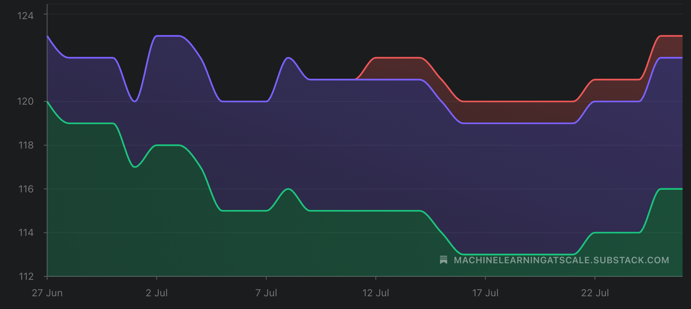
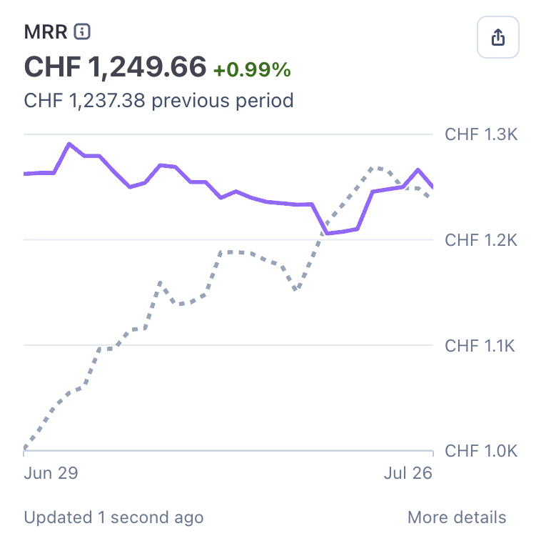
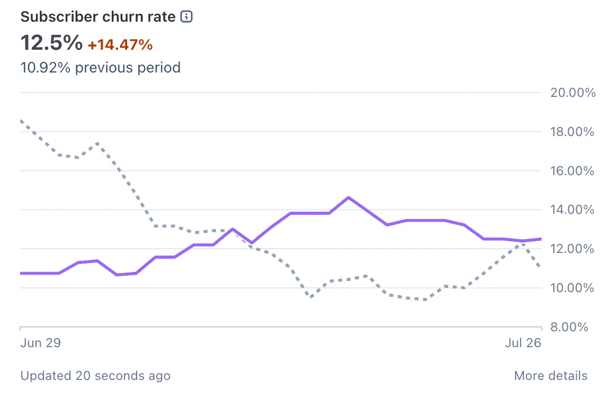

# Inside ML@Scale #4

*Flat month. What I am doing about it?*

Every 25th of the month, I publish **Inside ML@Scale** — a full, honest look at the business behind this newsletter.

The good, the bad.

What’s growing, what’s stagnating, what I’m trying that isn’t working (or sometimes is?)

### **What’s in the free section (this part)**

Every edition will have:

  * Top-line numbers

  * The _one thing_ that worked that month

  * The _one thing_ that didn’t work

  * What I’m trying next

### **Top-line: where we are in July 2026**

  * **14,900+** free subscribers

  * **50,000+** LinkedIn followers

  * **~25%** open rate (still constant, need to work on this!)

  * **6x/week** LinkedIn cadence, **3x/week** newsletter cadence

### **What worked this month**

This month was a nice month in terms of free subs. However paid subs did not growth much.

I added 400 free subs, but 0 paid subs (some new, some churned == 0 growth)

I believe I published really good articles about my personal career, like:

But they did not hit the way i intended them to. Will repackage them because I believe there’s lots of value.

### **What didn’t work**

Free to paid conversion!

### **What I’m trying next**

In august, I will go “full technical deep dive” with a series on Generative recommendations. In july, I will instead go full “personal stories”. Let’s see how that changes things!

# **The business numbers**

All right. Let’s get into the details.

## **Paid subs graph**

We are at 123 paid subs. The same as last month. And for that reason, MRR is flat as well

Sub churn is back at 14% :(. I need to gain 12 paid subs every month just to stay still! Need to improve here!

Still, I don’t take for granted this little biz of mine. Onto the next month!

That’s all for this second edition! Let me know which numbers you’d like to see more or less of.

— Ludo
