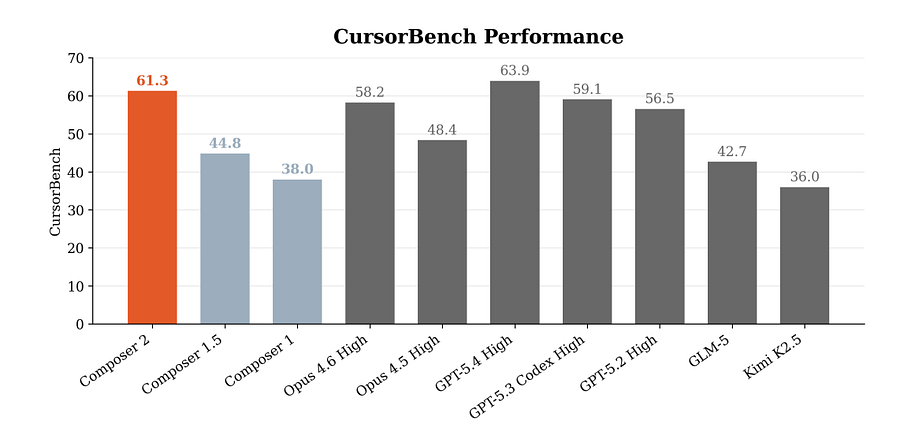
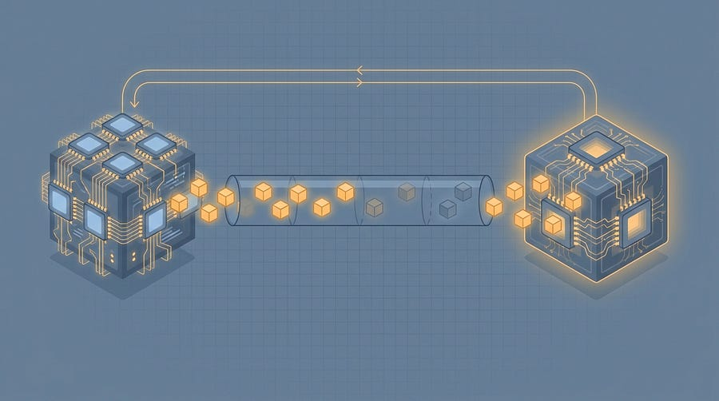

# Inside ML@Scale #4

*Flat month. What I am doing about it?*

> Paid post — only the publicly visible preview is included.

*Flat month. What I am doing about it?*

Every 25th of the month, I publish **Inside ML@Scale** — a full, honest look at the business behind this newsletter.

The good, the bad.

What’s growing, what’s stagnating, what I’m trying that isn’t working (or sometimes is?)

### **What’s in the free section (this part)**

Every edition will have:

  * Top-line numbers

  * The _one thing_ that worked that month

  * The _one thing_ that didn’t work

  * What I’m trying next

### **Top-line: where we are in July 2026**

  * **14,900+** free subscribers

  * **50,000+** LinkedIn followers

  * **~25%** open rate (still constant, need to work on this!)

  * **6x/week** LinkedIn cadence, **3x/week** newsletter cadence

### **What worked this month**

This month was a nice month in terms of free subs. However paid subs did not growth much.

[![THE ZÜRICH FEED \[Edition #7\]](../assets/832a61a16828fbba.webp)THE ZÜRICH FEED [Edition #7]Ludovico Bessi·Jul 22[Read full story](2026-07-22-the-zurich-feed-edition-7.md)](2026-07-22-the-zurich-feed-edition-7.md)

[Cursor Composer 2 report deep dive. Ludovico Bessi·Jul 19[Read full story](2026-07-19-cursor-composer-2-report-deep-dive.md)](2026-07-19-cursor-composer-2-report-deep-dive.md)

[Your RL Training Loop Is a Distributed Systems ProblemLudovico Bessi·Jul 12[Read full story](2026-07-12-your-rl-training-loop-is-a-distributed.md)](2026-07-12-your-rl-training-loop-is-a-distributed.md)

[![THE ZÜRICH FEED \[Edition #6\] ](../assets/9c2805381300d0b8.webp)THE ZÜRICH FEED [Edition #6] Ludovico Bessi·Jul 8[Read full story](2026-07-08-the-zurich-feed-edition-6.md)](2026-07-08-the-zurich-feed-edition-6.md)

[![ML@Scale 1:1 — Judit, ML Engineer at a Danish fashion-forecasting startup \[Edition #2\]](../assets/378aa61241f352ed.jpg)ML@Scale 1:1 — Judit, ML Engineer at a Danish fashion-forecasting startup [Edition #2]Ludovico Bessi·Jul 5[Read full story](2026-07-05-mlscale-11-judit-ml-engineer-at-a.md)](2026-07-05-mlscale-11-judit-ml-engineer-at-a.md)

I added 400 free subs, but 0 paid subs (some new, some churned == 0 growth)

I believe I published really good articles about my personal career, like:

[How I run 15 experiments at a timeLudovico Bessi·Jul 15[Read full story](2026-07-15-i-run-15-experiments-at-a-time-heres.md)](2026-07-15-i-run-15-experiments-at-a-time-heres.md)

[My manager asked me to stop working on my scope. I turned it into the strongest L5 evidence I haveLudovico Bessi·Jul 1[Read full story](2026-07-01-when-your-scope-gets-carved-out-dont.md)](2026-07-01-when-your-scope-gets-carved-out-dont.md)

But they did not hit the way i intended them to. Will repackage them because I believe there’s lots of value.

### **What didn’t work**

Free to paid conversion!

### **What I’m trying next**

In august, I will go “full technical deep dive” with a series on Generative recommendations. In july, I will instead go full “personal stories”. Let’s see how that changes things!

# **The business numbers**

All right. Let’s get into the details.

## **Paid subs graph**
