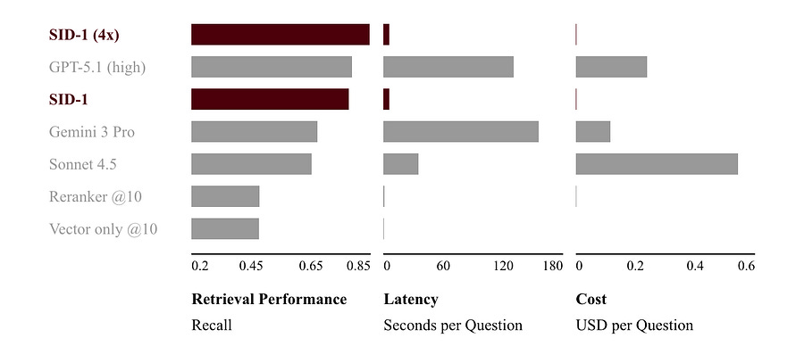

# Your RAG stack has about a year left.

*A 14B model just beat GPT-5.1 at retrieval*

*A 14B model just beat GPT-5.1 at retrieval*

A research lab you probably haven’t heard of ([SID](https://www.sid.ai/), YC S23) just published a technical report for a model called SID-1. It’s a fine-tune of Qwen3-14B trained, end to end with reinforcement learning, to do exactly one thing: agentic retrieval.

The numbers, on a hard, diverse closed-corpus benchmark spanning general knowledge, finance, science, legal, and email:

  * **Recall** : 0.84 vs GPT-5.1 at 0.78, Sonnet 4.5 at 0.64, embedding-plus-reranking at 0.45.

  * **Latency** : 6 seconds per question vs 144 for GPT-5.1 at high compute. 24x faster.

  * **Cost** : roughly 374x cheaper per question than Sonnet 4.5 when self-hosted.

A 14B model. Beating GPT-5.1 at high reasoning effort.

With three to four orders of magnitude less cost and one to two orders of magnitude less latency.

The math in the report is interesting in places (they have real, useful things to say about where standard GRPO breaks in multi-turn agentic settings, and I’ll touch on it briefly).

But for a Sunday read, the math is not the story. 

The story is what this means for the RAG stack you ship on Monday.

Four things I take away. I’ll go through each.

  1. The reranking pipeline is dying. Faster than people think.

  2. Specialization beats frontier generality at the task level. Again.

  3. Test-time compute is no longer just for reasoning. It’s a retrieval primitive now.

  4. The next layer of moats is domain-specific retrieval models. Not domain-specific LLMs.

* * *

## 1\. The reranking pipeline is dying

Be honest about your current RAG stack. It probably looks like this:

**The standard 2024 / 2025 stack:**

  * User query comes in.

  * Embed it with some bi-encoder (text-embedding-3-large, voyage, cohere, or a local fine-tune).

  * ANN over a vector index (FAISS, pgvector, Pinecone, Vespa, doesn’t matter).

  * Top-k candidates go to a cross-encoder reranker.

  * Top-n reranked chunks go into the context window.

  * Frontier LLM generates the answer.

This is what every “production RAG” tutorial in 2024 told you to build.

It’s what every RAG-as-a-service vendor sells. It’s what every internal Confluence chatbot at every BigCo runs today.

**The SID-1 framing:**

  * One model.

  * Receives the query.

  * Issues a search. Reads the results. Reasons. Issues another search. Refines. Iterates. Returns a ranked document list.

  * Done.

The “specialized models prompt search tools and rerank documents” pipeline collapses into a single model performing all those tasks iteratively. The technical report frames the old pipeline as the dead thing and the agentic single-model approach as the live thing. After looking at the numbers, it’s hard to disagree.

The recall jump from 0.45 (embedding plus reranking) to 0.84 is the part that should stop you. That is not a percentage point improvement. That is “your previous system was wrong almost as often as it was right, and now it’s right four times out of five.” On a hard, diverse benchmark.

Two specific architectural notes worth pulling out, because they’re the kind of thing that matters when you actually try to ship this:

  * **SID-1 returns a ranked document list, not an answer.** This is a deliberate design choice. It means the model decouples retrieval from synthesis: it’s a sub-agent. You can drop it behind your existing search bar. You can put it in front of GPT-5.1 or Sonnet for synthesis. You don’t rip out your stack, you replace one layer of it. The closest analogue is what swe-grep is to coding agents: a fast, specialized retriever a frontier model calls into.

  * **Hierarchical retrieval is part of the architecture.** First the model sees short excerpts. If it wants to read a full document, it calls a separate `read` tool. This means the model often uses _fewer_ input tokens than reranking, while seeing more candidate documents. This is not a small detail. It’s most of why the cost story works.

Reranking pipelines are not going away tomorrow. They will continue to ship and continue to work, the same way Lucene-based search still ships and still works.

The new default architecture for non-trivial retrieval is one agentic model in a loop with a search index.

* * *

## 2\. Specialization beats frontier generality at the task level

This is the part that makes me nervous about how MLEs are calibrating their bets right now.

The default story in 2025 was: frontier models keep getting better at everything. Specialized models are a fragile bet because next quarter’s GPT will eat them. Build on top of frontier APIs. Don’t train your own.

That story is mostly true. Until you hit a task where:

  * The task is well defined and measurable.

  * You have a clean reward signal.

  * You have an environment you can roll out in.

  * The task benefits from iteration and tool use, not just one-shot generation.

Retrieval is exactly this kind of task. You can verify whether the right document was returned. You can simulate an agent searching. You can run rollouts. You can compute NDCG.

Once a task has those properties, a small model trained end to end with RL can outperform a frontier model that’s reasoning over the same task at 100x the cost.

Not because the small model is smarter. Because the small model has been compressed, by training, into doing only this one thing extremely well.

This is not a new lesson. It’s the same lesson AlphaGo taught us in 2016 and AlphaCode taught us in 2022.

SID-1 is the production-shaped version of that lesson, applied to retrieval.

The report explicitly frames it as a 10x effective compute multiplier on top of the base model: a 14B fine-tune outperforms the 14B base, and after enough RL, outperforms much larger frontier models.

There’s also a quietly important detail buried in the data section. SID-1’s multi-hop training questions are themselves generated synthetically by frontier LLMs.

The team notes that this only became possible recently:

> _“We note that the ability to generate hard multi-hop questions is a recent emergent capability in large language models. Attempts by this team in 2023 and 2024 largely failed to generate sufficiently diverse questions for training.”_

Read that twice. Frontier general models are now strong enough to generate the training data for the specialized models that will beat them at specific tasks. This is the production loop that’s going to define the next two years of applied ML: use frontier models as data generators and judges, train smaller specialized models on that data, deploy the specialized models, keep the frontier model as fallback.

**The bad MLE conclusion:** “I should train my own models for everything.”

**The good MLE conclusion:** “I should look at my pipeline and ask which steps have a clean reward signal, an environment, and benefit from iteration. Those are the steps where a specialized model is going to win, and where I should either train one or buy one. Everything else stays on the frontier API.”

For most people reading this, retrieval is on that list. So is structured extraction. So is some kinds of code refactoring. So is most agentic browsing.

If you’re shipping RAG and you’ve never thought about whether your retrieval layer should be a model rather than a pipeline, that’s the question this report is forcing.

* * *

## 3\. Test-time compute is now a retrieval primitive

The report opens with a framing I want to flag because it’s the cleanest version of this idea I’ve seen written down:

> _“Today’s vector search uses five orders of magnitude more compute than BM25, the leading retrieval algorithm in 1994. We ask the question: How good can retrieval get if we use another five orders of magnitude more compute?”_

That’s the whole pitch. We’ve had two big jumps in retrieval compute spend (lexical to dense, dense to learned reranking). SID’s bet is that there’s a third one, and it looks like an agent in a loop.

The conceptual move is small but the implications are large. Until now, “test-time compute” has meant one specific thing: o1, R1, extended thinking, reasoning models burning tokens before they answer. SID-1 quietly extends it to the retrieval layer. The model spends more compute, at inference, iteratively searching and reading and adjusting, in order to find the right thing.

That means:

  * **Retrieval is no longer a fixed-cost step.** You used to pay X ms and Y dollars to get top-k results, full stop. Now you can pay more and get better recall. There’s a knob.

  * **Latency budgets need rethinking.** A user-facing search needs sub-second responses. A research agent doing literature review can spend 30 seconds to find the right five papers and that’s a feature, not a bug.

  * **Quality and cost trade off continuously.** Your pipeline used to be quality-locked at the recall of your reranker. Now it’s a slider.

The right mental model is the one we already have for reasoning models. Some queries are easy and one search is fine. Some queries are hard and you want the model to think and search and re-search five times. SID-1 explicitly adapts effort to question difficulty: it spends fewer tokens and turns on easy questions and more on hard ones, the same way o1 does.

Worth flagging the asymmetry: SID-1 is also faster than the frontier baselines in absolute terms. So this isn’t “you can spend more to get better.” It’s “you can spend less and get better, or spend the same and get a lot better.” The Pareto frontier moves.

* * *

## 4\. The next layer of moats is domain-specific retrieval

This is the strategic read, and the one that should matter most to anyone thinking about where to build.

The SID team’s own framing: step-change improvements in retrieval create new winners. Oracle (relational beat hierarchical). Google (better web search). Claude Code (better at finding the right file in a large codebase, which directly drove Anthropic’s coding adoption). OpenEvidence (better retrieval over medical literature).

Each of these companies got large because they were better at finding things in a specific domain at a specific moment. Not because they were smarter at synthesizing answers. Retrieval was the bottleneck, they unblocked it, they captured the surplus.

If SID is right that agentic retrieval is the next 10x in retrieval quality, then the next wave of category winners will be the companies that train one of these models for their specific domain first. Legal. Clinical research. Financial filings. Internal corporate knowledge. Codebases over a million lines. Long-form video. Whatever your moat-shaped vertical is.

What makes this actually defensible (and not “next quarter’s frontier model will eat it”) is the synthetic data pipeline. SID’s report explicitly chronicles how to generate hard multi-hop questions for any closed corpus, without human labelers, by walking document-similarity graphs. If you have the corpus and the eval, you can train the specialist. The corpus is the moat. Not the model weights.

This is the part that should be uncomfortable for anyone shipping a horizontal RAG product. Your differentiator was the retrieval quality you offered out of the box. If retrieval becomes a model someone else trains and you license, you become a thin wrapper. If it becomes a model you train on your customer’s corpus, you have a real product.

* * *

## The read

SID-1 is one paper from one small lab. It’s a preview. The benchmark is custom (though they acknowledge this and design it to be harder than HotpotQA, which they argue should be retired). They’re compute-limited and rolling out slowly.

But the direction is real. Agentic retrieval is to RAG what reasoning models were to base chat models: same building blocks, fundamentally different system, large step-change in quality, new cost-quality tradeoffs to think about.

If you’re an MLE shipping retrieval today, three concrete things to do this week:

  1. **Measure your current recall on hard queries.** Not aggregate NDCG on your easy set. Take the queries your users complain about and compute recall. If it’s near 0.45, you have a real problem and a real opportunity.

  2. **Map your pipeline.** Identify the steps that have clean reward signals and tool-use structure. Those are your candidates for replacement by a specialized model in the next 12 months.

  3. **Start treating retrieval as a compute-scalable layer.** Stop thinking of it as a fixed-latency, fixed-quality step. Build the slider into your product before you have to.

The lesson, if there is one: in 2026, “good RAG” stops meaning “good embeddings plus good reranker.” It starts meaning “a small model in a loop that knows when to keep looking.”

Your stack has a year. Maybe two if your domain is small.

— Ludo

## Caveats

I said I’d skim. Two findings from the training section deserve a flag, because they line up with a broader pattern in the agentic RL literature: GRPO is not a free lunch in multi-turn, multi-tool settings. Things break in non-obvious ways.

**Tokens in, tokens out.** Most RL frameworks pass rollouts between the generation engine and the training engine as OpenAI-style messages. This is fine for single-turn settings. In multi-turn agentic settings with tool calling, it quietly destroys you. Re-applying the chat template subtly retokenizes the rollout, and the training engine sees tokens that have near-zero probability under the actual policy. Negative advantage on those tokens dominates the gradient. The model collapses. SID’s fix is dead simple: move tokens through the pipeline as tokens, never as parsed messages. The reward curve they show (rises smoothly, then catastrophically collapses to zero) is one of those plots that should be hung in every RL training room.

**Length normalization has a hidden bug.** Dr. GRPO (and Magistral, and most modern frameworks) removes the per-sequence length bias because it incentivizes shorter positive rollouts and longer negative ones. SID found that when negative-advantage rollouts happen to be longer than positive ones (which is common in agentic search: failed searches tend to ramble), removing the length bias makes the mean per-token advantage negative, which suppresses logits globally, which eventually makes the model sample out-of-vocabulary tokens because the embedding matrix gets padded to a power of two. They prove this formally. It’s a beautiful, ugly little failure mode.

If you take one operational lesson from the training section, take this: **the standard RL recipes published in 2024 and 2025 are not yet stable for multi-turn tool-using agents.** Anyone telling you otherwise is selling something. The frontier labs have figured this out internally. The open recipes haven’t caught up.
