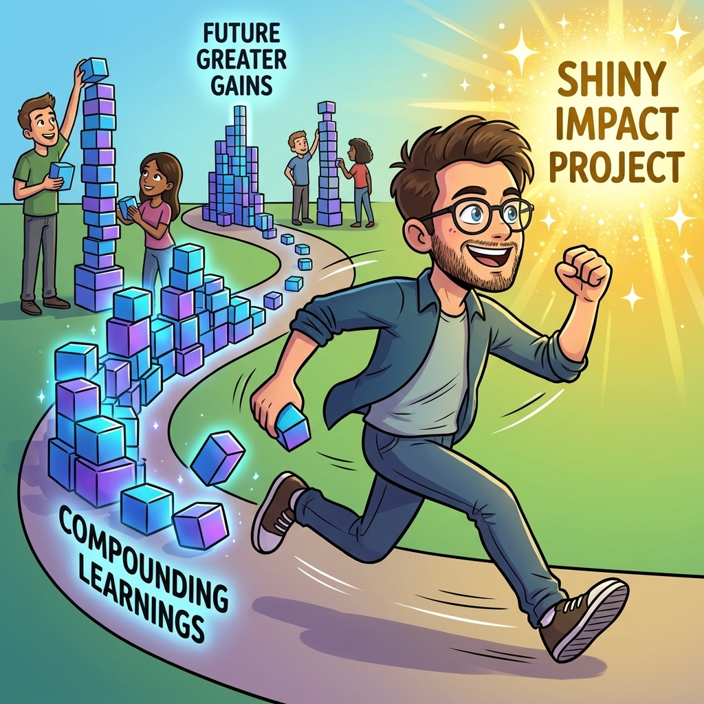

# I Left ML for "Impact." It's the Worst Trade I've Made

*The most optimal-looking internal move could turn out wrong. Why?*

<figure><a class="image-link image2 is-viewable-img" target="_blank" href="../assets/e6b490ff6851c762.jpg" data-component-name="Image2ToDOM">
<picture><source type="image/webp" srcset="../assets/e6b490ff6851c762.jpg 424w, ../assets/e6b490ff6851c762.jpg 848w, ../assets/e6b490ff6851c762.jpg 1272w, ../assets/e6b490ff6851c762.jpg 1456w" sizes="100vw"></picture>

<button tabindex="0" type="button" class="pencraft pc-reset pencraft icon-container restack-image buttonBase-GK1x3M"><svg aria-hidden="true" width="20" height="20" viewBox="0 0 20 20" fill="none" stroke-width="1.5" stroke="var(--color-fg-primary)" stroke-linecap="round" stroke-linejoin="round" xmlns="http://www.w3.org/2000/svg" class="icon-noB79L"><g><path d="M2.53001 7.81595C3.49179 4.73911 6.43281 2.5 9.91173 2.5C13.1684 2.5 15.9537 4.46214 17.0852 7.23684L17.6179 8.67647M17.6179 8.67647L18.5002 4.26471M17.6179 8.67647L13.6473 6.91176M17.4995 12.1841C16.5378 15.2609 13.5967 17.5 10.1178 17.5C6.86118 17.5 4.07589 15.5379 2.94432 12.7632L2.41165 11.3235M2.41165 11.3235L1.5293 15.7353M2.41165 11.3235L6.38224 13.0882"></path></g></svg></button><button tabindex="0" type="button" class="pencraft pc-reset pencraft icon-container view-image buttonBase-GK1x3M"><svg xmlns="http://www.w3.org/2000/svg" width="20" height="20" viewBox="0 0 24 24" fill="none" stroke="currentColor" stroke-width="2" stroke-linecap="round" stroke-linejoin="round" class="lucide lucide-maximize2 lucide-maximize-2 icon-noB79L"><polyline points="15 3 21 3 21 9"></polyline><polyline points="9 21 3 21 3 15"></polyline><line x1="21" x2="14" y1="3" y2="10"></line><line x1="3" x2="10" y1="21" y2="14"></line></svg></button>

</a></figure>

A year ago I made the most rational career move available to me.

I left ML.

I moved off ML engineering into a non-ML role in the Ads org, because that’s where the clean revenue impact was.

A big project.

A number I could point at. A calibration bullet that would write itself.

The logic was sane. Go where the impact is most legible. It’s the advice everyone gives you, and it’s not wrong. 

<em>Impact, impact, impact.</em>

I shipped the thing.

And then I switched back to ML.

It’s the worst trade I’ve made at Google. 

Not because the project failed! it succeeded and the number was real!

But that was very short term thinking of me.

This post is about the <em>optimal-looking</em> move. The lateral move that everyone, including you, agrees is the smart play but that quietly resets one of the assets you were actually compounding.

<mark data-color="#d9ead3" style="background-color: rgb(217, 234, 211); color: rgb(0, 0, 0);">Five angles:</mark>
<ul><li>
Why “impact” and “skill” are different currencies
</li><li>
The contrast: two engineers, same fork, two outcomes a few years out
</li><li>
Why this trade is worse in 2026 than it has ever been
</li><li>
The playbook: how to tell, <em>before</em> you take the move, whether you’re trading up or chasing a high
</li><li>
When leaving your specialty is actually the right call (because sometimes it is!!)
</li></ul>
Let’s go.

<h2>1. Impact is a currency that doesn’t compound</h2>
Here’s the thing nobody tells you when they tell you to chase impact.

You accumulate two completely different kinds of value as an engineer, and they behave nothing alike.

The first is <strong>impact</strong>. The launch, the revenue number, the metric you moved.

Impact is local: it’s tied to a specific project, in a specific org, at a specific moment. And it’s cyclical: it lands hard at calibration, and then it decays. Two cycles later, last year’s big win is a line in a doc nobody opens.

Impact resets every time you move.

The second is <strong>skill</strong>. Specific, scarce, portable, compounding skill.

The depth in a domain that takes years to build and that not many people have.

This is the thing that doesn’t reset when you change teams. You carry it across every move. It compounds, because each year of depth makes the next year of depth more valuable, and because scarcity is the whole game: you get paid for the thing few people can do, not the thing everyone’s doing.

<strong>The promotion system can only see one of these.</strong> Calibration runs on impact, because impact is legible: it has a number and a date.

Skill depth doesn’t show up as cleanly.

So the system points every smart, ambitious engineer at the same target: maximize visible impact, this cycle, wherever it’s easiest to generate.

And the easiest place to generate visible impact is often <em>outside your specialty</em>: in a role closer to revenue, where the number is bigger and the attribution is cleaner.

So you do the rational thing. You go get the impact.

What the system doesn’t price, because it can’t, is that you just traded a compounding asset for a cyclical one. You won this calibration. And you stopped the clock on the thing that was supposed to make you irreplaceable in five years.

That’s what I did. The Ads project was pure impact: a clean number, no specialty depth required.
<h2>2. Same fork, two engineers</h2>
Let me make it concrete.

Two ML engineers. Same level, same caliber, same fork in the road: a high-visibility, non-ML, revenue-adjacent project opens up.

The impact is obvious. The promo case writes itself.

<strong>Engineer A takes it.</strong> Correctly reasoned, by the way. This is not the dumb choice. They ship it, the number is real, the calibration bullet is excellent. They might even get the bump.

Two years later, they’re competing for the <em>next</em> thing on generic impact. And so is every strong SWE in the building, because “I shipped a big revenue project” is a sentence half the org can say.

Their ML has atrophied to the level of someone who read the papers but hasn’t built the thing in years.

The moat they had is gone, and they’re indistinguishable from a very good generalist. The market for very good generalists is enormous and crowded.

<strong>Engineer B turns it down</strong>, or finds a way to generate impact <em>inside</em> the specialty instead (!!!!): a ranking win, a recsys improvement, a number that happens to require the scarce skill to produce.

This looks slower. It probably <em>is</em> slower, this cycle. The impact is less clean, the attribution messier.

Two years later, they’re one of a handful of people who can actually do the hard ML thing at production scale and the impact came anyway, just routed through the moat instead of around it.

They’re not competing with every generalist. They’re competing with almost no one.

Same fork. Same person, even. Two trajectories.

<strong><mark data-color="#d9ead3" style="background-color: rgb(217, 234, 211); color: rgb(0, 0, 0);">Engineer A optimized for the impact the system could see.</mark></strong>

<strong><mark data-color="#d9ead3" style="background-color: rgb(217, 234, 211); color: rgb(0, 0, 0);">Engineer B optimized for the impact the system could see </mark></strong><em><strong><mark data-color="#d9ead3" style="background-color: rgb(217, 234, 211); color: rgb(0, 0, 0);">that also deepened the thing it couldn’t</mark></strong></em><strong><mark data-color="#d9ead3" style="background-color: rgb(217, 234, 211); color: rgb(0, 0, 0);">.</mark></strong>

Same output at calibration. Completely different positioning long term.

I was Engineer A. The switch back to ML was me realizing it mid-flight and paying to undo it.

🔒 <em>The rest of this post is for paid subscribers.</em>

<h2>3. The playbook: how to read the move before you take it</h2>

The whole skill here is evaluating an internal move <em>before</em> you take it, on the axis the promo system won’t show you: does this compound, or does it reset?

Here’s the actual checklist I run now, the one I didn’t have two years ago.

<strong>Question 1: Does the new scope build a skill, or just generate a number?</strong>

Be honest about this one. “Revenue-adjacent project in another org” usually generates a number without building a scarce, portable skill. Ask: in three years, what can I <em>do</em> that I couldn’t before? and is it rare?

If the only answer is “I shipped a big thing once,” that’s impact, not skill.

Impact you’ll have to re-earn at the next stop. Skill you keep.

<strong>Question 2: What’s the half-life of this impact?</strong>

Every impact win has a half-life. 

how long it stays legible before it decays into a doc nobody reads. A launch in your core system with downstream dependents has a long half-life; people keep running into it.

A one-off revenue project in an org you then leave has a short one. it’s loud for one cycle and gone by the next. Short half-life impact is a sugar high. It spikes your calibration once and leaves nothing behind.

<strong>Question 3: Is the skill portable, or org-specific?</strong>

Some depth only matters inside the team that has the problem.

Some depth (… ML at production scale, in 2026 for example :D) is portable to every serious company on earth.

Portable scarce skill is the asset that gives you leverage <em>and</em> an exit. Org-specific depth locks you in and evaporates the moment you move. Weight the move by how far the skill travels.

<strong>Question 4: What does my moat look like in three years on each path?</strong>

Run both branches.

Take the move: where’s my moat in three years?

Don’t take it: where’s my moat in three years?

Not “where’s my level” (!!!!). 

Where’s the thing that makes me hard to replace. If the move makes my next <em>three</em> moves easier, take it. If it makes only my <em>next</em> move easier and the two after harder, then.. you know the answer!

<strong>Question 5: Can I get the impact without leaving the moat?</strong>

This is the one I’d go back and force myself to ask. Most of the time, there’s a version of the impact you want that routes <em>through</em> your specialty instead of away from it.

It’s harder to find and slower to land. It’s almost always the better trade. I took the clean external number because it was easy. The harder, in-specialty number would have compounded.

The summary rule:

<strong><mark data-color="#d9ead3" style="background-color: rgb(217, 234, 211); color: rgb(0, 0, 0);">Visible impact is what gets you this promotion. A scarce compounding skill is what makes the </mark></strong><em><strong><mark data-color="#d9ead3" style="background-color: rgb(217, 234, 211); color: rgb(0, 0, 0);">next five</mark></strong></em><strong><mark data-color="#d9ead3" style="background-color: rgb(217, 234, 211); color: rgb(0, 0, 0);"> inevitable. Don’t trade the second for the first unless you know exactly what you’re buying.</mark></strong>
<h2>4. When leaving your specialty is the right call</h2>
Now the honest part, because “never leave ML” is a dumb rule and I’m not selling it.

There are three cases where taking the move is correct, and you need to be able to tell them apart from the trap.

<strong><mark data-color="#d9ead3" style="background-color: rgb(217, 234, 211); color: rgb(0, 0, 0);">Case 1: The new domain also compounds</mark>.</strong> If you’re leaving ML for something that is <em>itself</em> a scarce, deepening skill, i.e. going from ML eng to ML systems infra, say, or into a domain that’s becoming the next moat, then you’re not trading a compounding asset for a cyclical one.

You’re switching which compounding asset you’re building. That can be a great move. The test is the same: does it build rare, portable depth, or just a number?

<strong><mark data-color="#d9ead3" style="background-color: rgb(217, 234, 211); color: rgb(0, 0, 0);">Case 2: You haven’t found your moat yet</mark>.</strong> Early-career, the right move is often <em>breadth</em>: try things, find the specialty that’s going to be yours. If you don’t yet have a moat to protect, “go get visible impact wherever it is” is correct, because you’re still searching. The trap only springs once you <em>have</em> the compounding asset and trade it away. 3 years in, I had it. That’s why it cost me.

<strong><mark data-color="#d9ead3" style="background-color: rgb(217, 234, 211); color: rgb(0, 0, 0);">Case 3: Your specialty is dying</mark>.</strong> If the thing you’re deep in is being commoditized or automated out, the depth isn’t compounding anymore, then leaving is just rational.

 (For ML in 2026, this is not the situation. The opposite, if anything: the moat is widening. Which is exactly why leaving it for generic impact is a worse trade today than it was when I made it: I gave up the hottest specialty in tech for a number any strong generalist could have produced.)

The lesson was never “don’t leave.”

It’s: <strong>know which of these you’re in.</strong>

Trading up in compounding value is a great move. Chasing a local impact high while your moat quietly rusts is the most expensive mistake a mid-career engineer can make, precisely because it doesn’t feel like a mistake.

It feels optimal. It writes a beautiful calibration bullet.

I have the bullet. I’d trade it back for the months.

— Ludo

<em>A caveat, as always: this is one engineer’s read from inside one org, and the specifics of impact-vs-skill weighting depend on your company, your level, and your specialty.</em>

<em>The framework is the point, not my particular numbers. And it assumes you actually have a moat worth protecting — if you don’t yet, go get the impact. That part’s not a trap. That’s just being early.</em>

